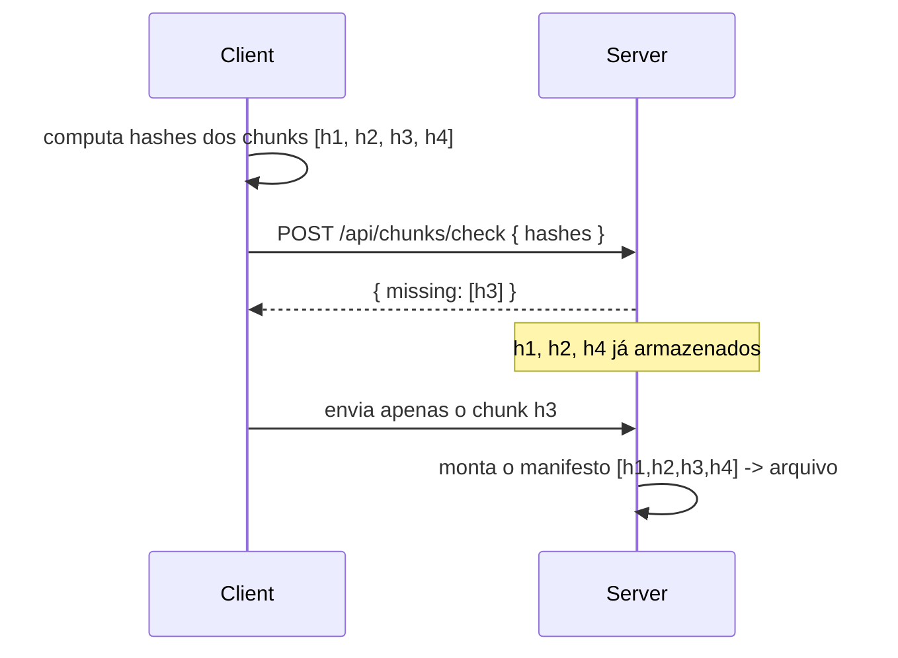

## Visão Geral

O Direct-Upload Pattern (veja Object Storage and the Direct-Upload Pattern) resolve como bytes vão de um client a um bucket sem rotear pelo servidor de aplicação, mas ainda trata um arquivo como um blob indivisível: uma URL presigned, um PUT, uma transferência tudo-ou-nada. Está tudo bem para uma foto de perfil de 2 MB. Se quebra para um produto de sincronização — um vídeo de 20 GB, uma conexão instável que cai no meio do upload, ou um usuário que edita três linhas em um documento de 500 páginas e agora precisa de alguma forma evitar reenviar as outras 499 páginas. A correção nos três casos é a mesma jogada subjacente: parar de tratar o arquivo como um blob e começar a tratá-lo como um conjunto de pedaços menores e independentemente endereçáveis — **chunks**.

## Chunking de Tamanho Fixo

O primeiro passo é mecânico: divida o arquivo em pedaços de tamanho fixo — tipicamente 5-10MB — e envie-os independentemente, em paralelo, cada um para sua própria chave de objeto ou via a API nativa de upload multiparte de um provedor de armazenamento (a Multipart Upload API do S3 é o caso comum: cada parte é enviada com um número de parte, validada via um ETag, e as partes são costuradas em um objeto no lado do servidor assim que todas estiverem presentes).

```
movie.mp4 (214 MB)
  chunk-0 [0MB   - 10MB)  -> upload -> ETag: a1b2...
  chunk-1 [10MB  - 20MB)  -> upload -> ETag: c3d4...
  chunk-2 [20MB  - 30MB)  -> upload -> ETag: e5f6...
  ...
  chunk-21 [210MB - 214MB) -> upload -> ETag: 9f8e...
```

Isso sozinho já traz duas coisas que um upload de requisição única não consegue: um **indicador de progresso** que o client pode renderizar honestamente (22 de 22 chunks feitos, não uma porcentagem falsa estimada pelo tempo decorrido), e **resumabilidade** — se a conexão cair depois do chunk 14, o client requisita novamente apenas os chunks 15-21 em vez de reiniciar uma transferência de 214 MB do zero. Ambos seguem diretamente do mesmo princípio por trás do direct-upload pattern: dê ao client algo estreito e resumível para fazer, e mantenha o servidor fora do caminho de bytes.

## Chunking Definido por Conteúdo: Corrigindo o Problema da Edição

Chunking de tamanho fixo tem um modo de falha específico: desenha limites de chunk por *offset*, não por *conteúdo*. Insira um byte no início de um arquivo e todo limite de chunk depois desse ponto se desloca — o chunk 1 não começa mais onde costumava, então seu hash muda, e também o de todo chunk depois dele, mesmo que o conteúdo real seja 99,9% idêntico à versão anterior. Para um produto de sincronização, onde "o usuário mudou um parágrafo" precisa se traduzir em "retransferir um chunk", isso é desqualificante.

**Content-Defined Chunking (CDC)** corrige isso escolhendo limites de chunk com base no *conteúdo* do arquivo usando um rolling hash (ex. um Rabin fingerprint) escaneado byte a byte sobre o arquivo: sempre que o rolling hash dos últimos N bytes corresponde a um padrão fixo (digamos, seus 13 bits menos significativos são todos zero — o que acontece em média uma vez a cada 2^13 bytes), essa posição de byte se torna um limite de chunk. Como o limite é uma função de conteúdo local em vez de uma distância do início do arquivo, inserir ou remover bytes só desloca os limites *imediatamente ao redor* da edição — todo chunk antes e depois dessa vizinhança permanece byte a byte idêntico à versão anterior, e mantém o mesmo hash.

```
Chunking de tamanho fixo (insere 1 byte no offset 0):
  v1: [AAAAAAAAAA][BBBBBBBBBB][CCCCCCCCCC]
  v2: [XAAAAAAAAA][ABBBBBBBBB][BCCCCCCCCC]   <- todo chunk mudou

Chunking definido por conteúdo (mesma edição):
  v1: [AAAAAAAAAA][BBBBBBBBBB][CCCCCCCCCC]
  v2: [XAAAAAAAAA][BBBBBBBBBB][CCCCCCCCCC]   <- só o chunk tocado mudou
```

## Fingerprinting e Deduplicação

Uma vez que um arquivo é dividido em chunks, cada chunk recebe um hash de conteúdo — SHA-256 é a escolha comum — computado no lado do client antes do upload. Esse hash é o fingerprint do chunk, e faz dois trabalhos de uma vez. Primeiro, é a checagem de integridade: depois do upload, o servidor (ou o client, no download) re-hasheia e compara, capturando corrupção silenciosa em trânsito. Segundo, e mais valiosamente, é uma chave de dedup: antes de enviar um chunk, o client pergunta ao servidor "você já tem um chunk com este hash?" Se a resposta é sim — porque outro arquivo compartilha esse conteúdo, ou porque esse exato chunk já existe de uma versão anterior deste mesmo arquivo — o upload é totalmente pulado e o servidor apenas adiciona uma referência ao chunk existente.



Isso é o que torna possível deduplicação entre usuários e entre versões: dois usuários que têm o mesmo template de PDF estoque o armazenam uma vez no nível de chunk, e um usuário que salva dez versões de um documento enquanto edita paga pela *união* de chunks que já existiram através dessas versões, não dez cópias completas. O trade-off é que o servidor agora precisa de um modelo de contagem de referências de chunk (um chunk não pode ser excluído até que nenhum manifesto de arquivo mais o referencie) — exclusão vira garbage collection em vez de uma exclusão direta.

## Delta Sync

Tudo acima converge para **delta sync**: quando um arquivo muda, apenas seu estado é transferido, não seus bytes. Ao salvar, o client re-executa o content-defined chunking na nova versão, computa hashes para os novos limites de chunk, e compara essa lista contra o manifesto da versão anterior — chunks com fingerprints já no manifesto anterior não precisam de nenhuma operação de rede, então só chunks que são novos ou mudaram realmente passam pelo fluxo de dedup-check-então-upload acima.

```
Estado de sincronização após edição:
  manifesto antigo: [h1, h2, h3,     h4]
  manifesto novo:   [h1, h2, h3_novo, h4]
                          |
                          v
              apenas h3_novo passa pelo
              fluxo de dedup-check-então-upload;
              h1, h2, h4 não requerem I/O de rede
```

O mesmo diff de manifesto roda em reverso para outros dispositivos: em vez de rebaixar o arquivo inteiro, um dispositivo compara seu manifesto local ao novo, descobre que já tem três dos quatro chunks, e só busca o chunk que falta — o que é por que editar um único parágrafo em um documento grande sincroniza para outros dispositivos em segundos em vez de minutos.

## Compressão no Lado do Client

Chunks são comumente comprimidos (ex. com Zstandard) antes do upload, adicionalmente ao chunking e dedup em vez de no lugar deles — compressão e content-defined chunking não conflitam, já que a compressão acontece por chunk depois que os limites já foram decididos pelo conteúdo. O benefício depende do conteúdo: texto, código-fonte, e outros formatos de baixa entropia comprimem bem e reduzem o tamanho de transferência significativamente; formatos já comprimidos como vídeo, imagens, ou arquivos zip ganham pouco ou nada e podem até crescer levemente, então tipicamente é aplicado condicionalmente por tipo de conteúdo em vez de incondicionalmente.

## Trade-offs

- **Content-defined chunking torna edições baratas de sincronizar, ao custo de tamanhos de chunk variáveis e imprevisíveis** — diferente do chunking de tamanho fixo, você não pode assumir que todo chunk tem exatamente 10MB, o que complica a estimativa de progresso e significa que o próprio scan de rolling hash custa CPU a cada salvamento, não só no primeiro upload.
- **Deduplicação em nível de chunk economiza armazenamento e largura de banda entre usuários e versões, mas transforma exclusão em contagem de referências** — um chunk só pode ser reclamado quando nenhum manifesto em lugar nenhum ainda aponta para ele, o que significa que a reclamação de armazenamento é eventualmente consistente, não imediata, e requer um passe de garbage collection.
- **Delta sync minimiza bytes transferidos, mas requer que todo client mantenha manifestos locais de chunk precisos** — se o manifesto de um client desviar do que o servidor realmente tem (uma sincronização parcial falhada, um bug), o diff está errado, e voltar a um estado correto requer ou refazer o fingerprinting do arquivo inteiro ou confiar em uma re-sincronização completa como fallback.
- **Compressão no lado do client troca CPU por largura de banda, e essa troca não vale a pena universalmente fazer** — aplicá-la incondicionalmente desperdiça CPU em mídia já comprimida por pouca ou nenhuma redução de tamanho, então precisa ser consciente do tipo de conteúdo em vez de política geral.

## Perguntas de Entrevista

- Por que o chunking de tamanho fixo torna edições de um único byte caras de sincronizar, e o que especificamente o content-defined chunking muda para corrigir isso?
- Como um rolling hash decide onde vai um limite de chunk, e por que isso torna os limites estáveis através de edições em outra parte do arquivo?
- O que a deduplicação em nível de chunk requer que o servidor rastreie que a deduplicação de arquivo inteiro não requer, e por que isso torna a exclusão mais difícil?
- Percorra o que acontece ponta a ponta quando um usuário muda um parágrafo em um documento grande que está sincronizado em três dispositivos.
- Quando compressão no lado do client antes do upload não valeria a pena, e como você decidiria se deve aplicá-la?

## Referências

- [Rabin, M. O. — "Fingerprinting by Random Polynomials" (Harvard, 1981) — a técnica de rolling hash por trás do content-defined chunking](https://www.cs.hmc.edu/~geoff/classes/hmc.cs070.200101/homework10/rabinfingerprint.pdf)
- [AWS S3 Documentation — Uploading and copying objects using multipart upload](https://docs.aws.amazon.com/AmazonS3/latest/userguide/mpuoverview.html)
- [Dropbox Tech Blog — "Rewriting the heart of our sync engine"](https://dropbox.tech/infrastructure/rewriting-the-heart-of-our-sync-engine)
- [rsync — "The rsync algorithm" (Andrew Tridgell, Paul Mackerras)](https://rsync.samba.org/tech_report/)
- [Facebook Engineering — Zstandard: "Smaller and faster data compression with Zstandard"](https://engineering.fb.com/2016/08/31/core-data/smaller-and-faster-data-compression-with-zstandard/)
