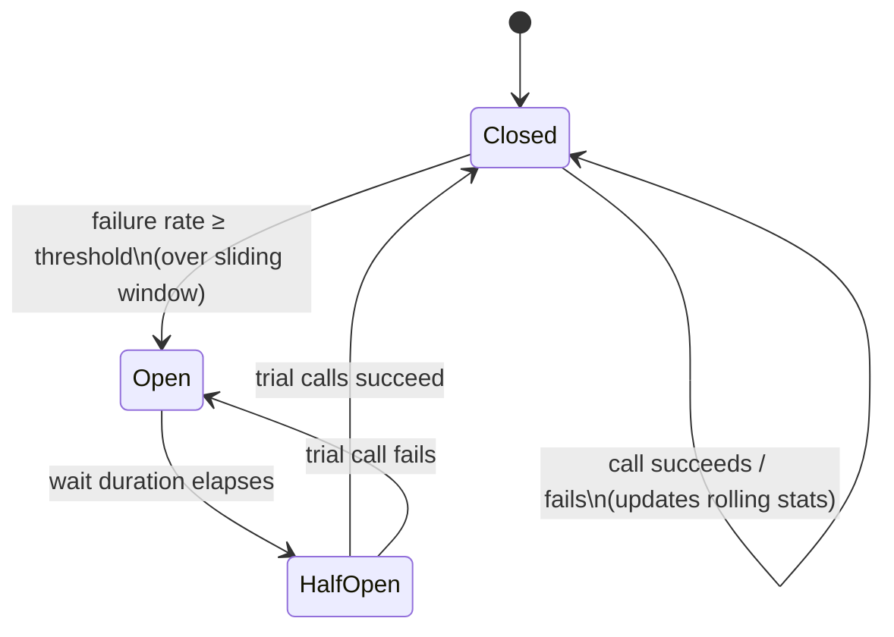

## Overview

In a system built from services calling services, failure doesn't stay where it started. A single dependency that goes slow or unresponsive doesn't just fail its own calls — every caller that blocks waiting on it ties up a thread, a connection, a slot in some bounded pool, for the duration of a timeout that's usually far longer than a healthy response would take. Enough concurrent callers doing that and the caller itself runs out of threads or connections, which makes *it* slow and unresponsive to *its* callers, who do the exact same thing one level up. The failure propagates outward, hop by hop, until services with no direct relationship to the original problem are down — even though only one leaf dependency actually broke. This is **cascading failure**, and it is the reason "the database is fine, but the whole site is down" is a coherent incident report. Circuit breakers and bulkheads are the two structural countermeasures: a circuit breaker stops a caller from wasting resources on a dependency that's already unhealthy, and a bulkhead makes sure that even when it does waste resources, it can only waste its *own* slice, not everyone else's.

## Cascading Failure: How One Slow Dependency Takes Down Everything

The canonical version of this story is the one Michael Nygard tells in *Release It!*: a resource pool for a single downstream call — say, a JDBC connection pool to a report-generation service — starts taking a long time to respond. Every request that needs that service acquires a thread from the caller's request-handling pool and blocks on the call. Requests keep arriving at the normal rate, but they now leave threads occupied for seconds or minutes instead of milliseconds. The pool fills. The next request that comes in, needing *any* thread — even one with nothing to do with the slow dependency — has nothing to run on and queues, then times out. The service that looked perfectly healthy a minute ago is now failing 100% of its requests, including requests that never touch the slow dependency at all. Its callers see it as down and repeat the exact same pattern against it.

Three things make this worse than a simple, contained failure:

- **Timeouts are usually too generous.** A default of 30 or 60 seconds means each blocked thread is unavailable for a long time relative to normal request latency, so it takes very few concurrent slow calls to exhaust a pool sized for normal traffic.
- **Retries amplify load onto an already-struggling dependency.** A caller that times out and immediately retries has just sent a second request into a system that couldn't handle the first one — see [Retries, Backoff, and Hedged Requests](retries-backoff-and-hedged-requests) for why naive retry policies make cascading failure *more* likely, not less.
- **Shared resource pools mean unrelated work pays the price.** If the connection pool, thread pool, or event-loop is shared across every kind of downstream call a service makes, one bad dependency can starve calls to every *other* dependency too — this is precisely what a bulkhead exists to prevent.

The fix has two independent halves. First, stop calling a dependency once it's clearly unhealthy, so callers fail fast instead of queuing behind a timeout — that's the **circuit breaker**. Second, make sure that even while a dependency is being called, its failure mode can't spend resources earmarked for other dependencies — that's the **bulkhead**. They solve different problems and are almost always deployed together.

## The Circuit Breaker State Machine

A circuit breaker wraps a call to a remote dependency and tracks its recent success/failure rate. Martin Fowler's widely-cited description (explicitly crediting Nygard's book for popularizing the pattern) frames it as three states:

- **Closed** — the normal state. Calls pass through to the dependency. Each result updates a rolling count of successes and failures. If the failure rate crosses a configured threshold, the breaker **trips** and moves to Open.
- **Open** — calls are rejected immediately, without attempting the network call at all. This is the fail-fast behavior: instead of a caller's thread blocking for a full timeout against a dependency that's very likely to fail anyway, it gets an immediate, cheap error (or a fallback) and moves on. After a configured wait duration, the breaker moves to Half-Open.
- **Half-Open** — a small number of trial calls are let through to see whether the dependency has recovered. If they succeed at an acceptable rate, the breaker resets to Closed. If they fail, it reopens and the wait duration starts again (often with backoff, so a persistently dead dependency isn't probed every few seconds forever).



The value of Open is not just latency — it's protecting the *dependency* too. A struggling service under a flood of retries and timeouts from every caller can never recover, because it's spending all its own resources failing requests instead of processing the ones it could actually handle. A tripped breaker gives it breathing room by cutting off traffic entirely for a while, which is often what lets it recover in the first place.

## Circuit Breakers in Practice: resilience4j

Netflix's Hystrix was the library that made this pattern mainstream in the JVM ecosystem, but Netflix put it into maintenance mode in 2018 and now points new projects at other options; **resilience4j** is the current standard for circuit breakers on the JVM, and its configuration surface maps directly onto the state machine above:

```java
CircuitBreakerConfig config = CircuitBreakerConfig.custom()
    .failureRateThreshold(50)                       // % failures in the window that trips the breaker
    .slowCallRateThreshold(80)                       // % of calls exceeding slowCallDurationThreshold
    .slowCallDurationThreshold(Duration.ofSeconds(2))
    .waitDurationInOpenState(Duration.ofSeconds(30))  // how long Open lasts before trying Half-Open
    .permittedNumberOfCallsInHalfOpenState(5)         // trial calls allowed in Half-Open
    .slidingWindowType(SlidingWindowType.COUNT_BASED)
    .slidingWindowSize(100)                           // last N calls used to compute the failure rate
    .build();

CircuitBreakerRegistry registry = CircuitBreakerRegistry.of(config);
CircuitBreaker breaker = registry.circuitBreaker("pricingService");

Supplier<PriceQuote> decorated = CircuitBreaker.decorateSupplier(
    breaker,
    () -> pricingClient.getQuote(request)
);

PriceQuote quote = Try.ofSupplier(decorated)
    .recover(CallNotPermittedException.class, ex -> PriceQuote.cachedFallback(request))
    .get();
```

Two parameters do most of the practical work: `slidingWindowSize` controls how much recent history the failure rate is computed over (too small and one bad burst trips the breaker; too large and it reacts too slowly), and `slowCallDurationThreshold` lets a call that *technically* succeeds but took far too long count against the dependency the same way an outright error does — a service returning correct responses in 8 seconds is still a service you should stop calling.

## Bulkheads: Isolating the Blast Radius

A circuit breaker decides *whether* to call a dependency. A **bulkhead** decides *how much of the caller's own resources* that dependency is allowed to consume while it's being called — the name comes from ship design, where watertight bulkheads divide a hull into compartments so a hole in one doesn't sink the whole vessel. Nygard's version of the pattern is exactly this: give each downstream dependency its own bounded pool of threads (or connections, or concurrent-request slots), sized for that dependency's expected load, instead of letting every call — to every dependency — draw from one shared pool.

Without bulkheads, the thread-pool-exhaustion scenario from the Overview happens by default: a shared pool means a slow dependency A can consume every thread in the pool, leaving zero for calls to healthy dependency B, even though B has nothing wrong with it. With bulkheads, A exhausting *its* pool leaves B's pool completely untouched, so calls to B keep succeeding while calls to A queue or fail fast.

resilience4j implements this with a bulkhead abstraction as well — either a fixed-size semaphore (bound concurrent calls, reject beyond the limit) or a bounded queue plus thread pool:

```java
// One bulkhead per downstream dependency — sized for that dependency's own budget.
Bulkhead pricingBulkhead = Bulkhead.of("pricingService",
    BulkheadConfig.custom()
        .maxConcurrentCalls(20)
        .maxWaitDuration(Duration.ofMillis(0))  // reject immediately rather than queue
        .build());

Bulkhead inventoryBulkhead = Bulkhead.of("inventoryService",
    BulkheadConfig.custom()
        .maxConcurrentCalls(30)
        .maxWaitDuration(Duration.ofMillis(0))
        .build());

Supplier<PriceQuote> pricingCall = Bulkhead.decorateSupplier(
    pricingBulkhead, () -> pricingClient.getQuote(request));

Supplier<StockLevel> inventoryCall = Bulkhead.decorateSupplier(
    inventoryBulkhead, () -> inventoryClient.getStock(sku));
```

`pricingService` running out of its 20 slots has zero effect on `inventoryService`'s 30 — they are entirely separate pools. The same principle applies one level down at the infrastructure layer: separate JDBC connection pools per database, separate thread pools per external API, and — at the process level — separate deployable services or containers so that one dependency's client library leaking memory can't take a whole fleet of unrelated services down with it, which is Nygard's broader argument for why bulkheading should be a default architectural stance, not an afterthought bolted on after an incident.

## Circuit Breakers + Bulkheads Together

The two patterns are complementary rather than redundant, and production systems use both, layered:

- The **bulkhead** bounds how much damage a dependency can do *while it's still being called* — it limits blast radius during the window before anyone has noticed the dependency is unhealthy.
- The **circuit breaker** stops calling the dependency *once* the failure rate crosses a threshold, which shrinks that window and removes load from a dependency trying to recover.

In resilience4j these compose as an explicit decorator chain, typically bulkhead outermost (bound concurrency first) and circuit breaker inside it (skip the call entirely once tripped), with a timeout and a retry (used carefully — see [Retries, Backoff, and Hedged Requests](retries-backoff-and-hedged-requests)) also in the stack:

```java
Supplier<PriceQuote> resilientCall = Decorators.ofSupplier(
        () -> pricingClient.getQuote(request))
    .withBulkhead(pricingBulkhead)
    .withCircuitBreaker(pricingBreaker)
    .withFallback(List.of(CallNotPermittedException.class, BulkheadFullException.class),
        ex -> PriceQuote.cachedFallback(request))
    .decorate();
```

This is also where observability earns its keep: a breaker that's open or a bulkhead that's rejecting calls is a strong, specific signal, and exposing per-dependency breaker state and rejection counts as metrics (rather than only aggregate error rates) is usually the fastest way to see *which* downstream dependency is the actual source of an incident — see [Distributed Tracing and Observability](distributed-tracing-and-observability).

## Choosing Thresholds

Every parameter here is a trade-off between reacting too slowly (cascading failure spreads before the breaker trips) and reacting too fast (a transient blip trips the breaker and cuts off a dependency that would have been fine):

- **Failure rate threshold and window size** should reflect the dependency's normal error rate plus margin, not an arbitrary round number. A dependency with a normal 2% error rate tripping at 50% over a 100-call window tolerates real noise; the same threshold over a 10-call window trips on a bad run of three or four unlucky requests.
- **Wait duration in Open** should be long enough that a genuinely struggling dependency gets real relief, but short enough that recovery is detected promptly — many implementations back off exponentially on repeated trips rather than using a fixed duration.
- **Bulkhead pool sizes** should be derived from the dependency's own latency and the caller's expected concurrent load against it specifically (Little's Law: pool size ≈ throughput × latency, plus headroom), not from a shared, guessed-at pool size that happens to work most of the time.
- **Timeouts** on the underlying call still matter even with a breaker in place — the breaker only helps once enough failures have accumulated to trip it; the first several slow calls still pay the full timeout, so the timeout itself should be tight relative to the dependency's real p99, not a generous default.

## Trade-offs

- **Fail-fast trades a slow failure for a fast one, not a failure for a success.** A tripped breaker still returns an error (or a fallback) to the caller — it does not make the dependency work. It only prevents that failure from being expensive and contagious. Callers still need a sensible fallback or degraded behavior, not just a faster exception.
- **Per-dependency bulkheads cost more idle capacity than one shared pool.** Sizing 20 threads for dependency A and 30 for dependency B means 50 threads provisioned even when only one dependency is under load, versus a shared pool of, say, 40 that could serve either alone — the isolation is bought with some amount of stranded capacity.
- **Thresholds tuned for one traffic pattern misfire under another.** A breaker calibrated against steady daytime traffic can trip needlessly during a legitimate low-traffic period (small sample, one blip looks like 100%) or fail to trip fast enough during a traffic spike. Thresholds need periodic revisiting, not a one-time setting.
- **A breaker adds a new failure mode of its own: stuck open.** If the health check or trial calls in Half-Open are themselves flawed (e.g., they hit a code path the real traffic doesn't), a recovered dependency can stay walled off indefinitely, which is its own incident requiring a manual reset.
- **Fallback logic is easy to under-invest in.** It's tempting to treat "return a cached value" or "return a default" as an afterthought, but a bad fallback (stale pricing shown as current, an empty inventory count treated as "in stock") can cause worse business outcomes than the original failure would have — the fallback path deserves the same design attention as the happy path.

## Interview Questions

- Walk through, step by step, how a single slow dependency with no circuit breaker or bulkhead can bring down a service three hops away that never calls it directly.
- Why does an Open circuit breaker help the *failing dependency* recover, not just the caller? What would happen without it, purely from retries?
- You have one shared thread pool serving calls to five downstream services. One of them starts timing out. What do you observe, and what's the fastest structural fix?
- How would you size a bulkhead's pool for a given downstream dependency? What inputs do you need, and what happens if you get the size too small versus too large?
- What's the risk of a circuit breaker's Half-Open trial calls not being representative of real traffic, and how would you detect it happening in production?
- Hystrix and resilience4j solve the same problem — what's the practical reason most new JVM systems choose resilience4j today?

## References

- [Release It! Second Edition: Design and Deploy Production-Ready Software](https://pragprog.com/titles/mnee2/release-it-second-edition/) — Michael Nygard, Pragmatic Bookshelf, 2018
- [CircuitBreaker](https://martinfowler.com/bliki/CircuitBreaker.html) — Martin Fowler
- [resilience4j: CircuitBreaker](https://resilience4j.readme.io/docs/circuitbreaker) — resilience4j documentation
- [Netflix/Hystrix](https://github.com/Netflix/Hystrix) — Netflix (archived; in maintenance mode since 2018)
