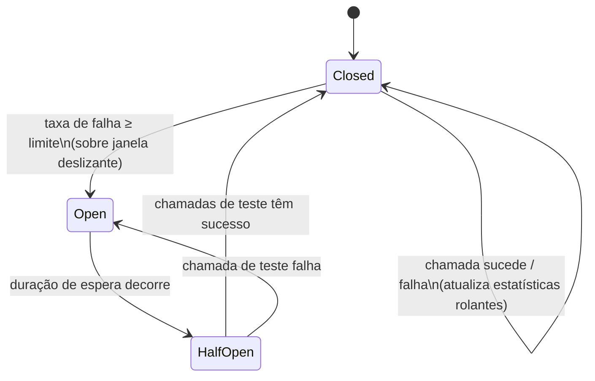

## Visão Geral

Em um sistema construído a partir de serviços chamando serviços, a falha não fica onde começou. Uma única dependência que fica lenta ou não responsiva não apenas falha suas próprias chamadas — todo chamador que bloqueia esperando por ela ocupa uma thread, uma conexão, um slot em algum pool limitado, pela duração de um timeout que costuma ser muito maior do que uma resposta saudável levaria. Chamadores concorrentes suficientes fazendo isso e o próprio chamador fica sem threads ou conexões, o que o torna lento e não responsivo para *seus* chamadores, que fazem exatamente a mesma coisa um nível acima. A falha se propaga para fora, salto a salto, até que serviços sem relação direta com o problema original estejam fora do ar — mesmo que apenas uma dependência folha tenha de fato quebrado. Isso é **falha em cascata**, e é a razão pela qual "o banco de dados está bem, mas o site inteiro está fora do ar" é um relatório de incidente coerente. Circuit breakers e bulkheads são as duas contramedidas estruturais: um circuit breaker impede que um chamador desperdice recursos em uma dependência que já está não saudável, e um bulkhead garante que mesmo quando ele desperdiça recursos, só pode desperdiçar *sua própria* fatia, não a de todo mundo.

## Falha em Cascata: Como Uma Dependência Lenta Derruba Tudo

A versão canônica dessa história é a que Michael Nygard conta em *Release It!*: um pool de recursos para uma única chamada downstream — digamos, um pool de conexões JDBC para um serviço de geração de relatórios — começa a levar muito tempo para responder. Toda requisição que precisa desse serviço adquire uma thread do pool de tratamento de requisições do chamador e bloqueia na chamada. As requisições continuam chegando na taxa normal, mas agora deixam threads ocupadas por segundos ou minutos em vez de milissegundos. O pool se enche. A próxima requisição que chega, precisando de *qualquer* thread — mesmo uma que não tenha nada a ver com a dependência lenta — não tem em que rodar e entra na fila, depois dá timeout. O serviço que parecia perfeitamente saudável um minuto atrás agora está falhando 100% de suas requisições, incluindo requisições que nunca tocam a dependência lenta. Seus chamadores o veem como fora do ar e repetem exatamente o mesmo padrão contra ele.

Três coisas tornam isso pior do que uma falha simples e contida:

- **Timeouts geralmente são generosos demais.** Um padrão de 30 ou 60 segundos significa que cada thread bloqueada fica indisponível por muito tempo em relação à latência normal de requisição, então bastam poucas chamadas lentas concorrentes para exaurir um pool dimensionado para tráfego normal.
- **Retries amplificam a carga sobre uma dependência já em dificuldade.** Um chamador que dá timeout e imediatamente tenta de novo acabou de enviar uma segunda requisição para um sistema que não conseguiu lidar com a primeira — veja [Retries, Backoff, and Hedged Requests](retries-backoff-and-hedged-requests) para por que políticas de retry ingênuas tornam a falha em cascata *mais* provável, não menos.
- **Pools de recursos compartilhados significam que trabalho não relacionado paga o preço.** Se o pool de conexões, pool de threads, ou event-loop for compartilhado entre toda chamada downstream que um serviço faz, uma dependência ruim pode esfomear chamadas para toda *outra* dependência também — é precisamente isso que um bulkhead existe para prevenir.

A correção tem duas metades independentes. Primeiro, pare de chamar uma dependência assim que ela estiver claramente não saudável, para que chamadores falhem rápido em vez de entrar na fila atrás de um timeout — esse é o **circuit breaker**. Segundo, garanta que mesmo enquanto uma dependência está sendo chamada, seu modo de falha não possa gastar recursos reservados para outras dependências — esse é o **bulkhead**. Eles resolvem problemas diferentes e são quase sempre implantados juntos.

## A Máquina de Estados do Circuit Breaker

Um circuit breaker envolve uma chamada a uma dependência remota e rastreia sua taxa recente de sucesso/falha. A descrição amplamente citada de Martin Fowler (creditando explicitamente o livro de Nygard por popularizar o padrão) o enquadra em três estados:

- **Closed (Fechado)** — o estado normal. Chamadas passam para a dependência. Cada resultado atualiza uma contagem rolante de sucessos e falhas. Se a taxa de falha ultrapassar um limite configurado, o breaker **dispara** e passa para Open.
- **Open (Aberto)** — chamadas são rejeitadas imediatamente, sem tentar a chamada de rede de forma alguma. Este é o comportamento fail-fast: em vez da thread de um chamador bloquear por um timeout completo contra uma dependência muito provavelmente destinada a falhar, ela recebe um erro imediato e barato (ou um fallback) e segue em frente. Depois de uma duração de espera configurada, o breaker passa para Half-Open.
- **Half-Open (Meio-Aberto)** — um pequeno número de chamadas de teste é deixado passar para ver se a dependência se recuperou. Se tiverem sucesso a uma taxa aceitável, o breaker reseta para Closed. Se falharem, ele reabre e a duração de espera recomeça (frequentemente com backoff, para que uma dependência persistentemente morta não seja sondada a cada poucos segundos para sempre).



O valor de Open não é apenas latência — é proteger a *dependência* também. Um serviço em dificuldade sob uma inundação de retries e timeouts de todo chamador nunca consegue se recuperar, porque está gastando todos os seus próprios recursos falhando requisições em vez de processar as que realmente conseguiria lidar. Um breaker disparado dá a ele espaço para respirar cortando o tráfego completamente por um tempo, o que frequentemente é o que permite que ele se recupere em primeiro lugar.

## Circuit Breakers na Prática: resilience4j

O Hystrix da Netflix foi a biblioteca que tornou este padrão mainstream no ecossistema JVM, mas a Netflix o colocou em modo de manutenção em 2018 e agora aponta novos projetos para outras opções; **resilience4j** é o padrão atual para circuit breakers na JVM, e sua superfície de configuração se mapeia diretamente para a máquina de estados acima:

```java
CircuitBreakerConfig config = CircuitBreakerConfig.custom()
    .failureRateThreshold(50)                       // % de falhas na janela que dispara o breaker
    .slowCallRateThreshold(80)                       // % de chamadas excedendo slowCallDurationThreshold
    .slowCallDurationThreshold(Duration.ofSeconds(2))
    .waitDurationInOpenState(Duration.ofSeconds(30))  // quanto tempo Open dura antes de tentar Half-Open
    .permittedNumberOfCallsInHalfOpenState(5)         // chamadas de teste permitidas em Half-Open
    .slidingWindowType(SlidingWindowType.COUNT_BASED)
    .slidingWindowSize(100)                           // últimas N chamadas usadas para computar a taxa de falha
    .build();

CircuitBreakerRegistry registry = CircuitBreakerRegistry.of(config);
CircuitBreaker breaker = registry.circuitBreaker("pricingService");

Supplier<PriceQuote> decorated = CircuitBreaker.decorateSupplier(
    breaker,
    () -> pricingClient.getQuote(request)
);

PriceQuote quote = Try.ofSupplier(decorated)
    .recover(CallNotPermittedException.class, ex -> PriceQuote.cachedFallback(request))
    .get();
```

Dois parâmetros fazem a maior parte do trabalho prático: `slidingWindowSize` controla quanto histórico recente a taxa de falha é computada sobre (pequeno demais e um pico ruim único dispara o breaker; grande demais e ele reage devagar demais), e `slowCallDurationThreshold` permite que uma chamada que *tecnicamente* tem sucesso mas demorou tempo demais conte contra a dependência da mesma forma que um erro declarado conta — um serviço retornando respostas corretas em 8 segundos ainda é um serviço que você deveria parar de chamar.

## Bulkheads: Isolando o Raio de Impacto

Um circuit breaker decide *se* chamar uma dependência. Um **bulkhead** decide *quanto dos próprios recursos do chamador* aquela dependência tem permissão para consumir enquanto está sendo chamada — o nome vem do design de navios, onde anteparos estanques dividem um casco em compartimentos para que um buraco em um não afunde o navio inteiro. A versão de Nygard do padrão é exatamente isso: dê a cada dependência downstream seu próprio pool limitado de threads (ou conexões, ou slots de requisição concorrente), dimensionado para a carga esperada dessa dependência, em vez de deixar toda chamada — para toda dependência — puxar de um único pool compartilhado.

Sem bulkheads, o cenário de exaustão do pool de threads da Visão Geral acontece por padrão: um pool compartilhado significa que uma dependência A lenta pode consumir toda thread do pool, deixando zero para chamadas à dependência B saudável, mesmo que B não tenha nada de errado. Com bulkheads, A exaurindo *seu* pool deixa o pool de B completamente intocado, então chamadas a B continuam tendo sucesso enquanto chamadas a A entram na fila ou falham rápido.

O resilience4j implementa isso com uma abstração de bulkhead também — ou um semáforo de tamanho fixo (limita chamadas concorrentes, rejeita além do limite) ou uma fila limitada mais pool de threads:

```java
// Um bulkhead por dependência downstream — dimensionado para o orçamento dessa dependência.
Bulkhead pricingBulkhead = Bulkhead.of("pricingService",
    BulkheadConfig.custom()
        .maxConcurrentCalls(20)
        .maxWaitDuration(Duration.ofMillis(0))  // rejeita imediatamente em vez de enfileirar
        .build());

Bulkhead inventoryBulkhead = Bulkhead.of("inventoryService",
    BulkheadConfig.custom()
        .maxConcurrentCalls(30)
        .maxWaitDuration(Duration.ofMillis(0))
        .build());

Supplier<PriceQuote> pricingCall = Bulkhead.decorateSupplier(
    pricingBulkhead, () -> pricingClient.getQuote(request));

Supplier<StockLevel> inventoryCall = Bulkhead.decorateSupplier(
    inventoryBulkhead, () -> inventoryClient.getStock(sku));
```

O `pricingService` ficando sem seus 20 slots tem efeito zero em `inventoryService`'s 30 — são pools inteiramente separados. O mesmo princípio se aplica um nível abaixo na camada de infraestrutura: pools de conexão JDBC separados por banco de dados, pools de threads separados por API externa, e — no nível de processo — serviços ou containers deployáveis separados para que o vazamento de memória da biblioteca client de uma dependência não possa derrubar uma frota inteira de serviços não relacionados, que é o argumento mais amplo de Nygard para por que bulkheading deveria ser uma postura arquitetural padrão, não uma reflexão tardia acrescentada após um incidente.

## Circuit Breakers + Bulkheads Juntos

Os dois padrões são complementares em vez de redundantes, e sistemas de produção usam ambos, em camadas:

- O **bulkhead** limita quanto dano uma dependência pode fazer *enquanto ainda está sendo chamada* — limita o raio de impacto durante a janela antes de alguém ter percebido que a dependência está não saudável.
- O **circuit breaker** para de chamar a dependência *assim que* a taxa de falha ultrapassar um limite, o que encolhe essa janela e remove carga de uma dependência tentando se recuperar.

No resilience4j, eles se compõem como uma cadeia explícita de decoradores, tipicamente bulkhead por fora (limita concorrência primeiro) e circuit breaker por dentro dele (pula a chamada completamente uma vez disparado), com um timeout e um retry (usado com cuidado — veja [Retries, Backoff, and Hedged Requests](retries-backoff-and-hedged-requests)) também na pilha:

```java
Supplier<PriceQuote> resilientCall = Decorators.ofSupplier(
        () -> pricingClient.getQuote(request))
    .withBulkhead(pricingBulkhead)
    .withCircuitBreaker(pricingBreaker)
    .withFallback(List.of(CallNotPermittedException.class, BulkheadFullException.class),
        ex -> PriceQuote.cachedFallback(request))
    .decorate();
```

É aqui também que a observabilidade se justifica: um breaker aberto ou um bulkhead rejeitando chamadas é um sinal forte e específico, e expor o estado do breaker e as contagens de rejeição por dependência como métricas (em vez de apenas taxas de erro agregadas) costuma ser a forma mais rápida de ver *qual* dependência downstream é a fonte real de um incidente — veja [Distributed Tracing and Observability](distributed-tracing-and-observability).

## Escolhendo Limites

Todo parâmetro aqui é um trade-off entre reagir devagar demais (falha em cascata se espalha antes do breaker disparar) e reagir rápido demais (um pico transitório dispara o breaker e corta uma dependência que estaria tudo bem):

- **Limite de taxa de falha e tamanho da janela** deveriam refletir a taxa de erro normal da dependência mais margem, não um número redondo arbitrário. Uma dependência com uma taxa de erro normal de 2% disparando a 50% sobre uma janela de 100 chamadas tolera ruído real; o mesmo limite sobre uma janela de 10 chamadas dispara em uma sequência ruim de três ou quatro requisições azaradas.
- **Duração de espera em Open** deveria ser longa o suficiente para que uma dependência genuinamente em dificuldade tenha alívio real, mas curta o suficiente para que a recuperação seja detectada prontamente — muitas implementações fazem backoff exponencial em disparos repetidos em vez de usar uma duração fixa.
- **Tamanhos de pool do bulkhead** deveriam ser derivados da própria latência da dependência e da carga concorrente esperada do chamador especificamente contra ela (Lei de Little: tamanho do pool ≈ throughput × latência, mais margem), não de um tamanho de pool compartilhado e chutado que acontece de funcionar na maior parte do tempo.
- **Timeouts** na chamada subjacente ainda importam mesmo com um breaker em vigor — o breaker só ajuda depois que falhas suficientes se acumularam para dispará-lo; as primeiras várias chamadas lentas ainda pagam o timeout completo, então o próprio timeout deveria ser apertado em relação ao p99 real da dependência, não um padrão generoso.

## Trade-offs

- **Fail-fast troca uma falha lenta por uma rápida, não uma falha por um sucesso.** Um breaker disparado ainda retorna um erro (ou um fallback) ao chamador — não faz a dependência funcionar. Só impede que essa falha seja cara e contagiosa. Chamadores ainda precisam de um fallback sensato ou comportamento degradado, não apenas uma exceção mais rápida.
- **Bulkheads por dependência custam mais capacidade ociosa do que um único pool compartilhado.** Dimensionar 20 threads para a dependência A e 30 para a dependência B significa 50 threads provisionadas mesmo quando apenas uma dependência está sob carga, versus um pool compartilhado de, digamos, 40 que poderia servir qualquer uma sozinha — o isolamento é comprado com alguma capacidade encalhada.
- **Limites ajustados para um padrão de tráfego falham em outro.** Um breaker calibrado contra tráfego diurno estável pode disparar desnecessariamente durante um período legítimo de baixo tráfego (amostra pequena, um pico parece 100%) ou não disparar rápido o suficiente durante um pico de tráfego. Limites precisam de revisão periódica, não uma configuração única.
- **Um breaker adiciona um novo modo de falha próprio: preso aberto.** Se o health check ou as chamadas de teste em Half-Open forem elas mesmas falhas (ex., atingem um caminho de código que o tráfego real não atinge), uma dependência recuperada pode ficar isolada indefinidamente, o que é seu próprio incidente exigindo um reset manual.
- **Lógica de fallback é fácil de subinvestir.** É tentador tratar "retornar um valor em cache" ou "retornar um padrão" como uma reflexão tardia, mas um fallback ruim (preço obsoleto mostrado como atual, uma contagem de estoque vazia tratada como "em estoque") pode causar resultados de negócio piores do que a falha original teria causado — o caminho de fallback merece a mesma atenção de design que o caminho feliz.

## Perguntas de Entrevista

- Percorra, passo a passo, como uma única dependência lenta sem circuit breaker ou bulkhead pode derrubar um serviço três saltos adiante que nunca a chama diretamente.
- Por que um circuit breaker Open ajuda a *dependência falha* a se recuperar, não apenas o chamador? O que aconteceria sem ele, puramente a partir de retries?
- Você tem um pool de threads compartilhado servindo chamadas para cinco serviços downstream. Um deles começa a dar timeout. O que você observa, e qual é a correção estrutural mais rápida?
- Como você dimensionaria o pool de um bulkhead para uma dada dependência downstream? Quais entradas você precisa, e o que acontece se você errar o tamanho para menos versus para mais?
- Qual é o risco das chamadas de teste em Half-Open de um circuit breaker não serem representativas do tráfego real, e como você detectaria isso acontecendo em produção?
- Hystrix e resilience4j resolvem o mesmo problema — qual é a razão prática pela qual a maioria dos novos sistemas JVM escolhe resilience4j hoje?

## Referências

- [Release It! Second Edition: Design and Deploy Production-Ready Software](https://pragprog.com/titles/mnee2/release-it-second-edition/) — Michael Nygard, Pragmatic Bookshelf, 2018
- [CircuitBreaker](https://martinfowler.com/bliki/CircuitBreaker.html) — Martin Fowler
- [resilience4j: CircuitBreaker](https://resilience4j.readme.io/docs/circuitbreaker) — documentação do resilience4j
- [Netflix/Hystrix](https://github.com/Netflix/Hystrix) — Netflix (arquivado; em modo de manutenção desde 2018)
