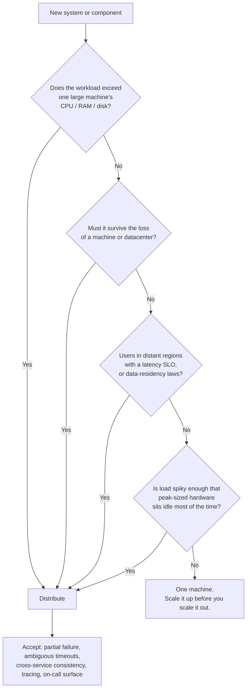

## Overview

Before any architecture diagram gets drawn, two decisions have already been made — often by default, rarely on purpose. The first is **who operates the infrastructure**: you, on machines you control, or a vendor you pay per hour. The second is **how many machines the system runs on**: one, or many communicating over a network. Both are framed in industry conversation as though the modern answer is obvious ("cloud, and distributed"), but neither is free, and the second one in particular buys you a whole category of failure modes that a single machine simply does not have. The useful instinct is the opposite of the default: distribute when a concrete requirement forces you to, not because the architecture looks more serious that way.

## Build or Buy, Run or Rent

Every capability an organization needs sits somewhere on a spectrum between fully in-house and fully outsourced. The rule of thumb is that **core competencies stay in-house and commodities get bought** — almost no one fabricates their own CPUs, because a semiconductor company does it better and cheaper. Software has two separable questions along that spectrum: who *writes* it, and who *operates* it.

At one end is bespoke software you write and run yourself. At the other end is SaaS — someone else's code, running on someone else's machines, reachable only through an API. The interesting middle ground is **off-the-shelf software that you self-host**: you download PostgreSQL and run it, either on hardware you own (on premises, which in practice usually means a rented rack) or on a VM you rent (IaaS). Renting a VM is *not* the same as using a cloud service; with IaaS you have outsourced the hardware and kept the entire operational burden.

## Where the Cloud Actually Wins

Using a managed cloud service instead of self-hosting the equivalent software means outsourcing that software's *operations*. Whether that saves money depends almost entirely on two variables:

**How variable your load is.** This is the strongest argument for the cloud and the one that survives scrutiny. If you provision for peak, everything you bought sits idle the rest of the time. Analytical workloads are the extreme case: an interactive query wants a large amount of parallel compute for thirty seconds and then wants nothing at all until the next query. Handing those resources back to the provider between queries is a real, structural saving that owning hardware cannot replicate.

**Whether you already know how to run the thing.** If your team has never operated the system in question, learning to do it well — or hiring people who already can — is expensive and slow. Buying the managed version is often faster to a working system, and it frees the operations effort you do have for higher-level concerns. There's a second-order benefit too: a provider running the same service for thousands of customers accumulates operational expertise you never will, so the median managed deployment is better-run than the median self-hosted one.

The flip side of that last point is that **the provider tunes for the median customer, not for you**. If your workload is unusual and you know how to exploit that, self-hosting lets you configure and tune in ways no vendor will do on your behalf.

## What You Give Up

The core cost of a cloud service is control, and it shows up in specific, concrete ways:

- **Missing features are not yours to add.** You can file a request. That's the entire remedy.
- **Outages are not yours to fix.** When the service is down, you wait.
- **Debugging is much harder.** With software you run, you can read OS-level metrics, strace a process, and grep the server logs. With a hosted service triggering a bug on your particular access pattern, you have none of that — you have a status page and a support ticket.
- **Vendor lock-in is real.** If the service shuts down, gets repriced, or changes in a way you can't live with, you migrate. That's cheap when alternatives expose a compatible API (S3-compatible object storage, Postgres wire protocol) and brutally expensive when they don't, which is the case for most higher-level managed services.
- **Geopolitical and regulatory exposure.** A provider in another jurisdiction can become unavailable to you through sanctions, and you must trust them with data you may be legally accountable for.

**Self-hosting still wins outright in a few shapes.** Predictable, steady load at meaningful scale is the big one: if you need roughly the same number of machines every day of the year, you're paying an elasticity premium for elasticity you never use, and owning hardware is often substantially cheaper. Latency-sensitive systems that need control of the hardware itself — high-frequency trading is the canonical example — can't accept a shared, virtualized substrate at all. And plenty of systems predate the cloud and have no business case for moving.

## Cloud Native: Composing Services Instead of Owning Machines

"Cloud native" doesn't just mean "runs in the cloud." A self-hosted database lifted onto an EC2 instance is running in the cloud and is not cloud native. The distinction is architectural: **cloud native systems are built on top of other cloud services rather than on generic OS resources.**

Conventional self-hosted software assumes a generic substrate — a Linux box, a filesystem, TCP/IP — and manages everything above it. A cloud native system instead composes managed primitives. Object storage (S3, Azure Blob, R2) offers a deliberately narrower API than a filesystem, but in exchange it hides the physical machines entirely: it spreads data across many of them, so you never plan disk capacity, and individual disk or machine failures lose nothing. Higher-level services then build on that: Snowflake is a data warehouse that stores its data in S3, and other products build on Snowflake in turn.

The structural consequence is **separation of storage and compute**. Traditionally one machine owned both the disk and the CPU acting on it, with RAID protecting against a disk failure. In the cloud, an instance's local disk is treated as an ephemeral cache — it vanishes when the instance is replaced, which happens routinely as load changes. Network-attached virtual disks (EBS and friends) emulate a block device well enough to run traditional software, but every I/O is now a network call, which adds overhead and makes the system acutely sensitive to network hiccups. Systems designed for the cloud usually skip virtual disks and write to purpose-built storage services instead. This is the same decoupling described in [Stateless Services and Decoupling](stateless-services-and-decoupling), pushed all the way down into the storage layer.

The trade-off is the usual one for abstractions: **higher-level services are more opinionated**. If your use case matches what the service was designed for, you get there far faster than you would assembling it from primitives. If it doesn't, you have no choice but to build down a layer. Cloud native services are also typically **multitenant** — your data and computation share hardware with other customers' — which is what makes the utilization economics work, and what makes performance isolation and security a hard engineering problem for the provider.

## What Happened to Operations

The people who used to be DBAs and sysadmins are now, in most organizations, part of a team that owns both the software and its production behavior — the DevOps idea, with Google's SRE role as one concrete implementation. The goal never changed: deliver the service reliably and keep production stable. The work did.

Self-hosted operations is largely machine-level: watch disk space and add disks before you run out, provision new boxes, move services between them, patch operating systems. Cloud services hide the machines behind an API — metered storage replaces capacity planning, and the service stays up through individual machine failures without you noticing. So the emphasis shifts to automation over one-off manual work, ephemeral instances over long-lived pets, frequent deploys, learning from incidents, and keeping organizational knowledge alive as people rotate.

What replaces the old work is not nothing. **Capacity planning becomes financial planning, and performance optimization becomes cost optimization** — you still need to know exactly what you're running and why, or the bill teaches you. Quotas and service limits are the new resource ceilings, and you need to know where they are before you hit them at 3am. Integrating a growing pile of vendor services with each other is largely unstandardized manual effort. And several things can't be outsourced at all: application and dependency security, the interactions between your own services, load monitoring, and root-causing degradations. The cloud changed the role of operations. It did not reduce the need for it.

## Do You Actually Need More Than One Machine?

A **distributed system** is one where several machines communicate over a network; each participant is a **node**. There are good reasons to become one:

- **Inherent distribution** — if two users on two devices interact, the system is distributed whether you like it or not.
- **Service-to-service calls** — if data lives in one service and is processed in another, it crosses a network. Cloud native architectures and microservices are distributed by construction.
- **Fault tolerance** — surviving the loss of a machine, a rack, or a datacenter requires redundancy, which requires more than one machine.
- **Scalability** — when data volume or compute demand exceeds what one machine can do.
- **Latency** — users on other continents are better served from a nearby region than from a packet round-trip halfway around the world.
- **Elasticity** — a single machine must be sized for peak, permanently.
- **Specialized hardware** — an object store wants many disks and few CPUs; an ML trainer wants GPUs and no disks.
- **Legal compliance** — data residency laws require some data to physically stay inside a jurisdiction, which forces geographic distribution.
- **Sustainability** — flexibility about where and when jobs run lets you chase cheap renewable power.

Now the other side. **Every network call is a request that might time out without telling you whether it was executed**, which means retrying isn't automatically safe. A call to another service is vastly slower than a function call in the same process — often so much slower that moving the computation to the machine that already holds the data beats moving the data to the computation. Troubleshooting gets genuinely hard: "the system is slow" no longer localizes to a process, which is why distributed tracing (OpenTelemetry, Zipkin, Jaeger) exists as a category at all. And once each service owns its own database, cross-service consistency becomes your application's problem rather than your database's; distributed transactions exist but are rarely used in a microservices setting, because they reintroduce exactly the coupling the split was meant to remove. [The Trouble with Distributed Systems](distributed-systems-partial-failures) is the full accounting of what you sign up for.

Against all of that, note how much one machine can now do. CPUs, memory, and disks have grown enormously, and single-node engines like DuckDB and SQLite handle datasets that would have demanded a cluster a decade ago. **More nodes are not reliably faster** — there are well-documented cases where a competent single-threaded program on one laptop beats a hundred-core cluster running the same workload, because the cluster spends its budget on coordination and data movement. Doing the work on one machine is usually simpler, cheaper, and easier to debug.

Every "yes" on that chart is a *requirement* — a number in an SLO, a law, a measured resource ceiling. "It feels more scalable" is not one of them. See [Horizontal vs. Vertical Scaling](horizontal-vs-vertical-scaling) for how far the "scale up first" path actually goes.

## Microservices and Serverless: Two Different Axes

These are frequently mentioned in the same breath and answer different questions. **Microservices is a decomposition style** — how the application is split. **Serverless is a deployment style** — how the pieces get run.

In a microservices architecture, each service has one well-defined purpose, exposes a network API, and is owned by one team. The advantages are real: independent deploys, independently sized resources, and implementation details hidden behind the API so owners can change internals freely. Each service normally owns its own database, precisely because a shared database makes the schema part of the public API — impossible to change safely — and lets one service's expensive query degrade another's latency.

The costs are equally real. Testing a service means standing up its dependencies. Every service needs deploy tooling, resource management, log collection, health monitoring, and an on-call rotation — which is why Kubernetes-shaped orchestration became the default substrate. API evolution gets awkward: adding or removing a field can break clients, and the breakage often surfaces late, which is what OpenAPI and gRPC schemas exist to contain. The sharpest framing is this: **microservices are a technical solution to a people problem** — letting many teams ship without coordinating. In a company with few teams, that problem doesn't exist yet, and the overhead is pure cost.

Serverless (FaaS) changes who decides when compute exists. With VMs you choose when to start and stop instances; with serverless the provider allocates and frees resources per request, and you pay for execution time rather than provisioned capacity — the same shift metered storage made for disks, applied to code execution. The constraints come with it: execution time limits, restricted runtimes, and cold starts on first invocation. The name is marketing — every invocation still runs on a server, just possibly a different one each time, which is only workable because the function is expected to be stateless in exactly the sense described in [Stateless Services and Decoupling](stateless-services-and-decoupling). The label has since been stretched to cover any autoscaling, usage-billed service, including BigQuery and hosted Kafka.

## A Different Set of Assumptions: Supercomputing

Cloud computing isn't the only way to build a large cluster, and comparing it to high-performance computing sharpens what cloud architecture is actually optimizing for. HPC runs computationally intensive batch jobs — weather forecasting, molecular dynamics, PDE solvers — that checkpoint to disk periodically. **When an HPC node fails, the normal response is to stop the whole cluster, fix the node, and restart from the last checkpoint.** That is unthinkable for an online service, which must keep serving users through failures, and that single difference drives most of the others: cloud systems chase partial-failure tolerance while HPC chases raw throughput.

The rest follows. HPC nodes talk over shared memory and RDMA, which assumes mutual trust among users; cloud machines are shared by mutually untrusting tenants and therefore need VMs, encryption, and authentication. Cloud datacenters use IP/Ethernet in Clos topologies for high bisection bandwidth; supercomputers use meshes and toruses tuned to known communication patterns. And cloud nodes can span continents, while a supercomputer assumes its nodes are in one room. Large-scale analytics borrows from both worlds, which is why the comparison is worth knowing.

## The Obligations That Come With the Data

Architecture is shaped by law and social responsibility, not only by throughput targets. GDPR, CCPA, and the EU AI Act give individuals enforceable rights over data about them, and those rights land directly on system design — the right to erasure is genuinely hard to honor in systems built on append-only logs and derived datasets like ML training corpora, and no regulation tells you which architecture is compliant, because they deliberately specify principles rather than technologies. The honest cost of storing data therefore includes liability, breach reputational damage, and fines, alongside the storage bill — and for data that could expose criminalized behavior, real physical risk to the people it describes. That calculation frequently comes out in favor of **data minimization**: collect for a stated purpose, keep it no longer than that purpose requires, and delete what isn't worth the risk. It runs directly against the "store everything, it might be useful later" instinct, and it is usually the right call.

## Trade-offs

- **Cloud services trade control for speed of adoption** — you get a well-run system without learning to run it, and you give up the ability to add a missing feature, fix an outage, read OS-level diagnostics, or stay on a version the vendor has decided to retire.
- **Elasticity is worth paying for only if your load is actually elastic** — variable and bursty workloads genuinely save money by returning idle capacity, while a steady, predictable load at scale pays a permanent premium for a capability it never exercises, which is exactly when owning hardware wins.
- **Higher-level managed services reduce work and increase lock-in in the same motion** — the more the service does for you, the more of your architecture is expressed in its proprietary shape, and the more expensive the exit becomes when no compatible alternative API exists.
- **Distribution buys scale, redundancy, and locality at the price of partial failure** — timeouts that don't tell you whether the request executed, network calls orders of magnitude slower than function calls, cross-service consistency becoming application logic, and debugging that requires a tracing stack to even begin.
- **A single large machine handles far more than most designs assume** — modern hardware plus single-node engines like DuckDB or SQLite covers many workloads outright, and a cluster can lose to one well-written single-threaded program that spends none of its budget on coordination.
- **Microservices solve an organizational problem and charge a technical fee** — independent team velocity is worth real infrastructure, deployment, and API-versioning overhead in a large company, and is close to pure overhead in a small one.

## Interview Questions

- A team runs a steady, predictable workload on 40 machines with little seasonal variation. What is the actual argument for keeping them in the cloud, and what is the actual argument for buying hardware?
- What distinguishes a "cloud native" database from the same database self-hosted on a cloud VM? Name a concrete architectural difference, not just an operational one.
- Cloud services removed traditional capacity planning. What replaced it, and why does the operations role not shrink as much as the marketing suggests?
- A colleague proposes splitting a new product into eight microservices on day one, with three engineers on the team. What specific costs would you raise, and what would change your mind?
- Under what circumstances would a hundred-node cluster be *slower* than a single machine for the same job, and what does that imply about how you should justify a decision to distribute?

## References

- [Martin Kleppmann, "Designing Data-Intensive Applications", 2nd Edition (O'Reilly) — Chapter 1, "Trade-Offs in Data Systems Architecture", sections "Cloud Versus Self-Hosting" and "Distributed Versus Single-Node Systems"](https://www.oreilly.com/library/view/designing-data-intensive-applications/9781098119058/)
- Frank McSherry, Michael Isard, and Derek G. Murray — ["Scalability! But at what COST?"](https://www.usenix.org/system/files/conference/hotos15/hotos15-paper-mcsherry.pdf) (HotOS XV, 2015), the measured case that a single-threaded program can beat a large cluster
- David Heinemeier Hansson — ["Why we're leaving the cloud"](https://world.hey.com/dhh/why-we-re-leaving-the-cloud-654b47e0) (37signals), a concrete accounting of when steady load makes self-hosting cheaper
- Martin Fowler — ["Microservice Trade-Offs"](https://martinfowler.com/articles/microservice-trade-offs.html), on what independent deployability actually costs
