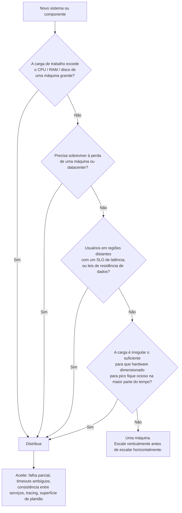

## Visão Geral

Antes de qualquer diagrama de arquitetura ser desenhado, duas decisões já foram tomadas — frequentemente por padrão, raramente de propósito. A primeira é **quem opera a infraestrutura**: você, em máquinas que controla, ou um fornecedor que você paga por hora. A segunda é **em quantas máquinas o sistema roda**: uma, ou várias se comunicando por rede. Ambas são enquadradas na conversa da indústria como se a resposta moderna fosse óbvia ("nuvem, e distribuído"), mas nenhuma é grátis, e a segunda em particular compra toda uma categoria de modos de falha que uma única máquina simplesmente não tem. O instinto útil é o oposto do padrão: distribua quando um requisito concreto força você a fazê-lo, não porque a arquitetura parece mais séria dessa forma.

## Construir ou Comprar, Rodar ou Alugar

Toda capacidade que uma organização precisa fica em algum lugar do espectro entre totalmente interno e totalmente terceirizado. A regra geral é que **competências centrais ficam internas e commodities são compradas** — quase ninguém fabrica seus próprios CPUs, porque uma empresa de semicondutores faz isso melhor e mais barato. Software tem duas questões separáveis ao longo desse espectro: quem *escreve* e quem *opera*.

Em uma ponta está software sob medida que você escreve e roda você mesmo. Na outra ponta está SaaS — código de outra pessoa, rodando nas máquinas de outra pessoa, alcançável apenas através de uma API. O meio-termo interessante é **software pronto que você auto-hospeda**: você baixa o PostgreSQL e o roda, seja em hardware que você possui (on premises, o que na prática costuma significar um rack alugado) ou em uma VM que você aluga (IaaS). Alugar uma VM *não* é a mesma coisa que usar um serviço em nuvem; com IaaS você terceirizou o hardware e manteve todo o fardo operacional.

## Onde a Nuvem Realmente Vence

Usar um serviço gerenciado em nuvem em vez de auto-hospedar o software equivalente significa terceirizar as *operações* desse software. Se isso economiza dinheiro depende quase inteiramente de duas variáveis:

**Quão variável é sua carga.** Este é o argumento mais forte para a nuvem e o único que resiste ao escrutínio. Se você provisiona para o pico, tudo que você comprou fica ocioso o resto do tempo. Cargas de trabalho analíticas são o caso extremo: uma query interativa quer uma grande quantidade de computação paralela por trinta segundos e depois não quer nada até a próxima query. Devolver esses recursos ao provedor entre queries é uma economia real e estrutural que possuir hardware não consegue replicar.

**Se você já sabe operar a coisa.** Se sua equipe nunca operou o sistema em questão, aprender a fazê-lo bem — ou contratar pessoas que já sabem — é caro e lento. Comprar a versão gerenciada frequentemente chega a um sistema funcionando mais rápido, e libera o esforço de operações que você tem para preocupações de nível mais alto. Há um benefício de segunda ordem também: um provedor rodando o mesmo serviço para milhares de clientes acumula expertise operacional que você nunca vai acumular, então o deployment gerenciado mediano é melhor operado do que o auto-hospedado mediano.

O outro lado desse último ponto é que **o provedor ajusta para o cliente mediano, não para você**. Se sua carga de trabalho é incomum e você sabe como explorar isso, auto-hospedar permite configurar e ajustar de formas que nenhum fornecedor fará por você.

## O Que Você Perde

O custo central de um serviço em nuvem é controle, e ele aparece em formas específicas e concretas:

- **Funcionalidades faltantes não são suas para adicionar.** Você pode registrar um pedido. Esse é o remédio inteiro.
- **Indisponibilidades não são suas para corrigir.** Quando o serviço está fora do ar, você espera.
- **Depuração é muito mais difícil.** Com software que você roda, pode ler métricas em nível de SO, fazer strace de um processo, e dar grep nos logs do servidor. Com um serviço hospedado disparando um bug no seu padrão de acesso específico, você não tem nada disso — tem uma página de status e um ticket de suporte.
- **Vendor lock-in é real.** Se o serviço fechar, for reprecificado, ou mudar de uma forma que você não consegue conviver, você migra. Isso é barato quando alternativas expõem uma API compatível (armazenamento de objetos compatível com S3, protocolo wire do Postgres) e brutalmente caro quando não expõem, o que é o caso para a maioria dos serviços gerenciados de nível mais alto.
- **Exposição geopolítica e regulatória.** Um provedor em outra jurisdição pode se tornar indisponível para você através de sanções, e você precisa confiar a eles dados pelos quais pode ser legalmente responsável.

**Auto-hospedar ainda vence de forma clara em algumas formas.** Carga estável e previsível em escala significativa é a grande delas: se você precisa de aproximadamente o mesmo número de máquinas todo dia do ano, está pagando um prêmio de elasticidade que nunca usa, e possuir hardware costuma ser substancialmente mais barato. Sistemas sensíveis a latência que precisam de controle do próprio hardware — high-frequency trading é o exemplo canônico — não conseguem aceitar um substrato compartilhado e virtualizado de forma alguma. E muitos sistemas antecedem a nuvem e não têm caso de negócio para migrar.

## Cloud Native: Compondo Serviços em Vez de Possuir Máquinas

"Cloud native" não significa apenas "roda na nuvem". Um banco de dados auto-hospedado erguido em uma instância EC2 está rodando na nuvem e não é cloud native. A distinção é arquitetural: **sistemas cloud native são construídos sobre outros serviços em nuvem em vez de sobre recursos genéricos de SO.**

Software auto-hospedado convencional assume um substrato genérico — uma máquina Linux, um sistema de arquivos, TCP/IP — e gerencia tudo acima disso. Um sistema cloud native, em vez disso, compõe primitivas gerenciadas. Armazenamento de objetos (S3, Azure Blob, R2) oferece uma API deliberadamente mais estreita que um sistema de arquivos, mas em troca esconde as máquinas físicas completamente: espalha dados por muitas delas, então você nunca planeja capacidade de disco, e falhas individuais de disco ou máquina não perdem nada. Serviços de nível mais alto então constroem sobre isso: Snowflake é um data warehouse que armazena seus dados em S3, e outros produtos constroem sobre o Snowflake por sua vez.

A consequência estrutural é a **separação de armazenamento e computação**. Tradicionalmente uma máquina possuía tanto o disco quanto a CPU agindo sobre ele, com RAID protegendo contra falha de disco. Na nuvem, o disco local de uma instância é tratado como um cache efêmero — ele desaparece quando a instância é substituída, o que acontece rotineiramente conforme a carga muda. Discos virtuais conectados por rede (EBS e afins) emulam um block device bem o suficiente para rodar software tradicional, mas todo I/O agora é uma chamada de rede, o que adiciona overhead e torna o sistema agudamente sensível a soluços de rede. Sistemas projetados para a nuvem geralmente pulam discos virtuais e escrevem para serviços de armazenamento feitos sob medida em vez disso. Este é o mesmo desacoplamento descrito em [Stateless Services and Decoupling](stateless-services-and-decoupling), empurrado até o fundo da camada de armazenamento.

O trade-off é o usual para abstrações: **serviços de nível mais alto são mais opinativos**. Se seu caso de uso corresponde ao que o serviço foi projetado para fazer, você chega lá muito mais rápido do que montando a partir de primitivas. Se não corresponde, você não tem escolha a não ser construir uma camada abaixo. Serviços cloud native também são tipicamente **multitenant** — seus dados e computação compartilham hardware com os de outros clientes — o que é o que faz a economia de utilização funcionar, e o que torna isolamento de performance e segurança um problema de engenharia difícil para o provedor.

## O Que Aconteceu com Operações

As pessoas que costumavam ser DBAs e sysadmins agora são, na maioria das organizações, parte de uma equipe que possui tanto o software quanto seu comportamento em produção — a ideia de DevOps, com o papel de SRE do Google como uma implementação concreta. O objetivo nunca mudou: entregar o serviço de forma confiável e manter a produção estável. O trabalho mudou.

Operações auto-hospedadas são majoritariamente em nível de máquina: observar espaço em disco e adicionar discos antes de ficar sem espaço, provisionar novas máquinas, mover serviços entre elas, aplicar patches em sistemas operacionais. Serviços em nuvem escondem as máquinas atrás de uma API — armazenamento medido substitui planejamento de capacidade, e o serviço permanece no ar através de falhas individuais de máquina sem você perceber. Então a ênfase muda para automação em vez de trabalho manual pontual, instâncias efêmeras em vez de "pets" de longa duração, deploys frequentes, aprender com incidentes, e manter o conhecimento organizacional vivo conforme as pessoas rotacionam.

O que substitui o trabalho antigo está longe de ser trivial. **Planejamento de capacidade vira planejamento financeiro, e otimização de performance vira otimização de custo** — você ainda precisa saber exatamente o que está rodando e por quê, ou a fatura te ensina. Cotas e limites de serviço são os novos tetos de recurso, e você precisa saber onde estão antes de bater neles às 3 da manhã. Integrar uma pilha crescente de serviços de fornecedores entre si é em grande parte esforço manual não padronizado. E várias coisas não podem ser terceirizadas de forma alguma: segurança de aplicação e dependências, as interações entre seus próprios serviços, monitoramento de carga, e diagnóstico de causa raiz de degradações. A nuvem mudou o papel das operações. Não reduziu a necessidade delas.

## Você Realmente Precisa de Mais de Uma Máquina?

Um **sistema distribuído** é aquele onde várias máquinas se comunicam por rede; cada participante é um **nó**. Há boas razões para se tornar um:

- **Distribuição inerente** — se dois usuários em dois dispositivos interagem, o sistema é distribuído quer você goste ou não.
- **Chamadas serviço-para-serviço** — se dados vivem em um serviço e são processados em outro, cruzam uma rede. Arquiteturas cloud native e microsserviços são distribuídas por construção.
- **Tolerância a falhas** — sobreviver à perda de uma máquina, um rack, ou um datacenter requer redundância, que requer mais de uma máquina.
- **Escalabilidade** — quando volume de dados ou demanda de computação excede o que uma máquina consegue fazer.
- **Latência** — usuários em outros continentes são melhor servidos de uma região próxima do que de uma ida-e-volta de pacote na metade do mundo.
- **Elasticidade** — uma única máquina precisa ser dimensionada para o pico, permanentemente.
- **Hardware especializado** — um object store quer muitos discos e poucos CPUs; um treinador de ML quer GPUs e nenhum disco.
- **Conformidade legal** — leis de residência de dados exigem que alguns dados permaneçam fisicamente dentro de uma jurisdição, o que força distribuição geográfica.
- **Sustentabilidade** — flexibilidade sobre onde e quando jobs rodam permite perseguir energia renovável barata.

Agora o outro lado. **Toda chamada de rede é uma requisição que pode dar timeout sem te dizer se foi executada**, o que significa que retentar não é automaticamente seguro. Uma chamada para outro serviço é vastamente mais lenta que uma chamada de função no mesmo processo — frequentemente tão mais lenta que mover a computação para a máquina que já detém os dados vence mover os dados para a computação. Diagnosticar problemas fica genuinamente difícil: "o sistema está lento" não localiza mais em um processo, motivo pelo qual distributed tracing (OpenTelemetry, Zipkin, Jaeger) existe como categoria. E uma vez que cada serviço possui seu próprio banco de dados, consistência entre serviços se torna problema da sua aplicação em vez de problema do seu banco de dados; transações distribuídas existem mas raramente são usadas em um ambiente de microsserviços, porque reintroduzem exatamente o acoplamento que a divisão pretendia remover. [The Trouble with Distributed Systems](distributed-systems-partial-failures) é a contabilidade completa do que você assina.

Contra tudo isso, note o quanto uma única máquina agora consegue fazer. CPUs, memória, e discos cresceram enormemente, e motores de nó único como DuckDB e SQLite lidam com datasets que teriam exigido um cluster uma década atrás. **Mais nós não são confiavelmente mais rápidos** — há casos bem documentados onde um programa competente e single-threaded em um laptop vence um cluster de cem núcleos rodando a mesma carga de trabalho, porque o cluster gasta seu orçamento em coordenação e movimentação de dados. Fazer o trabalho em uma máquina costuma ser mais simples, mais barato, e mais fácil de depurar.

Todo "sim" nesse fluxograma é um *requisito* — um número em um SLO, uma lei, um teto de recurso medido. "Parece mais escalável" não é um deles. Veja [Horizontal vs. Vertical Scaling](horizontal-vs-vertical-scaling) para até onde o caminho "escale verticalmente primeiro" realmente vai.

## Microsserviços e Serverless: Dois Eixos Diferentes

Estes são frequentemente mencionados na mesma frase e respondem perguntas diferentes. **Microsserviços é um estilo de decomposição** — como a aplicação é dividida. **Serverless é um estilo de deployment** — como as peças são executadas.

Em uma arquitetura de microsserviços, cada serviço tem um propósito bem definido, expõe uma API de rede, e é possuído por uma equipe. As vantagens são reais: deploys independentes, recursos dimensionados independentemente, e detalhes de implementação escondidos atrás da API para que os donos possam mudar internos livremente. Cada serviço normalmente possui seu próprio banco de dados, precisamente porque um banco de dados compartilhado torna o schema parte da API pública — impossível de mudar com segurança — e permite que a query cara de um serviço degrade a latência de outro.

Os custos são igualmente reais. Testar um serviço significa erguer suas dependências. Todo serviço precisa de ferramental de deploy, gerenciamento de recursos, coleta de logs, monitoramento de saúde, e uma rotação de plantão — motivo pelo qual orquestração no estilo Kubernetes se tornou o substrato padrão. A evolução de API fica complicada: adicionar ou remover um campo pode quebrar clients, e a quebra frequentemente surge tarde, o que é o que schemas OpenAPI e gRPC existem para conter. O enquadramento mais afiado é este: **microsserviços são uma solução técnica para um problema de pessoas** — permitir que muitas equipes lancem sem coordenar. Em uma empresa com poucas equipes, esse problema ainda não existe, e o overhead é custo puro.

Serverless (FaaS) muda quem decide quando computação existe. Com VMs você escolhe quando iniciar e parar instâncias; com serverless o provedor aloca e libera recursos por requisição, e você paga pelo tempo de execução em vez de capacidade provisionada — a mesma mudança que armazenamento medido fez para discos, aplicada à execução de código. As restrições vêm junto: limites de tempo de execução, runtimes restritos, e cold starts na primeira invocação. O nome é marketing — toda invocação ainda roda em um servidor, apenas possivelmente um diferente a cada vez, o que só é viável porque a função é esperada ser stateless exatamente no sentido descrito em [Stateless Services and Decoupling](stateless-services-and-decoupling). O rótulo desde então foi esticado para cobrir qualquer serviço com auto-scaling e cobrança por uso, incluindo BigQuery e Kafka hospedado.

## Um Conjunto Diferente de Suposições: Supercomputação

Computação em nuvem não é a única forma de construir um cluster grande, e comparar com HPC (high-performance computing) aguça o que a arquitetura em nuvem está realmente otimizando. HPC roda jobs batch computacionalmente intensivos — previsão do tempo, dinâmica molecular, resolvedores de PDE — que fazem checkpoint em disco periodicamente. **Quando um nó HPC falha, a resposta normal é parar o cluster inteiro, consertar o nó, e reiniciar a partir do último checkpoint.** Isso é impensável para um serviço online, que precisa continuar servindo usuários através de falhas, e essa única diferença impulsiona a maioria das outras: sistemas em nuvem perseguem tolerância a falhas parciais enquanto HPC persegue throughput bruto.

O resto se segue. Nós HPC conversam via memória compartilhada e RDMA, o que assume confiança mútua entre usuários; máquinas em nuvem são compartilhadas por locatários mutuamente desconfiados e portanto precisam de VMs, criptografia, e autenticação. Datacenters em nuvem usam IP/Ethernet em topologias Clos para alta largura de banda de bisseção; supercomputadores usam malhas e toroides ajustados a padrões de comunicação conhecidos. E nós em nuvem podem se estender por continentes, enquanto um supercomputador assume que seus nós estão em uma sala. Analytics em grande escala toma emprestado de ambos os mundos, motivo pelo qual a comparação vale a pena conhecer.

## As Obrigações Que Vêm Com os Dados

Arquitetura é moldada por lei e responsabilidade social, não apenas por metas de throughput. GDPR, CCPA, e o EU AI Act dão a indivíduos direitos exequíveis sobre dados sobre eles, e esses direitos caem diretamente sobre design de sistema — o direito ao apagamento é genuinamente difícil de honrar em sistemas construídos sobre logs append-only e datasets derivados como corpora de treinamento de ML, e nenhuma regulação te diz qual arquitetura é conforme, porque deliberadamente especificam princípios em vez de tecnologias. O custo honesto de armazenar dados, portanto, inclui responsabilidade legal, dano reputacional por violação, e multas, junto com a fatura de armazenamento — e para dados que poderiam expor comportamento criminalizado, risco físico real para as pessoas que ele descreve. Esse cálculo frequentemente pende a favor da **minimização de dados**: colete para um propósito declarado, mantenha não mais que esse propósito exigir, e delete o que não vale o risco. Vai diretamente contra o instinto de "armazene tudo, pode ser útil depois", e geralmente é a escolha certa.

## Trade-offs

- **Serviços em nuvem trocam controle por velocidade de adoção** — você recebe um sistema bem operado sem aprender a operá-lo, e abre mão da capacidade de adicionar uma funcionalidade faltante, corrigir uma indisponibilidade, ler diagnósticos em nível de SO, ou permanecer em uma versão que o fornecedor decidiu descontinuar.
- **Elasticidade só vale a pena pagar se sua carga é realmente elástica** — cargas de trabalho variáveis e irregulares genuinamente economizam dinheiro devolvendo capacidade ociosa, enquanto uma carga estável e previsível em escala paga um prêmio permanente por uma capacidade que nunca exercita, que é exatamente quando possuir hardware vence.
- **Serviços gerenciados de nível mais alto reduzem trabalho e aumentam lock-in no mesmo movimento** — quanto mais o serviço faz por você, mais da sua arquitetura é expressa em sua forma proprietária, e mais cara fica a saída quando nenhuma API alternativa compatível existe.
- **Distribuição compra escala, redundância, e proximidade ao preço de falha parcial** — timeouts que não dizem se a requisição foi executada, chamadas de rede ordens de grandeza mais lentas que chamadas de função, consistência entre serviços se tornando lógica de aplicação, e depuração que requer uma stack de tracing só para começar.
- **Uma única máquina grande lida com muito mais do que a maioria dos designs assume** — hardware moderno mais motores de nó único como DuckDB ou SQLite cobre muitas cargas de trabalho completamente, e um cluster pode perder para um programa single-threaded bem escrito que não gasta nada do seu orçamento em coordenação.
- **Microsserviços resolvem um problema organizacional e cobram uma taxa técnica** — velocidade independente de equipe vale overhead real de infraestrutura, deployment, e versionamento de API em uma empresa grande, e é quase overhead puro em uma pequena.

## Perguntas de Entrevista

- Uma equipe roda uma carga de trabalho estável e previsível em 40 máquinas com pouca variação sazonal. Qual é o argumento real para mantê-las na nuvem, e qual é o argumento real para comprar hardware?
- O que distingue um banco de dados "cloud native" do mesmo banco de dados auto-hospedado em uma VM de nuvem? Nomeie uma diferença arquitetural concreta, não apenas operacional.
- Serviços em nuvem removeram o planejamento tradicional de capacidade. O que o substituiu, e por que o papel de operações não encolhe tanto quanto o marketing sugere?
- Um colega propõe dividir um novo produto em oito microsserviços no dia um, com três engenheiros na equipe. Quais custos específicos você levantaria, e o que mudaria sua opinião?
- Sob quais circunstâncias um cluster de cem nós seria *mais lento* que uma única máquina para o mesmo job, e o que isso implica sobre como você deveria justificar uma decisão de distribuir?

## Referências

- [Martin Kleppmann, "Designing Data-Intensive Applications", 2nd Edition (O'Reilly) — Chapter 1, "Trade-Offs in Data Systems Architecture", sections "Cloud Versus Self-Hosting" and "Distributed Versus Single-Node Systems"](https://www.oreilly.com/library/view/designing-data-intensive-applications/9781098119058/)
- Frank McSherry, Michael Isard, and Derek G. Murray — ["Scalability! But at what COST?"](https://www.usenix.org/system/files/conference/hotos15/hotos15-paper-mcsherry.pdf) (HotOS XV, 2015), o caso medido de que um programa single-threaded pode vencer um cluster grande
- David Heinemeier Hansson — ["Why we're leaving the cloud"](https://world.hey.com/dhh/why-we-re-leaving-the-cloud-654b47e0) (37signals), uma contabilidade concreta de quando carga estável torna auto-hospedar mais barato
- Martin Fowler — ["Microservice Trade-Offs"](https://martinfowler.com/articles/microservice-trade-offs.html), sobre o que a implantabilidade independente realmente custa
