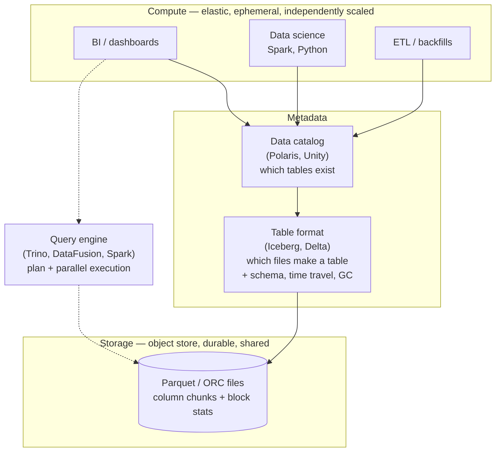

## Overview

A fact table in a data warehouse is often more than a hundred columns wide, and a typical analytical query reads four or five of them across every row that has ever been written — the exact mirror image of OLTP's "one row, all its columns, right now" access pattern that [Operational vs. Analytical Systems](operational-vs-analytical-systems) lays out. **Column-oriented storage** is the storage-layout answer to that specific shape: store all the values of one column contiguously instead of all the values of one row, so a query pays for the columns it names and nothing else. Everything else that makes analytical engines fast — aggressive compression, vectorized execution, precomputed cubes — is built on top of that one decision, and mostly only works *because* of it.

## Two Layouts for the Same Table

Take a `fact_sales` table with ten columns and a billion rows, roughly 100 bytes per row, so ~100 GB on disk:

```sql
SELECT SUM(quantity) FROM fact_sales WHERE date_key >= 20240101;
```

The query needs two columns: `quantity` (4 bytes) and `date_key` (4 bytes). In a **row-oriented** store, all the values of one row sit next to each other, so the storage engine cannot read those 8 bytes without dragging the surrounding 92 bytes through the disk, the page cache, and the CPU to reach them. Even a perfect index on `date_key` only narrows *which* rows to read; it does not make a row narrower. The query reads ~100 GB to use ~8 GB of it.

In a **column-oriented** store, each column's values are written contiguously, so the engine opens two files (or two column chunks) and reads 8 GB — before compression, which typically cuts it by another order of magnitude.

```text
Row-oriented — each row's fields contiguous:

  ┌──────────────── row 1 ────────────────┐┌──────────────── row 2 ─────────────
  │1001│20240103│ 31│ 3│ 1│…│ 4│2.49│USD │ │1002│20240103│ 69│ 5│ 0│…│ 1│0.99│USD
  └───────────────────────────────────────┘└────────────────────────────────────
   read 100 bytes to get at the 4 you wanted, one billion times over

Column-oriented — each column's values contiguous:

  sale_id     : 1001, 1002, 1003, 1004, 1005, …
  date_key    : 20240103, 20240103, 20240103, 20240104, 20240104, …
  product_sk  : 31, 69, 69, 31, 31, …
  store_sk    : 3, 5, 5, 3, 2, …
  quantity    : 4, 1, 2, 7, 1, …          ← the query reads this file
  net_price   : 2.49, 0.99, 0.99, 2.49, 3.10, …
  …
```

The layout depends on one invariant: **every column stores its rows in the same order.** The 23rd entry of every column belongs to the 23rd row, which is what makes it possible to reassemble a whole row at all, and what lets the engine combine per-column results positionally without a join.

In practice a columnar engine does not write one file per column for the entire table. It breaks the table into **blocks** (row groups) of thousands to millions of rows and stores each column separately *within* a block, usually with per-block min/max metadata. If blocks are aligned to a timestamp range — the common choice, since most warehouse queries are time-bounded — a query for last month skips every block whose range doesn't overlap, without reading any of their data. That is the same idea as an index, achieved with metadata instead of a separate structure.

This layout is now essentially universal in analytics: Snowflake, BigQuery, Redshift, ClickHouse, Druid, Pinot, the embedded engine in DuckDB, on-disk formats like Parquet and ORC, and in-memory formats like Apache Arrow. (Don't confuse it with the **wide-column** model of Bigtable, HBase, and Cassandra — despite the name, those store all of a row's values together and are row-oriented.)

## Why a Column Compresses and a Row Doesn't

A row is a jumble of unrelated types: an integer id, a timestamp, two foreign keys, a decimal price, a currency string. There is very little redundancy for a compressor to exploit across those bytes. A **column** is the opposite — a long run of values drawn from one domain, usually with a number of distinct values far smaller than the number of rows. A retailer might have a billion sales rows and 100,000 distinct products, five currencies, a few hundred stores. That low cardinality is exactly what compression algorithms want.

The technique that fits warehouses best is **bitmap encoding**. Turn a column with *n* distinct values into *n* bitmaps, one per value, with one bit per row:

```text
product_sk column:   31, 69, 69, 31, 31, 68, 69, 31

  product_sk = 31 :  1 0 0 1 1 0 0 1
  product_sk = 68 :  0 0 0 0 0 1 0 0
  product_sk = 69 :  0 1 1 0 0 0 1 0
```

These bitmaps are overwhelmingly zeros, so they are further **run-length encoded** (store "9 zeros, 3 ones" instead of the bits); roaring bitmaps switch between raw and run-length representations per chunk, picking whichever is smaller. The payoff is that warehouse predicates become bitwise operations on compressed data:

- `WHERE product_sk IN (31, 68, 69)` — load three bitmaps, bitwise OR.
- `WHERE product_sk = 31 AND store_sk = 3` — load one bitmap from each column, bitwise AND. This is only correct because both columns store rows in the same order, so the *k*-th bit means the same row in both.

**Sort order amplifies all of this.** Rows in a column store don't have to be in insertion order; an administrator can declare a sort key, and the table is sorted a whole row at a time (sorting columns independently would destroy the positional invariant). If the first sort key has few distinct values, it becomes long runs of identical values after sorting, and run-length encoding can squeeze a billion-row column down to kilobytes. The effect is strongest on the first sort key, weaker on the second, and essentially gone by the third — which is why choosing the sort key is a real design decision driven by the queries you expect, usually `date_key` first.

**The cost lands on writes.** Updating one row in the middle of a sorted, compressed columnar file means rewriting every compressed column block from that position on. Column stores therefore don't do single-row updates in place. They use a log-structured approach: writes land in a row-oriented, sorted, in-memory store, and once enough have accumulated they are merged with the on-disk column files and written out as new immutable files in bulk. Queries read both and merge the results, so an analyst sees their insert immediately even though the columnar files haven't changed. Immutable files written once are also precisely what object storage is good at — which leads directly to the next section.

## Cloud Data Warehouses: The Productized Version

Snowflake, Google BigQuery, and Amazon Redshift are columnar storage sold as a service, and their defining architectural move is **separating storage from compute**. Data lives in object storage (S3, GCS) rather than on disks attached to query nodes, so you can scale the two independently: add petabytes without adding CPUs, or spin up a large cluster for a one-hour backfill and shut it down, without moving a byte of data. It also means several independent compute clusters can read the same tables concurrently — the ETL job, the BI dashboards, and the data science team each get their own compute and can't starve each other.

The open-source ecosystem has decomposed the same architecture into swappable layers:



The **storage format** (Parquet, ORC, Lance) encodes column chunks as bytes. Because those files are immutable once written, a **table format** (Apache Iceberg, Delta Lake) sits above them to define which files currently constitute a table, giving you inserts, deletes, snapshots, time travel, and garbage collection over an immutable substrate. A **data catalog** defines which tables constitute a database. Pulling the catalog out as a standalone REST service is what lets governance and data-discovery tooling read metadata without going through a query engine. The practical consequence of the whole stack: the data is not locked inside one vendor's engine — Trino, Spark, and DuckDB can all read the same Parquet files.

## Query Execution: Compilation and Vectorization

Reading less data off disk only helps until the CPU becomes the bottleneck, and for a query scanning hundreds of millions of rows it does. The naive operator is an **interpreter**: for each row, walk a data structure representing the query, dispatch on what operation to perform, fetch the operand, compare, move on. The useful work is a single integer comparison; the overhead around it is a virtual call, a branch the CPU can't predict, and a pointer chase — easily tens of instructions of bookkeeping per instruction of real work. At a billion rows that ratio is the whole query time.

Two approaches replace it, and both are in production use:

**Query compilation.** The engine generates source code specialized to *this* query — with the column offsets, types, and constants baked in — compiles it to machine code (typically via LLVM), and runs it over the column data in memory. The generated loop has no interpretation left in it: no dispatch table, no branches on "what operator is this," just a tight loop doing the comparison. It is the same idea as JIT compilation in the JVM, and it is what Spark's whole-stage code generation does.

**Vectorized processing.** The query stays interpreted, but the unit of work becomes a *batch* of column values (typically ~1,000–2,000) rather than a row. A fixed library of operators is built into the engine: pass the `product_sk` column batch and the value `31` to the equality operator, get back a bitmap; pass `store_sk` and `3` to the same operator, get another bitmap; pass both to a bitwise AND operator. The dispatch overhead is paid once per batch of a thousand values instead of once per value, and the inner loop is a simple array scan. This is the approach pioneered by MonetDB/X100 and used by DuckDB, ClickHouse, and Snowflake.

Both win for the same hardware reasons, all of which columnar layout enables and row layout obstructs:

- **Sequential memory access.** A column batch is a dense array, so prefetching works and cache misses are rare. Row-at-a-time execution touches 100 bytes to use 4, wasting most of every cache line.
- **Tight inner loops** with no function calls keep the instruction pipeline full and avoid branch mispredictions.
- **SIMD.** One instruction can compare 8 or 16 packed integers at once — but only if those integers are adjacent in memory and the same type, which is the definition of a column.
- **Operating directly on compressed data.** An engine can AND two run-length-encoded bitmaps without ever materializing the decoded column, saving both the allocation and the memory bandwidth.

## Materialized Views and Data Cubes

A **virtual view** is a saved query: reading from it expands the definition and runs the underlying query every time. A **materialized view** is the query's *results*, actually written to disk. When the same expensive aggregation is run repeatedly — and warehouse dashboards do exactly that, a fixed set of `SUM`/`COUNT`/`AVG` queries re-run all day — recomputing it from raw data each time is pure waste.

A **data cube** (OLAP cube) is the classic materialized aggregate: a grid of precomputed aggregates grouped by dimensions. With `date_key` on one axis and `product_sk` on the other, each cell holds `SUM(net_price)` for that date-product combination, and summing along an axis collapses a dimension — total sales per product regardless of date, or per date regardless of product. Real fact tables have five or more dimensions (date, product, store, promotion, customer), making a hypercube rather than a grid, but the principle is identical. "Total sales per store yesterday" becomes reading one precomputed row instead of scanning a billion.

The two costs are worth naming explicitly:

- **Staleness and refresh cost.** A materialized view is derived data, and it is only as current as its last refresh. Refreshing it means either recomputing the whole thing on a schedule (cheap to reason about, stale between runs) or maintaining it incrementally as the base data changes (fresh, but every write now does extra work, and getting incremental maintenance right for arbitrary SQL is hard enough that systems like Materialize exist to do only that). There is no version of this where reads get faster for free — you have moved work from read time to write time, plus an interval of wrongness.
- **Lost flexibility.** A cube can only answer questions along the dimensions it was built with. "What proportion of sales came from items over $100" is unanswerable from a cube that doesn't have price as a dimension, no matter how many cells it has. This is why warehouses keep the raw data and treat cubes as a targeted accelerator for known-hot queries, not as a replacement for the fact table.

## Trade-offs

- **Columnar storage makes wide scans cheap and single-row access expensive** — reconstructing one full row means one seek per column and assembling values positionally, which is why the same layout that wins by 100x on `SUM(quantity)` loses badly on `SELECT * FROM orders WHERE id = ?`, and why one engine rarely serves both workloads well.
- **Compression buys I/O with CPU, and usually wins — but not always** — bitmap and run-length encoding can shrink a column by an order of magnitude, and modern engines operate on the compressed form directly; when they can't, a heavily compressed column that must be decoded before every operator turns a disk-bound query into a CPU-bound one.
- **The sort key is a one-shot bet on your query pattern** — it determines both which blocks a query can skip and how well the first column compresses, the benefit decays fast past the second key, and changing it means rewriting the table.
- **Writes are batched by design, so freshness is a pipeline property, not a storage property** — single-row updates would force rewriting compressed blocks, so column stores buffer writes in a row-oriented memory store and merge in bulk; this is fine for ETL loads and awkward for anything expecting operational write latency.
- **Storage-compute separation buys elasticity and independent scaling at the cost of network in the read path** — data sitting in object storage instead of on local disk is why you can resize compute in seconds, and also why cold queries pay object-store latency that a local-disk warehouse would not.
- **Materialized views and cubes trade staleness and write amplification for read latency** — they are precomputed answers to questions you already know you'll ask, so they collapse a billion-row scan to a lookup, but every one of them is another derived object to refresh, invalidate, and keep honest, and none of them can answer a question along a dimension they weren't built with.

## Interview Questions

- A query reads 3 columns of a 120-column fact table across a billion rows. Quantify roughly what a row store and a column store each read off disk, and explain why adding an index to the row store doesn't close the gap.
- Column stores require every column to store rows in the same order. What operations would break if you sorted each column independently to improve compression, and what does the engine get from that invariant besides row reconstruction?
- Why does a "country" column compress dramatically better than the same data laid out row-by-row? Name the encoding you'd expect and what property of the data makes it work.
- Your engine is disk-bound on a scan, so you enable heavier compression and it gets *slower*. What's the likely explanation, and what property of an execution engine would have prevented it?
- A dashboard runs the same six aggregations every 30 seconds. You propose a materialized view. What do you now have to decide about refresh, and what class of question does the dashboard permanently lose the ability to ask if you replace the raw table with a cube?

## References

- [Martin Kleppmann, "Designing Data-Intensive Applications", 2nd Edition (O'Reilly) — Chapter 4, "Storage and Retrieval", section "Data Storage for Analytics"](https://www.oreilly.com/library/view/designing-data-intensive-applications/9781098119058/)
- [Snowflake Documentation — Micro-partitions & Data Clustering](https://docs.snowflake.com/en/user-guide/tables-clustering-micropartitions)
- [ClickHouse Documentation — Architecture Overview (columnar storage and vectorized query execution)](https://clickhouse.com/docs/development/architecture)
- [Boncz, Zukowski, Nes — "MonetDB/X100: Hyper-Pipelining Query Execution" (CIDR 2005)](https://www.cidrdb.org/cidr2005/papers/P19.pdf)
