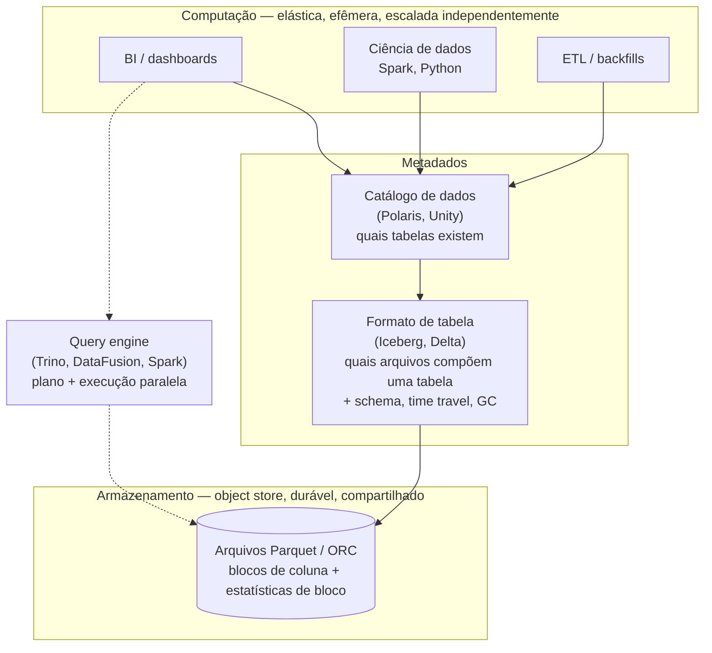

## Visão Geral

Uma tabela de fatos em um data warehouse costuma ter mais de cem colunas de largura, e uma consulta analítica típica lê apenas quatro ou cinco delas em cada linha já escrita — exatamente o espelho do padrão de acesso do OLTP, "uma linha, todas as suas colunas, agora", descrito em [Operational vs. Analytical Systems](operational-vs-analytical-systems). O **armazenamento orientado a colunas** é a resposta em nível de layout de armazenamento para esse formato específico: armazenar todos os valores de uma coluna de forma contígua em vez de todos os valores de uma linha, de modo que uma consulta pague pelas colunas que nomeia e por mais nada. Tudo o mais que torna os engines analíticos rápidos — compressão agressiva, execução vetorizada, cubos pré-computados — é construído em cima dessa única decisão, e na maior parte só funciona *por causa* dela.

## Dois Layouts para a Mesma Tabela

Considere uma tabela `fact_sales` com dez colunas e um bilhão de linhas, aproximadamente 100 bytes por linha, portanto ~100 GB em disco:

```sql
SELECT SUM(quantity) FROM fact_sales WHERE date_key >= 20240101;
```

A consulta precisa de duas colunas: `quantity` (4 bytes) e `date_key` (4 bytes). Em um armazenamento **orientado a linhas**, todos os valores de uma linha ficam lado a lado, então o motor de armazenamento não consegue ler esses 8 bytes sem arrastar os 92 bytes ao redor pelo disco, pelo page cache e pela CPU até chegar lá. Mesmo um índice perfeito em `date_key` apenas reduz *quais* linhas ler; ele não torna uma linha mais estreita. A consulta lê ~100 GB para usar ~8 GB deles.

Em um armazenamento **orientado a colunas**, os valores de cada coluna são escritos de forma contígua, então o motor abre dois arquivos (ou dois blocos de coluna) e lê 8 GB — antes da compressão, que normalmente corta isso por mais uma ordem de grandeza.

```text
Orientado a linhas — campos de cada linha contíguos:

  ┌──────────────── linha 1 ────────────────┐┌──────────────── linha 2 ───────────
  │1001│20240103│ 31│ 3│ 1│…│ 4│2.49│USD │ │1002│20240103│ 69│ 5│ 0│…│ 1│0.99│USD
  └───────────────────────────────────────┘└────────────────────────────────────
   lê 100 bytes para obter os 4 que você queria, um bilhão de vezes

Orientado a colunas — valores de cada coluna contíguos:

  sale_id     : 1001, 1002, 1003, 1004, 1005, …
  date_key    : 20240103, 20240103, 20240103, 20240104, 20240104, …
  product_sk  : 31, 69, 69, 31, 31, …
  store_sk    : 3, 5, 5, 3, 2, …
  quantity    : 4, 1, 2, 7, 1, …          ← a consulta lê este arquivo
  net_price   : 2.49, 0.99, 0.99, 2.49, 3.10, …
  …
```

O layout depende de um invariante: **toda coluna armazena suas linhas na mesma ordem.** A 23ª entrada de cada coluna pertence à 23ª linha, o que é o que torna possível reconstruir uma linha inteira, e o que permite ao motor combinar resultados por coluna de forma posicional sem um join.

Na prática, um engine colunar não escreve um arquivo por coluna para a tabela inteira. Ele divide a tabela em **blocos** (row groups) de milhares a milhões de linhas e armazena cada coluna separadamente *dentro* de um bloco, geralmente com metadados de mínimo/máximo por bloco. Se os blocos forem alinhados a um intervalo de timestamp — a escolha comum, já que a maioria das consultas de warehouse é limitada no tempo — uma consulta do último mês pula todo bloco cujo intervalo não se sobrepõe, sem ler nenhum dado deles. Essa é a mesma ideia de um índice, alcançada com metadados em vez de uma estrutura separada.

Esse layout hoje é essencialmente universal em analytics: Snowflake, BigQuery, Redshift, ClickHouse, Druid, Pinot, o engine embutido do DuckDB, formatos em disco como Parquet e ORC, e formatos em memória como Apache Arrow. (Não confunda com o modelo **wide-column** de Bigtable, HBase e Cassandra — apesar do nome, esses armazenam todos os valores de uma linha juntos e são orientados a linhas.)

## Por Que uma Coluna Comprime e uma Linha Não

Uma linha é uma mistura de tipos não relacionados: um id inteiro, um timestamp, duas chaves estrangeiras, um preço decimal, uma string de moeda. Há muito pouca redundância para um compressor explorar entre esses bytes. Uma **coluna** é o oposto — uma longa sequência de valores extraídos de um domínio único, geralmente com um número de valores distintos muito menor que o número de linhas. Um varejista pode ter um bilhão de linhas de vendas e 100.000 produtos distintos, cinco moedas, algumas centenas de lojas. Essa baixa cardinalidade é exatamente o que os algoritmos de compressão querem.

A técnica que mais se encaixa em warehouses é a **codificação por bitmap**. Transforme uma coluna com *n* valores distintos em *n* bitmaps, um por valor, com um bit por linha:

```text
coluna product_sk:   31, 69, 69, 31, 31, 68, 69, 31

  product_sk = 31 :  1 0 0 1 1 0 0 1
  product_sk = 68 :  0 0 0 0 0 1 0 0
  product_sk = 69 :  0 1 1 0 0 0 1 0
```

Esses bitmaps são majoritariamente zeros, então são ainda mais comprimidos com **run-length encoding** (armazenar "9 zeros, 3 uns" em vez dos bits); roaring bitmaps alternam entre representações brutas e de run-length por bloco, escolhendo a que for menor. O ganho é que os predicados de warehouse se tornam operações bit a bit sobre dados comprimidos:

- `WHERE product_sk IN (31, 68, 69)` — carrega três bitmaps, OR bit a bit.
- `WHERE product_sk = 31 AND store_sk = 3` — carrega um bitmap de cada coluna, AND bit a bit. Isso só é correto porque ambas as colunas armazenam linhas na mesma ordem, então o *k*-ésimo bit significa a mesma linha em ambas.

**A ordenação amplifica tudo isso.** As linhas em um armazenamento colunar não precisam estar na ordem de inserção; um administrador pode declarar uma chave de ordenação, e a tabela é ordenada uma linha inteira por vez (ordenar colunas independentemente destruiria o invariante posicional). Se a primeira chave de ordenação tem poucos valores distintos, ela se torna longas sequências de valores idênticos após a ordenação, e o run-length encoding consegue reduzir uma coluna de um bilhão de linhas a quilobytes. O efeito é mais forte na primeira chave de ordenação, mais fraco na segunda, e praticamente desaparece na terceira — por isso escolher a chave de ordenação é uma decisão de design real, guiada pelas consultas que você espera, geralmente `date_key` primeiro.

**O custo recai sobre as escritas.** Atualizar uma linha no meio de um arquivo colunar ordenado e comprimido significa reescrever todos os blocos de coluna comprimidos a partir daquela posição em diante. Armazenamentos colunares, portanto, não fazem atualizações de linha única in-place. Eles usam uma abordagem log-structured: as escritas chegam a um armazenamento em memória, orientado a linhas e ordenado, e assim que o suficiente se acumula são mescladas com os arquivos de coluna em disco e escritas como novos arquivos imutáveis em lote. As consultas leem ambos e mesclam os resultados, então um analista vê seu insert imediatamente mesmo que os arquivos colunares não tenham mudado. Arquivos imutáveis escritos uma única vez são também precisamente o que o armazenamento de objetos faz bem — o que leva diretamente à próxima seção.

## Data Warehouses na Nuvem: A Versão Produtizada

Snowflake, Google BigQuery e Amazon Redshift são armazenamento colunar vendido como serviço, e sua principal decisão arquitetural é **separar armazenamento de computação**. Os dados vivem em armazenamento de objetos (S3, GCS) em vez de discos anexados aos nós de consulta, então você pode escalar os dois de forma independente: adicionar petabytes sem adicionar CPUs, ou subir um cluster grande para um backfill de uma hora e desligá-lo, sem mover um único byte de dados. Isso também significa que vários clusters de computação independentes podem ler as mesmas tabelas simultaneamente — o job de ETL, os dashboards de BI e a equipe de ciência de dados recebem cada um sua própria computação e não podem sufocar uns aos outros.

O ecossistema open-source decompôs a mesma arquitetura em camadas intercambiáveis:



O **formato de armazenamento** (Parquet, ORC, Lance) codifica blocos de coluna como bytes. Como esses arquivos são imutáveis uma vez escritos, um **formato de tabela** (Apache Iceberg, Delta Lake) fica acima deles para definir quais arquivos constituem atualmente uma tabela, dando a você inserts, deletes, snapshots, time travel e coleta de lixo sobre um substrato imutável. Um **catálogo de dados** define quais tabelas constituem um banco de dados. Extrair o catálogo como um serviço REST autônomo é o que permite que ferramentas de governança e descoberta de dados leiam metadados sem passar por um query engine. A consequência prática de toda a pilha: os dados não ficam presos dentro do engine de um único fornecedor — Trino, Spark e DuckDB podem todos ler os mesmos arquivos Parquet.

## Execução de Consultas: Compilação e Vetorização

Ler menos dados do disco só ajuda até a CPU se tornar o gargalo, e para uma consulta que varre centenas de milhões de linhas isso acontece. O operador ingênuo é um **interpretador**: para cada linha, percorre uma estrutura de dados representando a consulta, despacha para qual operação executar, busca o operando, compara, segue em frente. O trabalho útil é uma única comparação de inteiros; a sobrecarga ao redor é uma chamada virtual, um branch que a CPU não consegue prever, e uma perseguição de ponteiros — facilmente dezenas de instruções de contabilidade para cada instrução de trabalho real. Em um bilhão de linhas, essa proporção é o tempo total da consulta.

Duas abordagens a substituem, e ambas estão em uso em produção:

**Compilação de consultas.** O engine gera código-fonte especializado para *esta* consulta — com os offsets de coluna, tipos e constantes embutidos —, compila para código de máquina (tipicamente via LLVM) e o executa sobre os dados de coluna em memória. O loop gerado não tem interpretação nenhuma: sem tabela de despacho, sem branches sobre "qual operador é este", apenas um loop apertado fazendo a comparação. É a mesma ideia da compilação JIT na JVM, e é o que a geração de código whole-stage do Spark faz.

**Processamento vetorizado.** A consulta permanece interpretada, mas a unidade de trabalho passa a ser um *lote* de valores de coluna (tipicamente ~1.000–2.000) em vez de uma linha. Uma biblioteca fixa de operadores é embutida no engine: passe o lote da coluna `product_sk` e o valor `31` para o operador de igualdade, obtenha de volta um bitmap; passe `store_sk` e `3` para o mesmo operador, obtenha outro bitmap; passe ambos para um operador AND bit a bit. A sobrecarga de despacho é paga uma vez por lote de mil valores em vez de uma vez por valor, e o loop interno é uma simples varredura de array. Essa é a abordagem pioneirada pelo MonetDB/X100 e usada por DuckDB, ClickHouse e Snowflake.

Ambas vencem pelas mesmas razões de hardware, todas viabilizadas pelo layout colunar e obstruídas pelo layout em linhas:

- **Acesso sequencial à memória.** Um lote de coluna é um array denso, então o prefetching funciona e cache misses são raros. A execução linha a linha toca 100 bytes para usar 4, desperdiçando a maior parte de cada linha de cache.
- **Loops internos apertados** sem chamadas de função mantêm o pipeline de instruções cheio e evitam previsões erradas de branch.
- **SIMD.** Uma instrução pode comparar 8 ou 16 inteiros empacotados de uma vez — mas apenas se esses inteiros estiverem adjacentes na memória e do mesmo tipo, o que é a definição de uma coluna.
- **Operar diretamente sobre dados comprimidos.** Um engine pode fazer AND em dois bitmaps codificados por run-length sem nunca materializar a coluna decodificada, economizando tanto a alocação quanto a largura de banda de memória.

## Views Materializadas e Cubos de Dados

Uma **view virtual** é uma consulta salva: ler dela expande a definição e executa a consulta subjacente toda vez. Uma **view materializada** são os *resultados* da consulta, efetivamente escritos em disco. Quando a mesma agregação cara é executada repetidamente — e dashboards de warehouse fazem exatamente isso, um conjunto fixo de consultas `SUM`/`COUNT`/`AVG` re-executadas o dia todo — recalculá-la a partir dos dados brutos toda vez é puro desperdício.

Um **cubo de dados** (cubo OLAP) é o agregado materializado clássico: uma grade de agregados pré-computados agrupados por dimensões. Com `date_key` em um eixo e `product_sk` no outro, cada célula guarda `SUM(net_price)` para aquela combinação data-produto, e somar ao longo de um eixo colapsa uma dimensão — vendas totais por produto independentemente da data, ou por data independentemente do produto. Tabelas de fatos reais têm cinco ou mais dimensões (data, produto, loja, promoção, cliente), formando um hipercubo em vez de uma grade, mas o princípio é idêntico. "Total de vendas por loja ontem" passa a ser ler uma linha pré-computada em vez de varrer um bilhão.

Os dois custos merecem ser nomeados explicitamente:

- **Obsolescência e custo de atualização.** Uma view materializada é dado derivado, e só está tão atual quanto sua última atualização. Atualizá-la significa recalcular tudo em uma agenda (barato de raciocinar, obsoleto entre execuções) ou mantê-la incrementalmente à medida que os dados base mudam (atualizada, mas toda escrita agora faz trabalho extra, e acertar a manutenção incremental para SQL arbitrário é difícil o suficiente para que sistemas como o Materialize existam só para fazer isso). Não há versão disso em que leituras fiquem mais rápidas de graça — você moveu trabalho do tempo de leitura para o tempo de escrita, mais um intervalo de imprecisão.
- **Flexibilidade perdida.** Um cubo só pode responder perguntas ao longo das dimensões com as quais foi construído. "Qual proporção das vendas veio de itens acima de US$ 100" é irrespondível a partir de um cubo que não tem preço como dimensão, não importa quantas células ele tenha. É por isso que os warehouses mantêm os dados brutos e tratam cubos como um acelerador direcionado para consultas conhecidas e frequentes, não como um substituto para a tabela de fatos.

## Trade-offs

- **O armazenamento colunar torna varreduras amplas baratas e o acesso a uma única linha caro** — reconstruir uma linha completa significa uma busca por coluna e montar valores de forma posicional, por isso o mesmo layout que vence por 100x em `SUM(quantity)` perde feio em `SELECT * FROM orders WHERE id = ?`, e por isso um engine raramente serve bem os dois tipos de carga.
- **Compressão troca I/O por CPU, e geralmente vence — mas nem sempre** — codificação bitmap e run-length podem reduzir uma coluna em uma ordem de grandeza, e engines modernos operam diretamente sobre a forma comprimida; quando não conseguem, uma coluna fortemente comprimida que precisa ser decodificada antes de cada operador transforma uma consulta limitada por disco em uma limitada por CPU.
- **A chave de ordenação é uma aposta única no seu padrão de consultas** — ela determina tanto quais blocos uma consulta pode pular quanto o quão bem a primeira coluna comprime, o benefício decai rapidamente após a segunda chave, e mudá-la significa reescrever a tabela.
- **As escritas são feitas em lote por design, então a atualidade é uma propriedade de pipeline, não de armazenamento** — atualizações de linha única forçariam reescrever blocos comprimidos, então armazenamentos colunares bufferizam escritas em um armazenamento em memória orientado a linhas e mesclam em lote; isso é bom para cargas de ETL e desajeitado para qualquer coisa que espera latência de escrita operacional.
- **A separação armazenamento-computação compra elasticidade e escalonamento independente ao custo de rede no caminho de leitura** — dados sentados em armazenamento de objetos em vez de disco local é o que permite redimensionar computação em segundos, e também é o motivo pelo qual consultas frias pagam latência de object store que um warehouse com disco local não pagaria.
- **Views materializadas e cubos trocam obsolescência e amplificação de escrita por latência de leitura** — são respostas pré-computadas para perguntas que você já sabe que vai fazer, então colapsam uma varredura de um bilhão de linhas em uma busca, mas cada uma delas é mais um objeto derivado para atualizar, invalidar e manter honesto, e nenhuma delas pode responder a uma pergunta ao longo de uma dimensão com a qual não foi construída.

## Perguntas de Entrevista

- Uma consulta lê 3 colunas de uma tabela de fatos de 120 colunas em um bilhão de linhas. Quantifique aproximadamente o que um armazenamento em linhas e um armazenamento em colunas leem cada um do disco, e explique por que adicionar um índice ao armazenamento em linhas não fecha a diferença.
- Armazenamentos colunares exigem que toda coluna armazene linhas na mesma ordem. Quais operações quebrariam se você ordenasse cada coluna independentemente para melhorar a compressão, e o que o engine ganha desse invariante além da reconstrução de linhas?
- Por que uma coluna "país" comprime dramaticamente melhor do que os mesmos dados dispostos linha a linha? Nomeie a codificação que você esperaria e qual propriedade dos dados a torna eficaz.
- Seu engine está limitado por disco em uma varredura, então você habilita compressão mais pesada e ela fica *mais lenta*. Qual é a explicação provável, e qual propriedade de um engine de execução teria evitado isso?
- Um dashboard executa as mesmas seis agregações a cada 30 segundos. Você propõe uma view materializada. O que você agora precisa decidir sobre atualização, e que classe de pergunta o dashboard perde permanentemente a capacidade de fazer se você substituir a tabela bruta por um cubo?

## Referências

- [Martin Kleppmann, "Designing Data-Intensive Applications", 2nd Edition (O'Reilly) — Capítulo 4, "Storage and Retrieval", seção "Data Storage for Analytics"](https://www.oreilly.com/library/view/designing-data-intensive-applications/9781098119058/)
- [Snowflake Documentation — Micro-partitions & Data Clustering](https://docs.snowflake.com/en/user-guide/tables-clustering-micropartitions)
- [ClickHouse Documentation — Architecture Overview (columnar storage and vectorized query execution)](https://clickhouse.com/docs/development/architecture)
- [Boncz, Zukowski, Nes — "MonetDB/X100: Hyper-Pipelining Query Execution" (CIDR 2005)](https://www.cidrdb.org/cidr2005/papers/P19.pdf)
