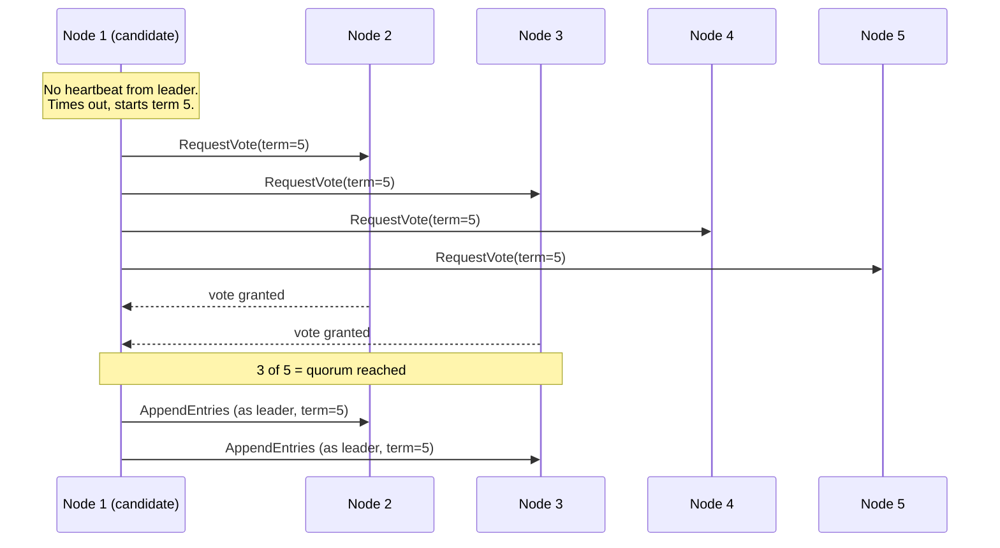

## Overview

Getting multiple nodes to agree on a single value sounds almost trivial until you require it to keep working when nodes crash, messages get lost, or a node that everyone thought was dead comes back to life at the worst possible moment. That's the *consensus problem* — and it turns out that a surprising number of distributed-systems primitives (electing a leader, granting a lock, appending to a replicated log, deciding to commit or abort a transaction) are really the same problem wearing different clothes. Consensus is what makes automatic, safe leader failover possible; almost nobody implements it from scratch, because a small family of proven libraries and coordination services already does.

## What Consensus Actually Requires

A consensus algorithm has to satisfy four properties, and the interesting one is the last:

- **Uniform agreement** — no two nodes decide differently.
- **Integrity** — once a node decides a value, it can't change its mind.
- **Validity** — the decided value must actually have been proposed by some node (rules out an algorithm that just always returns `null`).
- **Termination** — every node that doesn't crash eventually decides a value. This is the one that requires real fault tolerance — a single "dictator" node trivially satisfies the first three, but if it fails, the system can no longer decide anything at all, which is exactly single-leader replication without failover.

A consensus algorithm can only guarantee termination if **a majority (quorum) of nodes are up and can communicate** — three nodes tolerate one failure, five tolerate two. If a network partition splits the cluster and neither side has a majority, no side can make progress, which is precisely the CP behavior described in the CAP Theorem concept.

## Single-Value Consensus, Shared Logs, and Why They're the Same Problem

The simplest form — *single-value consensus* — is what you need when several nodes race to become leader, or several clients race to acquire the same lock: everyone proposes a candidate value, and the algorithm decides exactly one. It turns out this is equivalent to several other problems that look unrelated on the surface: a linearizable compare-and-set operation, an atomic fetch-and-add counter, and — the practically important one — a **shared, append-only log** (also called *total order broadcast*). If every node reads the same sequence of log entries in the same order, you get single-leader replication, event sourcing, and serializable transactions almost for free, because every replica just applies the same deterministic operations in the same order. This equivalence is why "consensus" as a single word covers what look like very different mechanisms — an algorithm that solves any one of them can be converted into a solution for the others.

## Raft and Paxos: Two Rounds of Voting

The best-known consensus algorithms — Raft, Paxos (and its Multi-Paxos variant), Viewstamped Replication, and Zab (ZooKeeper's own algorithm) — share the same basic shape once you get past the historical baggage of "Paxos is hard to understand" (which is part of why Raft was designed, explicitly, to be easier to reason about and implement):

1. **Leader election.** Every leadership term gets a monotonically increasing number (Raft calls it a *term*, Paxos a *ballot number*). If a node hasn't heard from the current leader within a timeout, it starts an election with a new, higher term and requests votes from a quorum.
2. **Log replication.** The elected leader appends new entries to its log and replicates them to a quorum before telling the client the write succeeded — so a write survives even if the current leader immediately crashes.

This looks superficially similar to two-phase commit (2PC), but it isn't: in 2PC, only the coordinator can propose a commit, and *every* participant must vote yes. In consensus algorithms, *any* node can start an election, and it only needs a quorum — not unanimity — to respond. That difference is what lets consensus tolerate a minority of nodes being down; 2PC's coordinator is a single point of failure with no equivalent fallback.

The genuinely hard part isn't the happy path — it's making sure a new leader always has every entry a previous leader might have already committed, even across multiple leader changes with overlapping in-flight writes. Raft handles this by only allowing a node to become leader if its own log is at least as up-to-date as a majority of its peers'; weakening this requirement (as Kafka's optional "unclean leader election" does, trading safety for faster recovery) reopens exactly the data-loss and split-brain problems consensus exists to close.

## Coordination Services: Outsourcing Consensus Instead of Implementing It

Almost nobody builds Raft or Paxos into their own application. Instead, most systems reach for a dedicated **coordination service** — ZooKeeper, etcd, or Consul — that runs consensus internally (etcd and Consul use Raft; ZooKeeper uses its own algorithm, Zab) and exposes a small, deliberately narrow set of primitives on top:

- **Locks and leases** — first-come-first-served, fault-tolerant CAS, so only one of several competing nodes acquires a given lock.
- **Fencing** — every acquisition gets a monotonically increasing token (`zxid` in ZooKeeper, a revision number in etcd), so a downstream system can reject writes from a leader that's since been superseded but doesn't know it yet — this is exactly the fencing-token fix needed for the "zombie leader" problem covered in the distributed-systems partial-failures concept.
- **Failure detection** — clients hold a session with periodic heartbeats; a session that goes silent past its timeout has its leases automatically released (ZooKeeper calls the corresponding nodes *ephemeral*).
- **Change notifications** — a client can subscribe to be told when a value changes, instead of polling.

A dedicated coordination service also has a scaling advantage that's easy to miss: it runs on a small, fixed number of nodes (typically three or five) *regardless of how large the system relying on it is*. Running full consensus across thousands of database shards directly would be prohibitively expensive — it's far cheaper to outsource just the "who's the leader for shard N" decision to a small, dedicated coordination cluster.

## Where This Shows Up Today

Kubernetes stores its entire cluster state — every pod, service, deployment, and config map — in etcd, making etcd's own Raft-based consensus the foundation the whole control plane's consistency depends on. Spark and Flink rely on ZooKeeper for high-availability leader election among job managers. Consul, built on Raft like etcd, leans more toward service discovery and health checking as its primary use case, with coordination primitives as a byproduct. In practice, the deciding factor for new systems today is rarely "which algorithm is theoretically better" — it's whether you're already running one of these services for something else (Kubernetes users already have etcd; teams in the Hadoop/big-data ecosystem often already have ZooKeeper) and just reuse it for coordination rather than standing up a second cluster.

## Trade-offs

- **Consensus systems always need a strict majority to make progress, which caps throughput rather than growing it.** Adding more nodes to a consensus group *not only doesn't* increase write throughput, it actively slows the group down (more nodes to reach quorum with) — the fix for read scaling is read replicas or caching in front of the consensus group, not adding more voting members.
- **Timeouts are a tuning problem with no universally correct value.** Too short, and normal network jitter across regions triggers unnecessary leader elections, which themselves cost availability while the new election runs; too long, and a genuine failure takes that much longer to recover from — the same fundamental trade-off as failure-detection timeouts anywhere else in a distributed system.
- **Coordination services are explicitly not general-purpose databases.** ZooKeeper/etcd are designed to hold a small amount of slow-changing data entirely in memory (Kubernetes' own docs warn against etcd datasets much beyond a few GB) — using one as a general key-value store for high-write-volume application data is a well-known way to degrade the very coordination it's supposed to provide reliably.
- **Weakening consensus guarantees for availability is a real, sometimes reasonable choice — but it's a different guarantee, not a faster version of the same one.** Kafka's unclean leader election trades "no committed data is ever lost" for "the system can recover even if it means picking a stale replica as leader" — appropriate for some workloads, silently catastrophic for others (e.g., a financial ledger).

## Interview Questions

- Why does a "dictator" node trivially satisfy agreement, integrity, and validity, but not termination — and why does that matter?
- Why can a consensus group with 5 nodes only tolerate 2 failures, not 4?
- How does the two-round-voting structure in Raft/Paxos differ from two-phase commit, given that both involve nodes voting?
- What specific problem does a fencing token solve that a lease/heartbeat alone doesn't?
- Why would a system choose etcd over rolling its own Raft implementation, given that etcd's API is much narrower than "full consensus"?
- Kafka lets you enable unclean leader election. What are you trading away, and when might that trade be acceptable?

## References

- Martin Kleppmann, [*Designing Data-Intensive Applications*, 2nd Edition](https://www.oreilly.com/library/view/designing-data-intensive-applications/9781098119058/) (O'Reilly) — Chapter 10, "Consistency and Consensus", sections "Consensus" and "Coordination Services"
- Diego Ongaro and John Ousterhout, ["In Search of an Understandable Consensus Algorithm"](https://raft.github.io/raft.pdf) (Raft paper, USENIX ATC 2014)
- [etcd Documentation — Why etcd](https://etcd.io/docs/v3.5/learning/why/)
- [Apache ZooKeeper — ZooKeeper Recipes and Solutions](https://zookeeper.apache.org/doc/current/recipes.html) (locks, leader election)
- [Kubernetes Documentation — Operating etcd clusters for Kubernetes](https://kubernetes.io/docs/tasks/administer-cluster/configure-upgrade-etcd/)
