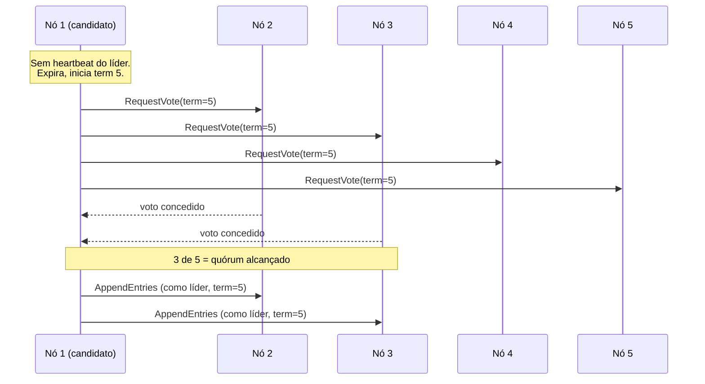

## Visão Geral

Fazer múltiplos nós concordarem sobre um único valor soa quase trivial até você exigir que continue funcionando quando nós travam, mensagens se perdem, ou um nó que todo mundo achava morto volta à vida no pior momento possível. Esse é o *problema do consenso* — e acontece que um número surpreendente de primitivas de sistemas distribuídos (eleger um líder, conceder um lock, anexar a um log replicado, decidir confirmar ou abortar uma transação) são realmente o mesmo problema vestindo roupas diferentes. Consenso é o que torna possível failover de líder automático e seguro; quase ninguém o implementa do zero, porque uma pequena família de bibliotecas comprovadas e serviços de coordenação já o faz.

## O Que Consenso Realmente Requer

Um algoritmo de consenso precisa satisfazer quatro propriedades, e a interessante é a última:

- **Acordo uniforme** — dois nós nunca decidem valores diferentes.
- **Integridade** — uma vez que um nó decide um valor, não pode mudar de ideia.
- **Validade** — o valor decidido precisa realmente ter sido proposto por algum nó (descarta um algoritmo que apenas sempre retorna `null`).
- **Terminação** — todo nó que não trava eventualmente decide um valor. Esta é a que requer tolerância a falhas real — um único nó "ditador" trivialmente satisfaz as três primeiras, mas se falhar, o sistema não pode mais decidir nada, que é exatamente replicação de líder único sem failover.

Um algoritmo de consenso só pode garantir terminação se **uma maioria (quórum) de nós estiver ativa e puder se comunicar** — três nós toleram uma falha, cinco toleram duas. Se uma partição de rede divide o cluster e nenhum lado tem maioria, nenhum lado pode progredir, que é precisamente o comportamento CP descrito no conceito Teorema CAP.

## Consenso de Valor Único, Logs Compartilhados, e Por Que São o Mesmo Problema

A forma mais simples — *consenso de valor único* — é o que você precisa quando vários nós competem para se tornar líder, ou vários clientes competem para adquirir o mesmo lock: todos propõem um valor candidato, e o algoritmo decide exatamente um. Acontece que isso é equivalente a vários outros problemas que parecem não relacionados na superfície: uma operação linearizável de compare-and-set, um contador atômico de fetch-and-add, e — o praticamente importante — um **log compartilhado, somente-append** (também chamado de *total order broadcast*). Se todo nó lê a mesma sequência de entradas de log na mesma ordem, você obtém replicação de líder único, event sourcing, e transações serializáveis quase de graça, porque cada réplica apenas aplica as mesmas operações determinísticas na mesma ordem. Essa equivalência é por que "consenso" como uma única palavra cobre o que parecem mecanismos muito diferentes — um algoritmo que resolve qualquer um deles pode ser convertido em uma solução para os outros.

## Raft e Paxos: Duas Rodadas de Votação

Os algoritmos de consenso mais conhecidos — Raft, Paxos (e sua variante Multi-Paxos), Viewstamped Replication, e Zab (o próprio algoritmo do ZooKeeper) — compartilham a mesma forma básica uma vez que você passa da bagagem histórica de "Paxos é difícil de entender" (que é parte de por que o Raft foi projetado, explicitamente, para ser mais fácil de raciocinar e implementar):

1. **Eleição de líder.** Todo mandato de liderança recebe um número monotonicamente crescente (o Raft chama de *term*, o Paxos de *ballot number*). Se um nó não ouviu do líder atual dentro de um timeout, inicia uma eleição com um novo term maior e solicita votos de um quórum.
2. **Replicação de log.** O líder eleito anexa novas entradas ao seu log e as replica para um quórum antes de dizer ao cliente que a escrita teve sucesso — então uma escrita sobrevive mesmo que o líder atual trave imediatamente.

Isso parece superficialmente similar a two-phase commit (2PC), mas não é: em 2PC, só o coordenador pode propor um commit, e *todo* participante precisa votar sim. Em algoritmos de consenso, *qualquer* nó pode iniciar uma eleição, e só precisa de um quórum — não unanimidade — para responder. Essa diferença é o que permite ao consenso tolerar uma minoria de nós fora do ar; o coordenador do 2PC é um ponto único de falha sem fallback equivalente.

A parte genuinamente difícil não é o caminho feliz — é garantir que um novo líder sempre tenha toda entrada que um líder anterior possa já ter confirmado, mesmo através de múltiplas trocas de líder com escritas em voo sobrepostas. O Raft trata isso permitindo que um nó só se torne líder se seu próprio log estiver pelo menos tão atualizado quanto o de uma maioria de seus pares; enfraquecer esse requisito (como a "eleição de líder suja" opcional do Kafka faz, trocando segurança por recuperação mais rápida) reabre exatamente os problemas de perda de dados e split-brain que o consenso existe para fechar.

## Serviços de Coordenação: Terceirizando Consenso em Vez de Implementá-lo

Quase ninguém constrói Raft ou Paxos em sua própria aplicação. Em vez disso, a maioria dos sistemas recorre a um **serviço de coordenação** dedicado — ZooKeeper, etcd, ou Consul — que roda consenso internamente (etcd e Consul usam Raft; ZooKeeper usa seu próprio algoritmo, Zab) e expõe um conjunto pequeno, deliberadamente estreito, de primitivas por cima:

- **Locks e leases** — primeiro-a-chegar-primeiro-a-ser-servido, CAS tolerante a falhas, para que apenas um de vários nós competindo adquira um dado lock.
- **Fencing** — toda aquisição recebe um token monotonicamente crescente (`zxid` no ZooKeeper, um número de revisão no etcd), para que um sistema downstream possa rejeitar escritas de um líder que já foi substituído mas ainda não sabe disso — essa é exatamente a correção de token de fencing necessária para o problema do "líder zumbi" coberto no conceito de falhas parciais de sistemas distribuídos.
- **Detecção de falhas** — clientes mantêm uma sessão com heartbeats periódicos; uma sessão que fica silenciosa além de seu timeout tem seus leases automaticamente liberados (o ZooKeeper chama os nós correspondentes de *efêmeros*).
- **Notificações de mudança** — um cliente pode se inscrever para ser avisado quando um valor muda, em vez de fazer polling.

Um serviço de coordenação dedicado também tem uma vantagem de escala fácil de perder: roda em um número pequeno e fixo de nós (tipicamente três ou cinco) *independentemente de quão grande é o sistema que depende dele*. Rodar consenso completo através de milhares de shards de banco de dados diretamente seria proibitivamente caro — é muito mais barato terceirizar apenas a decisão de "quem é o líder do shard N" para um pequeno cluster de coordenação dedicado.

## Onde Isso Aparece Hoje

O Kubernetes armazena todo o estado do seu cluster — todo pod, serviço, deployment, e config map — no etcd, tornando o próprio consenso baseado em Raft do etcd a fundação de que a consistência de todo o plano de controle depende. Spark e Flink dependem do ZooKeeper para eleição de líder de alta disponibilidade entre gerenciadores de job. Consul, construído sobre Raft como o etcd, inclina-se mais para descoberta de serviço e verificação de saúde como seu caso de uso primário, com primitivas de coordenação como um subproduto. Na prática, o fator decisivo para novos sistemas hoje raramente é "qual algoritmo é teoricamente melhor" — é se você já está rodando um desses serviços para outra coisa (usuários de Kubernetes já têm etcd; equipes no ecossistema Hadoop/big-data frequentemente já têm ZooKeeper) e simplesmente o reutilizam para coordenação em vez de levantar um segundo cluster.

## Trade-offs

- **Sistemas de consenso sempre precisam de uma maioria estrita para progredir, o que limita throughput em vez de aumentá-lo.** Adicionar mais nós a um grupo de consenso *não apenas não* aumenta throughput de escrita, ativamente desacelera o grupo (mais nós para alcançar quórum) — a correção para escala de leitura é réplicas de leitura ou caching na frente do grupo de consenso, não adicionar mais membros votantes.
- **Timeouts são um problema de ajuste sem um valor universalmente correto.** Curto demais, e jitter normal de rede entre regiões dispara eleições de líder desnecessárias, que elas mesmas custam disponibilidade enquanto a nova eleição roda; longo demais, e uma falha genuína leva mais tempo para se recuperar — o mesmo trade-off fundamental que timeouts de detecção de falha em qualquer outro lugar de um sistema distribuído.
- **Serviços de coordenação explicitamente não são bancos de dados de propósito geral.** ZooKeeper/etcd são projetados para manter uma pequena quantidade de dados que mudam lentamente inteiramente em memória (a própria documentação do Kubernetes alerta contra datasets etcd muito além de alguns GB) — usar um deles como um key-value store geral para dados de aplicação de alto volume de escrita é uma forma bem conhecida de degradar a própria coordenação que ele deveria fornecer de forma confiável.
- **Enfraquecer garantias de consenso por disponibilidade é uma escolha real, às vezes razoável — mas é uma garantia diferente, não uma versão mais rápida da mesma.** A eleição de líder suja do Kafka troca "nenhum dado confirmado é jamais perdido" por "o sistema pode se recuperar mesmo que signifique escolher uma réplica desatualizada como líder" — apropriado para algumas cargas de trabalho, silenciosamente catastrófico para outras (ex.: um ledger financeiro).

## Perguntas de Entrevista

- Por que um nó "ditador" trivialmente satisfaz acordo, integridade, e validade, mas não terminação — e por que isso importa?
- Por que um grupo de consenso com 5 nós só pode tolerar 2 falhas, não 4?
- Como a estrutura de votação em duas rodadas no Raft/Paxos difere de two-phase commit, dado que ambos envolvem nós votando?
- Qual problema específico um token de fencing resolve que um lease/heartbeat sozinho não resolve?
- Por que um sistema escolheria etcd em vez de implementar seu próprio Raft, dado que a API do etcd é muito mais estreita que "consenso completo"?
- O Kafka permite habilitar eleição de líder suja. O que você está trocando, e quando essa troca pode ser aceitável?

## Referências

- Martin Kleppmann, [*Designing Data-Intensive Applications*, 2ª Edição](https://www.oreilly.com/library/view/designing-data-intensive-applications/9781098119058/) (O'Reilly) — Capítulo 10, "Consistency and Consensus", seções "Consensus" e "Coordination Services"
- Diego Ongaro e John Ousterhout, ["In Search of an Understandable Consensus Algorithm"](https://raft.github.io/raft.pdf) (artigo do Raft, USENIX ATC 2014)
- [etcd Documentation — Why etcd](https://etcd.io/docs/v3.5/learning/why/)
- [Apache ZooKeeper — ZooKeeper Recipes and Solutions](https://zookeeper.apache.org/doc/current/recipes.html) (locks, eleição de líder)
- [Kubernetes Documentation — Operating etcd clusters for Kubernetes](https://kubernetes.io/docs/tasks/administer-cluster/configure-upgrade-etcd/)
