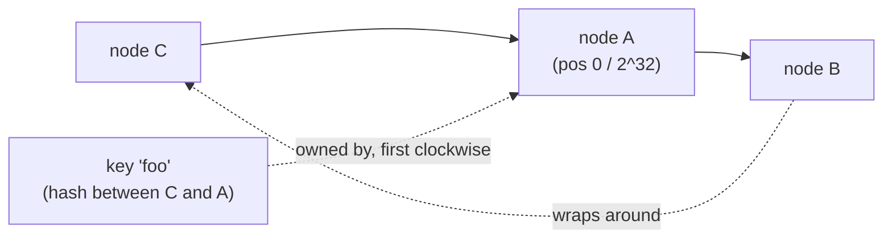
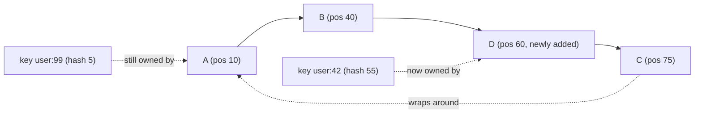

## Overview

Any system that shards data across multiple nodes — a cache cluster, a distributed database, a CDN's edge routing — needs a rule for "given this key, which node holds it?" The obvious rule, `hash(key) % N`, works fine as long as `N` (the node count) never changes. The instant you add or remove a node, `N` changes, and because the modulo is taken against the *new* `N`, almost every key maps to a different node than before. Consistent hashing is the standard fix: a scheme where adding or removing one node out of `N` remaps roughly `1/N` of the keys, not nearly all of them.

## The Problem: Naive Modulo Hashing

With 3 nodes and `hash(key) % 3`, a key with `hash(key) = 17` maps to node `17 % 3 = 2`. Add a 4th node and the same key now maps to `17 % 4 = 1` — a different node, with no data actually moved there yet. This happens to nearly every key whenever the node count changes, because the modulus itself changed:

```
3 nodes: hash(key) % 3   → node for hash=17 is 2
4 nodes: hash(key) % 4   → node for hash=17 is 1   (moved, even though nothing about the key changed)
```

For a cache cluster, this means adding a node to relieve load momentarily makes things *worse* — nearly the entire cache is invalidated at once, and every client refetches from the origin simultaneously (a cache stampede caused by the very scaling operation meant to prevent one).

## The Hash Ring

Consistent hashing (Karger et al., 1997) fixes this by hashing both keys *and* nodes onto the same circular space — typically `[0, 2^32)` or `[0, 2^64)`, visualized as a ring:



Each node is placed on the ring at the position given by `hash(node_id)`. Each key is placed at `hash(key)`, and is owned by the first node encountered walking clockwise from the key's position. Removing node A only affects the keys that were between node C and node A — they now belong to node B (the next node clockwise) — every other key on the ring is untouched. Adding a new node between two existing nodes only steals keys from the one immediate neighbor it was inserted next to.

## Virtual Nodes (Replicas on the Ring)

Placing each physical node at a single point on the ring creates two problems: an uneven distribution (some nodes end up owning much larger arcs than others, purely by chance of where their hash landed), and an all-or-nothing failure (losing one physical node dumps its entire arc onto exactly one neighbor). The fix used by every production system — Amazon's Dynamo popularized this — is **virtual nodes**: each physical node is hashed onto the ring at many points (100–200 is typical), each labeled `node_id + "#0"`, `node_id + "#1"`, etc. Keys are still owned by the nearest virtual node clockwise, but now each physical node's load is the sum of many small arcs scattered around the ring, which averages out to near-even distribution, and a failing node's load gets spread across many different neighbors instead of dumping onto one.

## Adding and Removing Nodes

```python
# conceptual sketch, not a full implementation
class ConsistentHashRing:
    def __init__(self, virtual_nodes=150):
        self.virtual_nodes = virtual_nodes
        self.ring = {}          # hash -> physical node id
        self.sorted_hashes = [] # kept sorted for binary search

    def add_node(self, node_id):
        for i in range(self.virtual_nodes):
            h = hash(f"{node_id}#{i}")
            self.ring[h] = node_id
        self.sorted_hashes = sorted(self.ring)

    def remove_node(self, node_id):
        for i in range(self.virtual_nodes):
            h = hash(f"{node_id}#{i}")
            del self.ring[h]
        self.sorted_hashes = sorted(self.ring)

    def get_node(self, key):
        h = hash(key)
        # find first ring position >= h, wrapping around to the start
        idx = bisect_left(self.sorted_hashes, h) % len(self.sorted_hashes)
        return self.ring[self.sorted_hashes[idx]]
```

Only the `virtual_nodes` positions belonging to the node being added or removed change ownership — every other key's `get_node()` result is unaffected, because its nearest clockwise virtual node hasn't moved.

## Worked Example

3 physical nodes, 1 virtual node each for simplicity (production uses ~150):

```
Ring positions (clockwise): A(10) -> B(40) -> C(75) -> back to A
key "user:42"  hash = 55  -> owned by C (next clockwise from 55)
key "user:99"  hash = 5   -> owned by A (next clockwise from 5, wrapping past 75->10)

Add node D at position 60:
key "user:42"  hash = 55  -> now owned by D (D is now the next clockwise node after 55)
key "user:99"  hash = 5   -> still owned by A (unaffected, D is nowhere near it)
```

Only keys between B(40) and D(60) moved — everything else on the ring kept its owner.



## Where It's Used in Practice

- **Caching layers** — Memcached clients (e.g., libketama) use consistent hashing client-side to decide which cache server owns a key, so scaling the cache cluster up or down doesn't cause a mass cache miss.
- **Distributed databases** — Cassandra and DynamoDB use it (with virtual nodes) for partition placement and replica assignment.
- **CDN request routing** — mapping a request to a specific edge/origin shard while keeping that mapping stable as the edge fleet scales.
- **Peer-to-peer DHTs** — Chord and similar systems use the ring model directly as their routing structure, not just a load-balancing detail.

## Trade-offs

- **Uniformity requires virtual nodes, and that's a real memory/CPU cost.** Without them, load across physical nodes can be significantly skewed depending on how their hashes happen to land; with 150+ virtual nodes per physical node, the ring itself grows into the tens of thousands of entries, which has to be kept sorted and searchable (a balanced tree or sorted array with binary search) on every request.
- **Lookup is O(log n) on the ring, not O(1)** — a hidden cost compared to naive `% N`, which is genuinely constant-time. For most systems this is negligible next to network latency, but it's not "free."
- **Rebalancing is bounded, not zero** — a new node still needs to fetch data for the ~`1/N` slice it now owns before it can safely serve it; consistent hashing minimizes *how much* data has to move, it doesn't eliminate the migration step itself.

## Interview Questions

- Why does `hash(key) % N` fail specifically at the moment `N` changes, and not before?
- What problem do virtual nodes solve that a single ring position per physical node doesn't?
- If a node is added to a 5-node ring, roughly what fraction of keys should move, and why?
- Name two real systems that use consistent hashing and what each uses it for.
- How would you detect that your ring has become unbalanced in production?

## References

- [Wikipedia — Consistent hashing](https://en.wikipedia.org/wiki/Consistent_hashing) — overview, including the original Karger et al. (1997, MIT/Akamai) formulation
- Giuseppe DeCandia et al., ["Dynamo: Amazon's Highly Available Key-value Store"](https://www.allthingsdistributed.com/files/amazon-dynamo-sosp2007.pdf) (SOSP 2007) — introduces virtual nodes for load balancing
- Martin Kleppmann, [*Designing Data-Intensive Applications*](https://www.oreilly.com/library/view/designing-data-intensive-applications/9781491903063/) (O'Reilly, 2017) — Chapter 6, "Partitioning"
- [Wikipedia — Chord (peer-to-peer)](https://en.wikipedia.org/wiki/Chord_(peer-to-peer)) — a DHT built directly on the hash-ring model
