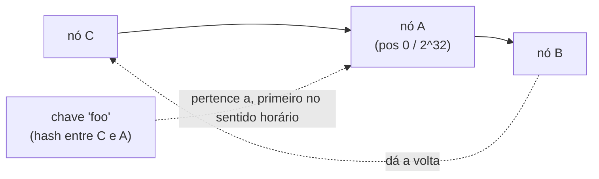
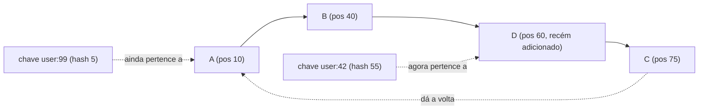

## Visão Geral

Qualquer sistema que particiona dados entre múltiplos nós — um cluster de cache, um banco de dados distribuído, o roteamento de borda de uma CDN — precisa de uma regra para "dada esta chave, qual nó a possui?" A regra óbvia, `hash(key) % N`, funciona bem enquanto `N` (o número de nós) nunca muda. No instante em que você adiciona ou remove um nó, `N` muda, e como o módulo é calculado contra o *novo* `N`, quase toda chave mapeia para um nó diferente do anterior. O hashing consistente é a solução padrão: um esquema onde adicionar ou remover um nó dentre `N` remapeia aproximadamente `1/N` das chaves, não quase todas elas.

## O Problema: Hashing por Módulo Ingênuo

Com 3 nós e `hash(key) % 3`, uma chave com `hash(key) = 17` mapeia para o nó `17 % 3 = 2`. Adicione um 4º nó e a mesma chave agora mapeia para `17 % 4 = 1` — um nó diferente, sem que nenhum dado tenha realmente sido movido para lá ainda. Isso acontece com quase toda chave sempre que o número de nós muda, porque o próprio módulo mudou:

```
3 nós: hash(key) % 3   → nó para hash=17 é 2
4 nós: hash(key) % 4   → nó para hash=17 é 1   (moveu, mesmo sem nada mudar na chave)
```

Para um cluster de cache, isso significa que adicionar um nó para aliviar a carga momentaneamente torna as coisas *piores* — quase todo o cache é invalidado de uma vez, e todo cliente busca novamente na origem simultaneamente (uma avalanche de cache causada exatamente pela operação de escala que deveria evitá-la).

## O Anel de Hash

O hashing consistente (Karger et al., 1997) resolve isso hasheando tanto chaves *quanto* nós no mesmo espaço circular — tipicamente `[0, 2^32)` ou `[0, 2^64)`, visualizado como um anel:



Cada nó é posicionado no anel na posição dada por `hash(node_id)`. Cada chave é posicionada em `hash(key)`, e pertence ao primeiro nó encontrado ao caminhar no sentido horário a partir da posição da chave. Remover o nó A afeta apenas as chaves que estavam entre o nó C e o nó A — elas agora pertencem ao nó B (o próximo nó no sentido horário) — toda outra chave no anel permanece intocada. Adicionar um novo nó entre dois nós existentes só rouba chaves do vizinho imediato ao lado do qual foi inserido.

## Nós Virtuais (Réplicas no Anel)

Colocar cada nó físico em um único ponto do anel cria dois problemas: uma distribuição desigual (alguns nós acabam possuindo arcos muito maiores que outros, puramente pelo acaso de onde seu hash caiu), e uma falha do tipo tudo-ou-nada (perder um nó físico despeja todo o seu arco em exatamente um vizinho). A solução usada por todo sistema em produção — popularizada pelo Dynamo da Amazon — são os **nós virtuais**: cada nó físico é hasheado no anel em muitos pontos (100–200 é típico), cada um rotulado `node_id + "#0"`, `node_id + "#1"`, etc. As chaves ainda pertencem ao nó virtual mais próximo no sentido horário, mas agora a carga de cada nó físico é a soma de muitos arcos pequenos espalhados pelo anel, o que se aproxima de uma distribuição uniforme, e a carga de um nó com falha se espalha por muitos vizinhos diferentes em vez de recair sobre um só.

## Adicionando e Removendo Nós

```python
# esboço conceitual, não uma implementação completa
class ConsistentHashRing:
    def __init__(self, virtual_nodes=150):
        self.virtual_nodes = virtual_nodes
        self.ring = {}          # hash -> id do nó físico
        self.sorted_hashes = [] # mantido ordenado para busca binária

    def add_node(self, node_id):
        for i in range(self.virtual_nodes):
            h = hash(f"{node_id}#{i}")
            self.ring[h] = node_id
        self.sorted_hashes = sorted(self.ring)

    def remove_node(self, node_id):
        for i in range(self.virtual_nodes):
            h = hash(f"{node_id}#{i}")
            del self.ring[h]
        self.sorted_hashes = sorted(self.ring)

    def get_node(self, key):
        h = hash(key)
        # encontra a primeira posição do anel >= h, dando a volta até o início
        idx = bisect_left(self.sorted_hashes, h) % len(self.sorted_hashes)
        return self.ring[self.sorted_hashes[idx]]
```

Apenas as posições de `virtual_nodes` pertencentes ao nó sendo adicionado ou removido mudam de dono — o resultado de `get_node()` para toda outra chave não é afetado, porque seu nó virtual mais próximo no sentido horário não se moveu.

## Exemplo Resolvido

3 nós físicos, 1 nó virtual cada para simplificar (produção usa ~150):

```
Posições no anel (sentido horário): A(10) -> B(40) -> C(75) -> volta para A
chave "user:42"  hash = 55  -> pertence a C (próximo no sentido horário a partir de 55)
chave "user:99"  hash = 5   -> pertence a A (próximo no sentido horário a partir de 5, dando a volta de 75->10)

Adiciona nó D na posição 60:
chave "user:42"  hash = 55  -> agora pertence a D (D é agora o próximo nó no sentido horário após 55)
chave "user:99"  hash = 5   -> ainda pertence a A (não afetado, D não está próximo)
```

Apenas chaves entre B(40) e D(60) se moveram — tudo mais no anel manteve seu dono.



## Onde É Usado na Prática

- **Camadas de cache** — clientes Memcached (ex.: libketama) usam hashing consistente no lado do cliente para decidir qual servidor de cache possui uma chave, para que escalar o cluster de cache para cima ou para baixo não cause uma perda em massa de cache.
- **Bancos de dados distribuídos** — Cassandra e DynamoDB o usam (com nós virtuais) para posicionamento de partições e atribuição de réplicas.
- **Roteamento de requisições em CDN** — mapeando uma requisição para um shard específico de borda/origem mantendo esse mapeamento estável conforme a frota de borda escala.
- **DHTs peer-to-peer** — Chord e sistemas similares usam o modelo de anel diretamente como sua estrutura de roteamento, não apenas como um detalhe de balanceamento de carga.

## Trade-offs

- **Uniformidade requer nós virtuais, e isso tem um custo real de memória/CPU.** Sem eles, a carga entre nós físicos pode ficar significativamente desigual dependendo de onde seus hashes caem; com 150+ nós virtuais por nó físico, o próprio anel cresce para dezenas de milhares de entradas, que precisam ser mantidas ordenadas e pesquisáveis (uma árvore balanceada ou array ordenado com busca binária) a cada requisição.
- **A busca é O(log n) no anel, não O(1)** — um custo escondido comparado ao `% N` ingênuo, que é genuinamente tempo constante. Para a maioria dos sistemas isso é insignificante perto da latência de rede, mas não é "gratuito."
- **O rebalanceamento é limitado, não zero** — um novo nó ainda precisa buscar os dados da fatia de ~`1/N` que agora possui antes de poder servi-la com segurança; o hashing consistente minimiza *quanto* dado precisa se mover, não elimina a etapa de migração em si.

## Perguntas de Entrevista

- Por que `hash(key) % N` falha especificamente no momento em que `N` muda, e não antes?
- Que problema os nós virtuais resolvem que uma única posição no anel por nó físico não resolve?
- Se um nó é adicionado a um anel de 5 nós, aproximadamente que fração das chaves deveria se mover, e por quê?
- Cite dois sistemas reais que usam hashing consistente e para que cada um o usa.
- Como você detectaria que seu anel ficou desbalanceado em produção?

## Referências

- [Wikipedia — Consistent hashing](https://en.wikipedia.org/wiki/Consistent_hashing) — visão geral, incluindo a formulação original de Karger et al. (1997, MIT/Akamai)
- Giuseppe DeCandia et al., ["Dynamo: Amazon's Highly Available Key-value Store"](https://www.allthingsdistributed.com/files/amazon-dynamo-sosp2007.pdf) (SOSP 2007) — introduz nós virtuais para balanceamento de carga
- Martin Kleppmann, [*Designing Data-Intensive Applications*](https://www.oreilly.com/library/view/designing-data-intensive-applications/9781491903063/) (O'Reilly, 2017) — Capítulo 6, "Partitioning"
- [Wikipedia — Chord (peer-to-peer)](https://en.wikipedia.org/wiki/Chord_(peer-to-peer)) — uma DHT construída diretamente sobre o modelo de anel de hash
</content>
