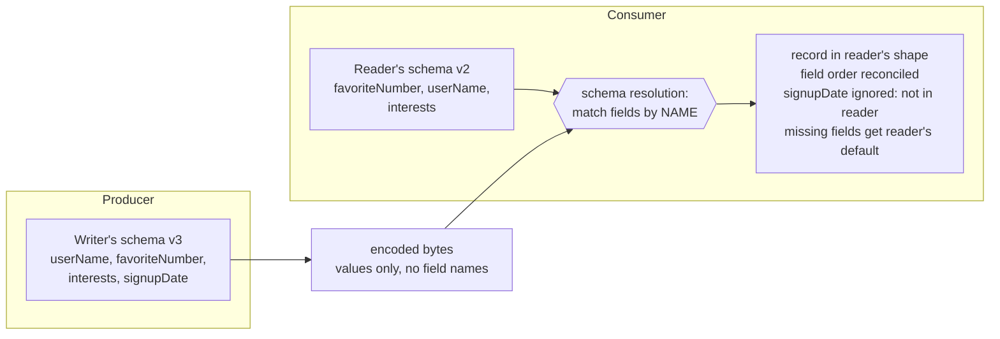

## Overview

In memory, your data lives in objects, structs, and hash tables held together by pointers. The moment it crosses a process boundary — written to disk, sent over a socket, published to a topic — it has to become a self-contained sequence of bytes, because a pointer means nothing to anyone else. That translation is **encoding** (also called serialization or marshaling), and the reverse is **decoding**. The format you pick is not a detail of the transport layer: it determines whether you can deploy a new version of one service on Tuesday and leave the other five alone until next quarter, or whether every schema change becomes a synchronized big-bang release.

The reason this matters is that old and new code coexist. Server-side rolling upgrades mean some instances run v2 while others still run v1; client-side apps mean users who never update. So data written by one version will be read by another, in both directions, and the encoding format is what decides whether that works. Two precise properties — **backward compatibility** (new code can read old data) and **forward compatibility** (old code can read new data) — are what the rest of this concept is about. This concept covers the formats themselves; the companion concept [Dataflow Patterns: Databases, Services, and Events](dataflow-patterns-databases-services-events) covers where the encoded bytes actually travel.

## Language-Specific Formats Are a Trap

Most languages ship with a built-in way to turn objects into bytes: `java.io.Serializable`, Python's `pickle`, Ruby's `Marshal`, Kryo for the JVM. They are seductive because the code is one line. They are also, for anything but the most transient use, the wrong choice:

- **They lock you into one language.** Bytes written by `pickle` are effectively unreadable outside Python. Storing data in that format is a commitment to your current language for as long as that data lives — which, for anything in a database, is longer than you think, and it forecloses integrating with any other organization.
- **They are a remote code execution vector.** Decoding has to instantiate arbitrary classes to rebuild the object graph. If an attacker can get your process to deserialize a byte sequence they control, they can often get it to instantiate classes that do something terrible. Java deserialization gadget chains are a whole genre of CVE.
- **Versioning is an afterthought.** These libraries are built for "save this object, load it back," not for "an older binary is going to read this next year." Forward and backward compatibility are usually not designed for at all.
- **They are slow and fat.** Java's built-in serialization is notorious on both counts.

Use them for a scratch cache you can throw away. Do not use them for anything durable or anything that crosses a trust boundary.

## JSON, XML, and Their Binary Variants

Once you want something multiple languages can read, JSON and XML are the obvious answers, with CSV for flat tabular data. They are good enough for an enormous amount of real work, especially as *interchange* formats between organizations — the difficulty of getting two companies to agree on anything usually outweighs elegance. But their limitations are real, and they are not the ones people usually complain about:

- **Number encoding is ambiguous.** XML and CSV cannot distinguish a number from a string of digits at all without an external schema. JSON distinguishes strings from numbers but not integers from floats, and it specifies no precision. Integers greater than 2^53 cannot be represented exactly in an IEEE 754 double, so a 64-bit ID silently loses its low bits in any JavaScript client. X's API works around this by returning post IDs twice — once as a JSON number, once as a decimal string — which tells you how load-bearing this problem is in practice.
- **There is no binary string type.** JSON and XML handle Unicode text well and byte sequences not at all, so people Base64-encode binary data into a string and use out-of-band knowledge (or a schema) to know it should be decoded. It works, and it inflates the payload by roughly a third.
- **The schema languages are heavyweight.** JSON Schema and XML Schema are genuinely powerful — validation constraints, conditional logic, remote references, open versus closed content models via `additionalProperties`. That power makes them hard to reason about, and specifically hard to evolve in a provably forward- or backward-compatible way.
- **CSV has no schema at all.** Column meaning is convention, adding a column is a manual migration for every consumer, and escaping rules are implemented inconsistently across parsers.

Binary variants of JSON — MessagePack, CBOR, BSON, Smile, and a long tail of others — keep the JSON data model but encode it more tightly. Because they still don't prescribe a schema, they must include every field *name* in every record. That caps the savings: the example record below is 81 bytes as compact JSON and 66 bytes as MessagePack. Losing human-readability for an 18% reduction is a bad trade. To do meaningfully better you have to stop shipping field names, and that requires a schema.

## The Same Record, Three Ways

Take one record:

```json
{
    "userName": "Martin",
    "favoriteNumber": 1337,
    "interests": ["daydreaming", "hacking"]
}
```

Here is what the three approaches actually put on the wire:

```text
JSON (textual, 81 bytes, whitespace stripped)
  {"userName":"Martin","favoriteNumber":1337,"interests":["daydreaming","hacking"]}
  - every field NAME is transmitted, as text, in every single record
  - 1337 is the four ASCII characters '1','3','3','7'

Protocol Buffers (33 bytes) — schema known to both sides, field TAGS on the wire
  0A 06 4D 61 72 74 69 6E        tag=1 wiretype=LEN, len=6, "Martin"
  10 B9 0A                       tag=2 wiretype=VARINT, 1337 as a 2-byte varint
  1A 0B "daydreaming"            tag=3 wiretype=LEN, len=11
  1A 07 "hacking"                tag=3 again — repeated fields are just repeated tags
  - the tag byte packs field number and wire type: (field_number << 3) | wire_type
  - no field names; the number 3 means "interests" only because the schema says so
  - an unknown tag can still be skipped, because the wire type gives its length

Avro (32 bytes) — schema known to both sides, NOTHING identifies fields on the wire
  0C 4D 61 72 74 69 6E           length 6 (zigzag varint), then "Martin"
  02 F2 14                       union branch 1 (= long, not null), then 1337
  04 16 "daydreaming" 0E "hacking" 00
                                 array block count 2, each string length-prefixed,
                                 then a 0 block terminating the array
  - no tags, no names, no type markers: values concatenated in schema field order
  - these bytes are meaningless without the exact schema that wrote them
```

That last point is the whole design difference. Protobuf's bytes are self-describing enough to skip an unrecognized field. Avro's bytes are not self-describing at all — which is why Avro is the most compact of the three, and why it needs a completely different mechanism for evolution.

## Protocol Buffers: Field Tags

Protobuf (and Thrift, which works much the same way) requires a schema written in its IDL:

```protobuf
syntax = "proto3";

message Person {
    string user_name       = 1;
    int64  favorite_number = 2;
    repeated string interests = 3;
}
```

The numbers are **field tags**, and they are the identity of each field. A code generator turns this into classes in your language of choice, so encoding and decoding is typed, compile-time-checked code rather than map lookups. The schema language is deliberately minimal: fields and types, no `minimum: 1, maximum: 65535` style validation. Integers use variable-length encoding, so small numbers cost one byte; there is no list type, just a `repeated` modifier that emits the same tag more than once.

Because the encoded record refers to fields only by tag, the evolution rules fall straight out of the encoding:

- **You can rename a field freely.** The name never appears on the wire. `user_name` becoming `username` changes nothing about existing data.
- **You can never change or reuse a tag number.** Changing tag 2 invalidates every record ever written. Reusing the tag of a deleted field is worse: old data still contains tag 2 with the old meaning, and new code will happily decode it as the new field. Use `reserved 2;` in the schema so nobody can do it by accident.
- **Adding a field means giving it a new tag.** Old code reading new data hits an unrecognized tag, and — critically — the wire type in the tag byte tells it how many bytes to skip. It can ignore the field *and preserve it* on a read-modify-write, which is what stops data loss when an old instance updates a record a new instance wrote. That is forward compatibility.
- **New code reading old data** finds the new tag absent and fills in a default (empty string, `0`). That is backward compatibility.
- **Removing a field** is the mirror image: fine, as long as the tag is retired forever and the field was never required.
- **Changing a type** is sometimes allowed and always risky. Widening `int32` to `int64` is safe in one direction — new code reading old data pads with zeros — but old code reading a new 64-bit value into a 32-bit variable will truncate it.

## Avro: Schemas Without Tags

Avro came out of Hadoop in 2009, precisely because Protobuf did not fit its use cases. The same record in Avro IDL:

```
record Person {
    string               userName;
    union { null, long } favoriteNumber = null;
    array<string>        interests;
}
```

No tag numbers anywhere. Since the bytes carry no field identifiers, decoding requires the exact schema used to write them. Avro's answer is that a reader always uses *two* schemas:

- the **writer's schema** — whatever version the producing code had compiled in, identical to what encoded the bytes;
- the **reader's schema** — what the consuming code expects, which may be an older or newer version.



Resolution matches fields **by name**, so field order can differ between the two schemas. A field present in the writer's schema but absent from the reader's is ignored. A field the reader expects but the writer never wrote is filled from the **reader's** declared default. Everything follows from that:

- **You may only add or remove fields that have a default value.** Add a field with no default and new readers cannot read old writers' data — backward compatibility broken. Remove a field with no default and old readers cannot read new writers' data — forward compatibility broken.
- **`null` is not a universal default.** To make a field nullable you use a union, `union { null, long }`, and `null` can be the default only if it is the first branch. Verbose, but it makes nullability explicit instead of ambient.
- **Renaming is asymmetric.** The reader's schema can declare aliases for old names, so a rename is backward compatible but not forward compatible. Adding a branch to a union has the same asymmetry.

That leaves the obvious question: how does a reader get the writer's schema? Not by shipping it with each record — the schema usually dwarfs the record. It depends on the context: a large file of millions of records (an Avro object container file) writes the schema once in the header; a database or event stream writes a schema **version number** per record and looks the version up in a schema registry (Confluent's registry for Kafka works exactly this way); two processes on a long-lived connection negotiate the schema once at setup.

The payoff for having no tag numbers is that Avro is friendly to **dynamically generated schemas**. Dump a relational database to Avro and you can generate the schema mechanically from the table definitions — each column becomes a field, keyed by name. When someone adds a column and drops another, you regenerate the schema and re-export; readers match by name and simply cope. Doing the same in Protobuf means an administrator hand-maintaining a column-name-to-tag-number mapping and never reusing a retired number. This is why Avro shows up so often in the pipelines and event streams discussed in the sibling concept: those are exactly the places where schemas change often, are generated rather than hand-written, and are shared across many independently deployed consumers.

## Backward and Forward Compatibility, Precisely

These two words get used interchangeably in code review, and they are not interchangeable. Fix the direction by asking *which side is newer*:

- **Backward compatibility: new code can read data written by old code.** You are the author of the new code, so you know what the old format looked like and can handle it explicitly. This is normally the easy direction.
- **Forward compatibility: old code can read data written by new code.** This is the hard direction, because it requires code written *before* the change to do something sensible with additions it has never heard of — namely ignore them, without corrupting them.

Concretely. An order service publishes `OrderPlaced`. Today it has `orderId` (tag 1), `userId` (tag 2), and `amountCents` (tag 3). You add `currencyCode` as tag 4 and deploy the producer first.

- **Old consumer, new data (forward).** The billing service still runs the v1 schema. It decodes tags 1-3 normally, hits tag 4, reads the wire type, skips the right number of bytes, and keeps working. If it re-emits or re-stores the record, a good implementation retains the unknown field rather than dropping it — otherwise the currency silently disappears from a record that had one.
- **New consumer, old data (backward).** The analytics service is upgraded to v2 and starts consuming a backlog written before the change. Tag 4 is simply absent, so it decodes to the default empty string. Your code has to treat "no currency code" as a real state — a default is not the same as a correct value, and this is where the compatibility guarantee ends and product logic begins.

For request/response APIs the same two properties apply in both directions at once. An **older client calling a newer service** needs backward compatibility on the request (the new service reads the old request) and forward compatibility on the response (the old client reads the new response). A **newer client calling an older service** needs exactly the reverse. Any API you cannot upgrade both sides of simultaneously — which is every public API and most internal ones — needs all four.

The failure mode worth internalizing is the read-modify-write hazard: new code writes a record containing a new field, old code reads it into a model object that doesn't preserve unknown fields, modifies something unrelated, and writes it back. The new field is gone, silently, and nothing errored. Protobuf's skip-with-length and Avro's resolution rules exist to prevent exactly this.

## The Merits of an Explicit Schema

Protobuf and Avro schema languages are far simpler than JSON Schema or XML Schema — fields and types, essentially nothing else. That simplicity is why they have broad language support and why the compatibility rules are checkable. The ideas are old: ASN.1, standardized in 1984, evolved via tag numbers the same way Protobuf does, and its DER encoding still encodes every X.509 certificate you use. What you get from a schema-driven binary format:

- **Compactness that binary-JSON variants can't reach**, because field names never appear in the data. Thirty-three bytes versus sixty-six versus eighty-one, for the same record.
- **Documentation that cannot go stale**, because the schema is *required* to decode. Hand-written API docs drift; a schema that's wrong doesn't decode.
- **Automated compatibility checking.** Keep a registry of schema versions and you can mechanically verify that a proposed change is backward- and forward-compatible *before* it's deployed, instead of discovering it from a consumer's error rate.
- **Code generation and compile-time type checking**, which for statically typed languages moves a class of bugs from runtime to build time.

The result is close to the flexibility people go to schemaless JSON stores for, with better guarantees and better tooling. The operational advice is to keep the number of concurrent encoding formats in your system small — every additional format is another set of evolution rules your team has to hold in their heads.

## Trade-offs

- **Textual formats buy interoperability with verbosity and ambiguity** — JSON's lack of integer/float distinction and absence of a binary type are real correctness hazards (64-bit IDs in JavaScript, Base64 inflating payloads by a third), but "everyone can parse it without agreeing on anything first" is often worth more than bytes, especially across organizational boundaries.
- **Binary JSON variants are the worst of both worlds for most systems** — they still transmit every field name because they refuse to require a schema, so you lose human-readability for roughly an 18% size reduction; if the size matters enough to give up readability, go all the way to a schema-driven format.
- **Protobuf's tag numbers are permanent global state you have to manage by hand** — they make old and new code interoperate without a schema registry, but a reused tag number corrupts data silently, which is why `reserved` exists and why hand-assigning tags scales badly to generated schemas.
- **Avro's tagless encoding is the most compact and the most dependent on infrastructure** — the bytes are meaningless without the writer's schema, so you must run a registry (or container-file headers, or connection negotiation) as a hard dependency; in exchange, schemas can be generated mechanically and matched by name.
- **Backward compatibility is cheap, forward compatibility is a design constraint** — new code knows what old data looked like, but old code must ignore-and-preserve additions it was never written to understand, and that only happens if the format supports it and your model objects don't silently drop unknown fields.
- **Codegen buys compile-time safety at the cost of build-pipeline coupling** — generated classes catch type errors before deploy, but they also mean schema changes require regenerating and redeploying every consumer that wants to see the new field, which is exactly the coordination you were trying to avoid.

## Interview Questions

- Your team stores events as `pickle`-serialized Python objects in S3 for a year of retention, and a new Go service now needs to read them. Beyond "rewrite it," what specifically has gone wrong here, and which property of the original choice caused it?
- Define backward and forward compatibility without using the words "old" and "new" ambiguously, then say which one an older mobile client calling your newly deployed API needs on the *response*, and why.
- A developer deletes field `email = 4` from a `.proto` and later adds `phone = 4` because the number was free. Walk through exactly what happens when the new code reads a record written before the deletion, and explain why no error is raised.
- Avro's encoded bytes contain no field names and no type markers, yet Avro supports adding and removing fields. Explain the mechanism that makes both statements true simultaneously, and what infrastructure it forces you to operate.
- You need to export a 400-table relational database to files nightly, and the schema changes every few sprints. Argue for Avro over Protocol Buffers here, then name the situation where the argument reverses.

## References

- [Martin Kleppmann, "Designing Data-Intensive Applications", 2nd Edition (O'Reilly) — Chapter 5, "Encoding and Evolution", section "Formats for Encoding Data"](https://www.oreilly.com/library/view/designing-data-intensive-applications/9781098119058/)
- [Protocol Buffers Language Guide (proto3) — Updating A Message Type](https://protobuf.dev/programming-guides/proto3/#updating)
- [Protocol Buffers — Encoding (wire format, varints, and field tags)](https://protobuf.dev/programming-guides/encoding/)
- [Apache Avro Specification — Schema Resolution](https://avro.apache.org/docs/1.12.0/specification/#schema-resolution)
