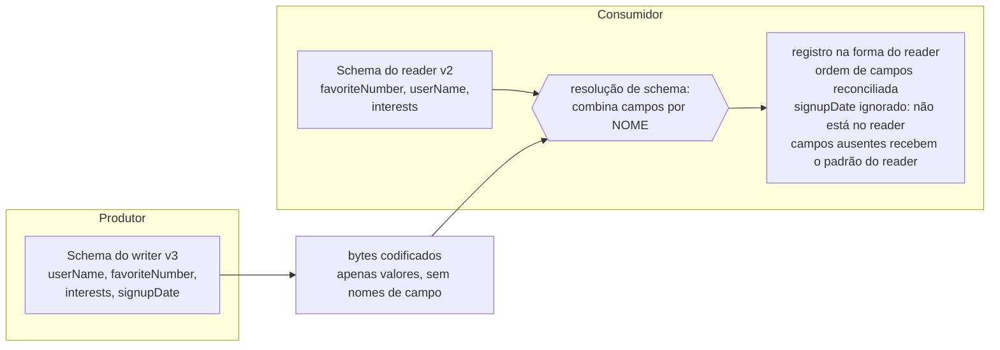

## Visão Geral

Na memória, seus dados vivem em objetos, structs e hash tables mantidos juntos por ponteiros. No momento em que cruzam a fronteira de um processo — escritos em disco, enviados por um socket, publicados em um tópico — precisam se tornar uma sequência autocontida de bytes, porque um ponteiro não significa nada para mais ninguém. Essa tradução é a **codificação** (também chamada de serialização ou marshaling), e o inverso é a **decodificação**. O formato que você escolhe não é um detalhe da camada de transporte: ele determina se você pode implantar uma nova versão de um serviço na terça-feira e deixar os outros cinco intocados até o próximo trimestre, ou se toda mudança de schema se torna um release sincronizado do tipo big-bang.

A razão pela qual isso importa é que código antigo e novo coexistem. Rolling upgrades no lado do servidor significam que algumas instâncias rodam v2 enquanto outras ainda rodam v1; aplicativos no lado do cliente significam usuários que nunca atualizam. Então dados escritos por uma versão serão lidos por outra, em ambas as direções, e o formato de codificação é o que decide se isso funciona. Duas propriedades precisas — **compatibilidade retroativa** (código novo consegue ler dados antigos) e **compatibilidade progressiva** (código antigo consegue ler dados novos) — são sobre o que trata o restante deste conceito. Este conceito cobre os formatos em si; o conceito complementar [Dataflow Patterns: Databases, Services, and Events](dataflow-patterns-databases-services-events) cobre para onde os bytes codificados realmente viajam.

## Formatos Específicos de Linguagem São uma Armadilha

A maioria das linguagens vem com uma forma embutida de transformar objetos em bytes: `java.io.Serializable`, `pickle` do Python, `Marshal` do Ruby, Kryo para a JVM. São sedutores porque o código é uma linha. Também são, para qualquer uso além do mais transitório, a escolha errada:

- **Prendem você a uma linguagem.** Bytes escritos pelo `pickle` são efetivamente ilegíveis fora do Python. Armazenar dados nesse formato é um compromisso com sua linguagem atual pelo tempo que esses dados existirem — o que, para qualquer coisa em um banco de dados, é mais tempo do que você imagina, e impede integrar com qualquer outra organização.
- **São um vetor de execução remota de código.** A decodificação precisa instanciar classes arbitrárias para reconstruir o grafo de objetos. Se um atacante conseguir fazer seu processo desserializar uma sequência de bytes que ele controla, muitas vezes consegue fazê-lo instanciar classes que fazem algo terrível. Cadeias de gadgets de desserialização Java são um gênero inteiro de CVE.
- **Versionamento é uma reflexão tardia.** Essas bibliotecas são construídas para "salvar este objeto, carregá-lo de volta", não para "um binário mais antigo vai ler isso ano que vem". Compatibilidade progressiva e retroativa normalmente nem são consideradas.
- **São lentas e pesadas.** A serialização embutida do Java é notória em ambos os aspectos.

Use-as para um cache descartável que você pode jogar fora. Não as use para nada durável ou que cruze uma fronteira de confiança.

## JSON, XML e Suas Variantes Binárias

Uma vez que você quer algo que várias linguagens possam ler, JSON e XML são as respostas óbvias, com CSV para dados tabulares planos. São bons o suficiente para uma quantidade enorme de trabalho real, especialmente como formatos de *intercâmbio* entre organizações — a dificuldade de fazer duas empresas concordarem sobre qualquer coisa geralmente supera a elegância. Mas suas limitações são reais, e não são as que as pessoas normalmente reclamam:

- **A codificação de números é ambígua.** XML e CSV não conseguem distinguir um número de uma string de dígitos sem um schema externo. JSON distingue strings de números, mas não inteiros de floats, e não especifica precisão. Inteiros maiores que 2^53 não podem ser representados exatamente em um double IEEE 754, então um ID de 64 bits perde silenciosamente seus bits inferiores em qualquer cliente JavaScript. A API do X contorna isso retornando IDs de post duas vezes — uma como número JSON, outra como string decimal —, o que mostra o quanto esse problema é relevante na prática.
- **Não há um tipo de string binária.** JSON e XML lidam bem com texto Unicode e nada bem com sequências de bytes, então as pessoas codificam dados binários em Base64 dentro de uma string e usam conhecimento fora de banda (ou um schema) para saber que devem ser decodificados. Funciona, e infla o payload em cerca de um terço.
- **As linguagens de schema são pesadas.** JSON Schema e XML Schema são genuinamente poderosas — restrições de validação, lógica condicional, referências remotas, modelos de conteúdo abertos versus fechados via `additionalProperties`. Esse poder as torna difíceis de raciocinar, e especificamente difíceis de evoluir de forma comprovadamente compatível para trás ou para frente.
- **CSV não tem schema algum.** O significado da coluna é convenção, adicionar uma coluna é uma migração manual para cada consumidor, e as regras de escaping são implementadas de forma inconsistente entre parsers.

Variantes binárias do JSON — MessagePack, CBOR, BSON, Smile e uma longa cauda de outras — mantêm o modelo de dados do JSON, mas o codificam de forma mais compacta. Como ainda não prescrevem um schema, precisam incluir todo *nome* de campo em cada registro. Isso limita a economia: o registro de exemplo abaixo tem 81 bytes como JSON compacto e 66 bytes como MessagePack. Perder a legibilidade humana por uma redução de 18% é uma má troca. Para fazer melhor de forma significativa, você tem que parar de enviar nomes de campos, e isso exige um schema.

## O Mesmo Registro, de Três Formas

Considere um registro:

```json
{
    "userName": "Martin",
    "favoriteNumber": 1337,
    "interests": ["daydreaming", "hacking"]
}
```

Eis o que as três abordagens realmente colocam no fio:

```text
JSON (textual, 81 bytes, sem espaços em branco)
  {"userName":"Martin","favoriteNumber":1337,"interests":["daydreaming","hacking"]}
  - todo NOME de campo é transmitido, como texto, em cada registro
  - 1337 são os quatro caracteres ASCII '1','3','3','7'

Protocol Buffers (33 bytes) — schema conhecido por ambos os lados, TAGS de campo no fio
  0A 06 4D 61 72 74 69 6E        tag=1 wiretype=LEN, len=6, "Martin"
  10 B9 0A                       tag=2 wiretype=VARINT, 1337 como varint de 2 bytes
  1A 0B "daydreaming"            tag=3 wiretype=LEN, len=11
  1A 07 "hacking"                tag=3 novamente — campos repetidos são apenas tags repetidas
  - o byte de tag empacota o número do campo e o tipo de wire: (field_number << 3) | wire_type
  - sem nomes de campo; o número 3 significa "interests" só porque o schema diz isso
  - uma tag desconhecida ainda pode ser pulada, porque o tipo de wire dá seu tamanho

Avro (32 bytes) — schema conhecido por ambos os lados, NADA identifica campos no fio
  0C 4D 61 72 74 69 6E           tamanho 6 (varint zigzag), depois "Martin"
  02 F2 14                       branch de union 1 (= long, não null), depois 1337
  04 16 "daydreaming" 0E "hacking" 00
                                 contagem de bloco do array 2, cada string com tamanho prefixado,
                                 depois um bloco 0 terminando o array
  - sem tags, sem nomes, sem marcadores de tipo: valores concatenados na ordem de campo do schema
  - esses bytes não têm significado sem o schema exato que os escreveu
```

Esse último ponto é toda a diferença de design. Os bytes do Protobuf são autodescritivos o suficiente para pular um campo não reconhecido. Os bytes do Avro não são autodescritivos de forma alguma — o que é por que o Avro é o mais compacto dos três, e por que precisa de um mecanismo completamente diferente para evolução.

## Protocol Buffers: Tags de Campo

O Protobuf (e o Thrift, que funciona de forma muito semelhante) exige um schema escrito em sua IDL:

```protobuf
syntax = "proto3";

message Person {
    string user_name       = 1;
    int64  favorite_number = 2;
    repeated string interests = 3;
}
```

Os números são **tags de campo**, e são a identidade de cada campo. Um gerador de código transforma isso em classes na linguagem de sua escolha, então codificar e decodificar é código tipado, verificado em tempo de compilação, em vez de lookups em mapas. A linguagem de schema é deliberadamente minimalista: campos e tipos, sem validação estilo `minimum: 1, maximum: 65535`. Inteiros usam codificação de comprimento variável, então números pequenos custam um byte; não há um tipo lista, apenas um modificador `repeated` que emite a mesma tag mais de uma vez.

Como o registro codificado se refere a campos apenas por tag, as regras de evolução decorrem diretamente da codificação:

- **Você pode renomear um campo livremente.** O nome nunca aparece no fio. `user_name` virar `username` não muda nada nos dados existentes.
- **Você nunca pode mudar ou reutilizar um número de tag.** Mudar a tag 2 invalida todo registro já escrito. Reutilizar a tag de um campo excluído é pior: dados antigos ainda contêm a tag 2 com o significado antigo, e código novo vai felizmente decodificá-la como o novo campo. Use `reserved 2;` no schema para que ninguém faça isso por acidente.
- **Adicionar um campo significa dar a ele uma nova tag.** Código antigo lendo dados novos encontra uma tag não reconhecida, e — de forma crítica — o tipo de wire no byte da tag diz quantos bytes pular. Ele pode ignorar o campo *e preservá-lo* em um read-modify-write, o que é o que impede a perda de dados quando uma instância antiga atualiza um registro que uma instância nova escreveu. Essa é a compatibilidade progressiva.
- **Código novo lendo dados antigos** encontra a nova tag ausente e preenche com um padrão (string vazia, `0`). Essa é a compatibilidade retroativa.
- **Remover um campo** é o espelho: tudo bem, desde que a tag seja aposentada para sempre e o campo nunca tenha sido obrigatório.
- **Mudar um tipo** às vezes é permitido e sempre arriscado. Ampliar `int32` para `int64` é seguro em uma direção — código novo lendo dados antigos preenche com zeros —, mas código antigo lendo um novo valor de 64 bits em uma variável de 32 bits vai truncá-lo.

## Avro: Schemas Sem Tags

O Avro surgiu do Hadoop em 2009, precisamente porque o Protobuf não se encaixava em seus casos de uso. O mesmo registro em IDL Avro:

```
record Person {
    string               userName;
    union { null, long } favoriteNumber = null;
    array<string>        interests;
}
```

Nenhum número de tag em lugar nenhum. Como os bytes não carregam identificadores de campo, a decodificação exige o schema exato usado para escrevê-los. A resposta do Avro é que um leitor sempre usa *dois* schemas:

- o **schema do writer** — qualquer versão que o código produtor tinha compilado, idêntico ao que codificou os bytes;
- o **schema do reader** — o que o código consumidor espera, que pode ser uma versão mais antiga ou mais nova.



A resolução combina campos **por nome**, então a ordem dos campos pode diferir entre os dois schemas. Um campo presente no schema do writer mas ausente no do reader é ignorado. Um campo que o reader espera mas o writer nunca escreveu é preenchido a partir do padrão declarado **do reader**. Tudo decorre disso:

- **Você só pode adicionar ou remover campos que tenham um valor padrão.** Adicione um campo sem padrão e novos readers não conseguem ler dados de writers antigos — compatibilidade retroativa quebrada. Remova um campo sem padrão e readers antigos não conseguem ler dados de writers novos — compatibilidade progressiva quebrada.
- **`null` não é um padrão universal.** Para tornar um campo anulável você usa uma union, `union { null, long }`, e `null` só pode ser o padrão se for o primeiro branch. Verboso, mas torna a nulidade explícita em vez de ambiente.
- **Renomear é assimétrico.** O schema do reader pode declarar aliases para nomes antigos, então uma renomeação é compatível para trás mas não para frente. Adicionar um branch a uma union tem a mesma assimetria.

Isso deixa a pergunta óbvia: como um reader obtém o schema do writer? Não enviando-o junto com cada registro — o schema geralmente é muito maior que o próprio registro. Depende do contexto: um arquivo grande com milhões de registros (um arquivo de contêiner de objetos Avro) escreve o schema uma vez no cabeçalho; um banco de dados ou stream de eventos escreve um **número de versão** de schema por registro e o consulta em um registro de schemas (o registro da Confluent para Kafka funciona exatamente assim); dois processos em uma conexão de longa duração negociam o schema uma vez na configuração.

O ganho de não ter números de tag é que o Avro é amigável a **schemas gerados dinamicamente**. Faça um dump de um banco de dados relacional para Avro e você pode gerar o schema mecanicamente a partir das definições de tabela — cada coluna vira um campo, indexado por nome. Quando alguém adiciona uma coluna e remove outra, você regenera o schema e reexporta; os readers combinam por nome e simplesmente lidam com isso. Fazer o mesmo em Protobuf significa um administrador mantendo manualmente um mapeamento de nome-de-coluna para número-de-tag e nunca reutilizando um número aposentado. É por isso que o Avro aparece tanto nos pipelines e streams de eventos discutidos no conceito irmão: são exatamente os lugares onde schemas mudam com frequência, são gerados em vez de escritos à mão, e são compartilhados entre muitos consumidores implantados independentemente.

## Compatibilidade Retroativa e Progressiva, com Precisão

Essas duas palavras são usadas de forma intercambiável em code review, e não são intercambiáveis. Fixe a direção perguntando *qual lado é mais novo*:

- **Compatibilidade retroativa: código novo consegue ler dados escritos por código antigo.** Você é o autor do código novo, então sabe como era o formato antigo e pode tratá-lo explicitamente. Essa normalmente é a direção fácil.
- **Compatibilidade progressiva: código antigo consegue ler dados escritos por código novo.** Essa é a direção difícil, porque exige que código escrito *antes* da mudança faça algo sensato com adições sobre as quais nunca ouviu falar — a saber, ignorá-las, sem corrompê-las.

Concretamente. Um serviço de pedidos publica `OrderPlaced`. Hoje tem `orderId` (tag 1), `userId` (tag 2) e `amountCents` (tag 3). Você adiciona `currencyCode` como tag 4 e implanta o produtor primeiro.

- **Consumidor antigo, dado novo (progressiva).** O serviço de faturamento ainda roda o schema v1. Ele decodifica as tags 1-3 normalmente, encontra a tag 4, lê o tipo de wire, pula o número correto de bytes e continua funcionando. Se ele reemitir ou re-armazenar o registro, uma boa implementação retém o campo desconhecido em vez de descartá-lo — caso contrário a moeda desaparece silenciosamente de um registro que tinha uma.
- **Consumidor novo, dado antigo (retroativa).** O serviço de analytics é atualizado para v2 e começa a consumir um backlog escrito antes da mudança. A tag 4 simplesmente está ausente, então ela decodifica para o padrão de string vazia. Seu código tem que tratar "sem código de moeda" como um estado real — um padrão não é o mesmo que um valor correto, e é aqui que a garantia de compatibilidade termina e a lógica de negócio começa.

Para APIs de requisição/resposta, as mesmas duas propriedades se aplicam em ambas as direções ao mesmo tempo. Um **cliente mais antigo chamando um serviço mais novo** precisa de compatibilidade retroativa na requisição (o novo serviço lê a requisição antiga) e compatibilidade progressiva na resposta (o cliente antigo tolera a resposta nova). Um **cliente mais novo chamando um serviço mais antigo** precisa exatamente do inverso. Qualquer API que você não consiga atualizar dos dois lados simultaneamente — o que é toda API pública e a maioria das internas — precisa das quatro.

O modo de falha que vale a pena internalizar é o perigo do read-modify-write: código novo escreve um registro contendo um campo novo, código antigo o lê em um objeto de modelo que não preserva campos desconhecidos, modifica algo não relacionado, e o escreve de volta. O campo novo desaparece, silenciosamente, e nada deu erro. O skip-with-length do Protobuf e as regras de resolução do Avro existem para evitar exatamente isso.

## Os Méritos de um Schema Explícito

As linguagens de schema do Protobuf e do Avro são muito mais simples que JSON Schema ou XML Schema — campos e tipos, essencialmente mais nada. Essa simplicidade é o motivo pelo qual têm amplo suporte de linguagens e por que as regras de compatibilidade são verificáveis. As ideias são antigas: ASN.1, padronizado em 1984, evoluiu via números de tag da mesma forma que o Protobuf, e sua codificação DER ainda codifica todo certificado X.509 que você usa. O que você ganha de um formato binário orientado a schema:

- **Compactação que variantes binárias de JSON não conseguem alcançar**, porque nomes de campo nunca aparecem nos dados. Trinta e três bytes contra sessenta e seis contra oitenta e um, para o mesmo registro.
- **Documentação que não pode ficar desatualizada**, porque o schema é *obrigatório* para decodificar. Documentação de API escrita à mão fica desatualizada; um schema errado simplesmente não decodifica.
- **Verificação automatizada de compatibilidade.** Mantenha um registro de versões de schema e você pode verificar mecanicamente que uma mudança proposta é compatível para trás e para frente *antes* de ser implantada, em vez de descobrir isso pela taxa de erros de um consumidor.
- **Geração de código e verificação de tipos em tempo de compilação**, o que para linguagens estaticamente tipadas move uma classe de bugs de runtime para o momento do build.

O resultado é próximo da flexibilidade pela qual as pessoas recorrem a armazenamentos JSON sem schema, com garantias e ferramentas melhores. O conselho operacional é manter o número de formatos de codificação concorrentes em seu sistema pequeno — cada formato adicional é mais um conjunto de regras de evolução que sua equipe precisa guardar na cabeça.

## Trade-offs

- **Formatos textuais compram interoperabilidade com verbosidade e ambiguidade** — a falta de distinção inteiro/float do JSON e a ausência de um tipo binário são riscos reais de correção (IDs de 64 bits em JavaScript, Base64 inflando payloads em um terço), mas "todo mundo consegue parsear sem concordar com nada antes" costuma valer mais que bytes, especialmente entre fronteiras organizacionais.
- **Variantes binárias de JSON são o pior dos dois mundos para a maioria dos sistemas** — ainda transmitem todo nome de campo porque se recusam a exigir um schema, então você perde legibilidade humana por uma redução de tamanho de cerca de 18%; se o tamanho importa o suficiente para abrir mão da legibilidade, vá até o fim para um formato orientado a schema.
- **Os números de tag do Protobuf são estado global permanente que você tem que gerenciar à mão** — permitem que código antigo e novo interoperem sem um registro de schemas, mas um número de tag reutilizado corrompe dados silenciosamente, por isso o `reserved` existe e por que atribuir tags à mão escala mal para schemas gerados.
- **A codificação sem tags do Avro é a mais compacta e a mais dependente de infraestrutura** — os bytes não têm significado sem o schema do writer, então você precisa rodar um registro (ou cabeçalhos de arquivo de contêiner, ou negociação de conexão) como uma dependência obrigatória; em troca, schemas podem ser gerados mecanicamente e combinados por nome.
- **Compatibilidade retroativa é barata, compatibilidade progressiva é uma restrição de design** — código novo sabe como eram os dados antigos, mas código antigo precisa ignorar-e-preservar adições para as quais nunca foi escrito para entender, e isso só acontece se o formato suportar e seus objetos de modelo não descartarem silenciosamente campos desconhecidos.
- **Codegen compra segurança em tempo de compilação ao custo de acoplamento com o pipeline de build** — classes geradas capturam erros de tipo antes do deploy, mas também significam que mudanças de schema exigem regenerar e reimplantar cada consumidor que quer ver o novo campo, exatamente a coordenação que você estava tentando evitar.

## Perguntas de Entrevista

- Sua equipe armazena eventos como objetos Python serializados com `pickle` no S3 por um ano de retenção, e um novo serviço em Go agora precisa lê-los. Além de "reescrever", o que especificamente deu errado aqui, e qual propriedade da escolha original causou isso?
- Defina compatibilidade retroativa e progressiva sem usar as palavras "antigo" e "novo" de forma ambígua, e depois diga qual delas um cliente mobile mais antigo chamando sua API recém-implantada precisa na *resposta*, e por quê.
- Um desenvolvedor exclui o campo `email = 4` de um `.proto` e depois adiciona `phone = 4` porque o número estava livre. Percorra exatamente o que acontece quando o código novo lê um registro escrito antes da exclusão, e explique por que nenhum erro é lançado.
- Os bytes codificados do Avro não contêm nomes de campo nem marcadores de tipo, ainda assim o Avro suporta adicionar e remover campos. Explique o mecanismo que torna ambas as afirmações verdadeiras simultaneamente, e qual infraestrutura ele te obriga a operar.
- Você precisa exportar um banco de dados relacional com 400 tabelas para arquivos toda noite, e o schema muda a cada poucas sprints. Argumente a favor do Avro sobre o Protocol Buffers aqui, depois nomeie a situação em que o argumento se inverte.

## Referências

- [Martin Kleppmann, "Designing Data-Intensive Applications", 2nd Edition (O'Reilly) — Capítulo 5, "Encoding and Evolution", seção "Formats for Encoding Data"](https://www.oreilly.com/library/view/designing-data-intensive-applications/9781098119058/)
- [Protocol Buffers Language Guide (proto3) — Updating A Message Type](https://protobuf.dev/programming-guides/proto3/#updating)
- [Protocol Buffers — Encoding (wire format, varints, and field tags)](https://protobuf.dev/programming-guides/encoding/)
- [Apache Avro Specification — Schema Resolution](https://avro.apache.org/docs/1.12.0/specification/#schema-resolution)
