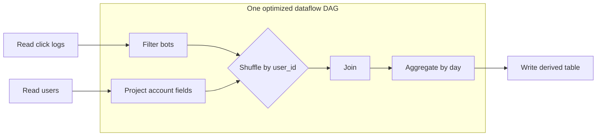
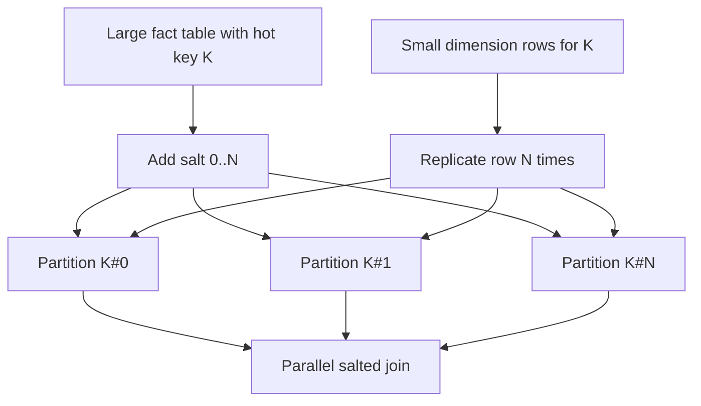

## Overview

The [MapReduce programming model](mapreduce-programming-model) is powerful because it turns a large computation into deterministic map tasks, a shuffle, and deterministic reduce tasks that can be retried independently. Its weakness appears when real batch workflows become pipelines: clean raw logs, join them with account data, aggregate by day, enrich with geography, train a model, and publish the result. In classic MapReduce, each stage is a separate job. Every job writes its entire output to the distributed filesystem, the next job reads that output back, and no stage can start consuming a predecessor's records until the predecessor has fully materialized them.

**Dataflow engines** such as Spark, Tez, and Flink keep the fault-tolerant, distributed execution idea but model the whole workflow as one directed acyclic graph (DAG) of operators. That lets the engine see where data must be repartitioned, where it can be pipelined, where it can stay in memory or on local disk, and where durable materialization is actually needed. The result is not merely a faster implementation detail: it changes how you reason about joins, grouping, fault tolerance, and query optimization in large-scale batch systems.

## Why MapReduce Materializes Too Much

A sequence of MapReduce jobs treats the distributed filesystem as the boundary between every pair of stages. That boundary is safe and simple: if a reducer finishes, its output is replicated durably; if a later job fails, the system can restart from those files. But the price is high. Intermediate data is often much larger than the final answer, and writing it to replicated storage after every stage burns network bandwidth, disk I/O, serialization cost, and scheduling time.

The cost is especially visible in chained jobs. The mapper of job two often does little more than parse records that the reducer of job one just wrote. If the reducer sorted and partitioned records by key, the next mapper may immediately discard that useful physical layout and ask the next shuffle to create another one. Because jobs are separated by full materialization, the system cannot pipeline records from one operator into the next, cannot globally choose a cheaper join order, and cannot avoid redundant map phases that exist only to adapt one job's output files into the next job's input records.

This does not make MapReduce obsolete for every workload. Durable stage boundaries are useful when teams exchange files through a data lake, when a stage is intentionally reused by many downstream jobs, or when a batch result is the product. But when the intermediate output exists only to feed the next operator, materializing everything is wasteful.

## Dataflow Engines as Operator DAGs

Dataflow engines represent a workflow as a graph of operators: read, filter, map, join, group, aggregate, sort, and write. Edges describe how records move between operators. A narrow edge can keep each partition local, while a wide edge requires a shuffle so all records with the same key meet. Because the engine sees the entire graph, it can fuse simple operators, pipeline records through adjacent operators, and choose the minimum number of shuffle boundaries.

Spark, Tez, and Flink differ in APIs and execution details, but the architectural shift is the same. Instead of running many independent MapReduce jobs, the scheduler breaks a DAG into stages only at true data-exchange boundaries. Intermediate results can be streamed directly to downstream operators, held in memory, spilled to local disk, or checkpointed only when reuse, fault tolerance, or operational boundaries justify it.

This is why iterative algorithms and interactive analytics improved so dramatically with Spark. A machine-learning job that repeatedly scans the same training vectors should not reload them from replicated storage on every pass. Keeping partitions in memory, and recomputing them if lost, is a better fit than writing every iteration to a distributed filesystem.

## Lineage and Recomputation for Fault Tolerance

Classic MapReduce relies heavily on durable materialization: once a stage writes replicated output, later recovery can restart from that point. Dataflow engines often prefer **lineage**. A partition is not protected by eagerly replicating every intermediate byte; it is protected by remembering how it was derived. Spark's RDD abstraction records transformations such as `map`, `filter`, `join`, and `groupBy`. If one executor loses a partition, Spark can recompute just that partition from its ancestors rather than rerun the whole workflow.

Lineage works best for deterministic, coarse-grained transformations over immutable partitions. It avoids the cost of replicating short-lived intermediate state, and it fits batch workloads where recomputation is usually cheaper than constantly writing replicas. The trade is that recovery may re-execute upstream work, and very long lineages may need checkpointing to cap recovery time. Dataflow engines therefore still materialize at selected boundaries: final outputs, explicit caches, checkpoints, shuffle files, or data reused by many downstream branches.

Flink's fault tolerance is more checkpoint-oriented for stateful streaming, while Spark's original RDD model emphasizes lineage and recomputation. In bounded batch processing, both ideas share the same goal: do not force every transient operator output through replicated storage merely to survive failures.

## Reduce-Side Joins and Sort-Merge

A **reduce-side join** makes the fewest assumptions about its inputs. Both relations are partitioned by the join key so that equal keys arrive at the same reducer or downstream task. Within each partition, records are sorted by the join key, and the reducer performs a merge: advance through both sorted streams, match equal keys, emit joined rows, and move on. This is the batch version of a distributed sort-merge join.

The advantage is generality. The two inputs may live in different file formats, have different partitioning, and be produced by unrelated upstream systems. As long as the engine can shuffle both by the same key, the join works. The disadvantage is the full shuffle: both inputs may be read, serialized, transferred across the network, sorted, and spilled before a single joined row is emitted. For large fact-to-fact joins, this may be unavoidable; for fact-to-dimension joins or pre-partitioned datasets, it is often unnecessary.

Reduce-side joins also expose the physical reality behind [sharding and secondary indexes](sharding-strategies-rebalancing-and-secondary-indexes). A join key is a temporary shard key for the duration of the computation. If that key distributes evenly, reducers finish together. If one key dominates, the whole job waits for one overloaded partition.

## Handling Skew and Hot Keys

A shuffle assumes that hashing the key produces roughly equal partitions. Real data breaks that assumption: null user IDs, anonymous accounts, viral products, a default country code, or one enterprise customer can create a **hot key** with orders of magnitude more rows than the median key. Since all rows for a key must meet to join or aggregate, one task becomes a straggler while the rest of the cluster sits idle.

The first fix is to avoid shuffling bad keys when they do not matter. Null keys in an inner join do not match anything, so filter or isolate them before the join. If one side is small enough, a broadcast join can eliminate the shuffle. If skew remains, engines can use **skewed joins** or manual **salting**. Salting adds an artificial bucket to the hot key, splitting `customer_42` into `customer_42#0` through `customer_42#N`; the other side is replicated across those salts so the original join semantics are preserved.

Salting is not free. It increases the size of the replicated side and complicates the plan, so it is best reserved for known hot keys or extreme skew. Modern Spark can also use Adaptive Query Execution to detect skewed sort-merge join partitions at runtime and split them, but the underlying principle is the same: make one pathological key consume several tasks instead of one.

## Map-Side Joins

A **map-side join** avoids the reduce-side shuffle by arranging for each mapper or task to have all data needed for its local input partition. It is faster when its preconditions are true and wrong when they are only hoped for.

### Broadcast hash join

In a broadcast hash join, the small side is copied to every worker and loaded into an in-memory hash table. Each task scans a partition of the large side and performs local lookups. This is ideal for joining a huge event table to a small user-segment, feature-flag, currency, or product-dimension table. The constraint is memory: if the broadcast side is underestimated or grows unexpectedly, every executor can run out of memory at once.

### Partitioned hash join

A partitioned hash join works when both inputs are already partitioned in the same way by the join key and have a compatible number of partitions. Then partition `i` of the left input only needs partition `i` of the right input, so the engine can join them locally. This is common in curated data lakes where large tables are bucketed by account ID, date, or another shared key. It is fragile across schema changes, rebucketing, and inconsistent partition counts.

### Map-side merge join

A map-side merge join is even more specific: both inputs are partitioned by the join key and sorted by that key inside each partition. The task can stream both files and merge them without building a large hash table. It is excellent when upstream storage already guarantees the layout, but expensive to create solely for one downstream query because sorting and partitioning are exactly what reduce-side joins perform.

## Query Languages, Optimizers, and DataFrames

Most teams should not hard-code join strategies in application logic. Declarative systems such as Hive and Spark SQL let users state *what* result they need while an optimizer chooses *how* to execute it. With table statistics, file metadata, partition information, and runtime feedback, the optimizer can pick a broadcast hash join for a small dimension table, a sort-merge join for large inputs, a partition-aware plan for bucketed tables, or a skew-aware plan when runtime metrics show imbalance.

DataFrame APIs sit between imperative code and SQL. Spark DataFrames, Pandas, Snowpark, and similar APIs let developers express transformations with ordinary language constructs while preserving a logical plan that the engine can optimize. This is a major advantage over arbitrary user code: once data is hidden inside an opaque function, the engine cannot reorder filters, push projections, choose a join strategy, or eliminate redundant stages.

The practical rule is to give the optimizer good information. Store analytical data in formats that expose column statistics, keep table statistics current, partition and bucket deliberately, and use hints only when you know something the optimizer cannot infer. This connects directly to [column-oriented storage for analytics](column-oriented-storage-for-analytics): columnar formats reduce I/O, expose statistics, and make vectorized execution and projection pushdown effective.

## Batch Use Cases for Dataflow Engines

Dataflow engines are the workhorses behind offline derived data. ETL jobs clean operational records, validate schemas, deduplicate events, and produce curated datasets for analysts. Search indexing jobs read source documents, tokenize and normalize them, build inverted indexes, and publish immutable segments that serving systems can load. Machine-learning feature pipelines join raw events with labels, user attributes, and historical aggregates to create training examples and offline feature tables.

They also build read-only derived datastores served to production: recommendation snapshots, denormalized account summaries, fraud-risk features, ranking indexes, and analytical cubes. These outputs are usually not the system of record. They are materialized views over data owned elsewhere, rebuilt or incrementally refreshed by batch workflows, and swapped into serving systems when complete. That makes batch processing complementary to streaming and online transactions rather than a replacement for them; see [batch processing in distributed systems](batch-processing-in-distributed-systems) for the broader role of bounded jobs.

## Trade-offs

- **Dataflow DAGs remove accidental materialization but make execution less inspectable** — keeping intermediate data in memory, local disk, or pipelined streams avoids repeated distributed-filesystem writes, but operators are now coupled inside one optimized plan rather than separated by obvious files you can inspect and reuse.
- **Lineage avoids replicating transient state and pays with recomputation** — Spark-style RDD lineage can rebuild lost partitions instead of copying every intermediate result to several machines, but recovery time grows with lineage length and expensive ancestors may need checkpointing.
- **Reduce-side joins are universal and expensive** — repartitioning and sorting both inputs by key works regardless of their original layout, which is why it is the safe default, but the full shuffle is often the dominant cost of a batch job.
- **Map-side joins are fast because they rely on strong preconditions** — broadcast joins need a genuinely small side, partitioned joins need matching partition layouts, and merge joins need sorted partitions; if those assumptions drift, the plan fails or silently becomes much more expensive.
- **Skew turns average-case scalability into tail-latency pain** — a cluster with hundreds of workers can still wait on one hot key, so serious pipelines need skew detection, salting, AQE, hot-key isolation, or domain-specific handling of null and default values.
- **Declarative APIs give optimizers room to help and require trustworthy metadata** — Spark SQL, Hive, and DataFrames can choose join strategies and reorder operators, but bad statistics, stale partition metadata, and opaque user-defined functions can force poor plans.

## Interview Questions

- Why does a chain of MapReduce jobs often write and reread far more data than a dataflow engine running the same logical workflow?
- A Spark executor loses one cached partition of an RDD. How can lineage recover it, and when would checkpointing still be useful?
- Compare a reduce-side sort-merge join with a broadcast hash join. What assumptions does each make, and where does each pay network or memory cost?
- Your join runs 99% of tasks quickly and one task for 40 minutes. What evidence would you look for, and how could salting or skew-aware execution help?
- When can a partitioned map-side join avoid a shuffle, and why is that different from merely having both inputs partitioned somehow?
- Why do DataFrame and SQL APIs give a distributed engine more optimization opportunities than arbitrary imperative code?

## References

- [Martin Kleppmann, "Designing Data-Intensive Applications", 2nd Edition (O'Reilly) — Chapter 11, "Batch Processing", sections "Dataflow Engines", "Shuffling Data", "Joins and Grouping", "Query Languages", "DataFrames", and "Batch Use Cases"](https://www.oreilly.com/library/view/designing-data-intensive-applications/9781098119058/)
- [Zaharia et al. — "Resilient Distributed Datasets: A Fault-Tolerant Abstraction for In-Memory Cluster Computing" (NSDI 2012)](https://www.usenix.org/conference/nsdi12/technical-sessions/presentation/zaharia)
- [Apache Spark Documentation — "Performance Tuning", join strategy hints and automatic broadcast joins](https://spark.apache.org/docs/latest/sql-performance-tuning.html)
- [Apache Flink Documentation — "Execution Mode (Batch/Streaming)"](https://nightlies.apache.org/flink/flink-docs-stable/docs/dev/datastream/execution_mode/)
- [Data Dynamics — "Conquering PySpark Data Skew: Rescuing Jobs Stuck at 99%"](https://www.data-dynamics.io/en/blog/pyspark-data-skew)
