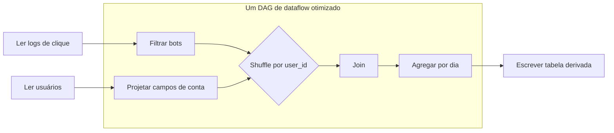
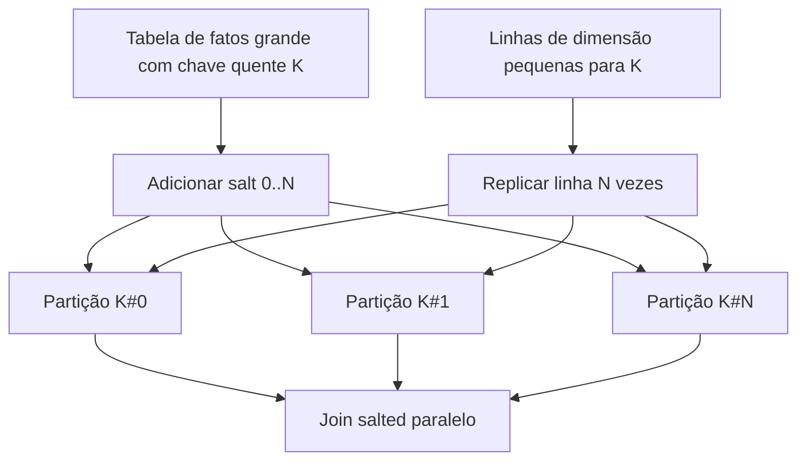

## Visão Geral

O [modelo de programação MapReduce](mapreduce-programming-model) é poderoso porque transforma uma computação grande em tarefas map determinísticas, um shuffle e tarefas reduce determinísticas que podem ser reexecutadas de forma independente. Sua fraqueza aparece quando fluxos de trabalho em batch reais se tornam pipelines: limpar logs brutos, juntá-los com dados de conta, agregar por dia, enriquecer com geografia, treinar um modelo e publicar o resultado. No MapReduce clássico, cada estágio é um job separado. Todo job escreve sua saída inteira no sistema de arquivos distribuído, o próximo job lê essa saída de volta, e nenhum estágio pode começar a consumir os registros de um predecessor até que o predecessor os tenha materializado completamente.

**Engines de dataflow** como Spark, Tez e Flink mantêm a ideia de execução distribuída e tolerante a falhas, mas modelam o fluxo de trabalho inteiro como um único grafo acíclico dirigido (DAG) de operadores. Isso permite que o engine veja onde os dados precisam ser reparticionados, onde podem ser pipelinados, onde podem ficar em memória ou em disco local, e onde a materialização durável é realmente necessária. O resultado não é apenas um detalhe de implementação mais rápido: muda como você raciocina sobre joins, agrupamento, tolerância a falhas e otimização de consultas em sistemas de batch em larga escala.

## Por Que o MapReduce Materializa Demais

Uma sequência de jobs MapReduce trata o sistema de arquivos distribuído como a fronteira entre cada par de estágios. Essa fronteira é segura e simples: se um reducer termina, sua saída é replicada de forma durável; se um job posterior falha, o sistema pode reiniciar a partir desses arquivos. Mas o preço é alto. Dados intermediários costumam ser muito maiores que a resposta final, e escrevê-los em armazenamento replicado após cada estágio consome largura de banda de rede, I/O de disco, custo de serialização e tempo de agendamento.

O custo é especialmente visível em jobs encadeados. O mapper do job dois frequentemente faz pouco mais que parsear registros que o reducer do job um acabou de escrever. Se o reducer ordenou e particionou registros por chave, o próximo mapper pode descartar imediatamente esse layout físico útil e pedir ao próximo shuffle para criar outro. Como os jobs são separados por materialização completa, o sistema não consegue pipelinar registros de um operador para o próximo, não consegue escolher globalmente uma ordem de join mais barata, e não consegue evitar fases map redundantes que existem só para adaptar os arquivos de saída de um job aos registros de entrada do próximo job.

Isso não torna o MapReduce obsoleto para todo tipo de carga. Fronteiras de estágio duráveis são úteis quando equipes trocam arquivos por meio de um data lake, quando um estágio é intencionalmente reutilizado por muitos jobs downstream, ou quando um resultado em batch é o produto. Mas quando a saída intermediária existe só para alimentar o próximo operador, materializar tudo é desperdício.

## Engines de Dataflow como DAGs de Operadores

Engines de dataflow representam um fluxo de trabalho como um grafo de operadores: read, filter, map, join, group, aggregate, sort e write. As arestas descrevem como os registros se movem entre operadores. Uma aresta estreita pode manter cada partição local, enquanto uma aresta larga exige um shuffle para que todos os registros com a mesma chave se encontrem. Como o engine vê o grafo inteiro, ele pode fundir operadores simples, pipelinar registros por operadores adjacentes e escolher o número mínimo de fronteiras de shuffle.

Spark, Tez e Flink diferem em APIs e detalhes de execução, mas a mudança arquitetural é a mesma. Em vez de executar muitos jobs MapReduce independentes, o scheduler divide um DAG em estágios apenas nas fronteiras verdadeiras de troca de dados. Resultados intermediários podem ser transmitidos diretamente para operadores downstream, mantidos em memória, derramados em disco local ou pontos de verificação (checkpoint) somente quando reutilização, tolerância a falhas ou fronteiras operacionais justificam.

É por isso que algoritmos iterativos e analytics interativos melhoraram tão drasticamente com o Spark. Um job de machine learning que varre repetidamente os mesmos vetores de treinamento não deveria recarregá-los do armazenamento replicado a cada passagem. Manter partições em memória, e recomputá-las se perdidas, é uma adequação melhor do que escrever cada iteração em um sistema de arquivos distribuído.

## Linhagem (Lineage) e Recomputação para Tolerância a Falhas

O MapReduce clássico depende fortemente de materialização durável: uma vez que um estágio escreve saída replicada, a recuperação posterior pode reiniciar a partir desse ponto. Engines de dataflow frequentemente preferem **linhagem (lineage)**. Uma partição não é protegida replicando avidamente cada byte intermediário; ela é protegida lembrando como foi derivada. A abstração RDD do Spark registra transformações como `map`, `filter`, `join` e `groupBy`. Se um executor perde uma partição, o Spark pode recomputar apenas aquela partição a partir de seus ancestrais em vez de reexecutar todo o fluxo de trabalho.

A linhagem funciona melhor para transformações determinísticas e de granularidade grossa sobre partições imutáveis. Ela evita o custo de replicar estado intermediário de vida curta, e se encaixa em cargas de batch onde a recomputação geralmente é mais barata do que escrever réplicas constantemente. A contrapartida é que a recuperação pode reexecutar trabalho upstream, e linhagens muito longas podem precisar de checkpoint para limitar o tempo de recuperação. Engines de dataflow, portanto, ainda materializam em fronteiras selecionadas: saídas finais, caches explícitos, checkpoints, arquivos de shuffle, ou dados reutilizados por muitos ramos downstream.

A tolerância a falhas do Flink é mais orientada a checkpoint para streaming com estado, enquanto o modelo RDD original do Spark enfatiza linhagem e recomputação. No processamento em batch limitado, ambas as ideias compartilham o mesmo objetivo: não forçar toda saída de operador transitória por armazenamento replicado apenas para sobreviver a falhas.

## Joins Reduce-Side e Sort-Merge

Um **join reduce-side** faz as menores suposições possíveis sobre suas entradas. Ambas as relações são particionadas pela chave de join de modo que chaves iguais cheguem ao mesmo reducer ou tarefa downstream. Dentro de cada partição, os registros são ordenados pela chave de join, e o reducer realiza um merge: avança por ambos os streams ordenados, combina chaves iguais, emite linhas juntadas e segue em frente. Esta é a versão em batch de um join sort-merge distribuído.

A vantagem é a generalidade. As duas entradas podem viver em formatos de arquivo diferentes, ter particionamento diferente, e ser produzidas por sistemas upstream não relacionados. Contanto que o engine consiga embaralhar (shuffle) ambos pela mesma chave, o join funciona. A desvantagem é o shuffle completo: ambas as entradas podem ser lidas, serializadas, transferidas pela rede, ordenadas e derramadas em disco antes que uma única linha juntada seja emitida. Para joins grandes fato-a-fato, isso pode ser inevitável; para joins fato-a-dimensão ou conjuntos de dados pré-particionados, geralmente é desnecessário.

Joins reduce-side também expõem a realidade física por trás de [sharding e índices secundários](sharding-strategies-rebalancing-and-secondary-indexes). Uma chave de join é uma chave de shard temporária durante a computação. Se essa chave se distribui uniformemente, os reducers terminam juntos. Se uma chave domina, o job inteiro espera por uma partição sobrecarregada.

## Lidando com Skew e Chaves Quentes

Um shuffle assume que aplicar hash na chave produz partições aproximadamente iguais. Dados reais quebram essa suposição: IDs de usuário nulos, contas anônimas, produtos virais, um código de país padrão, ou um único cliente enterprise pode criar uma **chave quente** com ordens de magnitude mais linhas do que a mediana. Como todas as linhas de uma chave precisam se encontrar para juntar ou agregar, uma tarefa se torna um straggler enquanto o resto do cluster fica ocioso.

A primeira correção é evitar embaralhar chaves ruins quando elas não importam. Chaves nulas em um inner join não combinam com nada, então filtre-as ou isole-as antes do join. Se um dos lados for pequeno o suficiente, um broadcast join pode eliminar o shuffle. Se o skew persistir, engines podem usar **joins com detecção de skew** ou **salting** manual. Salting adiciona um bucket artificial à chave quente, dividindo `customer_42` em `customer_42#0` até `customer_42#N`; o outro lado é replicado por esses salts para que a semântica original do join seja preservada.

Salting não é grátis. Aumenta o tamanho do lado replicado e complica o plano, então é melhor reservá-lo para chaves quentes conhecidas ou skew extremo. O Spark moderno também pode usar Adaptive Query Execution para detectar em tempo de execução partições de sort-merge join com skew e dividi-las, mas o princípio subjacente é o mesmo: fazer uma chave patológica consumir várias tarefas em vez de uma.

## Joins Map-Side

Um **join map-side** evita o shuffle do reduce-side arranjando para que cada mapper ou tarefa tenha todos os dados necessários para sua partição local de entrada. É mais rápido quando suas pré-condições são verdadeiras e errado quando são apenas esperadas.

### Broadcast hash join

Em um broadcast hash join, o lado pequeno é copiado para cada worker e carregado em uma hash table em memória. Cada tarefa varre uma partição do lado grande e realiza buscas locais. Isso é ideal para juntar uma tabela enorme de eventos a uma pequena tabela de segmento de usuário, feature flag, moeda ou dimensão de produto. A restrição é a memória: se o lado transmitido (broadcast) for subestimado ou crescer inesperadamente, todo executor pode ficar sem memória ao mesmo tempo.

### Partitioned hash join

Um partitioned hash join funciona quando ambas as entradas já estão particionadas da mesma forma pela chave de join e têm um número compatível de partições. Então a partição `i` da entrada esquerda só precisa da partição `i` da entrada direita, então o engine pode juntá-las localmente. Isso é comum em data lakes curados onde tabelas grandes são bucketed por ID de conta, data ou outra chave compartilhada. É frágil a mudanças de schema, rebucketing, e contagens de partição inconsistentes.

### Map-side merge join

Um map-side merge join é ainda mais específico: ambas as entradas são particionadas pela chave de join e ordenadas por essa chave dentro de cada partição. A tarefa pode transmitir ambos os arquivos e mesclá-los sem construir uma hash table grande. É excelente quando o armazenamento upstream já garante o layout, mas caro de criar somente para uma consulta downstream porque ordenar e particionar é exatamente o que joins reduce-side realizam.

## Linguagens de Consulta, Otimizadores e DataFrames

A maioria das equipes não deveria fixar estratégias de join na lógica da aplicação. Sistemas declarativos como Hive e Spark SQL deixam os usuários declararem *o que* resultado precisam enquanto um otimizador escolhe *como* executá-lo. Com estatísticas de tabela, metadados de arquivo, informações de partição e feedback em tempo de execução, o otimizador pode escolher um broadcast hash join para uma tabela de dimensão pequena, um sort-merge join para entradas grandes, um plano ciente de partição para tabelas bucketed, ou um plano ciente de skew quando métricas em tempo de execução mostram desequilíbrio.

APIs de DataFrame ficam entre código imperativo e SQL. DataFrames do Spark, Pandas, Snowpark e APIs semelhantes permitem que desenvolvedores expressem transformações com construções de linguagem comuns preservando um plano lógico que o engine pode otimizar. Isso é uma vantagem importante sobre código de usuário arbitrário: uma vez que dados são escondidos dentro de uma função opaca, o engine não pode reordenar filtros, empurrar projeções, escolher uma estratégia de join, ou eliminar estágios redundantes.

A regra prática é dar ao otimizador boas informações. Armazene dados analíticos em formatos que expõem estatísticas de coluna, mantenha estatísticas de tabela atualizadas, particione e faça bucket deliberadamente, e use hints só quando você sabe algo que o otimizador não consegue inferir. Isso se conecta diretamente com [armazenamento orientado a colunas para analytics](column-oriented-storage-for-analytics): formatos colunares reduzem I/O, expõem estatísticas, e tornam a execução vetorizada e o pushdown de projeção eficazes.

## Casos de Uso em Batch para Engines de Dataflow

Engines de dataflow são os cavalos de batalha por trás de dados derivados offline. Jobs de ETL limpam registros operacionais, validam schemas, deduplicam eventos e produzem conjuntos de dados curados para analistas. Jobs de indexação de busca leem documentos fonte, tokenizam e normalizam-nos, constroem índices invertidos e publicam segmentos imutáveis que sistemas de serving podem carregar. Pipelines de features de machine learning juntam eventos brutos com rótulos, atributos de usuário e agregados históricos para criar exemplos de treinamento e tabelas de features offline.

Também constroem datastores derivados somente-leitura servidos em produção: snapshots de recomendação, resumos de conta desnormalizados, features de risco de fraude, índices de ranking e cubos analíticos. Essas saídas geralmente não são o sistema de registro. São views materializadas sobre dados possuídos em outro lugar, reconstruídas ou atualizadas incrementalmente por fluxos de trabalho em batch, e trocadas para sistemas de serving quando completas. Isso torna o processamento em batch complementar ao streaming e às transações online em vez de um substituto para eles; veja [processamento em batch em sistemas distribuídos](batch-processing-in-distributed-systems) para o papel mais amplo dos jobs limitados.

## Trade-offs

- **DAGs de dataflow removem materialização acidental mas tornam a execução menos inspecionável** — manter dados intermediários em memória, disco local ou streams pipelinados evita escritas repetidas no sistema de arquivos distribuído, mas os operadores agora estão acoplados dentro de um plano otimizado em vez de separados por arquivos óbvios que você pode inspecionar e reutilizar.
- **Linhagem evita replicar estado transitório e paga com recomputação** — a linhagem estilo RDD do Spark pode reconstruir partições perdidas em vez de copiar cada resultado intermediário para várias máquinas, mas o tempo de recuperação cresce com o comprimento da linhagem e ancestrais caros podem precisar de checkpoint.
- **Joins reduce-side são universais e caros** — reparticionar e ordenar ambas as entradas por chave funciona independentemente do layout original delas, o que é por que é o padrão seguro, mas o shuffle completo é frequentemente o custo dominante de um job em batch.
- **Joins map-side são rápidos porque dependem de pré-condições fortes** — broadcast joins precisam de um lado genuinamente pequeno, joins particionados precisam de layouts de partição correspondentes, e merge joins precisam de partições ordenadas; se essas suposições derivarem, o plano falha ou silenciosamente fica muito mais caro.
- **Skew transforma escalabilidade de caso médio em dor de latência de cauda** — um cluster com centenas de workers ainda pode esperar por uma chave quente, então pipelines sérios precisam de detecção de skew, salting, AQE, isolamento de chave quente, ou tratamento específico de domínio para valores nulos e padrão.
- **APIs declarativas dão espaço para otimizadores ajudarem e exigem metadados confiáveis** — Spark SQL, Hive e DataFrames podem escolher estratégias de join e reordenar operadores, mas estatísticas ruins, metadados de partição desatualizados e funções definidas pelo usuário opacas podem forçar planos ruins.

## Perguntas de Entrevista

- Por que uma cadeia de jobs MapReduce frequentemente escreve e relê muito mais dados do que um engine de dataflow executando a mesma lógica de fluxo de trabalho?
- Um executor Spark perde uma partição em cache de um RDD. Como a linhagem pode recuperá-la, e quando o checkpoint ainda seria útil?
- Compare um join sort-merge reduce-side com um broadcast hash join. Quais suposições cada um faz, e onde cada um paga custo de rede ou memória?
- Seu join executa 99% das tarefas rapidamente e uma tarefa por 40 minutos. Que evidência você procuraria, e como salting ou execução ciente de skew poderiam ajudar?
- Quando um join map-side particionado pode evitar um shuffle, e por que isso é diferente de simplesmente ter ambas as entradas particionadas de alguma forma?
- Por que APIs de DataFrame e SQL dão a um engine distribuído mais oportunidades de otimização do que código imperativo arbitrário?

## Referências

- [Martin Kleppmann, "Designing Data-Intensive Applications", 2nd Edition (O'Reilly) — Capítulo 11, "Batch Processing", seções "Dataflow Engines", "Shuffling Data", "Joins and Grouping", "Query Languages", "DataFrames" e "Batch Use Cases"](https://www.oreilly.com/library/view/designing-data-intensive-applications/9781098119058/)
- [Zaharia et al. — "Resilient Distributed Datasets: A Fault-Tolerant Abstraction for In-Memory Cluster Computing" (NSDI 2012)](https://www.usenix.org/conference/nsdi12/technical-sessions/presentation/zaharia)
- [Apache Spark Documentation — "Performance Tuning", join strategy hints and automatic broadcast joins](https://spark.apache.org/docs/latest/sql-performance-tuning.html)
- [Apache Flink Documentation — "Execution Mode (Batch/Streaming)"](https://nightlies.apache.org/flink/flink-docs-stable/docs/dev/datastream/execution_mode/)
- [Data Dynamics — "Conquering PySpark Data Skew: Rescuing Jobs Stuck at 99%"](https://www.data-dynamics.io/en/blog/pyspark-data-skew)
