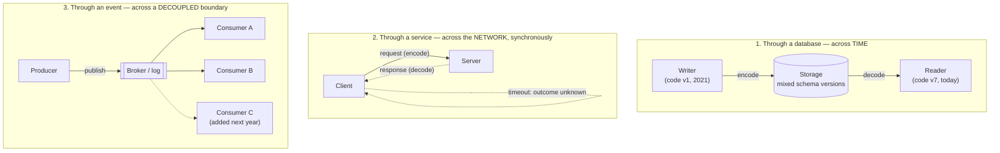

## Overview

Picking an encoding is only half the problem. Once data is a sequence of bytes, it has to *go* somewhere — into a database where a different version of your code reads it back years later, across a network to a service that answers synchronously, or onto a topic where consumers you've never heard of pick it up. Compatibility is a relationship between the process that encodes and the process that decodes, so the shape of that journey determines who has to agree on the schema, how long they have to keep agreeing, and how badly things break when they don't. [Data Encoding Formats and Schema Evolution](data-encoding-formats-and-schema-evolution) covers the byte formats themselves; this concept is about the three roads they travel.

## Three Shapes of Dataflow



The database path couples code written *at different times*. The service path couples two processes that must both be up *right now*. The event path couples a producer to a set of consumers it never learns the identity of. Each one puts the compatibility burden somewhere different.

## Dataflow Through Databases: A Message to Your Future Self

In a database, the writer encodes and the reader decodes — and sometimes the reader is simply a later version of the same process. Storing a row is sending a message to your future self, which makes **backward compatibility** (new code reads old data) non-negotiable: without it, next year's deploy can't read this year's writes.

The less obvious half is that **forward compatibility** (old code reads new data) is usually required too, and not because of some cross-team integration. During a rolling upgrade, some instances of *your own service* are running the new code and some the old, against the same database. A row written by a v8 instance will be read by a v7 instance that's still alive. The one team, one service, one schema assumption doesn't save you — the deploy itself creates two concurrent readers.

The other thing that makes databases distinctive is that **data outlives code**. When you deploy, the old binary is gone in minutes. The five-year-old rows are still there, in their original encoding, unless something explicitly rewrote them. Most systems avoid that rewrite:

- LSM-tree storage engines rewrite records into the current format lazily, during compaction.
- Relational databases allow cheap schema changes — adding a nullable column, say — without touching existing rows; a read of an old row just materializes `NULL` for the missing column.

Schema evolution makes the whole database *look* like it was encoded with one schema even though the bytes on disk span a decade of versions. That illusion holds for simple additive changes. It breaks for structural ones — turning a single-valued attribute into a list, splitting a table — which still require an application-level migration, and keeping forward and backward compatibility intact across such a migration is genuinely hard.

One important exception: a **snapshot or data dump** is written in one pass and is immutable afterward, so it's normally encoded entirely in the latest schema. Since you're copying everything anyway, you might as well normalize the encoding — and pick a format suited to whoever reads it next (an Avro container file for archival, or a column-oriented format like Parquet if the destination is analytics).

The dangerous pattern here is **field-dropping round trips**: old code reads a record, doesn't recognize a field the new code added, and writes the record back without it. The write silently destroys data that neither side ever asked to delete. Preserving unknown fields through a decode/re-encode cycle is a property of the encoding library, and you have to check that yours does it.

## Dataflow Through Services: REST and RPC

The client-server split is the most common way two processes talk over a network: the server exposes an API, clients call it. Unlike a database, which accepts arbitrary queries in a query language, a service exposes only what its business logic chooses to expose — that restriction *is* the encapsulation, and it's what lets a service team change its internals freely.

That freedom is also the constraint. The point of a service-oriented architecture is that each service is owned by one team and deployable without cross-team coordination, which means **old and new versions of clients and servers are running simultaneously, by design**. There's one useful simplifying assumption here, though: you generally control deploy order and roll out servers before clients. So for services you need backward compatibility on *requests* (new server understands old client's request) and forward compatibility on *responses* (old client tolerates new server's extra fields) — a weaker requirement than the both-directions-always demand a database imposes.

**REST** is the dominant design philosophy, and it's HTTP-native rather than HTTP-tunneling: URLs identify resources, methods carry the verb, and existing HTTP machinery for caching, authentication, and content negotiation is used rather than reinvented. Clients still need to know which endpoints exist and what shapes go over the wire, which is what an IDL is for — **OpenAPI** for JSON-over-HTTP services, **Protocol Buffers** for gRPC. Both generate client SDKs, documentation, and, importantly, can **verify schema-change compatibility in CI** so you find out you broke a client before your clients do.

### Why Location Transparency Leaks

**RPC** takes a different stance: make a remote call look exactly like a local function call. That's *location transparency*, and it's the idea behind a long line of technologies — CORBA, DCOM, Java RMI, EJB, SOAP — most of which are remembered mainly for how badly they went. The abstraction is not merely leaky; it's actively misleading, because a network call differs from a local call in ways the syntax hides:

- **Failure is outside your control.** A local call fails based on its arguments. A remote call fails because a switch dropped a packet or the remote box is paging.
- **There's a third outcome.** A local call returns, throws, or hangs. A remote call can also *time out*, which means you don't know whether it happened. That's not an error, it's an absence of information.
- **Retrying can double-execute.** If the request landed and only the response was lost, a retry runs the action twice — unless the protocol carries an idempotency key or dedup mechanism. Local calls never have this problem, so an API modeled on local calls never provides the mechanism.
- **Latency is wildly variable.** Sub-millisecond when things are calm, seconds when the network is congested — for the exact same call.
- **Arguments must be serialized.** You can pass a pointer to a local function. Over a network everything is copied, which is fine for a small struct and awful for a large mutable object graph.
- **Types don't line up across languages.** The framework has to translate, and languages don't agree (JavaScript's 64-bit integer handling being the standard cautionary tale).

[The Trouble with Distributed Systems](distributed-systems-partial-failures) goes into the consequences properly. The design lesson for dataflow is narrower: don't dress a remote call up as a local one. Part of REST's appeal is precisely that it *doesn't* — a state transfer over a network is visibly a different kind of operation than a method call, and the code that calls it is more likely to handle timeouts, retries, and idempotency because nothing pretended those weren't needed.

Modern RPC frameworks like gRPC haven't abandoned the model, but they've stopped selling the illusion: deadlines, retry policies, and streaming are first-class, explicit parts of the API rather than hidden behind a function signature.

The other service-specific compatibility wrinkle is **who you can force to upgrade**. Inside your organization, you can chase down every caller. For a public API, the provider has no control over clients and can't make them move, so compatibility has to hold for years — sometimes indefinitely — and a genuinely breaking change means running multiple API versions side by side. There's no industry agreement on how versions should be signaled: a version segment in the URL, an `Accept` header, or a per-API-key pinned version stored server-side and changed through an admin interface are all in wide use.

## Durable Execution and Workflows

Once an operation spans several services, you have a **workflow**: a graph of **tasks** (Temporal calls them *activities*; other frameworks say *durable functions*). Charging a payment might mean calling fraud detection, then the card processor, then the bank. A **workflow engine** decides when and where each task runs, what happens when one fails, and how much runs in parallel — typically split into an *orchestrator* that schedules and an *executor* that runs.

The class of engine worth understanding here is the **durable execution** framework — Temporal, Restate, and in a managed-service form AWS Step Functions. The problem they solve is that you cannot wrap "debit the card" and "deposit to the bank" in a database transaction. They're separate systems, one of them is a third party, and a crash between the two leaves money charged and never deposited.

The promise is that you write the process as ordinary sequential code:

```python
@workflow.defn
class PaymentWorkflow:
    @workflow.run
    async def run(self, payment: PaymentRequest) -> PaymentResult:
        is_fraud = await workflow.execute_activity(
            check_fraud, payment,
            start_to_close_timeout=timedelta(seconds=15),
        )
        if is_fraud:
            return PaymentResultFraudulent
        card_response = await workflow.execute_activity(
            debit_credit_card, payment,
            start_to_close_timeout=timedelta(seconds=15),
        )
        # ... deposit, notify, etc.
```

There is no state machine to hand-roll, no "which step am I on" column, no resume logic. The framework provides it by **logging every RPC call and state change to durable storage**, write-ahead-log style. If the process crashes after the fraud check but before the card debit, the workflow is rescheduled — possibly on a different machine — and the code runs *from the top again*, except that `check_fraud` doesn't actually re-execute. The framework recognizes the call, skips it, and returns the recorded result. Execution fast-forwards through everything already done and picks up at the first step that hasn't completed. From the business's point of view, the workflow ran exactly once even though the code body ran three times.

That mechanism dictates the constraints, and they're sharper than the "it's just normal code" pitch suggests:

- **Replay must be deterministic.** Same inputs, same sequence of calls, every time. `random()`, `now()`, and reading a mutable global are all landmines — the framework supplies deterministic replacements and you have to remember to use them. Temporal ships static analysis (Workflow Check) to catch violations.
- **The call log is positional, so editing a running workflow's code is dangerous.** Reordering two activities can make a replay diverge from its history into undefined behavior. The safe practice is to deploy the changed workflow as a **new version** so in-flight executions finish on the old code and only new executions get the new code.
- **External services must still be idempotent.** The framework can suppress a duplicate *inside* its own boundary. It cannot un-charge a third-party gateway. Every external call needs a stable, unique idempotency key that you supply.

Durable execution doesn't remove the distributed-systems problems from the RPC section. It gives you a place to put the retry, resume, and exactly-once bookkeeping so it isn't scattered through your business logic.

## Event-Driven Architectures

The last mode inverts the direction of knowledge. Instead of a caller invoking a named recipient and waiting, a producer publishes an **event** to a **message broker** and moves on. Delivery is asynchronous; the producer doesn't block on processing, and doesn't learn the outcome. (You can build a request/response pattern on top by having the sender wait on a reply channel — but that's opting back into synchronous coupling, not the default.)

[Message Brokers: Queues vs. Log-Based Streaming](message-brokers-queues-vs-logs) covers the mechanics — queue versus topic, acknowledgments versus offsets, retention, replay, ordering guarantees. What matters *as a dataflow pattern* is the coupling profile, and it's genuinely different from the other two:

- **The producer doesn't know who consumes.** It publishes `OrderPlaced` and is done. Adding a fraud-scoring consumer, an analytics consumer, and an email consumer next quarter requires no change to the producer and no deployment coordination with it.
- **Service discovery mostly evaporates.** The sender needs the broker's address, not the recipient's. There's no IP to resolve, no health check to wire, no direct dependency to break when the consumer is redeployed.
- **The broker is a buffer.** A consumer that's down or overloaded doesn't propagate failure back to the producer — messages pile up and are delivered when it recovers, and crashed consumers get redelivery instead of silent loss.
- **One event, many recipients.** Fan-out is native rather than an N-way call loop in the producer.

The bill for that decoupling comes due in three places. **Eventual consistency**: the moment the producer's transaction commits, downstream state is stale, and "stale for how long" is a function of consumer lag rather than anything the producer controls — so read-your-own-writes across an event boundary needs deliberate handling. **Tracing**: an RPC failure gives you a stack of caller frames; an event failure gives you a message and no caller, so you need explicit correlation/trace IDs propagated through the payload, and even then a request's causal graph is reconstructed after the fact rather than observed directly. **Nobody owns the contract**: with an RPC API the consumer list is at least discoverable, whereas an event schema is read by parties the producer can't enumerate — which is why a **schema registry** alongside the broker (validating that each new schema version is compatible with the ones already in the topic) tends to be non-optional at scale rather than a nicety. **AsyncAPI** plays the OpenAPI role for message schemas.

Brokers don't impose a data model — a message is bytes plus metadata — so the encoding choice is yours, typically Protobuf, Avro, or JSON. And the field-dropping hazard from the database section reappears verbatim: a consumer that reads an event, transforms it, and republishes to another topic will silently strip fields it doesn't know about unless the encoding preserves unknowns.

A related design point: **distributed actor frameworks** (Akka, Orleans, Erlang/OTP) fold the broker into the programming model, and location transparency works far better there than in RPC — precisely because the actor model already assumes messages can be lost even locally. The abstraction isn't lying about what can go wrong. Rolling upgrades still demand both compatibility directions, since a new-version node will send messages to an old-version node and back.

## Trade-offs

- **A database demands both compatibility directions; a service usually needs only one each way** — because data outlives code, a database read can hit a record written by any historical version, while a service can lean on the deploy-servers-before-clients ordering to need only backward compatibility on requests and forward compatibility on responses. That makes database schema evolution the strictest of the three regimes, even inside a single team's single service.
- **REST's refusal to hide the network is a feature, not a limitation** — RPC's location transparency makes remote calls syntactically cheap and therefore encourages calling them like local functions, which is exactly how you end up with no timeout, no retry policy, and no idempotency key. Explicit state transfer produces uglier code that fails better.
- **Durable execution buys crash-resumability at the cost of determinism constraints on your code** — the replay mechanism that lets a workflow survive a mid-flight crash also forbids clocks, randomness, and reordering of steps in a running workflow, and it can't make third-party calls idempotent for you. You trade "write plain code" for "write plain code that obeys rules the type system won't enforce."
- **Event-driven decoupling moves complexity from the producer to the operator** — the producer's dependency list shrinks to just the broker, and consumers evolve independently, but end-to-end reasoning ("did this order actually get emailed?") stops being a stack trace and becomes a distributed-tracing problem you must build for deliberately.
- **Asynchrony converts availability problems into latency problems, which is usually but not always the better failure** — a broker buffering for a downed consumer beats an RPC cascade failure, but for anything the user is waiting on synchronously, "eventually" is indistinguishable from "broken," so a fire-and-forget event is the wrong shape for a request that needs an answer.
- **Every mode needs a schema contract; only some of them let you enforce it** — OpenAPI and Protobuf definitions can be compatibility-checked in CI against the previous version, and a schema registry does the same for topics, but a database's on-disk records and an unregistered JSON topic have no such gate, so violations show up as production decode errors instead of failed builds.

## Interview Questions

- Your service is deployed with a rolling upgrade against a single shared database, and the new version adds a field. Why is backward compatibility alone insufficient here, and what specifically goes wrong if the old version reads and rewrites a new-version record?
- Why can a service API get away with weaker compatibility guarantees than a database schema, and what deployment assumption is that argument resting on? When does the assumption fail?
- A colleague argues that gRPC makes remote calls "just like local calls" so the team can drop explicit timeout handling. Give the three concrete outcomes a network call can produce that a local call cannot, and say what each one requires from the caller.
- A durable execution workflow has been running for six hours when you need to ship a fix that reorders two of its steps. Why is editing the workflow code in place unsafe, and what's the correct deployment strategy?
- You're deciding between having the order service call the email service directly over HTTP versus publishing an `OrderPlaced` event. Name what each choice makes easy and what it makes hard, and identify which failure mode you'd be trading for which.

## References

- [Martin Kleppmann, "Designing Data-Intensive Applications", 2nd Edition (O'Reilly) — Chapter 5, "Encoding and Evolution", section "Modes of Dataflow"](https://www.oreilly.com/library/view/designing-data-intensive-applications/9781098119058/)
- [Temporal Documentation — Understanding Temporal: Durable Execution](https://docs.temporal.io/evaluate/understanding-temporal)
- [AWS Documentation — What is AWS Step Functions?](https://docs.aws.amazon.com/step-functions/latest/dg/welcome.html)
- [Brandur Leach (Stripe) — Designing Robust and Predictable APIs with Idempotency](https://stripe.com/blog/idempotency)
