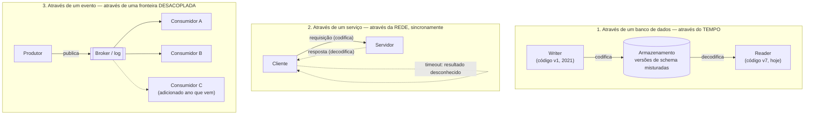

## Visão Geral

Escolher uma codificação é só metade do problema. Uma vez que os dados são uma sequência de bytes, eles precisam *ir* para algum lugar — para um banco de dados onde uma versão diferente do seu código os lê de volta anos depois, através de uma rede para um serviço que responde sincronamente, ou para um tópico onde consumidores dos quais você nunca ouviu falar os captam. Compatibilidade é uma relação entre o processo que codifica e o processo que decodifica, então a forma dessa jornada determina quem precisa concordar com o schema, por quanto tempo precisam continuar concordando, e quão mal as coisas quebram quando não concordam. [Data Encoding Formats and Schema Evolution](data-encoding-formats-and-schema-evolution) cobre os próprios formatos de bytes; este conceito trata das três estradas que eles percorrem.

## Três Formas de Dataflow



O caminho do banco de dados acopla código escrito *em momentos diferentes*. O caminho do serviço acopla dois processos que precisam estar ambos ativos *agora*. O caminho do evento acopla um produtor a um conjunto de consumidores cuja identidade ele nunca aprende. Cada um coloca o fardo da compatibilidade em um lugar diferente.

## Dataflow Através de Bancos de Dados: Uma Mensagem para Seu Eu Futuro

Em um banco de dados, o writer codifica e o reader decodifica — e às vezes o reader é simplesmente uma versão posterior do mesmo processo. Armazenar uma linha é enviar uma mensagem para seu eu futuro, o que torna a **compatibilidade retroativa** (código novo lê dados antigos) inegociável: sem ela, o deploy do próximo ano não consegue ler as escritas deste ano.

A metade menos óbvia é que a **compatibilidade progressiva** (código antigo lê dados novos) geralmente também é necessária, e não por causa de alguma integração cross-team. Durante um rolling upgrade, algumas instâncias do *seu próprio serviço* estão rodando o código novo e algumas o antigo, contra o mesmo banco de dados. Uma linha escrita por uma instância v8 será lida por uma instância v7 que ainda está viva. A suposição de "uma equipe, um serviço, um schema" não te salva — o próprio deploy cria dois leitores concorrentes.

A outra coisa que torna os bancos de dados distintos é que **os dados sobrevivem ao código**. Quando você faz deploy, o binário antigo desaparece em minutos. As linhas de cinco anos atrás ainda estão lá, em sua codificação original, a menos que algo tenha explicitamente as reescrito. A maioria dos sistemas evita essa reescrita:

- Motores de armazenamento LSM-tree reescrevem registros no formato atual de forma preguiçosa, durante a compactação.
- Bancos de dados relacionais permitem mudanças de schema baratas — adicionar uma coluna anulável, por exemplo — sem tocar em linhas existentes; uma leitura de uma linha antiga simplesmente materializa `NULL` para a coluna ausente.

A evolução de schema faz o banco de dados inteiro *parecer* que foi codificado com um único schema, mesmo que os bytes em disco abranjam uma década de versões. Essa ilusão se mantém para mudanças aditivas simples. Ela se quebra para mudanças estruturais — transformar um atributo de valor único em uma lista, dividir uma tabela — que ainda exigem uma migração em nível de aplicação, e manter a compatibilidade progressiva e retroativa intacta através de tal migração é genuinamente difícil.

Uma exceção importante: um **snapshot ou dump de dados** é escrito em uma única passagem e é imutável depois disso, então normalmente é codificado inteiramente no schema mais recente. Já que você está copiando tudo de qualquer forma, pode muito bem normalizar a codificação — e escolher um formato adequado para quem quer que o leia em seguida (um arquivo de contêiner Avro para arquivamento, ou um formato orientado a colunas como Parquet se o destino for analytics).

O padrão perigoso aqui é o **descarte de campo em ida-e-volta**: código antigo lê um registro, não reconhece um campo que o código novo adicionou, e escreve o registro de volta sem ele. A escrita destrói silenciosamente dados que nenhum dos lados jamais pediu para excluir. Preservar campos desconhecidos através de um ciclo de decodificação/recodificação é uma propriedade da biblioteca de codificação, e você tem que verificar se a sua faz isso.

## Dataflow Através de Serviços: REST e RPC

A divisão cliente-servidor é a forma mais comum de dois processos conversarem por uma rede: o servidor expõe uma API, os clientes a chamam. Diferente de um banco de dados, que aceita consultas arbitrárias em uma linguagem de consulta, um serviço expõe apenas o que sua lógica de negócio escolhe expor — essa restrição *é* o encapsulamento, e é o que permite que uma equipe de serviço mude seus internos livremente.

Essa liberdade também é a restrição. O objetivo de uma arquitetura orientada a serviços é que cada serviço seja possuído por uma equipe e implantável sem coordenação cross-team, o que significa que **versões antigas e novas de clientes e servidores estão rodando simultaneamente, por design**. Há uma suposição simplificadora útil aqui, no entanto: geralmente você controla a ordem de deploy e implanta servidores antes de clientes. Então para serviços você precisa de compatibilidade retroativa nas *requisições* (servidor novo entende a requisição do cliente antigo) e compatibilidade progressiva nas *respostas* (cliente antigo tolera os campos extras do servidor novo) — um requisito mais fraco do que a exigência de ambas-as-direções-sempre que um banco de dados impõe.

**REST** é a filosofia de design dominante, e é nativa de HTTP em vez de tunelar por HTTP: URLs identificam recursos, métodos carregam o verbo, e a maquinaria HTTP existente para cache, autenticação e negociação de conteúdo é usada em vez de reinventada. Clientes ainda precisam saber quais endpoints existem e quais formas vão pelo fio, o que é para o que serve uma IDL — **OpenAPI** para serviços JSON-sobre-HTTP, **Protocol Buffers** para gRPC. Ambos geram SDKs de cliente, documentação, e, importante, podem **verificar compatibilidade de mudança de schema em CI**, então você descobre que quebrou um cliente antes de seus clientes descobrirem.

### Por Que a Transparência de Localização Vaza

**RPC** adota uma postura diferente: fazer uma chamada remota parecer exatamente como uma chamada de função local. Isso é *transparência de localização*, e é a ideia por trás de uma longa linha de tecnologias — CORBA, DCOM, Java RMI, EJB, SOAP —, a maioria das quais é lembrada principalmente por quão mal terminaram. A abstração não é apenas com vazamentos; é ativamente enganosa, porque uma chamada de rede difere de uma chamada local de formas que a sintaxe esconde:

- **A falha está fora do seu controle.** Uma chamada local falha com base em seus argumentos. Uma chamada remota falha porque um switch descartou um pacote ou a máquina remota está fazendo paging.
- **Há um terceiro resultado.** Uma chamada local retorna, lança exceção ou trava. Uma chamada remota também pode *dar timeout*, o que significa que você não sabe se aconteceu. Isso não é um erro, é uma ausência de informação.
- **Repetir pode executar duas vezes.** Se a requisição chegou e só a resposta foi perdida, uma repetição executa a ação duas vezes — a menos que o protocolo carregue uma chave de idempotência ou mecanismo de deduplicação. Chamadas locais nunca têm esse problema, então uma API modelada em chamadas locais nunca fornece o mecanismo.
- **A latência é extremamente variável.** Sub-milissegundo quando as coisas estão calmas, segundos quando a rede está congestionada — para exatamente a mesma chamada.
- **Argumentos precisam ser serializados.** Você pode passar um ponteiro para uma função local. Por uma rede tudo é copiado, o que é bom para uma struct pequena e péssimo para um grafo de objetos mutável grande.
- **Tipos não se alinham entre linguagens.** O framework tem que traduzir, e linguagens não concordam (o tratamento de inteiros de 64 bits do JavaScript sendo o caso de aviso padrão).

[The Trouble with Distributed Systems](distributed-systems-partial-failures) explora as consequências apropriadamente. A lição de design para dataflow é mais estreita: não vista uma chamada remota de local. Parte do apelo do REST é precisamente que ele *não faz isso* — uma transferência de estado por rede é visivelmente um tipo diferente de operação do que uma chamada de método, e o código que a chama tem mais probabilidade de tratar timeouts, retries e idempotência porque nada fingiu que não eram necessários.

Frameworks RPC modernos como o gRPC não abandonaram o modelo, mas pararam de vender a ilusão: deadlines, políticas de retry e streaming são partes explícitas e de primeira classe da API em vez de escondidas atrás de uma assinatura de função.

A outra ruga de compatibilidade específica de serviços é **quem você pode forçar a atualizar**. Dentro da sua organização, você pode perseguir todo chamador. Para uma API pública, o provedor não tem controle sobre os clientes e não pode fazê-los se mover, então a compatibilidade tem que se manter por anos — às vezes indefinidamente — e uma mudança genuinamente quebradora significa rodar múltiplas versões de API lado a lado. Não há acordo da indústria sobre como as versões devem ser sinalizadas: um segmento de versão na URL, um header `Accept`, ou uma versão fixada por chave de API armazenada no lado do servidor e mudada por uma interface administrativa estão todos em uso amplo.

## Execução Durável e Workflows

Uma vez que uma operação abrange vários serviços, você tem um **workflow**: um grafo de **tarefas** (o Temporal as chama de *activities*; outros frameworks dizem *durable functions*). Cobrar um pagamento pode significar chamar detecção de fraude, depois o processador de cartão, depois o banco. Um **workflow engine** decide quando e onde cada tarefa é executada, o que acontece quando uma falha, e quanto roda em paralelo — tipicamente dividido em um *orquestrador* que agenda e um *executor* que executa.

A classe de engine que vale a pena entender aqui é o framework de **execução durável** — Temporal, Restate, e em forma de serviço gerenciado o AWS Step Functions. O problema que eles resolvem é que você não pode envolver "debitar o cartão" e "depositar no banco" em uma transação de banco de dados. São sistemas separados, um deles é terceiro, e uma falha entre os dois deixa dinheiro cobrado e nunca depositado.

A promessa é que você escreve o processo como código sequencial comum:

```python
@workflow.defn
class PaymentWorkflow:
    @workflow.run
    async def run(self, payment: PaymentRequest) -> PaymentResult:
        is_fraud = await workflow.execute_activity(
            check_fraud, payment,
            start_to_close_timeout=timedelta(seconds=15),
        )
        if is_fraud:
            return PaymentResultFraudulent
        card_response = await workflow.execute_activity(
            debit_credit_card, payment,
            start_to_close_timeout=timedelta(seconds=15),
        )
        # ... depositar, notificar, etc.
```

Não há máquina de estados para construir manualmente, nenhuma coluna "em qual passo estou", nenhuma lógica de retomada. O framework a fornece **registrando cada chamada RPC e mudança de estado em armazenamento durável**, estilo write-ahead-log. Se o processo falha após a checagem de fraude mas antes do débito do cartão, o workflow é reagendado — possivelmente em uma máquina diferente —, e o código roda *do início novamente*, exceto que `check_fraud` não é de fato reexecutado. O framework reconhece a chamada, a pula, e retorna o resultado gravado. A execução avança rapidamente por tudo que já foi feito e retoma no primeiro passo que não foi concluído. Do ponto de vista do negócio, o workflow rodou exatamente uma vez mesmo que o corpo do código tenha rodado três vezes.

Esse mecanismo dita as restrições, e elas são mais afiadas do que o discurso de "é só código normal" sugere:

- **O replay tem que ser determinístico.** Mesmas entradas, mesma sequência de chamadas, sempre. `random()`, `now()`, e ler um global mutável são todas minas terrestres — o framework fornece substitutos determinísticos e você tem que lembrar de usá-los. O Temporal disponibiliza análise estática (Workflow Check) para pegar violações.
- **O log de chamadas é posicional, então editar o código de um workflow em execução é perigoso.** Reordenar duas atividades pode fazer um replay divergir de seu histórico para comportamento indefinido. A prática segura é implantar o workflow alterado como uma **nova versão** para que execuções em andamento terminem no código antigo e só novas execuções recebam o código novo.
- **Serviços externos ainda precisam ser idempotentes.** O framework pode suprimir uma duplicata *dentro* de sua própria fronteira. Ele não consegue desfazer uma cobrança em um gateway de terceiros. Toda chamada externa precisa de uma chave de idempotência estável e única que você fornece.

A execução durável não remove os problemas de sistemas distribuídos da seção de RPC. Ela te dá um lugar para colocar a contabilidade de retry, retomada e exactly-once para que não fique espalhada pela sua lógica de negócio.

## Arquiteturas Orientadas a Eventos

O último modo inverte a direção do conhecimento. Em vez de um chamador invocar um destinatário nomeado e esperar, um produtor publica um **evento** em um **message broker** e segue em frente. A entrega é assíncrona; o produtor não bloqueia no processamento, e não aprende o resultado. (Você pode construir um padrão de requisição/resposta em cima disso fazendo o remetente esperar em um canal de resposta — mas isso é optar de volta pelo acoplamento síncrono, não o padrão.)

[Message Brokers: Queues vs. Log-Based Streaming](message-brokers-queues-vs-logs) cobre a mecânica — fila versus tópico, confirmações versus offsets, retenção, replay, garantias de ordenação. O que importa *como padrão de dataflow* é o perfil de acoplamento, e ele é genuinamente diferente dos outros dois:

- **O produtor não sabe quem consome.** Ele publica `OrderPlaced` e está pronto. Adicionar um consumidor de pontuação de fraude, um consumidor de analytics e um consumidor de email no próximo trimestre não requer mudança no produtor nem coordenação de deploy com ele.
- **A descoberta de serviço praticamente evapora.** O remetente precisa do endereço do broker, não do destinatário. Não há IP para resolver, nenhum health check para conectar, nenhuma dependência direta para quebrar quando o consumidor é reimplantado.
- **O broker é um buffer.** Um consumidor que está fora do ar ou sobrecarregado não propaga falha de volta ao produtor — mensagens se acumulam e são entregues quando ele se recupera, e consumidores travados recebem redelivery em vez de perda silenciosa.
- **Um evento, muitos destinatários.** O fan-out é nativo em vez de um loop de chamadas a N destinatários no produtor.

A conta desse desacoplamento vence em três lugares. **Consistência eventual**: no momento em que a transação do produtor é confirmada, o estado downstream fica obsoleto, e "obsoleto por quanto tempo" é função do atraso do consumidor em vez de qualquer coisa que o produtor controle — então ler-suas-próprias-escritas através de uma fronteira de evento precisa de tratamento deliberado. **Rastreamento**: uma falha de RPC te dá uma pilha de frames de chamador; uma falha de evento te dá uma mensagem e nenhum chamador, então você precisa de IDs de correlação/trace explícitos propagados pelo payload, e mesmo assim o grafo causal de uma requisição é reconstruído depois do fato em vez de observado diretamente. **Ninguém é dono do contrato**: com uma API RPC a lista de consumidores é ao menos descobrível, enquanto um schema de evento é lido por partes que o produtor não consegue enumerar — o que é por que um **registro de schema** ao lado do broker (validando que cada nova versão de schema é compatível com as já existentes no tópico) tende a ser não-opcional em escala em vez de uma conveniência. **AsyncAPI** desempenha o papel do OpenAPI para schemas de mensagens.

Brokers não impõem um modelo de dados — uma mensagem é bytes mais metadados —, então a escolha de codificação é sua, tipicamente Protobuf, Avro ou JSON. E o risco de descarte de campo da seção de bancos de dados reaparece literalmente: um consumidor que lê um evento, o transforma, e republica em outro tópico vai silenciosamente descartar campos que não conhece a menos que a codificação preserve desconhecidos.

Um ponto de design relacionado: **frameworks de atores distribuídos** (Akka, Orleans, Erlang/OTP) dobram o broker dentro do modelo de programação, e a transparência de localização funciona muito melhor ali do que no RPC — precisamente porque o modelo de ator já assume que mensagens podem ser perdidas até localmente. A abstração não está mentindo sobre o que pode dar errado. Rolling upgrades ainda exigem ambas as direções de compatibilidade, já que um nó de nova versão enviará mensagens a um nó de versão antiga e vice-versa.

## Trade-offs

- **Um banco de dados exige ambas as direções de compatibilidade; um serviço geralmente precisa apenas de uma em cada direção** — porque os dados sobrevivem ao código, uma leitura de banco de dados pode atingir um registro escrito por qualquer versão histórica, enquanto um serviço pode se apoiar na ordenação servidores-antes-de-clientes para precisar apenas de compatibilidade retroativa em requisições e compatibilidade progressiva em respostas. Isso torna a evolução de schema de banco de dados o regime mais estrito dos três, mesmo dentro de um único serviço de uma única equipe.
- **A recusa do REST em esconder a rede é uma característica, não uma limitação** — a transparência de localização do RPC torna chamadas remotas sintaticamente baratas e portanto encoraja chamá-las como funções locais, o que é exatamente como você acaba sem timeout, sem política de retry e sem chave de idempotência. Transferência de estado explícita produz código mais feio que falha melhor.
- **Execução durável compra resumibilidade após falha ao custo de restrições de determinismo no seu código** — o mecanismo de replay que permite que um workflow sobreviva a uma falha em pleno voo também proíbe relógios, aleatoriedade e reordenação de passos em um workflow em execução, e não pode tornar chamadas de terceiros idempotentes para você. Você troca "escrever código simples" por "escrever código simples que obedece regras que o sistema de tipos não impõe".
- **O desacoplamento orientado a eventos move complexidade do produtor para o operador** — a lista de dependências do produtor encolhe para apenas o broker, e consumidores evoluem independentemente, mas raciocínio de ponta a ponta ("esse pedido realmente foi enviado por email?") deixa de ser um stack trace e vira um problema de rastreamento distribuído que você precisa construir deliberadamente.
- **A assincronia converte problemas de disponibilidade em problemas de latência, o que geralmente mas nem sempre é a falha melhor** — um broker fazendo buffer para um consumidor caído vence uma falha em cascata de RPC, mas para qualquer coisa que o usuário está esperando sincronamente, "eventualmente" é indistinguível de "quebrado", então um evento de dispare-e-esqueça é a forma errada para uma requisição que precisa de uma resposta.
- **Todo modo precisa de um contrato de schema; só alguns deles permitem que você o imponha** — definições de OpenAPI e Protobuf podem ser verificadas quanto à compatibilidade em CI contra a versão anterior, e um registro de schema faz o mesmo para tópicos, mas os registros em disco de um banco de dados e um tópico JSON não registrado não têm tal barreira, então violações aparecem como erros de decodificação em produção em vez de builds falhados.

## Perguntas de Entrevista

- Seu serviço é implantado com um rolling upgrade contra um único banco de dados compartilhado, e a versão nova adiciona um campo. Por que a compatibilidade retroativa sozinha é insuficiente aqui, e o que especificamente dá errado se a versão antiga lê e reescreve um registro da versão nova?
- Por que uma API de serviço pode se safar com garantias de compatibilidade mais fracas do que um schema de banco de dados, e em qual suposição de deploy esse argumento se apoia? Quando a suposição falha?
- Um colega argumenta que o gRPC torna chamadas remotas "exatamente como chamadas locais" para que a equipe possa remover o tratamento explícito de timeout. Dê os três resultados concretos que uma chamada de rede pode produzir que uma chamada local não pode, e diga o que cada um exige do chamador.
- Um workflow de execução durável está rodando há seis horas quando você precisa lançar uma correção que reordena dois de seus passos. Por que editar o código do workflow no lugar é inseguro, e qual é a estratégia de deploy correta?
- Você está decidindo entre fazer o serviço de pedidos chamar o serviço de email diretamente via HTTP versus publicar um evento `OrderPlaced`. Nomeie o que cada escolha facilita e o que dificulta, e identifique qual modo de falha você estaria trocando por qual.

## Referências

- [Martin Kleppmann, "Designing Data-Intensive Applications", 2nd Edition (O'Reilly) — Capítulo 5, "Encoding and Evolution", seção "Modes of Dataflow"](https://www.oreilly.com/library/view/designing-data-intensive-applications/9781098119058/)
- [Temporal Documentation — Understanding Temporal: Durable Execution](https://docs.temporal.io/evaluate/understanding-temporal)
- [AWS Documentation — What is AWS Step Functions?](https://docs.aws.amazon.com/step-functions/latest/dg/welcome.html)
- [Brandur Leach (Stripe) — Designing Robust and Predictable APIs with Idempotency](https://stripe.com/blog/idempotency)
