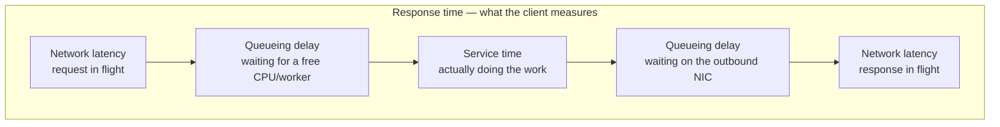

## Overview

Response time is not a number — it's a **distribution**. The same request, issued repeatedly against the same system, will take a different amount of time on every attempt, because garbage collection pauses, context switches, TCP retransmissions, page faults, and above all *queueing* add random delay. Reporting the arithmetic mean of that distribution collapses it into a single value that no particular user necessarily experienced and that systematically hides your slowest users. Percentiles are the fix: they describe the shape of the distribution, and they let you say something falsifiable about how long users actually wait.

## Latency Is Not Response Time

The two terms get used interchangeably in casual conversation, but they mean different things, and the distinction is the whole reason performance numbers are hard to reason about:

- **Response time** is what the client sees: the elapsed time from issuing a request until the answer is in hand. It includes *all* delays incurred anywhere in the system.
- **Service time** is the duration for which the service is actively processing the request.
- **Queueing delay** is time spent waiting for a resource to become free — waiting for a CPU core after the request has already been received, or waiting for the outbound network interface to drain before the response packet can go out.
- **Latency** is the catchall for time during which a request is *not being actively processed* — during which it is latent. **Network latency** specifically is the time the request and response spend traveling over the wire.



Queueing delay is not a rounding error — it usually accounts for the *majority* of the variability in response times, and it grows sharply as throughput approaches hardware capacity. A server can only process a handful of requests genuinely in parallel (bounded by cores, worker threads, connection pool size), so it takes just a few slow requests to hold up everything queued behind them. That's **head-of-line blocking**: a request with a 2 ms service time can still show a 300 ms response time because it sat behind someone else's slow query.

The practical consequence is a measurement rule: **queueing delay is not part of service time, so you must measure response times on the client side.** A server that reports "p99 = 15 ms" from inside its own request handler is reporting service time and is blind to the queue it is sitting behind. Systems under overload look healthy in server-side metrics right up until users are timing out.

## Why Averages Lie

Take a service that handled 1,000 requests in the last minute:

```
 count   response time    cumulative     running
                          count          percentile
 -----   -------------    ----------     ----------
   700       60 ms            700          70.0%
   200      150 ms            900          90.0%
    70      400 ms            970          97.0%   <- p95 lands here
    25      900 ms            995          99.5%   <- p99 lands here
     4    2,000 ms            999          99.9%   <- p999 lands here
     1    5,000 ms          1,000         100.0%
 -----   -------------
 1,000    mean = 135.5 ms
```

"Our average response time is 135 ms" is a true statement and a useless one. Notice what it hides:

- **900 of 1,000 requests were faster than the average.** The mean was dragged up by a small tail, so it doesn't describe the typical experience — the median (60 ms) does.
- **30 users waited 900 ms or longer**, and one waited five full seconds. That's 3% of your traffic having a visibly bad time, invisible in the headline number.
- Kill the single 5,000 ms outlier and the mean drops to 130.6 ms — a 4% "improvement" driven entirely by one request. Means are unstable under exactly the outliers you care most about.

The mean is genuinely useful for one thing: estimating throughput and capacity, since total work is a sum. It is a poor answer to "how long does a user typically wait?"

## Percentiles

Sort every response time from fastest to slowest and pick the value at a given position:

- **p50 (median)** — half of requests are faster, half slower. This is the honest answer to "how long does a typical user wait?" Above: **60 ms**.
- **p95** — 95 out of 100 requests are faster than this; 5 out of 100 are this slow or slower. Above: **400 ms**.
- **p99** — the slowest 1 in 100. Above: **900 ms**.
- **p999** — the slowest 1 in 1,000. Above: **2,000 ms**.

High percentiles are called **tail latencies**, and they matter far more than their headline frequency suggests. Amazon famously specifies internal service response times at the 99.9th percentile even though it affects only 1 request in 1,000 — because the slowest requests tend to be the ones with the most data to process, which means the accounts with the longest purchase history, which means the most valuable customers. The tail is not a random sample of your users; it is biased toward your heaviest ones.

Volume makes this concrete. At 10,000 requests per second, "only 0.1% of requests are slow" is **10 slow requests every second**, 864,000 per day. Nobody experiences your p50; a large absolute number of people experience your p999 every single day.

There is a point of diminishing returns. Amazon judged optimizing p9999 (the slowest 1 in 10,000) not worth the cost: at that depth the numbers are dominated by random events outside your control — a rack vibration, a neighbor's GC pause, a retransmitted packet — and the engineering effort buys progressively less.

## Tail Latency Amplification

Here is why tail latency is disproportionately dangerous: modern pages fan out. A single end-user request triggers many backend calls, and even when they run in parallel, **the page is as slow as its slowest call.** One unlucky call ruins the whole response.

If each backend call independently has a 1% chance of exceeding its p99, the probability that a page load escapes cleanly is `0.99^N`:

```
 backend calls per page    P(all calls under p99)    P(page hits the tail)
 ----------------------    ----------------------    ---------------------
           1                       99.0%                      1.0%
          10                       90.4%                      9.6%
          20                       81.8%                     18.2%
         100                       36.6%                     63.4%
```

A page that fans out to 100 services turns a 1-in-100 backend event into a **majority** of page loads. This is **tail latency amplification**, and it inverts the usual intuition: at fan-out scale, the p99 of your dependencies becomes the p50 of your product. It also means shaving your own service's median buys you very little if you're one of a hundred callees — the leverage is entirely in the tail.

Mitigations are architectural rather than statistical. Reduce fan-out where you can. Set aggressive per-call timeouts with a degraded fallback so one slow dependency can't hold the response hostage. **Hedged requests** — issuing a duplicate request to a second replica once the first exceeds, say, its p95, and taking whichever answer arrives first — trade a few percent of extra load for a dramatically tighter tail, and depend on the routing layer being able to steer to a healthy replica (see [Load Balancing Strategies](load-balancing-strategies)). Keeping utilization comfortably below capacity is itself a tail-latency strategy, since queueing delay explodes non-linearly near saturation; [Rate Limiting](rate-limiting) and load shedding exist partly to keep you off that cliff.

## Percentiles in SLOs, SLAs, and Monitoring

Percentiles are the natural vocabulary for **service level objectives**. An SLO might state: median response time under 200 ms, p99 under 1 second, and at least 99.9% of valid requests returning non-error responses. An **SLA** is the contract wrapping that objective, specifying consequences — service credits, refunds — when it isn't met. Writing an SLO as "average response time under 500 ms" is nearly unenforceable: a provider can meet it while a meaningful slice of your traffic times out.

Computing percentiles continuously is its own problem. The naive approach — retain every response time in a rolling 10-minute window and sort it each minute — works until volume makes it expensive. Production systems use approximate streaming estimators: **HdrHistogram**, **t-digest**, **OpenHistogram**, **DDSketch**, or Prometheus histogram buckets. See [Designing a Metrics Monitoring and Alerting System](metrics-monitoring-and-alerting-system) for how this pipeline is built end to end.

One rule deserves to be stated flatly, because violating it is extremely common: **you cannot average percentiles.** The mean of the p99s reported by ten servers is not the fleet p99, and neither is the mean of a p99 series downsampled from 1-minute to 1-hour resolution. Percentiles are not additive. The correct aggregation is to **add the histograms** — merge the underlying bucket counts, then compute the percentile from the merged distribution. This is exactly why Prometheus recommends `histogram_quantile()` over a summary's precomputed per-instance quantiles: histogram buckets can be summed across instances, precomputed quantiles cannot.

## Trade-offs

- **The mean is the right tool for capacity, the wrong tool for user experience** — total work is a sum, so means feed throughput and cost models well; but a mean is unstable under outliers and describes no particular user, which is why it belongs on a capacity dashboard and never in an SLO.
- **Higher percentiles describe more users' pain but are noisier and costlier to fix** — p999 captures your heaviest, most valuable customers, yet it's driven by events largely outside your control (GC, packet loss, noisy neighbors), so past roughly p999 the effort curve steepens sharply while the benefit flattens.
- **Client-side measurement is accurate; server-side measurement is convenient** — instrumenting inside the request handler misses queueing delay and network time entirely, so it flatters you exactly when the system is overloaded; client-side instrumentation sees the truth but mixes in the client's own network conditions, which you can't fix.
- **Approximate percentile sketches trade exactness for tractability** — HdrHistogram, t-digest, and DDSketch give you bounded-error percentiles at fixed memory cost instead of retaining and sorting every sample, which is nearly always the right trade at production volume, but the reported p99 is an estimate and its error bound depends on bucket configuration.
- **Averaging percentiles is cheap and mathematically meaningless** — every dashboard that downsamples a p99 series or averages p99 across instances is producing a number with no defined interpretation; adding histograms and recomputing is the correct alternative, and it requires exporting bucket counts rather than precomputed quantiles.
- **Load generators that wait for a response systematically understate the tail** — if your benchmark client stalls while the system is slow instead of issuing requests on schedule, it never records the requests a real user would have queued during the stall (coordinated omission), so the measured p99 can be off by orders of magnitude.

## Interview Questions

- A service reports p99 = 20 ms from inside its own request handler, but users report multi-second page loads. What measurement mistake is most likely, and what would you instrument instead?
- Your mean response time is 120 ms and your p99 is 3 seconds. What does the shape of that distribution tell you, and what class of cause would you investigate first?
- A product page issues 40 parallel backend calls. Each backend has a p99 of 500 ms. Roughly what fraction of page loads will contain at least one call over 500 ms, and what does that imply about where to spend optimization effort?
- Your monitoring system stores a per-instance p99 every 10 seconds. A colleague builds a fleet-wide hourly p99 by averaging those values. Why is the resulting number meaningless, and what would you export instead?
- Why would a team deliberately target p999 rather than p9999 for internal service SLOs, and what changes about the cost/benefit at that depth?

## References

- [Martin Kleppmann, "Designing Data-Intensive Applications", 2nd Edition (O'Reilly) — Chapter 2, "Defining Nonfunctional Requirements", section "Describing Performance"](https://www.oreilly.com/library/view/designing-data-intensive-applications/9781098119058/)
- [Jeffrey Dean and Luiz André Barroso — "The Tail at Scale", Communications of the ACM 56(2), 2013](https://research.google/pubs/the-tail-at-scale/)
- [Google SRE Book — Chapter 4: Service Level Objectives](https://sre.google/sre-book/service-level-objectives/)
- [Prometheus Documentation — Histograms and Summaries](https://prometheus.io/docs/practices/histograms/)
