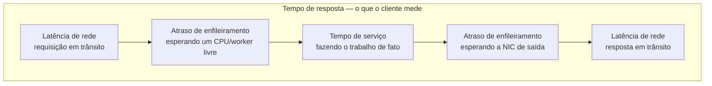

## Visão Geral

Tempo de resposta não é um número — é uma **distribuição**. A mesma requisição, emitida repetidamente contra o mesmo sistema, vai levar uma quantidade diferente de tempo a cada tentativa, porque pausas de garbage collection, trocas de contexto, retransmissões TCP, page faults e, acima de tudo, **enfileiramento**, adicionam atraso aleatório. Reportar a média aritmética dessa distribuição a colapsa em um único valor que nenhum usuário em particular necessariamente vivenciou e que sistematicamente esconde seus usuários mais lentos. Percentis são a correção: eles descrevem a forma da distribuição, e permitem que você diga algo falseável sobre quanto tempo os usuários realmente esperam.

## Latência Não É Tempo de Resposta

Os dois termos são usados de forma intercambiável em conversas casuais, mas significam coisas diferentes, e a distinção é a razão inteira pela qual números de performance são difíceis de raciocinar:

- **Tempo de resposta** é o que o cliente vê: o tempo decorrido desde emitir uma requisição até ter a resposta em mãos. Inclui *todos* os atrasos incorridos em qualquer lugar do sistema.
- **Tempo de serviço** é a duração durante a qual o serviço está ativamente processando a requisição.
- **Atraso de enfileiramento** é tempo gasto esperando um recurso ficar livre — esperar por um núcleo de CPU depois que a requisição já foi recebida, ou esperar a interface de rede de saída esvaziar antes que o pacote de resposta possa sair.
- **Latência** é o termo genérico para o tempo durante o qual uma requisição *não está sendo ativamente processada* — durante o qual está latente. A **latência de rede** especificamente é o tempo que a requisição e a resposta passam viajando pelo fio.



O atraso de enfileiramento não é um erro de arredondamento — ele geralmente responde pela *maioria* da variabilidade nos tempos de resposta, e cresce acentuadamente à medida que a vazão se aproxima da capacidade do hardware. Um servidor só consegue processar umas poucas requisições genuinamente em paralelo (limitado por núcleos, threads de worker, tamanho do pool de conexões), então bastam poucas requisições lentas para segurar tudo que está enfileirado atrás delas. Isso é **bloqueio na cabeça da fila** (head-of-line blocking): uma requisição com tempo de serviço de 2 ms ainda pode mostrar um tempo de resposta de 300 ms porque ficou atrás da consulta lenta de outra pessoa.

A consequência prática é uma regra de medição: **o atraso de enfileiramento não é parte do tempo de serviço, então você deve medir tempos de resposta no lado do cliente.** Um servidor que reporta "p99 = 15 ms" de dentro de seu próprio handler de requisição está reportando tempo de serviço e é cego para a fila em que está sentado atrás. Sistemas sobrecarregados parecem saudáveis em métricas do lado do servidor até o exato momento em que usuários começam a dar timeout.

## Por Que as Médias Mentem

Considere um serviço que atendeu 1.000 requisições no último minuto:

```
 contagem  tempo de resposta   contagem      percentil
                               acumulada     corrente
 --------  -----------------   ----------    ----------
   700       60 ms                700           70.0%
   200      150 ms                900           90.0%
    70      400 ms                970           97.0%   <- p95 fica aqui
    25      900 ms                995           99.5%   <- p99 fica aqui
     4    2.000 ms                999           99.9%   <- p999 fica aqui
     1    5.000 ms              1.000          100.0%
 --------  -----------------
 1.000    média = 135,5 ms
```

"Nosso tempo médio de resposta é 135 ms" é uma afirmação verdadeira e inútil. Note o que ela esconde:

- **900 de 1.000 requisições foram mais rápidas que a média.** A média foi puxada para cima por uma pequena cauda, então ela não descreve a experiência típica — a mediana (60 ms) descreve.
- **30 usuários esperaram 900 ms ou mais**, e um esperou cinco segundos inteiros. Isso é 3% do seu tráfego tendo uma experiência visivelmente ruim, invisível no número principal.
- Elimine o único outlier de 5.000 ms e a média cai para 130,6 ms — uma "melhora" de 4% causada inteiramente por uma requisição. Médias são instáveis exatamente sob os outliers com os quais você mais se importa.

A média é genuinamente útil para uma coisa: estimar vazão e capacidade, já que o trabalho total é uma soma. É uma resposta pobre para "quanto tempo um usuário tipicamente espera?".

## Percentis

Ordene todo tempo de resposta do mais rápido para o mais lento e escolha o valor em uma dada posição:

- **p50 (mediana)** — metade das requisições são mais rápidas, metade mais lentas. Essa é a resposta honesta para "quanto tempo um usuário típico espera?". Acima: **60 ms**.
- **p95** — 95 em cada 100 requisições são mais rápidas que isso; 5 em cada 100 são tão lentas ou mais. Acima: **400 ms**.
- **p99** — as 1 em 100 mais lentas. Acima: **900 ms**.
- **p999** — as 1 em 1.000 mais lentas. Acima: **2.000 ms**.

Percentis altos são chamados de **latências de cauda**, e importam muito mais do que sua frequência principal sugere. A Amazon é famosa por especificar tempos de resposta de serviços internos no 99,9º percentil mesmo que isso afete apenas 1 requisição em 1.000 — porque as requisições mais lentas tendem a ser as com mais dados para processar, o que significa as contas com o histórico de compra mais longo, o que significa os clientes mais valiosos. A cauda não é uma amostra aleatória dos seus usuários; é enviesada em direção aos seus mais pesados.

O volume torna isso concreto. A 10.000 requisições por segundo, "apenas 0,1% das requisições são lentas" são **10 requisições lentas a cada segundo**, 864.000 por dia. Ninguém experimenta seu p50; um grande número absoluto de pessoas experimenta seu p999 todos os dias.

Há um ponto de retorno decrescente. A Amazon julgou que otimizar o p9999 (as 1 em 10.000 mais lentas) não valia o custo: nessa profundidade os números são dominados por eventos aleatórios fora do seu controle — uma vibração de rack, uma pausa de GC de um vizinho, um pacote retransmitido — e o esforço de engenharia compra progressivamente menos.

## Amplificação de Latência de Cauda

Eis por que a latência de cauda é desproporcionalmente perigosa: páginas modernas fazem fan-out. Uma única requisição de usuário final dispara muitas chamadas de backend, e mesmo quando elas rodam em paralelo, **a página é tão lenta quanto sua chamada mais lenta.** Uma chamada azarada arruína a resposta inteira.

Se cada chamada de backend tem independentemente 1% de chance de exceder seu p99, a probabilidade de que um carregamento de página escape ileso é `0,99^N`:

```
 chamadas de backend por página   P(todas as chamadas sob o p99)   P(página atinge a cauda)
 -------------------------------  -------------------------------  --------------------------
                1                            99,0%                          1,0%
               10                            90,4%                          9,6%
               20                            81,8%                         18,2%
              100                            36,6%                         63,4%
```

Uma página que faz fan-out para 100 serviços transforma um evento de backend de 1-em-100 na **maioria** dos carregamentos de página. Isso é a **amplificação de latência de cauda**, e ela inverte a intuição usual: em escala de fan-out, o p99 de suas dependências se torna o p50 do seu produto. Também significa que reduzir a mediana do seu próprio serviço te compra muito pouco se você for um de cem chamados — a alavancagem está inteiramente na cauda.

As mitigações são arquiteturais em vez de estatísticas. Reduza o fan-out onde puder. Estabeleça timeouts agressivos por chamada com um fallback degradado para que uma dependência lenta não possa sequestrar a resposta. **Requisições hedged** — emitir uma requisição duplicada para uma segunda réplica assim que a primeira exceder, digamos, seu p95, e usar a resposta que chegar primeiro — trocam alguns por cento de carga extra por uma cauda dramaticamente mais estreita, e dependem da camada de roteamento conseguir direcionar para uma réplica saudável (veja [Load Balancing Strategies](load-balancing-strategies)). Manter a utilização confortavelmente abaixo da capacidade é em si uma estratégia de latência de cauda, já que o atraso de enfileiramento explode de forma não linear perto da saturação; [Rate Limiting](rate-limiting) e o load shedding existem em parte para te manter longe desse precipício.

## Percentis em SLOs, SLAs e Monitoramento

Percentis são o vocabulário natural para **objetivos de nível de serviço (SLOs)**. Um SLO pode declarar: tempo médio de resposta abaixo de 200 ms, p99 abaixo de 1 segundo, e pelo menos 99,9% das requisições válidas retornando respostas sem erro. Um **SLA** é o contrato que envolve esse objetivo, especificando consequências — créditos de serviço, reembolsos — quando não é atendido. Escrever um SLO como "tempo médio de resposta abaixo de 500 ms" é quase impossível de fazer cumprir: um provedor pode cumpri-lo enquanto uma fatia significativa do seu tráfego dá timeout.

Calcular percentis continuamente é seu próprio problema. A abordagem ingênua — reter cada tempo de resposta em uma janela rolante de 10 minutos e ordená-la a cada minuto — funciona até o volume torná-la cara. Sistemas de produção usam estimadores de streaming aproximados: **HdrHistogram**, **t-digest**, **OpenHistogram**, **DDSketch**, ou buckets de histograma do Prometheus. Veja [Designing a Metrics Monitoring and Alerting System](metrics-monitoring-and-alerting-system) para como esse pipeline é construído de ponta a ponta.

Uma regra merece ser declarada de forma direta, porque violá-la é extremamente comum: **você não pode tirar a média de percentis.** A média dos p99s reportados por dez servidores não é o p99 da frota, e nem a média de uma série de p99 reamostrada de resolução de 1 minuto para 1 hora. Percentis não são aditivos. A agregação correta é **somar os histogramas** — mesclar as contagens de bucket subjacentes, então calcular o percentil a partir da distribuição mesclada. É exatamente por isso que o Prometheus recomenda `histogram_quantile()` em vez dos quantis pré-computados por instância de um summary: buckets de histograma podem ser somados entre instâncias, quantis pré-computados não podem.

## Trade-offs

- **A média é a ferramenta certa para capacidade, a ferramenta errada para experiência do usuário** — trabalho total é uma soma, então médias alimentam bem modelos de vazão e custo; mas uma média é instável sob outliers e não descreve nenhum usuário em particular, o que é por que ela pertence a um dashboard de capacidade e nunca a um SLO.
- **Percentis mais altos descrevem a dor de mais usuários mas são mais ruidosos e caros de corrigir** — o p999 captura seus clientes mais pesados e valiosos, ainda assim é dirigido por eventos amplamente fora do seu controle (GC, perda de pacotes, vizinhos barulhentos), então a partir de aproximadamente p999 a curva de esforço aumenta drasticamente enquanto o benefício se estabiliza.
- **Medição do lado do cliente é precisa; medição do lado do servidor é conveniente** — instrumentar dentro do handler de requisição perde completamente o atraso de enfileiramento e o tempo de rede, então te elogia exatamente quando o sistema está sobrecarregado; instrumentação do lado do cliente vê a verdade mas mistura as próprias condições de rede do cliente, que você não consegue corrigir.
- **Sketches aproximados de percentil trocam exatidão por tratabilidade** — HdrHistogram, t-digest e DDSketch te dão percentis com erro limitado a custo fixo de memória em vez de reter e ordenar cada amostra, o que é quase sempre a troca certa em volume de produção, mas o p99 reportado é uma estimativa e seu limite de erro depende da configuração de bucket.
- **Tirar a média de percentis é barato e matematicamente sem sentido** — todo dashboard que reamostra uma série de p99 ou tira a média de p99 entre instâncias está produzindo um número sem interpretação definida; somar histogramas e recalcular é a alternativa correta, e exige exportar contagens de bucket em vez de quantis pré-computados.
- **Geradores de carga que esperam por uma resposta sistematicamente subestimam a cauda** — se seu cliente de benchmark trava enquanto o sistema está lento em vez de emitir requisições conforme o cronograma, ele nunca registra as requisições que um usuário real teria enfileirado durante a travada (omissão coordenada), então o p99 medido pode estar errado por ordens de magnitude.

## Perguntas de Entrevista

- Um serviço reporta p99 = 20 ms de dentro de seu próprio handler de requisição, mas usuários reportam carregamentos de página de vários segundos. Qual erro de medição é mais provável, e o que você instrumentaria em vez disso?
- Seu tempo médio de resposta é 120 ms e seu p99 é 3 segundos. O que a forma dessa distribuição te diz, e que classe de causa você investigaria primeiro?
- Uma página de produto emite 40 chamadas de backend paralelas. Cada backend tem um p99 de 500 ms. Aproximadamente qual fração de carregamentos de página conterá pelo menos uma chamada acima de 500 ms, e o que isso implica sobre onde gastar esforço de otimização?
- Seu sistema de monitoramento armazena um p99 por instância a cada 10 segundos. Um colega constrói um p99 de frota por hora tirando a média desses valores. Por que o número resultante não tem sentido, e o que você exportaria em vez disso?
- Por que uma equipe iria deliberadamente mirar no p999 em vez do p9999 para SLOs de serviço internos, e o que muda no custo/benefício nessa profundidade?

## Referências

- [Martin Kleppmann, "Designing Data-Intensive Applications", 2nd Edition (O'Reilly) — Capítulo 2, "Defining Nonfunctional Requirements", seção "Describing Performance"](https://www.oreilly.com/library/view/designing-data-intensive-applications/9781098119058/)
- [Jeffrey Dean and Luiz André Barroso — "The Tail at Scale", Communications of the ACM 56(2), 2013](https://research.google/pubs/the-tail-at-scale/)
- [Google SRE Book — Chapter 4: Service Level Objectives](https://sre.google/sre-book/service-level-objectives/)
- [Prometheus Documentation — Histograms and Summaries](https://prometheus.io/docs/practices/histograms/)
