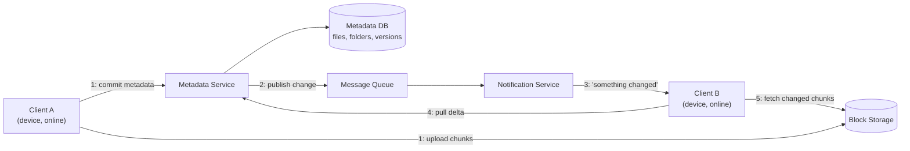

## Overview

Getting bytes from a client into durable storage — presigned URLs, multipart uploads, chunking — is already a solved problem covered in [Object Storage and the Direct-Upload Pattern](object-storage-and-direct-upload) and [Chunked Upload, Deduplication, and Delta Sync](chunked-upload-deduplication-and-delta-sync). A sync product like Dropbox or Google Drive is a genuinely different problem sitting on top of that solved one: a user owns a laptop, a phone, and a desktop at work, and all three are supposed to show the *exact same* file tree at all times, even though each device only sees the network intermittently, edits can happen on two of them while the third is asleep in a bag, and "the same" has to survive folder renames, moves, deletions, and two people editing one file at once. The upload mechanics are a solved sub-problem; keeping a fleet of loosely-connected replicas of a whole namespace converged with a server-side source of truth — cheaply, at the scale of hundreds of millions of accounts, without silently losing anyone's edits — is the actual design problem, and it is fundamentally a distributed-systems and product-design problem, not a storage problem.

## Functional Requirements

- **Upload and download files**, including large ones, using the chunked-upload and direct-to-storage mechanics of the two prerequisite concepts — not re-litigated here.
- **Automatic sync across a user's devices.** A change made on one online device should reach every other online device without the user manually re-uploading or re-downloading anything.
- **Namespace: folders and files organized into a hierarchy** per user (and, for shared folders, per group of users), with rename and move as first-class, cheap operations.
- **Sharing.** A file or folder can be made visible, and optionally editable, to other accounts.
- **Version history.** Every saved edit is individually recoverable; a user can look at, and restore, any prior version of a file.
- **Offline support.** A device that has been offline for hours or days must be able to catch up to the current state rather than requiring a full re-sync of everything.

Explicitly out of scope, and delegated: how a large file is actually split, fingerprinted, deduplicated, and transferred byte-for-byte efficiently is [Chunked Upload, Deduplication, and Delta Sync](chunked-upload-deduplication-and-delta-sync); where the bytes physically live and how a client talks to that storage tier is [Object Storage and the Direct-Upload Pattern](object-storage-and-direct-upload). This design assumes both of those exist and asks: what has to sit *above* them to turn "a bucket full of chunks" into "a file system that stays consistent across five devices"?

## Non-Functional Requirements

- **Metadata consistency is the load-bearing requirement.** At any moment, "what is the current version of this file, and where does it live in the folder tree" must have one unambiguous answer. Two devices disagreeing about which version is current is a correctness bug, not a UX nit — it is how users lose work.
- **High availability**, particularly for reads: browsing a folder tree or checking a file's status has to work continuously, even while some part of the write path is degraded.
- **The metadata path and the file-content path have wildly different scale characteristics, and the design has to treat them as separate systems.** Metadata records — file names, sizes, version pointers, folder membership — are small (bytes to kilobytes) and change on every keystroke-adjacent save. File content is enormous by comparison (megabytes to gigabytes) and changes far less often relative to its size. A design that routes both through the same critical path lets a 4 GB video upload block a folder rename.
- **Eventual, bounded-latency propagation for content; near-immediate propagation for the fact that something changed.** A device doesn't need the new bytes in milliseconds, but it does need to *learn*, quickly, that it should go get them — the two have different latency budgets and are handled by different subsystems.
- **Durability of every version**, not just the latest — version history is a functional requirement that leaks into non-functional territory, since it means storage volume grows in proportion to edit history, not file count.

## High-Level Design



The client that made the change does two things in parallel, not one: it pushes the new or changed chunks straight to block storage using the direct-upload path, and it commits a small metadata record — new version id, chunk manifest reference, updated folder pointer — to the **metadata service**. The metadata write is the one that matters for consistency, because it is the single moment at which "the current version of this file" changes for everyone. That write lands in a relational **metadata database** (the source of truth for the namespace and version history) and, in the same transaction or via an [outbox](outbox-pattern)-style step, publishes a change event onto a **message queue**.

A **notification/synchronization service** consumes that queue and is responsible for exactly one job: telling every *other* currently-online device belonging to that account (or that shared folder) that something changed, as fast as possible, without those devices having to poll the metadata service continuously. It does not send the changed data itself — it sends a signal. Each notified device then calls back into the metadata service to pull the actual delta (which files/folders changed, to which version), and only after that does it fetch the specific chunks it's missing from block storage — the same chunk-manifest diff described in [Chunked Upload, Deduplication, and Delta Sync](chunked-upload-deduplication-and-delta-sync). The queue between the metadata write and the notification fan-out exists for the same reason it exists in any other system: it decouples "record the change" (must be fast and safe) from "notify potentially many recipients" (can be slower, can retry, can fail for one recipient without affecting the write). The mechanics of that decoupling are the same ones covered generally in [Designing a Notification System](notification-system-design); this design is the specific instance where the "event" being fanned out is "your file tree just changed."

## The Metadata Service and Data Model

The metadata service owns two related but distinct things: the **namespace** (what the folder tree looks like) and **versioning** (what the current and historical contents of each file are). Both are deliberately modeled to make the common operations — rename, move, restore a prior version — cheap.

```
folder(id, parent_folder_id, owner_id, name, is_deleted)
file(id, parent_folder_id, owner_id, name, current_version_id)
file_version(id, file_id, chunk_manifest_id, size_bytes,
              created_at, created_by_device_id, hash)
```

**The namespace is a tree of parent pointers, not a materialized path string.** A folder row points at its parent's id, not at a string like `/Documents/Work/2026`. This is the detail that makes rename and move O(1): renaming an ancestor folder changes exactly one row, and every descendant's effective path is derived at read time by walking pointers rather than needing to be rewritten. Storing the full path as a denormalized string instead would turn "rename a top-level folder with ten thousand files inside it" into a bulk update across every descendant row — precisely the kind of write amplification a metadata service, which is supposed to be small and fast, cannot absorb.

**A file's history is an append-only sequence of versions, never an overwrite.** Editing a file does not mutate its row in place; it inserts a new `file_version` row and repoints `current_version_id` at it. This is the same principle that shows up in [Designing a Digital Wallet](digital-wallet-design) for ledger entries and in [Event Sourcing and CQRS](event-sourcing-and-cqrs) generally: an append-only history is what makes "what did this look like an hour ago" and "undo the last change" queries rather than archaeology. It also means storage cost scales with edit history, not with file count — which is exactly why the content itself is chunked and deduplicated (see [Chunked Upload, Deduplication, and Delta Sync](chunked-upload-deduplication-and-delta-sync)): without chunk-level dedup, keeping every version of every file would multiply storage cost by the number of saves a user makes.

The architectural reason metadata is a *separate service* from file content, rather than one system doing both, comes straight out of the non-functional requirements: metadata is small, changes constantly, and needs strong consistency — one unambiguous "current version" per file — while content is huge, changes comparatively rarely, and can tolerate a short propagation delay. Coupling them means every metadata read or write competes with multi-gigabyte transfers for the same infrastructure, and it means the strongly-consistent store (typically a relational database, sharded by user or namespace) has to also somehow hold blobs it was never built to hold efficiently. Splitting them lets each be scaled, replicated, and made consistent according to its own requirements — a pattern that is really just [Object Storage and the Direct-Upload Pattern](object-storage-and-direct-upload)'s metadata/bytes split, applied recursively one layer up.

## Notifications and the Sync Protocol

A device that is online needs to learn "something changed" quickly, but constantly polling the metadata service ("did anything change? did anything change? did anything change?") from every device on every account does not scale — most polls return "no." The two real approaches both avoid that:

- **Long polling.** The client opens an HTTP request carrying a cursor (its last-known sync position) and the server holds that connection open — not responding immediately, but not closing it either — until either something changes for that account or a timeout elapses (tens of seconds), at which point it responds and the client immediately reopens a new long-poll. Dropbox's actual Core API did exactly this with a `longpoll_delta` endpoint: it blocks until a change is detected relative to the caller's cursor, and the response only ever says "there may be changes" — the client then calls the ordinary delta endpoint to fetch what actually changed. Splitting "learn something happened" from "fetch what happened" into two calls is deliberate: the long-poll connection stays cheap and content-free, while the actual delta-fetching endpoint can be ordinary, cacheable, retryable HTTP.
- **A persistent connection** (WebSocket, or a comparable push channel) held open per online device, over which the server pushes a change notification directly instead of waiting for the next poll to time out. This trades one long-lived connection per device for lower latency and less connection-churn than repeatedly reopening long-polls, at the cost of needing infrastructure that can hold millions of concurrent open connections and route a targeted message to the right one.

A third, structurally different option is a **server-initiated webhook**, which is how Google Drive's API models the same problem: the client registers a `watch` channel for a resource, the server calls back to a URL the client controls when something changes, and the client then calls `changes.list` to pull the actual delta — the same "signal, then pull" split as the long-poll approach, just inverted in who holds the connection. Whichever transport is chosen, the notification itself should carry as little information as possible — ideally nothing more than "your account has new changes as of cursor X" — because the payload of *what* changed belongs to the metadata service's delta API, which has proper pagination, retry, and consistency guarantees that a best-effort push channel does not.

## Handling Sync Conflicts

Two devices editing the same file while one or both are offline is not a rare edge case to handle defensively — it is a certain, recurring event at scale, and how to resolve it is as much a product decision as an engineering one. Three real approaches, in increasing order of sophistication:

- **Last-write-wins.** Whichever version reaches the metadata service last becomes the current version, full stop. It is trivial to implement and gives no error to either user — and that is exactly the problem: one user's edit disappears with no signal that it happened, which for a product whose entire pitch is "we never lose your files" is a serious failure mode, not a graceful degradation.
- **Keep both, surfaced as a conflicted copy.** This is Dropbox's actual, documented real-world behavior: when two edits to the same file genuinely race, Dropbox does not attempt to merge them — it keeps the version that arrived first under the original name and saves the other as a separate file, named something like `filename (username's conflicted copy YYYY-MM-DD).ext`. Nothing is silently lost, the user is made aware something needs their attention, and resolution — deciding which content is "right," or merging by hand — is pushed to the one party who actually has the context to do it: the human. This is a strictly better user-facing outcome than last-write-wins at the cost of a slightly confusing extra file appearing, and it requires no clever merge logic in the server at all.
- **CRDTs or operational transforms for structured content.** For documents with enough internal structure to define a merge (rich text, spreadsheets), a Conflict-Free Replicated Data Type or an operational-transform algorithm can reconcile concurrent edits automatically and converge every replica to the same result without a human resolving anything — this is how real-time collaborative editors like Google Docs behave. It is a materially harder mechanism to build correctly and it only works because the editor deeply understands the document's structure (character insertions, paragraph moves); a general file-sync product handling opaque binary blobs has no such structure to reason about, so this approach is genuinely out of scope here and belongs to the collaborative-editor problem, not the file-sync problem.

The practical takeaway for a design interview: naming last-write-wins and immediately explaining why it is unacceptable for a sync product, then landing on conflicted copies as the correct default with CRDTs/OT flagged as the answer *for a different, narrower problem* (structured real-time collaboration), demonstrates the judgment the question is actually testing.

## Storage Efficiency

None of the above addresses the most naive-seeming failure mode: if a user changes one line in a 200-page document, does the whole file get re-uploaded and stored again as a second, mostly-duplicate copy? The answer for a well-built sync product is no, and the mechanism — splitting files into content-addressed chunks with a rolling hash, fingerprinting each chunk, deduplicating by content hash across versions and even across users, and diffing chunk manifests to sync only what changed — is exactly what [Chunked Upload, Deduplication, and Delta Sync](chunked-upload-deduplication-and-delta-sync) covers in depth. This case study's metadata service is what makes that mechanism *addressable*: `file_version.chunk_manifest_id` is the pointer that ties one version of one file to the specific ordered list of chunk hashes that reconstruct it, and the version-history model above only stays cheap in storage because unchanged chunks are referenced, not duplicated, across every version in that history.

## Trade-offs

- **Separating metadata from file content buys independent scaling and consistency models, at the cost of two systems that must stay coherent** — a metadata row can point at a chunk manifest that failed to fully upload, or a chunk can be garbage-collected while a metadata row still references it if the two aren't kept honest about ownership and reference counts. The payoff is that the strongly-consistent, small, hot metadata store never has to hold a byte of actual file content.
- **Parent-pointer namespaces make rename and move cheap but make "what is this file's full path" an on-demand computation, not a stored fact** — every path-displaying read walks the tree upward. That's the right trade for a system where renames are common and full-path lookups are comparatively rare.
- **Append-only version history gives free undo and audit at the cost of open-ended storage growth** — chunk-level deduplication is what keeps that growth sub-linear in edit count, but it also means deletion is never immediate; a chunk is only reclaimable once no version anywhere still references it, which turns "delete a file" into eventual garbage collection rather than an instant free.
- **Long polling and persistent connections both buy low-latency change notification, at the cost of connection-holding infrastructure that has to scale with concurrently-online devices, not with request rate** — a webhook-based push model (Google Drive's approach) avoids holding connections server-side but requires the client to run a reachable endpoint, which is a much easier ask for a server-to-server integration than for a phone that sleeps its network stack.
- **Keeping both versions as a conflicted copy avoids silent data loss but pushes resolution work onto the user** — it is the right default for a general-purpose file-sync product precisely because it does not pretend to understand the file's content well enough to merge it; that honesty is worth the occasional user confusion of an extra file appearing.
- **CRDTs/OT eliminate conflicts entirely for structured content but only work because the data model is deeply understood** — applying that machinery to opaque files (a compiled binary, a video, a zip archive) is not merely harder, it is not well-defined, since there is no structural notion of "merge" for two arbitrary byte streams.

## Interview Questions

- Why does the metadata service need to be architecturally separate from block storage, and what specifically goes wrong if a single system tries to be strongly consistent for both small metadata and huge file content?
- A user renames a folder containing 50,000 files. Walk through what happens in a parent-pointer namespace model versus a model that stores materialized full paths.
- Design the notification path: how does a second online device learn that a file changed, and why is it wrong for the notification payload itself to carry the changed content?
- Two devices edit the same file while both are offline, then both come back online. What actually happens under last-write-wins versus Dropbox's conflicted-copy approach, and why is the second one the right default for a general file-sync product?
- Why are CRDTs and operational transforms not the answer to file-sync conflicts in general, even though they solve a structurally similar-looking problem for collaborative editors?
- How does chunk-level deduplication change the storage-cost story for a user who saves 200 versions of a large document over a year?

## References

- [Alex Xu and Sahn Lam, "System Design Interview – An Insider's Guide, Volume 1" (ByteByteGo, 2020) — Chapter 15, "Design Google Drive"](https://bytebytego.com)
- [Dropbox Tech Blog — "Rewriting the heart of our sync engine"](https://dropbox.tech/infrastructure/rewriting-the-heart-of-our-sync-engine)
- [Dropbox Tech Blog — "Low-latency notification of Dropbox file changes"](https://dropbox.tech/developers/low-latency-notification-of-dropbox-file-changes)
- [Dropbox Help — "What's a conflicted copy?"](https://help.dropbox.com/organize/conflicted-copy)
- [Google Drive API Documentation — "Notifications for resource changes"](https://developers.google.com/workspace/drive/api/guides/push)
- [Shapiro, Preguiça, Baquero, Zawirski — "Conflict-Free Replicated Data Types" (INRIA Research Report, 2011)](https://hal.science/inria-00609399)
