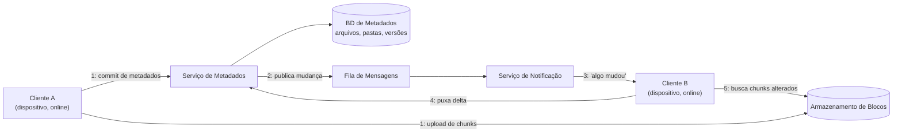

## Visão Geral

Levar bytes de um cliente para armazenamento durável — URLs pré-assinadas, uploads multipart, chunking — já é um problema resolvido, coberto em [Object Storage and the Direct-Upload Pattern](object-storage-and-direct-upload) e [Chunked Upload, Deduplication, and Delta Sync](chunked-upload-deduplication-and-delta-sync). Um produto de sincronização como Dropbox ou Google Drive é um problema genuinamente diferente sentado em cima desse já resolvido: um usuário possui um laptop, um celular e um desktop no trabalho, e os três devem mostrar a *mesma* árvore de arquivos exata o tempo todo, mesmo que cada dispositivo só veja a rede intermitentemente, edições possam acontecer em dois deles enquanto o terceiro está dormindo em uma mochila, e "o mesmo" tenha que sobreviver a renomeações de pastas, movimentos, exclusões, e duas pessoas editando um arquivo ao mesmo tempo. A mecânica de upload é um subproblema resolvido; manter uma frota de réplicas fracamente conectadas de um namespace inteiro convergida com uma fonte de verdade do lado do servidor — de forma barata, na escala de centenas de milhões de contas, sem perder silenciosamente as edições de ninguém — é o problema de design real, e é fundamentalmente um problema de sistemas distribuídos e design de produto, não um problema de armazenamento.

## Requisitos Funcionais

- **Upload e download de arquivos**, incluindo grandes, usando a mecânica de upload em chunks e direto-para-armazenamento dos dois conceitos pré-requisito — não revisitados aqui.
- **Sincronização automática entre os dispositivos de um usuário.** Uma mudança feita em um dispositivo online deve chegar a todo outro dispositivo online sem que o usuário precise reenviar ou baixar novamente nada manualmente.
- **Namespace: pastas e arquivos organizados em uma hierarquia** por usuário (e, para pastas compartilhadas, por grupo de usuários), com renomeação e movimentação como operações de primeira classe e baratas.
- **Compartilhamento.** Um arquivo ou pasta pode ser tornado visível, e opcionalmente editável, para outras contas.
- **Histórico de versões.** Toda edição salva é individualmente recuperável; um usuário pode olhar, e restaurar, qualquer versão anterior de um arquivo.
- **Suporte offline.** Um dispositivo que ficou offline por horas ou dias precisa ser capaz de se atualizar para o estado atual em vez de exigir uma ressincronização completa de tudo.

Explicitamente fora do escopo, e delegado: como um arquivo grande é de fato dividido, tem impressão digital calculada, é deduplicado e transferido byte a byte de forma eficiente é [Chunked Upload, Deduplication, and Delta Sync](chunked-upload-deduplication-and-delta-sync); onde os bytes fisicamente vivem e como um cliente conversa com essa camada de armazenamento é [Object Storage and the Direct-Upload Pattern](object-storage-and-direct-upload). Este design assume que ambos existem e pergunta: o que tem que ficar *acima* deles para transformar "um bucket cheio de chunks" em "um sistema de arquivos que permanece consistente entre cinco dispositivos"?

## Requisitos Não Funcionais

- **Consistência de metadados é o requisito estrutural.** A qualquer momento, "qual é a versão atual deste arquivo, e onde ele vive na árvore de pastas" precisa ter uma resposta inequívoca. Dois dispositivos discordando sobre qual versão é a atual é um bug de correção, não um detalhe de UX — é como usuários perdem trabalho.
- **Alta disponibilidade**, particularmente para leituras: navegar em uma árvore de pastas ou checar o status de um arquivo tem que funcionar continuamente, mesmo enquanto alguma parte do caminho de escrita está degradada.
- **O caminho de metadados e o caminho de conteúdo de arquivo têm características de escala radicalmente diferentes, e o design tem que tratá-los como sistemas separados.** Registros de metadados — nomes de arquivo, tamanhos, ponteiros de versão, associação de pasta — são pequenos (bytes a kilobytes) e mudam a cada salvamento próximo a uma tecla pressionada. Conteúdo de arquivo é enorme em comparação (megabytes a gigabytes) e muda muito menos frequentemente em relação ao seu tamanho. Um design que roteia ambos pelo mesmo caminho crítico deixa um upload de vídeo de 4 GB bloquear uma renomeação de pasta.
- **Propagação eventual e de latência limitada para conteúdo; propagação quase imediata para o fato de que algo mudou.** Um dispositivo não precisa dos bytes novos em milissegundos, mas precisa *aprender*, rapidamente, que deveria ir buscá-los — os dois têm orçamentos de latência diferentes e são tratados por subsistemas diferentes.
- **Durabilidade de toda versão**, não apenas a mais recente — histórico de versões é um requisito funcional que vaza para o território não funcional, já que significa que o volume de armazenamento cresce proporcionalmente ao histórico de edições, não à contagem de arquivos.

## Design de Alto Nível



O cliente que fez a mudança faz duas coisas em paralelo, não uma: envia os chunks novos ou alterados direto para o armazenamento de blocos usando o caminho de upload direto, e faz commit de um pequeno registro de metadados — novo id de versão, referência ao manifesto de chunks, ponteiro de pasta atualizado — no **serviço de metadados**. A escrita de metadados é a que importa para consistência, porque é o único momento em que "a versão atual deste arquivo" muda para todos. Essa escrita chega em um **banco de dados de metadados** relacional (a fonte de verdade para o namespace e histórico de versões) e, na mesma transação ou via uma etapa estilo [outbox](outbox-pattern), publica um evento de mudança em uma **fila de mensagens**.

Um **serviço de notificação/sincronização** consome essa fila e é responsável por exatamente um trabalho: dizer a todo *outro* dispositivo atualmente online pertencente àquela conta (ou àquela pasta compartilhada) que algo mudou, o mais rápido possível, sem que esses dispositivos tenham que fazer polling contínuo no serviço de metadados. Ele não envia o dado alterado em si — envia um sinal. Cada dispositivo notificado então chama de volta o serviço de metadados para puxar o delta real (quais arquivos/pastas mudaram, para qual versão), e só depois disso ele busca os chunks específicos que está faltando no armazenamento de blocos — o mesmo diff de manifesto de chunks descrito em [Chunked Upload, Deduplication, and Delta Sync](chunked-upload-deduplication-and-delta-sync). A fila entre a escrita de metadados e o fan-out de notificação existe pela mesma razão que existe em qualquer outro sistema: ela desacopla "registrar a mudança" (precisa ser rápido e seguro) de "notificar potencialmente muitos destinatários" (pode ser mais lento, pode fazer retry, pode falhar para um destinatário sem afetar a escrita). A mecânica desse desacoplamento é a mesma coberta de forma geral em [Designing a Notification System](notification-system-design); este design é a instância específica onde o "evento" sendo distribuído é "sua árvore de arquivos acabou de mudar".

## O Serviço de Metadados e o Modelo de Dados

O serviço de metadados possui duas coisas relacionadas mas distintas: o **namespace** (a aparência da árvore de pastas) e o **versionamento** (quais são o conteúdo atual e histórico de cada arquivo). Ambos são deliberadamente modelados para tornar as operações comuns — renomear, mover, restaurar uma versão anterior — baratas.

```
folder(id, parent_folder_id, owner_id, name, is_deleted)
file(id, parent_folder_id, owner_id, name, current_version_id)
file_version(id, file_id, chunk_manifest_id, size_bytes,
              created_at, created_by_device_id, hash)
```

**O namespace é uma árvore de ponteiros de pai, não uma string de caminho materializada.** Uma linha de pasta aponta para o id de seu pai, não para uma string como `/Documents/Work/2026`. Esse é o detalhe que torna renomear e mover O(1): renomear uma pasta ancestral muda exatamente uma linha, e o caminho efetivo de todo descendente é derivado no momento da leitura percorrendo ponteiros em vez de precisar ser reescrito. Armazenar o caminho completo como uma string desnormalizada em vez disso transformaria "renomear uma pasta de nível superior com dez mil arquivos dentro" em uma atualização em massa em cada linha descendente — exatamente o tipo de amplificação de escrita que um serviço de metadados, que deveria ser pequeno e rápido, não pode absorver.

**O histórico de um arquivo é uma sequência somente-anexação de versões, nunca uma sobrescrita.** Editar um arquivo não muta sua linha in-place; insere uma nova linha `file_version` e reaponta `current_version_id` para ela. Esse é o mesmo princípio que aparece em [Designing a Digital Wallet](digital-wallet-design) para lançamentos de razão contábil e em [Event Sourcing and CQRS](event-sourcing-and-cqrs) de forma geral: um histórico somente-anexação é o que torna consultas como "como isso era há uma hora" e "desfazer a última mudança" queries em vez de arqueologia. Também significa que o custo de armazenamento escala com o histórico de edições, não com a contagem de arquivos — o que é exatamente por que o conteúdo em si é dividido em chunks e deduplicado (veja [Chunked Upload, Deduplication, and Delta Sync](chunked-upload-deduplication-and-delta-sync)): sem deduplicação em nível de chunk, manter cada versão de cada arquivo multiplicaria o custo de armazenamento pelo número de salvamentos que um usuário faz.

A razão arquitetural pela qual metadados são um serviço *separado* do conteúdo de arquivo, em vez de um sistema fazendo os dois, vem diretamente dos requisitos não funcionais: metadados são pequenos, mudam constantemente, e precisam de consistência forte — uma "versão atual" inequívoca por arquivo —, enquanto conteúdo é enorme, muda comparativamente rara vez, e pode tolerar um pequeno atraso de propagação. Acoplá-los significa que toda leitura ou escrita de metadados compete com transferências de múltiplos gigabytes pela mesma infraestrutura, e significa que o armazenamento fortemente consistente (tipicamente um banco de dados relacional, sharded por usuário ou namespace) também tem que de alguma forma guardar blobs para os quais nunca foi construído para armazenar eficientemente. Separá-los permite que cada um seja escalado, replicado, e tornado consistente de acordo com seus próprios requisitos — um padrão que é realmente apenas a divisão metadados/bytes de [Object Storage and the Direct-Upload Pattern](object-storage-and-direct-upload), aplicada recursivamente uma camada acima.

## Notificações e o Protocolo de Sincronização

Um dispositivo que está online precisa aprender "algo mudou" rapidamente, mas fazer polling constante no serviço de metadados ("algo mudou? algo mudou? algo mudou?") de todo dispositivo em toda conta não escala — a maioria dos polls retorna "não". As duas abordagens reais evitam isso:

- **Long polling.** O cliente abre uma requisição HTTP carregando um cursor (sua última posição de sincronização conhecida) e o servidor mantém essa conexão aberta — não respondendo imediatamente, mas também não a fechando — até que algo mude para aquela conta ou um timeout decorra (dezenas de segundos), momento em que ele responde e o cliente imediatamente reabre um novo long-poll. A API Core real do Dropbox fazia exatamente isso com um endpoint `longpoll_delta`: ele bloqueia até que uma mudança seja detectada em relação ao cursor do chamador, e a resposta só diz "pode haver mudanças" — o cliente então chama o endpoint delta comum para buscar o que de fato mudou. Separar "aprender que algo aconteceu" de "buscar o que aconteceu" em duas chamadas é deliberado: a conexão de long-poll permanece barata e sem conteúdo, enquanto o endpoint real de busca de delta pode ser HTTP comum, cacheável, com retry.
- **Uma conexão persistente** (WebSocket, ou um canal push comparável) mantida aberta por dispositivo online, pela qual o servidor empurra uma notificação de mudança diretamente em vez de esperar o próximo poll dar timeout. Isso troca uma conexão de longa duração por dispositivo por menor latência e menos rotatividade de conexão do que reabrir long-polls repetidamente, ao custo de precisar de infraestrutura que consiga manter milhões de conexões abertas simultâneas e rotear uma mensagem direcionada para a certa.

Uma terceira opção, estruturalmente diferente, é um **webhook iniciado pelo servidor**, que é como a API do Google Drive modela o mesmo problema: o cliente registra um canal `watch` para um recurso, o servidor chama de volta uma URL controlada pelo cliente quando algo muda, e o cliente então chama `changes.list` para puxar o delta real — a mesma divisão "sinal, depois puxa" da abordagem de long-polling, apenas invertida em quem mantém a conexão. Seja qual for o transporte escolhido, a notificação em si deveria carregar o mínimo de informação possível — idealmente nada além de "sua conta tem mudanças novas a partir do cursor X" — porque o payload de *o que* mudou pertence à API delta do serviço de metadados, que tem paginação, retry e garantias de consistência adequadas que um canal push de melhor esforço não tem.

## Lidando com Conflitos de Sincronização

Dois dispositivos editando o mesmo arquivo enquanto um ou ambos estão offline não é um caso extremo raro para tratar defensivamente — é um evento certo e recorrente em escala, e como resolvê-lo é tanto uma decisão de produto quanto de engenharia. Três abordagens reais, em ordem crescente de sofisticação:

- **Last-write-wins.** Qualquer que seja a versão que chegue ao serviço de metadados por último se torna a versão atual, ponto final. É trivial de implementar e não dá erro nenhum a nenhum usuário — e é exatamente esse o problema: a edição de um usuário desaparece sem sinal algum de que aconteceu, o que para um produto cujo pitch inteiro é "nós nunca perdemos seus arquivos" é um modo de falha sério, não uma degradação graciosa.
- **Manter ambos, expostos como uma cópia conflitante.** Esse é o comportamento real e documentado do Dropbox: quando duas edições ao mesmo arquivo genuinamente entram em corrida, o Dropbox não tenta mesclá-las — ele mantém a versão que chegou primeiro sob o nome original e salva a outra como um arquivo separado, nomeado algo como `nomedoarquivo (cópia conflitante de nomedeusuário AAAA-MM-DD).ext`. Nada é perdido silenciosamente, o usuário fica ciente de que algo precisa de sua atenção, e a resolução — decidir qual conteúdo está "certo", ou mesclar à mão — é empurrada para a única parte que de fato tem o contexto para isso: o humano. Esse é um resultado voltado ao usuário estritamente melhor do que last-write-wins ao custo de um arquivo extra ligeiramente confuso aparecendo, e não exige lógica de merge inteligente nenhuma no servidor.
- **CRDTs ou transformações operacionais para conteúdo estruturado.** Para documentos com estrutura interna suficiente para definir um merge (texto rico, planilhas), um Conflict-Free Replicated Data Type ou um algoritmo de transformação operacional pode reconciliar edições concorrentes automaticamente e convergir toda réplica para o mesmo resultado sem que um humano resolva nada — é assim que editores colaborativos em tempo real de verdade, como o Google Docs, se comportam. É um mecanismo materialmente mais difícil de construir corretamente e só funciona porque o editor entende profundamente a estrutura do documento (inserções de caractere, movimentos de parágrafo); um produto genérico de sincronização de arquivos lidando com blobs binários opacos não tem tal estrutura para raciocinar, então essa abordagem está genuinamente fora do escopo aqui e pertence ao problema do editor colaborativo, não ao problema de sincronização de arquivos.

O ponto prático para uma entrevista de design: nomear last-write-wins e imediatamente explicar por que é inaceitável para um produto de sincronização, então pousar em cópias conflitantes como o padrão correto com CRDTs/OT sinalizados como a resposta *para um problema diferente e mais estreito* (colaboração estruturada em tempo real), demonstra o julgamento que a pergunta está realmente testando.

## Eficiência de Armazenamento

Nada do que foi dito acima trata o modo de falha mais aparentemente ingênuo: se um usuário muda uma linha em um documento de 200 páginas, o arquivo inteiro é reenviado e armazenado novamente como uma segunda cópia, majoritariamente duplicada? A resposta para um produto de sincronização bem construído é não, e o mecanismo — dividir arquivos em chunks endereçados por conteúdo com um hash rolante, calcular impressão digital de cada chunk, deduplicar por hash de conteúdo entre versões e até entre usuários, e comparar manifestos de chunks para sincronizar apenas o que mudou — é exatamente o que [Chunked Upload, Deduplication, and Delta Sync](chunked-upload-deduplication-and-delta-sync) cobre em profundidade. O serviço de metadados deste estudo de caso é o que torna esse mecanismo *endereçável*: `file_version.chunk_manifest_id` é o ponteiro que liga uma versão de um arquivo à lista ordenada específica de hashes de chunk que o reconstroem, e o modelo de histórico de versões acima só permanece barato em armazenamento porque chunks inalterados são referenciados, não duplicados, através de cada versão nesse histórico.

## Trade-offs

- **Separar metadados do conteúdo de arquivo compra escalonamento e modelos de consistência independentes, ao custo de dois sistemas que precisam permanecer coerentes** — uma linha de metadados pode apontar para um manifesto de chunk que falhou em fazer upload completo, ou um chunk pode ser coletado como lixo enquanto uma linha de metadados ainda o referencia se os dois não forem mantidos honestos sobre propriedade e contagens de referência. O ganho é que o armazenamento de metadados pequeno, quente e fortemente consistente nunca precisa guardar um byte de conteúdo de arquivo real.
- **Namespaces de ponteiro de pai tornam renomear e mover baratos mas tornam "qual é o caminho completo deste arquivo" uma computação sob demanda, não um fato armazenado** — toda leitura que exibe caminho percorre a árvore para cima. Essa é a troca certa para um sistema onde renomeações são comuns e buscas de caminho completo são comparativamente raras.
- **Histórico de versões somente-anexação dá desfazer e auditoria de graça ao custo de crescimento de armazenamento em aberto** — deduplicação em nível de chunk é o que mantém esse crescimento sub-linear em contagem de edições, mas também significa que exclusão nunca é imediata; um chunk só é liberável uma vez que nenhuma versão em lugar nenhum ainda o referencie, o que transforma "excluir um arquivo" em coleta de lixo eventual em vez de uma liberação instantânea.
- **Long polling e conexões persistentes ambos compram notificação de mudança de baixa latência, ao custo de infraestrutura de manutenção de conexão que tem que escalar com dispositivos simultaneamente online, não com taxa de requisição** — um modelo push baseado em webhook (a abordagem do Google Drive) evita manter conexões do lado do servidor mas exige que o cliente rode um endpoint alcançável, o que é um pedido muito mais fácil para uma integração servidor-a-servidor do que para um celular que dorme sua stack de rede.
- **Manter ambas as versões como uma cópia conflitante evita perda silenciosa de dados mas empurra o trabalho de resolução para o usuário** — é o padrão certo para um produto genérico de sincronização de arquivos precisamente porque não finge entender o conteúdo do arquivo o suficiente para mesclá-lo; essa honestidade vale a confusão ocasional do usuário com um arquivo extra aparecendo.
- **CRDTs/OT eliminam conflitos inteiramente para conteúdo estruturado mas só funcionam porque o modelo de dados é profundamente compreendido** — aplicar essa maquinaria a arquivos opacos (um binário compilado, um vídeo, um arquivo zip) não é apenas mais difícil, é mal definido, já que não há noção estrutural de "merge" para dois streams de bytes arbitrários.

## Perguntas de Entrevista

- Por que o serviço de metadados precisa ser arquiteturalmente separado do armazenamento de blocos, e o que especificamente dá errado se um único sistema tenta ser fortemente consistente tanto para metadados pequenos quanto para conteúdo de arquivo enorme?
- Um usuário renomeia uma pasta contendo 50.000 arquivos. Percorra o que acontece em um modelo de namespace de ponteiro de pai versus um modelo que armazena caminhos completos materializados.
- Desenhe o caminho de notificação: como um segundo dispositivo online aprende que um arquivo mudou, e por que é errado que o payload de notificação em si carregue o conteúdo alterado?
- Dois dispositivos editam o mesmo arquivo enquanto ambos estão offline, e depois ambos voltam a ficar online. O que realmente acontece sob last-write-wins versus a abordagem de cópia conflitante do Dropbox, e por que a segunda é o padrão certo para um produto genérico de sincronização de arquivos?
- Por que CRDTs e transformações operacionais não são a resposta para conflitos de sincronização de arquivos em geral, mesmo resolvendo um problema estruturalmente parecido para editores colaborativos?
- Como a deduplicação em nível de chunk muda a história de custo de armazenamento para um usuário que salva 200 versões de um documento grande ao longo de um ano?

## Referências

- [Alex Xu and Sahn Lam, "System Design Interview – An Insider's Guide, Volume 1" (ByteByteGo, 2020) — Capítulo 15, "Design Google Drive"](https://bytebytego.com)
- [Dropbox Tech Blog — "Rewriting the heart of our sync engine"](https://dropbox.tech/infrastructure/rewriting-the-heart-of-our-sync-engine)
- [Dropbox Tech Blog — "Low-latency notification of Dropbox file changes"](https://dropbox.tech/developers/low-latency-notification-of-dropbox-file-changes)
- [Dropbox Help — "What's a conflicted copy?"](https://help.dropbox.com/organize/conflicted-copy)
- [Google Drive API Documentation — "Notifications for resource changes"](https://developers.google.com/workspace/drive/api/guides/push)
- [Shapiro, Preguiça, Baquero, Zawirski — "Conflict-Free Replicated Data Types" (INRIA Research Report, 2011)](https://hal.science/inria-00609399)
