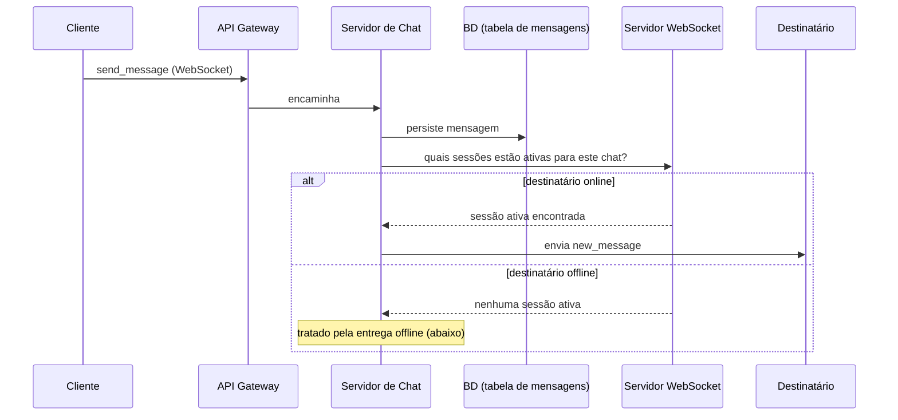
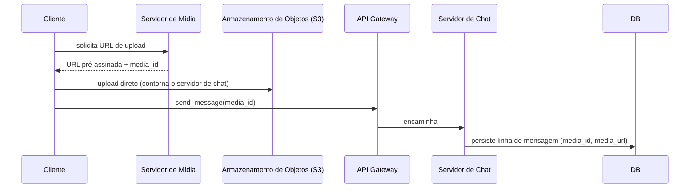

## Visão Geral

"Projete o Slack" (ou o Messenger, ou o WhatsApp) é um dos prompts mais comuns de entrevista de system design porque força o candidato a raciocinar sobre entrega em tempo real, usuários offline, consistência multi-dispositivo e mídia não estruturada tudo em um único sistema. Como qualquer prompt ambíguo, o entrevistador dá uma declaração de uma linha — "projete um sistema de chat" — e espera que *você* reduza o escopo para um MVP de três ou quatro funcionalidades em vez de tentar todas as funcionalidades do Slack (threads, busca, reações, integrações) em uma sessão de 45-60 minutos. Este conceito percorre esse exercício de definição de escopo e o design de alto nível resultante; o conceito de continuação, [Scaling Real-Time Messaging](scaling-real-time-messaging-ordering-and-fan-out), cobre os deep dives sobre ordenação, fan-out e presença em escala de bilhões de usuários.

## Requisitos Funcionais

Decomponha o prompt vago em um MVP concreto antes de projetar qualquer coisa. Para este passo a passo, o escopo é quatro funcionalidades:

- **Enviar e receber mensagens**, um-para-um ou em um chat em grupo.
- **Enviar mídia rica** (imagens, vídeos, arquivos), não apenas texto simples — esta é uma sondagem deliberada sobre escolhas de armazenamento de dados estruturados vs. não estruturados.
- **Receber notificações em tempo real para usuários offline** — a experiência do usuário tem que ser perfeita quer o destinatário esteja ativamente conectado ou não.
- **Excluir uma mensagem**, com a exclusão se propagando para todos os destinatários em todos os seus dispositivos (um usuário pode estar logado em um celular, um laptop e um tablet ao mesmo tempo).

Listar explicitamente o que está *fora* do escopo (busca, threads, reações, confirmações de leitura além de uma menção básica) é tão importante quanto listar o que está dentro — sinaliza ao entrevistador que você entende a diferença entre um produto completo e um MVP do tamanho de uma entrevista.

## Requisitos Não Funcionais

Requisitos não funcionais descrevem as *qualidades* do sistema, e cada um deles deveria ser respaldado por um número — seja dado pelo entrevistador ou uma suposição que você declara e pede para eles validarem:

- **Escalabilidade** — assuma 1 bilhão de usuários ativos diários e 100 mil chats concorrentes. A 1B DAU, isso é aproximadamente 12 mil queries por segundo de carga sustentada. Sempre esclareça usuários ativos diários vs. mensais; os dois implicam infraestruturas muito diferentes.
- **Baixa latência** — a entrega de chat em tempo real deveria ficar abaixo de ~200ms para evitar um atraso perceptível; qualquer coisa cruzando 500ms é tratada como um caminho degradado que recorre a batching.
- **Consistência vs. disponibilidade** — partições de rede são um dado em qualquer sistema distribuído (veja [CAP Theorem](cap-theorem)), então a escolha real é CP ou AP, nunca CA. Um sistema de chat prioriza **disponibilidade** sobre consistência estrita: mostrar uma lista de mensagens um pouco desatualizada vence recusar a servir uma.
- **Durabilidade de mensagens** — mensagens precisam sobreviver a falha de nó e ser recuperáveis para auditoria/conformidade e recuperação de desastre (RPO/RTO), não apenas cacheadas em memória.
- **Consistência entre múltiplos dispositivos** — uma mensagem, sua exclusão, um indicador de digitação, uma confirmação de leitura, e uma atualização de presença todos precisam se propagar para todo dispositivo em que o usuário está logado, não apenas aquele que disparou o evento.

## Entidades Centrais

Antes de pular para APIs ou diagramas, nomeie os substantivos que o sistema precisa persistir:

- **Usuário** — um participante registrado que pode enviar e receber mensagens.
- **Chat** — uma abstração sobre uma conversa um-para-um ou um grupo; é para isso que uma mensagem é "enviada".
- **Mensagem** — o próprio conteúdo, seja texto simples ou um ponteiro para mídia rica.
- **Mídia** — conteúdo não estruturado (imagem, vídeo, áudio, arquivo) enviado como parte de uma mensagem.
- **Sessão de Dispositivo** — a conexão WebSocket ativa ou o endpoint de notificação push para um dos dispositivos de um usuário; como um usuário pode estar logado em múltiplos dispositivos simultaneamente, o estado de sessão tem que ser rastreado por dispositivo, não apenas por usuário.

## Por Que WebSockets, Não Polling REST

Um ciclo tradicional de requisição/resposta REST significa que o cliente tem que abrir uma nova conexão (ou fazer polling repetidamente) para descobrir se o servidor tem algo novo a dizer — caro e de alta latência para um sistema que é fundamentalmente uma conversa de ida e volta. **WebSockets** fornecem uma única conexão persistente e bidirecional: uma vez estabelecida, qualquer lado pode empurrar uma mensagem para o outro a qualquer momento sem renegociar uma conexão. Qualquer funcionalidade que exija interação verdadeiramente em tempo real — não apenas chat — é candidata a WebSockets em vez de polling (veja [RFC 6455](https://datatracker.ietf.org/doc/html/rfc6455) para a especificação do protocolo).

## Eventos e Payloads de WebSocket

Conexões WebSocket carregam **eventos** estruturados, cada um com um nome de evento e um payload; o servidor decide o que fazer (transmitir, confirmar, persistir) com base no tipo de evento:

| Evento | Direção | Propósito |
|---|---|---|
| `send_message` | cliente → servidor | O cliente submete uma nova mensagem. |
| `new_message` | servidor → clientes | O servidor distribui a mensagem para o(s) outro(s) participante(s) (um-para-um ou grupo). |
| `message_deleted` | servidor → clientes | Transmite uma exclusão para que o cliente de todo participante remova a mensagem localmente. |
| `user_typing` / `typing_started` / `typing_stopped` | cliente → servidor, servidor → clientes | Indicador de digitação, individual ou em grupo. |
| `read_receipt` | cliente → servidor, servidor → clientes | Confirmação de leitura. |
| `presence_update` | servidor → clientes | Mudança de status online/offline. |

Um payload representativo para uma mensagem transmitida inclui um `message_id` globalmente único gerado pelo servidor, o `chat_id` (usuário ou grupo), o conteúdo, e metadados (timestamp, remetente). O servidor — não o cliente — cria o `message_id`, porque relógios de cliente não são confiáveis para ordenação (mais sobre isso no deep dive de fan-out).

## Design de Alto Nível: Enviando uma Mensagem (Chat 1:1 e em Grupo)

Comece simples: não adicione um componente até que a complexidade medida o exija. O fluxo base:

O **API Gateway** atua como proxy reverso, balanceador de carga, e trata autenticação/autorização, rate limiting e tradução de protocolo. O **Servidor de Chat** (um microsserviço) valida o remetente, classifica o tipo de mensagem (texto vs. mídia), gera um `message_id` globalmente único (ex.: um UUID) antes de persistir, escreve a linha, e opcionalmente incrementa um número de sequência por chat. Ele então pergunta ao **Servidor WebSocket** — que rastreia a conexão ativa de cada dispositivo — quais destinatários estão atualmente online, e envia `new_message` para essas sessões.

### Schema de banco de dados para o caso de uso 1

| Tabela | Colunas-chave |
|---|---|
| `user` | `user_id`, `username`, ... |
| `chat` | `chat_id`, `is_group`, `created_at` |
| `chat_members` | `chat_id`, `user_id`, `joined_at` |
| `message` | `message_id` (globalmente único), `chat_id`, `sender_id`, `content`, `parent_message_id` (anulável, para respostas em thread), `created_at` |

Manter `parent_message_id` desde o primeiro dia significa que o schema pode crescer para respostas em thread mais tarde sem uma migração que quebre as linhas existentes.

## Design de Alto Nível: Mensagens de Mídia Rica

Payloads binários grandes (imagens, vídeos, arquivos) não pertencem ao mesmo armazenamento que texto — este é o instinto de [polyglot persistence](polyglot-persistence) em ação. O fluxo muda na frente:

O cliente pede ao **Servidor de Mídia** uma URL de upload pré-assinada, envia o binário *diretamente* para armazenamento de objetos (ex.: S3) — contornando completamente o servidor de chat para o payload pesado — e recebe de volta um `media_id`/URL. O evento `send_message` então carrega essa referência de mídia em vez de bytes brutos. A tabela `message` só precisa de duas colunas adicionais, `media_id` e `media_url`, para distinguir conteúdo estruturado (texto) de não estruturado (mídia); o restante do pipeline (persistir, buscar sessões ativas, distribuir) é idêntico ao caso de uso 1.

## Design de Alto Nível: Entrega Offline via Inbox e Notificações Push

Tudo até este ponto assume que o destinatário está online. Para um destinatário **offline**, o sistema não deveria esperar que ele reconecte antes de fazer qualquer coisa — deveria notificá-lo proativamente. Quando o servidor de chat (via o servidor WebSocket) determina que um destinatário não tem sessão ativa:

1. Insere uma linha em uma tabela **`inbox`**: `user_id`, `message_id` (FK para `message`), `created_at`, `delivered_at` (anulável).
2. Envia uma notificação push (ex.: via APNs para iOS) que diz *"você tem uma nova mensagem"* — não o conteúdo da mensagem em si.
3. Quando o usuário reconecta, o servidor WebSocket lê suas linhas `inbox` pendentes, envia as mensagens reais, e marca `delivered_at` para que a mesma mensagem nunca seja reentregue.

Um job de limpeza periodicamente purga linhas de inbox entregues (ou elas são marcadas e deixadas para auditoria, dependendo do requisito de durabilidade).

## Design de Alto Nível: Excluindo uma Mensagem

A exclusão espelha o fluxo de envio: o servidor de chat exclui (ou faz soft-delete) a linha por `message_id`, então checa o status do destinatário exatamente como antes — destinatários online recebem um evento `message_deleted` empurrado imediatamente; destinatários offline recebem uma notificação push. Uma flag `is_deleted` na linha `message` (ou `inbox`) significa que quando um usuário offline reconecta e a inbox é reproduzida, mensagens já excluídas são filtradas em vez de entregues e depois retiradas.

## Trade-offs

- **Priorizar disponibilidade sobre consistência (AP) significa que destinatários podem brevemente ver um estado de mensagem diferente em dispositivos diferentes.** Essa é uma troca aceitável para chat (uma lista de mensagens um pouco desatualizada) mas seria inaceitável para, digamos, um razão financeiro — sempre nomeie de qual subsistema você está descrevendo a troca.
- **Armazenar apenas um ponteiro de mídia (não o binário) na tabela de mensagens mantém o caminho quente rápido, mas acopla a integridade da mensagem a dois sistemas (o armazenamento relacional/NoSQL e o armazenamento de objetos) em vez de um.** Um `media_url` pendurado com um objeto S3 ausente é um modo de falha que tem que ser tratado (ex.: um job de reconciliação em segundo plano).
- **URLs de upload pré-assinadas removem o servidor de chat do caminho crítico do upload de mídia, melhorando a vazão, mas empurram lógica de autorização (quem tem permissão para enviar o quê, limites de tamanho) para o servidor de mídia e a própria política do bucket de armazenamento, não para a validação de requisição do servidor de chat.**

## Perguntas de Entrevista

- Por que o servidor de chat gera o `message_id` em vez de confiar em um fornecido pelo cliente?
- O que muda no design de alto nível entre um chat um-para-um e um chat em grupo com 500 membros?
- Por que armazenar um ponteiro (URL de mídia) em vez da própria mídia na tabela de mensagens?
- Como você estenderia o schema para suportar respostas em thread sem quebrar consultas existentes?
- Qual é a diferença entre "a mensagem não foi entregue" e "a mensagem foi entregue a um dispositivo que não é mais válido"?

## Referências

- IETF, ["RFC 6455 — The WebSocket Protocol"](https://datatracker.ietf.org/doc/html/rfc6455)
- IGotAnOffer: Engineering, [System design mock interviews (YouTube)](https://www.youtube.com/@IGotAnOffer-Engineering)
- System Design Handbook, ["Slack System Design Interview: The Complete Guide"](https://www.systemdesignhandbook.com/guides/slack-system-design-interview/)
- MDN Web Docs, ["WebSockets API"](https://developer.mozilla.org/en-US/docs/Web/API/WebSockets_API)
