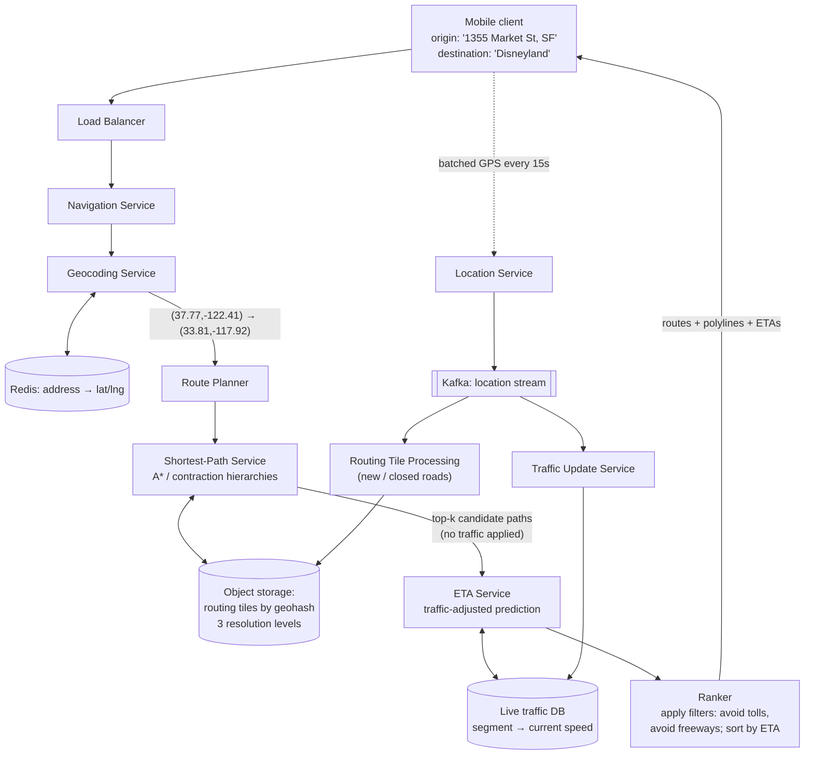

## Overview

"Design Google Maps" is not one problem, it is three problems wearing a trench coat, and the fastest way to lose control of the interview is to treat them as one. **Map rendering** is a static-content delivery problem: ~100 PB of pre-rendered image tiles that never change between builds and must reach a phone over cellular data. **Geocoding** is a text-to-coordinate lookup problem: read-heavy, tiny payloads, effectively a cache. **Routing** is a graph problem: a road network with hundreds of millions of nodes where the naive algorithm from an algorithms course would need minutes and gigabytes to answer a single query. Different bottlenecks — bandwidth, read throughput, and graph traversal cost — which means different storage engines, different scaling strategies, and different failure modes. Name all three up front, then design them separately.

This concept assumes the geospatial indexing layer from [Designing a Proximity Service](proximity-service) — geohash, quadtree, and S2 all show up here as the addressing scheme for tiles, and they are not re-derived below.

## Requirements

Anchor the scope at 1 billion daily active users on mobile, with terabytes of raw road data ingested from mapping authorities and improved over time by the app's own telemetry. Three features are in scope: **user location updates**, **navigation with ETA**, and **map rendering**. Business listings, photos, and multi-stop route optimization are explicitly out.

The non-functional requirements are where the design actually gets decided:

- **Accuracy over speed on the routing path.** A route that is 20 seconds slower than optimal is fine; a route that sends a driver down a closed road is a product failure. This licenses caching and approximation in ranking, but not in the road graph itself.
- **Smooth rendering with minimal data and battery.** The client is a phone on cellular. Every design choice — tile size, batching of GPS updates, vector vs. raster — is ultimately a data-usage argument.
- **Enormous read skew.** Tile fetches vastly outnumber every other request type, and they are all reads of immutable content. That single fact is why rendering is a CDN problem and not a service problem.
- **Very high, very uniform write volume on location updates.** At 1B DAU and ~5 billion navigation-minutes per day, sending a GPS fix every second would be ~3 million QPS. Batching on the client to one request every 15 seconds cuts that to ~200k QPS average, ~1M QPS at peak.
- **High availability, tolerant of staleness.** A user's last known position is obsolete the moment the next fix arrives, so the location store trades consistency for availability without argument.

## The Map Tile Pyramid

The naive rendering design — generate an image for the requested viewport on demand — is wrong for two compounding reasons: there is an unbounded number of (location, zoom) combinations, so the render cluster does unbounded work, and every response is unique, so nothing is cacheable. The fix is to make the output space finite. **Pre-render the world into fixed tiles at each zoom level**, and let the client fetch and mosaic the tiles it needs.

The pyramid is defined by a simple doubling rule. Zoom level 0 is the entire planet in a single 256×256 PNG. Each increment doubles the tile count in both the north-south and east-west directions, so level *z* holds 4^*z* tiles, each still 256×256 pixels:

| Zoom | Tiles | What it shows |
|---|---|---|
| 0 | 1 | whole world |
| 8 | 65,536 | country / region |
| 14 | 268,435,456 | neighbourhood |
| 21 | ~4.4 trillion | individual buildings |

At level 21, 4.4 trillion tiles × ~100 KB per compressed PNG is roughly 440 PB. But about 90% of the earth's surface is ocean, desert, and mountain — visually near-uniform and therefore extremely compressible — which conservatively knocks that down to ~50 PB. Every lower level costs a quarter of the one above it, so the whole pyramid is a geometric series: 50 + 50/4 + 50/16 + … ≈ 67 PB. Call it **~100 PB for the full multi-resolution map**.

That number is the whole argument. 100 PB cannot live on the client, and it must not be regenerated per request. It has to be built once by an offline pipeline, stored in object storage, and served from the edge.

### Why this is a CDN problem, not a service problem

Tiles are immutable between map builds, identical for every user who looks at the same place at the same zoom, and requested overwhelmingly more often than they are produced. That is the textbook profile for edge caching (see [Caching Strategies and CDNs](caching-strategies-and-cdns)). A cold tile is pulled from the origin bucket once, cached at the point of presence, and served from there to every subsequent requester in that region — and map traffic is intensely geographically local, so PoP hit rates are excellent by construction.

The volume makes the case concrete. A user driving at 30 km/h at a zoom where one tile covers a 200 m × 200 m block consumes about 1.25 MB per minute of navigation. Across 5 billion navigation-minutes per day that is ~6.25 billion MB/day, or ~62,500 MB per second. Spread across ~200 PoPs, each edge location serves a few hundred MB/s — entirely ordinary. Force that same traffic through an origin cluster and it becomes a capacity problem with no good answer.

### Addressing a tile

The tile's identity is its geographic cell, which is exactly what geohash (or S2, or a slippy-map `z/x/y` triple) gives you: a deterministic, sortable string computed from a lat/lng pair and a zoom level. The tile URL is then just that string:

```
https://cdn.map-provider.com/tiles/9q9hvu.png
```

There is a real design decision hiding in *who* computes that string. Doing it on the client is one line of math and zero network round-trips — but it hardcodes the encoding scheme into every shipped binary on every platform, and mobile releases are slow and irreversible. Putting a thin **map tile service** in front instead (client sends lat/lng + zoom, service returns the 9 tile URLs for the viewport and its eight neighbours, client downloads them from the CDN) costs one small round-trip and buys the freedom to change the tiling scheme server-side. At this scale, the operational flexibility usually wins.

### Raster or vector

Shipping vector data (paths and polygons) instead of rasterized PNGs and letting the client draw them via WebGL/Metal is a strict improvement on two axes: vector geometry compresses far better than images, and zooming becomes continuous rather than a jarring swap between pixelated levels, because the client rescales primitives instead of stretching bitmaps. The cost is a much heavier client renderer and per-platform rendering differences — which is why raster tiles remain the safe fallback path.

## Geocoding

Routing operates on coordinates, but users type addresses. **Geocoding** converts "1600 Amphitheatre Parkway, Mountain View, CA" into `(37.4224764, -122.0842499)`; **reverse geocoding** goes the other way, turning a GPS fix into a human-readable address for the "you have arrived" string and for share-my-location. Neither is a nearest-neighbour search — that is the proximity service's job — so do not conflate them.

The hard part of forward geocoding is that input is unstructured natural language: place names, partial addresses, misspellings, ambiguous city names. The classic technique is **interpolation** over a GIS street network — a road segment is known to run from house number 100 to 200 between two coordinates, so number 150 is estimated proportionally along it — supplemented by exact rooftop-level records where they exist. The response distinguishes those cases (`ROOFTOP` vs. interpolated) because downstream accuracy depends on it.

Operationally, geocoding is the easiest of the three subsystems: the corpus is small relative to tiles, writes are rare (addresses change on the timescale of municipal records), and reads are frequent and latency-sensitive because every navigation request begins with two of them. A key-value store like Redis, fronting a durable record store, is the right shape. Cache aggressively; the distribution of queried addresses is extremely skewed.

## The Road Network as a Weighted Graph

Model intersections as **nodes** and road segments as **edges**. The edge weight is not distance — it is *traversal cost*, typically expected travel time, which folds in speed limit, road class, turn restrictions, and (as we will see) live traffic. Shortest path over that graph is the route.

The problem is scale. Dijkstra's algorithm is correct and, on a graph with non-negative weights, optimal in the textbook sense — but it explores outward from the origin in every direction until it reaches the destination. For a cross-country query, that means settling essentially every node on the continent. With hundreds of millions of nodes, a single query costs seconds to minutes and needs the entire graph resident in memory. At 1 billion DAU that is not a slow system; it is an impossible one.

Three ideas fix it, and a real design uses all three.

### Routing tiles

Apply the tiling idea to the graph itself. Cut the world into grid cells and, for each cell, serialize the nodes and edges inside it — plus references to the neighbouring tiles its roads cross into — as a compact binary adjacency list. These are **routing tiles**: same spatial partitioning as map tiles, completely different payload (binary graph data, not PNGs). The pathfinder loads only the tiles it currently needs, hydrating neighbours on demand as the search frontier expands, so memory tracks the size of the explored corridor rather than the size of the planet. Store them in object storage keyed by geohash and cache them aggressively in the routing service's process memory — there is no query to run against them, so a database would be pure overhead. (Valhalla's ["Why Tiles?"](https://valhalla.readthedocs.io/en/latest/mjolnir/why_tiles/) is the canonical open-source writeup of this structure.)

### Hierarchy

A San Francisco → Los Angeles route should not consider residential cul-de-sacs in Fresno. Build **three sets of routing tiles at different resolutions**: small tiles with all local streets, larger tiles with only arterial roads, and large tiles containing only highways. Nodes carry cross-level edges — the on-ramp from a local street to a freeway is an edge from a node in a small tile to a node in a big tile — so the search can climb into the highway layer for the long middle of the journey and drop back down to street level near both endpoints. This is the same instinct a human map-reader has, expressed as graph structure.

### Better algorithms

Two techniques do the real work in production:

- **A\* with a geographic heuristic.** A\* is Dijkstra plus an admissible estimate of remaining cost. On a road network, straight-line (great-circle) distance to the destination divided by the maximum plausible speed is exactly such an estimate — it never overestimates, so optimality is preserved, and it biases exploration toward the destination instead of expanding a circle in all directions. The search frontier becomes an ellipse rather than a disc, cutting settled nodes by a large constant factor.
- **Contraction hierarchies (CH).** A preprocessing step that orders nodes by "importance" and iteratively removes the unimportant ones, adding *shortcut* edges that preserve shortest-path distances across each removed node. A query then runs a bidirectional search that only ever moves "upward" in the hierarchy, meeting in the middle. The preprocessing is expensive and offline; the query is orders of magnitude faster than plain Dijkstra on the same graph — continental routes in the millisecond range. The trade-off that matters: **shortcuts are baked against a specific cost function**, so changing edge weights (live traffic!) invalidates them, which is why production systems pair CH with customizable variants that separate the topology-only preprocessing from the frequently-changing weights.

For the interview, the expected answer is not an implementation. It is: *Dijkstra is the correct baseline and does not scale; A\* with a geographic heuristic prunes the search; contraction hierarchies move the cost offline into preprocessing; tiling and hierarchy keep memory bounded.*

## Real-Time Traffic Into Edge Weights

Static travel time is a lower bound on reality. The system already collects ~1M location updates per second from navigating users; those GPS traces are, in aggregate, a live speed measurement of every road segment being driven right now. Fan the location stream into a message log (Kafka is the standard choice), and let a **traffic update service** consume it, aggregate observed speeds per segment, and write into a live traffic store.

That store then feeds routing in two places:

1. **Edge weights** — the current speed on a segment adjusts its traversal cost, so the pathfinder routes around congestion rather than through it.
2. **ETA prediction** — the ETA service takes a candidate path and estimates total travel time from current traffic *and* historical patterns for that time of day. This is a prediction problem, not an arithmetic one: a route that takes 40 minutes means the driver reaches its later segments 40 minutes from now, so the model must predict what traffic *will* be, not only what it is. Production systems use learned models (graph neural networks over the road network) for exactly this.

The same stream drives **adaptive rerouting**. Naively, finding which active navigators are affected by an incident in tile `r_2` means scanning every active route's tile list — O(n·m) across millions of routes. The trick is to store, for each active user, not just their current tile but the chain of enclosing tiles at successively coarser resolutions up to one that contains their destination. Checking whether an incident affects a user then becomes a containment test against a single coarse tile, which eliminates the overwhelming majority of users in one comparison before any detailed check runs. Pushing the updated route to the client wants a persistent bidirectional channel — WebSocket over push notifications (payload-limited, no web support) or long polling (heavier on servers).

## Why the Data Lives in Four Different Stores

Nothing about these four datasets suggests they belong in the same engine — this is [polyglot persistence](polyglot-persistence) as a forced move rather than a preference:

| Data | Shape | Store | Why |
|---|---|---|---|
| Map tiles | ~100 PB of immutable blobs, read-only, geographically local reads | Object storage + CDN | No query needs; the only requirement is cheap bulk storage and edge delivery |
| Routing tiles | TBs of binary adjacency lists, rebuilt by an offline pipeline, loaded whole | Object storage keyed by geohash, cached in-process | The consumer is a graph traversal, not a query planner; a database buys nothing |
| Geocoding data | Small, read-heavy, latency-critical, rarely written | Key-value store (Redis) over a durable record store | Point lookups with a heavily skewed access distribution |
| User locations & live traffic | ~1M writes/sec, append-only, staleness-tolerant | Wide-column store (Cassandra), partitioned by `user_id`, clustered by `timestamp` | Write-optimized, horizontally scalable, AP under partition |

The dividing line is **static vs. dynamic**. Tiles and the road graph change on the timescale of an offline build pipeline — hours or days — so they can be precomputed, replicated everywhere, and cached with long TTLs. Live traffic and user positions change every few seconds and are worthless when stale. Putting them in the same store forces one of two mistakes: either the static data inherits the write amplification of the dynamic path, or the dynamic data inherits caching semantics that make it wrong.

## Request Path for a Navigation Query



Read the flow in two halves. **Downward** is the synchronous request: geocode both endpoints, run pathfinding over routing tiles to get top-k candidate paths on pure road structure (cacheable, because the graph barely changes), score each candidate against live traffic in the ETA service, apply user filters and rank. **Upward from the client** is the asynchronous loop: batched GPS updates land in a log, and consumers turn them into fresher traffic weights and corrected road data — which is what makes tomorrow's routes better than today's.

Note the separation between the shortest-path service and the ETA service. Shortest-path answers "what routes physically exist and are structurally good," which depends only on the road graph and is therefore highly cacheable. ETA answers "how long will each take right now," which depends on data that changes minute to minute. Fusing them would destroy the cacheability of the expensive half.

## Trade-offs

- **Pre-rendering the entire tile pyramid costs ~100 PB of storage but makes rendering a pure CDN problem** — the alternative, on-demand rendering, has unbounded output cardinality, so nothing caches and the render cluster scales with traffic instead of with the size of the world. Storage is cheap and static; compute under load is neither.
- **Computing tile URLs on the client saves a round-trip but hardcodes the tiling scheme into every shipped app binary** — a server-side tile service adds one small request per viewport change and buys the ability to change encodings without a coordinated multi-platform release. Choose the round-trip unless the tiling scheme is genuinely permanent.
- **Contraction hierarchies make continental routing milliseconds-fast, but the shortcuts are precomputed against a fixed cost function** — the moment live traffic changes edge weights, a naively built hierarchy is stale. Systems that need both speed and live weights must split preprocessing into a topology phase (rare) and a weight-customization phase (frequent), which is strictly more machinery than plain A\*.
- **Hierarchical routing tiles make long routes tractable but can miss genuinely optimal paths** — restricting the middle of a long journey to the arterial and highway layers is an assumption, not a theorem; a shortcut through surface streets that beats the freeway during rush hour may never be explored. This is an explicit accuracy-for-latency trade.
- **Batching GPS updates to every 15 seconds cuts write load 15x and saves phone battery, at the cost of traffic-detection latency** — an incident is observed up to 15 seconds late, and a rerouting decision inherits that lag. The knob is adaptive: slow the batch further when the user is stationary in traffic, tighten it when they are moving fast near a decision point.
- **Separating the static stores (tiles, road graph) from the dynamic ones (locations, traffic) means route correctness now depends on a pipeline, not a transaction** — a closed road is only reflected once the routing tile processing job reruns, so there is a real window where the system confidently routes drivers onto a road that no longer exists. Freshness SLAs on that pipeline are a product requirement, not an implementation detail.

## Interview Questions

- The tile pyramid at maximum zoom is ~440 PB before compression and ~50 PB after. Which property of the earth's surface makes that reduction legitimate, and where would the argument break down?
- Dijkstra is optimal on a non-negative weighted graph. Explain precisely what goes wrong when you run it on a continent-sized road network, and what A\*'s geographic heuristic changes about the work performed.
- Contraction hierarchies precompute shortcut edges. Why does introducing live traffic data threaten that preprocessing, and what does a system have to do to keep both?
- Routing tiles and map tiles use the same spatial subdivision but are stored and consumed completely differently. Describe both differences and explain why sharing the subdivision is still useful.
- A traffic incident appears in one routing tile. Naively, finding affected drivers is O(n·m) over all active routes. Describe a data layout that lets you reject most users with a single comparison, and state what it costs you.

## References

- [Alex Xu and Sahn Lam, "System Design Interview – An Insider's Guide, Volume 2" (ByteByteGo, 2022) — Chapter 3, "Google Maps"](https://bytebytego.com)
- [Geisberger, Sanders, Schultes, Delling, "Contraction Hierarchies: Faster and Simpler Hierarchical Routing in Road Networks" (WEA 2008)](https://link.springer.com/chapter/10.1007/978-3-540-68552-4_24)
- [OpenStreetMap Wiki, "Slippy map tilenames" — the z/x/y tile addressing scheme and zoom-level math](https://wiki.openstreetmap.org/wiki/Slippy_map_tilenames)
- [DeepMind, "Traffic prediction with advanced Graph Neural Networks" — how ETA models learn over the road network](https://deepmind.google/discover/blog/traffic-prediction-with-advanced-graph-neural-networks/)
