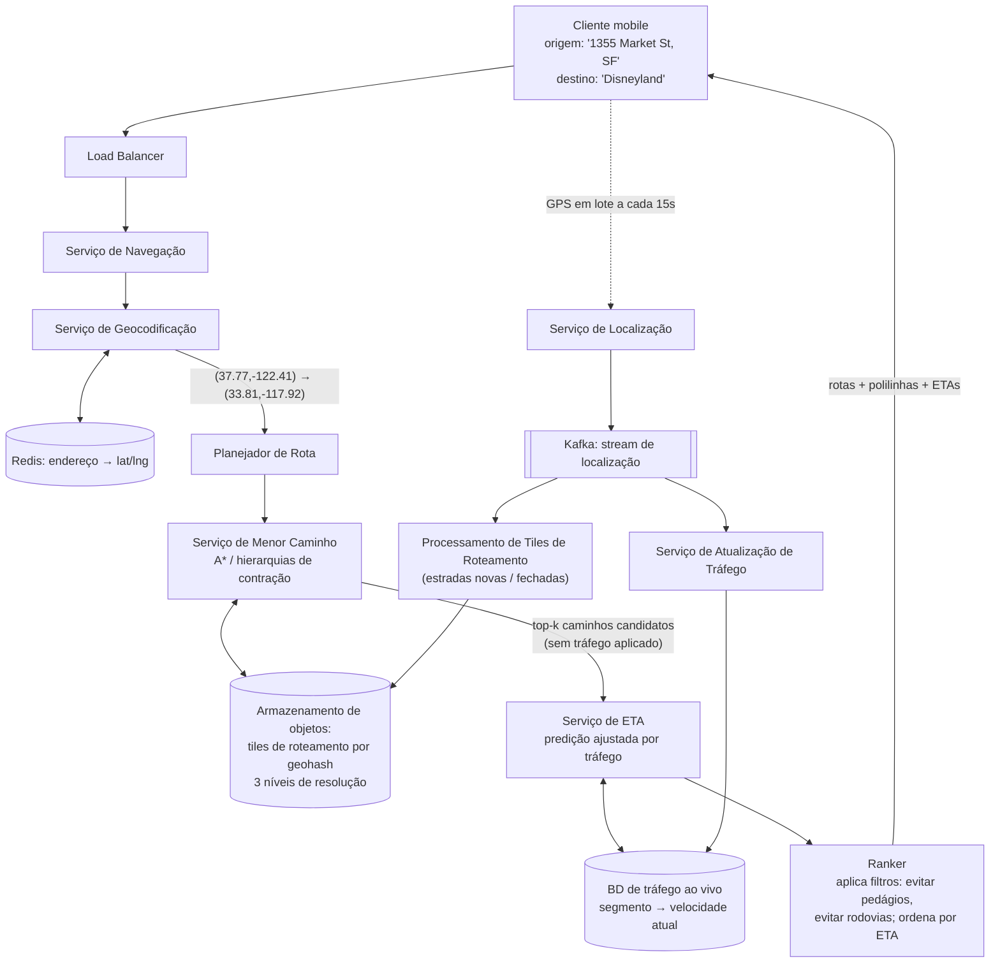

## Visão Geral

"Projete o Google Maps" não é um problema, são três problemas vestindo um sobretudo, e a forma mais rápida de perder o controle da entrevista é tratá-los como um só. **Renderização de mapas** é um problema de entrega de conteúdo estático: ~100 PB de tiles de imagem pré-renderizados que nunca mudam entre builds e precisam chegar a um celular via dados celulares. **Geocodificação** é um problema de busca texto-para-coordenada: intensivo em leitura, payloads minúsculos, efetivamente um cache. **Roteamento** é um problema de grafo: uma rede rodoviária com centenas de milhões de nós onde o algoritmo ingênuo de um curso de algoritmos precisaria de minutos e gigabytes para responder uma única consulta. Gargalos diferentes — largura de banda, vazão de leitura e custo de travessia de grafo — o que significa motores de armazenamento diferentes, estratégias de escalonamento diferentes, e modos de falha diferentes. Nomeie os três de cara, depois os projete separadamente.

Este conceito assume a camada de indexação geoespacial de [Designing a Proximity Service](proximity-service) — geohash, quadtree e S2 todos aparecem aqui como o esquema de endereçamento para tiles, e não são derivados novamente abaixo.

## Requisitos

Ancore o escopo em 1 bilhão de usuários ativos diários no celular, com terabytes de dados rodoviários brutos ingeridos de autoridades de mapeamento e melhorados ao longo do tempo pela própria telemetria do app. Três funcionalidades estão no escopo: **atualizações de localização do usuário**, **navegação com ETA**, e **renderização de mapas**. Listagens de negócios, fotos, e otimização de rota multi-parada estão explicitamente fora.

Os requisitos não funcionais são onde o design realmente é decidido:

- **Precisão sobre velocidade no caminho de roteamento.** Uma rota que é 20 segundos mais lenta que a ótima está bem; uma rota que manda um motorista para uma estrada fechada é uma falha de produto. Isso licencia caching e aproximação no ranking, mas não no próprio grafo rodoviário.
- **Renderização suave com dados e bateria mínimos.** O cliente é um celular em rede celular. Toda escolha de design — tamanho do tile, batching de atualizações de GPS, vetor vs. raster — é em última análise um argumento de uso de dados.
- **Enorme assimetria de leitura.** Buscas de tiles superam vastamente todo outro tipo de requisição, e todas são leituras de conteúdo imutável. Esse único fato é por que renderização é um problema de CDN e não um problema de serviço.
- **Volume de escrita muito alto e muito uniforme em atualizações de localização.** A 1B DAU e ~5 bilhões de minutos-navegação por dia, enviar uma correção de GPS a cada segundo seria ~3 milhões QPS. Fazer batch no cliente para uma requisição a cada 15 segundos reduz isso para ~200 mil QPS de média, ~1M QPS no pico.
- **Alta disponibilidade, tolerante à obsolescência.** A última posição conhecida de um usuário fica obsoleta no momento em que a próxima correção chega, então o armazenamento de localização troca consistência por disponibilidade sem discussão.

## A Pirâmide de Tiles de Mapa

O design ingênuo de renderização — gerar uma imagem para o viewport solicitado sob demanda — está errado por duas razões que se somam: há um número ilimitado de combinações (localização, zoom), então o cluster de renderização faz trabalho ilimitado, e toda resposta é única, então nada é cacheável. A correção é tornar o espaço de saída finito. **Pré-renderize o mundo em tiles fixos em cada nível de zoom**, e deixe o cliente buscar e montar os tiles de que precisa.

A pirâmide é definida por uma regra simples de duplicação. O nível de zoom 0 é o planeta inteiro em um único PNG de 256×256. Cada incremento dobra a contagem de tiles nas direções norte-sul e leste-oeste, então o nível *z* contém 4^*z* tiles, cada um ainda de 256×256 pixels:

| Zoom | Tiles | O que mostra |
|---|---|---|
| 0 | 1 | mundo inteiro |
| 8 | 65.536 | país / região |
| 14 | 268.435.456 | bairro |
| 21 | ~4,4 trilhões | edifícios individuais |

No nível 21, 4,4 trilhões de tiles × ~100 KB por PNG comprimido é aproximadamente 440 PB. Mas cerca de 90% da superfície da Terra é oceano, deserto e montanha — visualmente quase uniforme e portanto extremamente compressível — o que conservadoramente reduz isso para ~50 PB. Todo nível inferior custa um quarto do de cima, então a pirâmide inteira é uma série geométrica: 50 + 50/4 + 50/16 + … ≈ 67 PB. Chame de **~100 PB para o mapa multi-resolução completo**.

Esse número é o argumento inteiro. 100 PB não pode viver no cliente, e não deve ser regenerado por requisição. Tem que ser construído uma vez por um pipeline offline, armazenado em armazenamento de objetos, e servido da borda (edge).

### Por Que Isso É um Problema de CDN, Não um Problema de Serviço

Tiles são imutáveis entre builds de mapa, idênticos para todo usuário que olha para o mesmo lugar no mesmo zoom, e requisitados esmagadoramente com mais frequência do que são produzidos. Esse é o perfil de livro-texto para caching de borda (veja [Caching Strategies and CDNs](caching-strategies-and-cdns)). Um tile frio é puxado do bucket de origem uma vez, cacheado no ponto de presença, e servido dali para todo requisitante subsequente naquela região — e o tráfego de mapa é intensamente local geograficamente, então taxas de acerto de PoP são excelentes por construção.

O volume torna o caso concreto. Um usuário dirigindo a 30 km/h em um zoom onde um tile cobre um quarteirão de 200 m × 200 m consome cerca de 1,25 MB por minuto de navegação. Através de 5 bilhões de minutos-navegação por dia isso é ~6,25 bilhões de MB/dia, ou ~62.500 MB por segundo. Distribuído entre ~200 PoPs, cada localização de borda serve algumas centenas de MB/s — inteiramente ordinário. Force esse mesmo tráfego por um cluster de origem e vira um problema de capacidade sem boa resposta.

### Endereçando um Tile

A identidade do tile é sua célula geográfica, o que é exatamente o que o geohash (ou S2, ou uma tripla `z/x/y` de slippy-map) fornece: uma string determinística e ordenável computada a partir de um par lat/lng e um nível de zoom. A URL do tile então é apenas essa string:

```
https://cdn.map-provider.com/tiles/9q9hvu.png
```

Há uma decisão de design real escondida em *quem* computa essa string. Fazê-lo no cliente é uma linha de matemática e zero round-trips de rede — mas fixa o esquema de codificação em todo binário lançado em toda plataforma, e releases mobile são lentos e irreversíveis. Colocar um **serviço de tiles de mapa** fino na frente em vez disso (cliente envia lat/lng + zoom, o serviço retorna as 9 URLs de tile do viewport e seus oito vizinhos, cliente as baixa da CDN) custa um pequeno round-trip e compra a liberdade de mudar o esquema de tiling do lado do servidor. Nessa escala, a flexibilidade operacional geralmente vence.

### Raster ou Vetor

Enviar dados vetoriais (caminhos e polígonos) em vez de PNGs rasterizados e deixar o cliente desenhá-los via WebGL/Metal é uma melhoria estrita em dois eixos: geometria vetorial comprime muito melhor que imagens, e o zoom se torna contínuo em vez de uma troca abrupta entre níveis pixelados, porque o cliente reescala primitivas em vez de esticar bitmaps. O custo é um renderizador de cliente muito mais pesado e diferenças de renderização por plataforma — o que é por que tiles raster permanecem o caminho de fallback seguro.

## Geocodificação

Roteamento opera em coordenadas, mas usuários digitam endereços. **Geocodificação** converte "1600 Amphitheatre Parkway, Mountain View, CA" em `(37.4224764, -122.0842499)`; **geocodificação reversa** vai na outra direção, transformando uma correção de GPS em um endereço legível por humanos para a string "você chegou" e para compartilhar-minha-localização. Nenhum dos dois é uma busca de vizinho mais próximo — isso é trabalho do serviço de proximidade — então não os confunda.

A parte difícil da geocodificação direta é que a entrada é linguagem natural não estruturada: nomes de lugares, endereços parciais, erros de digitação, nomes de cidade ambíguos. A técnica clássica é a **interpolação** sobre uma rede rodoviária GIS — um segmento de estrada é conhecido por ir do número de casa 100 a 200 entre duas coordenadas, então o número 150 é estimado proporcionalmente ao longo dele — complementada por registros exatos em nível de "telhado" (rooftop) onde existem. A resposta distingue esses casos (`ROOFTOP` vs. interpolado) porque a precisão downstream depende disso.

Operacionalmente, geocodificação é o mais fácil dos três subsistemas: o corpus é pequeno em relação aos tiles, escritas são raras (endereços mudam na escala de tempo de registros municipais), e leituras são frequentes e sensíveis à latência porque toda requisição de navegação começa com duas delas. Um armazenamento de chave-valor como Redis, na frente de um armazenamento de registro durável, é o formato certo. Faça cache agressivamente; a distribuição de endereços consultados é extremamente enviesada.

## A Rede Rodoviária como um Grafo Ponderado

Modele interseções como **nós** e segmentos de estrada como **arestas**. O peso da aresta não é distância — é *custo de travessia*, tipicamente tempo de viagem esperado, que embute limite de velocidade, classe de estrada, restrições de curva e (como veremos) tráfego ao vivo. O menor caminho sobre esse grafo é a rota.

O problema é escala. O algoritmo de Dijkstra é correto e, em um grafo com pesos não negativos, ótimo no sentido de livro-texto — mas ele explora para fora a partir da origem em toda direção até alcançar o destino. Para uma consulta através do país, isso significa fixar essencialmente todo nó no continente. Com centenas de milhões de nós, uma única consulta custa segundos a minutos e precisa do grafo inteiro residente em memória. A 1 bilhão de DAU isso não é um sistema lento; é um impossível.

Três ideias corrigem isso, e um design real usa as três.

### Tiles de Roteamento

Aplique a ideia de tiling ao próprio grafo. Corte o mundo em células de grade e, para cada célula, serialize os nós e arestas dentro dela — mais referências aos tiles vizinhos que suas estradas cruzam — como uma lista de adjacência binária compacta. Esses são **tiles de roteamento**: mesma partição espacial dos tiles de mapa, payload completamente diferente (dados de grafo binários, não PNGs). O pathfinder carrega apenas os tiles de que precisa no momento, hidratando vizinhos sob demanda conforme a fronteira de busca se expande, então a memória acompanha o tamanho do corredor explorado em vez do tamanho do planeta. Armazene-os em armazenamento de objetos indexados por geohash e faça cache agressivamente na memória de processo do serviço de roteamento — não há consulta para rodar contra eles, então um banco de dados seria puro overhead. (O ["Why Tiles?"](https://valhalla.readthedocs.io/en/latest/mjolnir/why_tiles/) do Valhalla é o texto de referência open-source canônico para essa estrutura.)

### Hierarquia

Uma rota São Francisco → Los Angeles não deveria considerar becos sem saída residenciais em Fresno. Construa **três conjuntos de tiles de roteamento em resoluções diferentes**: tiles pequenos com todas as ruas locais, tiles maiores só com estradas arteriais, e tiles grandes contendo apenas rodovias. Nós carregam arestas cross-level — a rampa de acesso de uma rua local para uma rodovia é uma aresta de um nó em um tile pequeno para um nó em um tile grande — então a busca pode subir para a camada de rodovia durante a longa parte do meio da jornada e voltar ao nível de rua perto de ambos os pontos finais. Essa é a mesma intuição que um leitor de mapa humano tem, expressa como estrutura de grafo.

### Algoritmos Melhores

Duas técnicas fazem o trabalho real em produção:

- **A\* com heurística geográfica.** A\* é Dijkstra mais uma estimativa admissível do custo restante. Em uma rede rodoviária, a distância em linha reta (grande círculo) até o destino dividida pela velocidade plausível máxima é exatamente tal estimativa — nunca superestima, então a otimalidade é preservada, e enviesa a exploração em direção ao destino em vez de expandir um círculo em todas as direções. A fronteira de busca se torna uma elipse em vez de um disco, cortando nós fixados por um fator constante grande.
- **Hierarquias de contração (CH).** Um passo de pré-processamento que ordena nós por "importância" e remove iterativamente os não importantes, adicionando arestas de *atalho* que preservam distâncias de menor caminho através de cada nó removido. Uma consulta então roda uma busca bidirecional que só se move "para cima" na hierarquia, se encontrando no meio. O pré-processamento é caro e offline; a consulta é ordens de magnitude mais rápida que o Dijkstra puro no mesmo grafo — rotas continentais na faixa de milissegundos. A troca que importa: **atalhos são cozidos contra uma função de custo específica**, então mudar pesos de aresta (tráfego ao vivo!) os invalida, o que é por que sistemas de produção combinam CH com variantes customizáveis que separam o pré-processamento apenas-topologia da customização de pesos, frequentemente mutável.

Para a entrevista, a resposta esperada não é uma implementação. É: *Dijkstra é a linha de base correta e não escala; A\* com heurística geográfica poda a busca; hierarquias de contração movem o custo offline para o pré-processamento; tiling e hierarquia mantêm a memória limitada.*

## Tráfego em Tempo Real nos Pesos das Arestas

Tempo de viagem estático é um limite inferior para a realidade. O sistema já coleta ~1M atualizações de localização por segundo de usuários navegando; esses traces de GPS são, em agregado, uma medição ao vivo da velocidade de todo segmento de estrada sendo dirigido agora. Alimente o stream de localização em um log de mensagens (Kafka é a escolha padrão), e deixe um **serviço de atualização de tráfego** consumi-lo, agregar velocidades observadas por segmento, e escrever em um armazenamento de tráfego ao vivo.

Esse armazenamento então alimenta o roteamento em dois lugares:

1. **Pesos de aresta** — a velocidade atual em um segmento ajusta seu custo de travessia, então o pathfinder roteia ao redor de congestionamento em vez de através dele.
2. **Predição de ETA** — o serviço de ETA pega um caminho candidato e estima o tempo de viagem total a partir do tráfego atual *e* padrões históricos para aquele horário do dia. Isso é um problema de predição, não aritmética: uma rota que leva 40 minutos significa que o motorista alcança seus segmentos posteriores 40 minutos a partir de agora, então o modelo tem que predizer como o tráfego *vai estar*, não apenas como está. Sistemas de produção usam modelos aprendidos (redes neurais de grafo sobre a rede rodoviária) para exatamente isso.

O mesmo stream dirige o **reroteamento adaptativo**. Ingenuamente, encontrar quais navegadores ativos são afetados por um incidente no tile `r_2` significa varrer a lista de tiles de toda rota ativa — O(n·m) através de milhões de rotas. O truque é armazenar, para cada usuário ativo, não apenas seu tile atual mas a cadeia de tiles envolventes em resoluções sucessivamente mais grossas até um que contém seu destino. Checar se um incidente afeta um usuário então se torna um teste de contenção contra um único tile grosso, o que elimina a maioria esmagadora dos usuários em uma comparação antes de qualquer checagem detalhada rodar. Empurrar a rota atualizada para o cliente quer um canal bidirecional persistente — WebSocket sobre notificações push (limitado por payload, sem suporte web) ou long polling (mais pesado nos servidores).

## Por Que os Dados Vivem em Quatro Armazenamentos Diferentes

Nada sobre esses quatro conjuntos de dados sugere que pertençam ao mesmo engine — isso é [polyglot persistence](polyglot-persistence) como um movimento forçado em vez de uma preferência:

| Dado | Formato | Armazenamento | Por quê |
|---|---|---|---|
| Tiles de mapa | ~100 PB de blobs imutáveis, somente leitura, leituras geograficamente locais | Armazenamento de objetos + CDN | Nenhuma consulta é necessária; o único requisito é armazenamento em massa barato e entrega de borda |
| Tiles de roteamento | TBs de listas de adjacência binárias, reconstruídas por um pipeline offline, carregadas inteiras | Armazenamento de objetos indexado por geohash, cacheado em processo | O consumidor é uma travessia de grafo, não um planejador de consultas; um banco de dados não traz nada |
| Dados de geocodificação | Pequenos, intensivos em leitura, críticos em latência, raramente escritos | Armazenamento chave-valor (Redis) sobre um armazenamento de registro durável | Buscas pontuais com uma distribuição de acesso fortemente enviesada |
| Localizações de usuário e tráfego ao vivo | ~1M escritas/seg, somente-anexação, tolerante à obsolescência | Armazenamento wide-column (Cassandra), particionado por `user_id`, clusterizado por `timestamp` | Otimizado para escrita, escalável horizontalmente, AP sob partição |

A linha divisória é **estático vs. dinâmico**. Tiles e o grafo rodoviário mudam na escala de tempo de um pipeline de build offline — horas ou dias — então podem ser pré-computados, replicados em todo lugar, e cacheados com TTLs longos. Tráfego ao vivo e posições de usuário mudam a cada poucos segundos e não valem nada quando obsoletos. Colocá-los no mesmo armazenamento força um de dois erros: ou os dados estáticos herdam a amplificação de escrita do caminho dinâmico, ou os dados dinâmicos herdam semântica de cache que os torna errados.

## Caminho de Requisição para uma Consulta de Navegação



Leia o fluxo em duas metades. **Para baixo** é a requisição síncrona: geocodifica ambos os pontos finais, roda pathfinding sobre tiles de roteamento para obter top-k caminhos candidatos na estrutura rodoviária pura (cacheável, porque o grafo quase não muda), pontua cada candidato contra tráfego ao vivo no serviço de ETA, aplica filtros de usuário e ranqueia. **Para cima a partir do cliente** é o loop assíncrono: atualizações de GPS em lote chegam a um log, e consumidores as transformam em pesos de tráfego mais atuais e dados rodoviários corrigidos — o que é o que torna as rotas de amanhã melhores que as de hoje.

Note a separação entre o serviço de menor caminho e o serviço de ETA. Menor caminho responde "quais rotas fisicamente existem e são estruturalmente boas", o que depende apenas do grafo rodoviário e é portanto altamente cacheável. ETA responde "quanto tempo cada uma levará agora mesmo", o que depende de dados que mudam minuto a minuto. Fundi-los destruiria a cacheabilidade da metade cara.

## Trade-offs

- **Pré-renderizar a pirâmide de tiles inteira custa ~100 PB de armazenamento mas torna a renderização um puro problema de CDN** — a alternativa, renderização sob demanda, tem cardinalidade de saída ilimitada, então nada cacheia e o cluster de renderização escala com o tráfego em vez de com o tamanho do mundo. Armazenamento é barato e estático; computação sob carga não é nenhum dos dois.
- **Computar URLs de tile no cliente economiza um round-trip mas fixa o esquema de tiling em todo binário de app lançado** — um serviço de tile do lado do servidor adiciona uma pequena requisição por mudança de viewport e compra a capacidade de mudar codificações sem um release multi-plataforma coordenado. Escolha o round-trip a menos que o esquema de tiling seja genuinamente permanente.
- **Hierarquias de contração tornam o roteamento continental rápido em milissegundos, mas os atalhos são pré-computados contra uma função de custo fixa** — no momento em que o tráfego ao vivo muda pesos de aresta, uma hierarquia construída ingenuamente está obsoleta. Sistemas que precisam de velocidade e pesos ao vivo têm que dividir o pré-processamento em uma fase de topologia (rara) e uma fase de customização de pesos (frequente), o que é estritamente mais maquinaria que o A\* puro.
- **Tiles de roteamento hierárquicos tornam rotas longas tratáveis mas podem perder caminhos genuinamente ótimos** — restringir o meio de uma jornada longa às camadas arterial e de rodovia é uma suposição, não um teorema; um atalho por ruas de superfície que vence a rodovia durante o horário de pico pode nunca ser explorado. Essa é uma troca explícita de precisão por latência.
- **Fazer batch de atualizações de GPS a cada 15 segundos corta a carga de escrita em 15x e economiza bateria do celular, ao custo de latência de detecção de tráfego** — um incidente é observado até 15 segundos atrasado, e uma decisão de reroteamento herda esse atraso. O botão é adaptativo: desacelere o batch ainda mais quando o usuário está parado no trânsito, aperte quando estiver se movendo rápido perto de um ponto de decisão.
- **Separar os armazenamentos estáticos (tiles, grafo rodoviário) dos dinâmicos (localizações, tráfego) significa que a correção da rota agora depende de um pipeline, não de uma transação** — uma estrada fechada só é refletida uma vez que o job de processamento de tiles de roteamento reroda, então há uma janela real em que o sistema roteia motoristas com confiança para uma estrada que não existe mais. SLAs de atualidade nesse pipeline são um requisito de produto, não um detalhe de implementação.

## Perguntas de Entrevista

- A pirâmide de tiles no zoom máximo é ~440 PB antes da compressão e ~50 PB depois. Qual propriedade da superfície da Terra torna essa redução legítima, e onde o argumento quebraria?
- Dijkstra é ótimo em um grafo ponderado não negativo. Explique precisamente o que dá errado quando você o roda em uma rede rodoviária do tamanho de um continente, e o que a heurística geográfica do A\* muda sobre o trabalho realizado.
- Hierarquias de contração pré-computam arestas de atalho. Por que introduzir dados de tráfego ao vivo ameaça esse pré-processamento, e o que um sistema tem que fazer para manter os dois?
- Tiles de roteamento e tiles de mapa usam a mesma subdivisão espacial mas são armazenados e consumidos de forma completamente diferente. Descreva ambas as diferenças e explique por que compartilhar a subdivisão ainda é útil.
- Um incidente de tráfego aparece em um tile de roteamento. Ingenuamente, encontrar motoristas afetados é O(n·m) sobre todas as rotas ativas. Descreva um layout de dados que permite rejeitar a maioria dos usuários com uma única comparação, e declare o que isso custa.

## Referências

- [Alex Xu and Sahn Lam, "System Design Interview – An Insider's Guide, Volume 2" (ByteByteGo, 2022) — Capítulo 3, "Google Maps"](https://bytebytego.com)
- [Geisberger, Sanders, Schultes, Delling, "Contraction Hierarchies: Faster and Simpler Hierarchical Routing in Road Networks" (WEA 2008)](https://link.springer.com/chapter/10.1007/978-3-540-68552-4_24)
- [OpenStreetMap Wiki, "Slippy map tilenames" — the z/x/y tile addressing scheme and zoom-level math](https://wiki.openstreetmap.org/wiki/Slippy_map_tilenames)
- [DeepMind, "Traffic prediction with advanced Graph Neural Networks" — how ETA models learn over the road network](https://deepmind.google/discover/blog/traffic-prediction-with-advanced-graph-neural-networks/)
