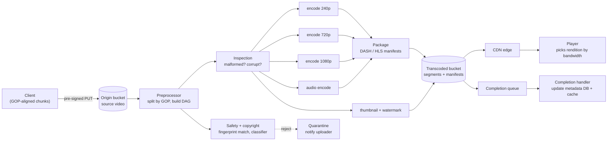

## Overview

Storing video is the easy part: object storage is cheap, durable, and already solved. The hard part of a video platform is what happens between "the bytes landed in a bucket" and "a phone on a degrading LTE connection starts playing in under two seconds" — one arbitrary source file has to become a matrix of renditions across resolutions, bitrates, codecs, and containers, and every one of those renditions has to be sitting on an edge server geographically close to the viewer before they press play. Transcoding is where the compute cost lives, CDN egress is where the money goes, and the source file in the origin bucket is arguably the least interesting artifact in the whole system: after the pipeline runs, almost nobody ever reads it again.

## Requirements

**Functional:** upload a video of arbitrary format and resolution (capped, say, at 1 GB), and watch a video on web, mobile, and smart TV clients. Everything else on the product surface — comments, subscriptions, playlists, recommendations — is explicitly out of scope for a 45-minute design; naming that boundary is part of the exercise.

**Non-functional**, each attached to a number rather than an adjective:

- **Upload reliability** — a 1 GB upload over a mobile connection will be interrupted. A dropped connection at 80% must not restart the transfer from zero.
- **Fast playback start** — the viewer sees the first frame in ~1-2 seconds, which rules out "download the file, then play it" and forces segmented streaming from an edge server.
- **Adaptive quality** — the player must switch renditions mid-playback as bandwidth changes, without a stall and without the user touching a quality menu.
- **Storage and bandwidth scale** — at 5M DAU with 10% of users uploading one ~300 MB video per day, that's roughly 150 TB of *source* video ingested daily, before transcoding multiplies it. At 5 videos watched per user per day, egress is ~7.5 PB/day; at commodity CDN pricing of ~$0.02/GB, that alone is six figures a day. Bandwidth cost, not disk cost, is the number that shapes the architecture.
- **Availability over strict consistency** — a view count that's a few seconds stale is fine; a video that won't play is not.

## High-Level Design

Three tiers, and the key structural decision is that only one of them ever touches video bytes:

- **API servers** handle everything *except* video: signup, metadata reads and writes, generating upload URLs, feed queries. Stateless, so the tier scales horizontally behind a load balancer.
- **Storage tier** — an origin bucket for source uploads, a separate bucket for transcoded renditions.
- **CDN** — serves every byte of actual playback. The API tier never proxies video.

### Upload

The upload path is the [Object Storage and the Direct-Upload Pattern](object-storage-and-direct-upload) applied verbatim: the client asks an API server for a pre-signed URL, the API server writes a `pending` metadata row and mints a short-lived, tightly scoped signature, and the client PUTs the bytes straight into the origin bucket. The API servers never see the payload, which is what keeps them cheap and stateless.

Two things extend that baseline for video. First, a 1 GB file needs [chunked, resumable upload](chunked-upload-deduplication-and-delta-sync) rather than one atomic PUT — but with a video-specific twist on where the chunk boundaries go: instead of arbitrary 10 MB offsets, the client splits on **GOP (Group of Pictures) alignment**. A GOP starts with a keyframe and contains the frames that depend on it, so a GOP-aligned chunk is an independently decodable unit — which means the transcoder can start encoding chunk 3 without waiting for chunks 1 and 2, and the same boundaries later become the segments the player fetches. Chunking for resumability and chunking for parallel encoding turn out to be the same operation. (Clients too old to split locally just send the whole file and let the server segment it.)

Second, metadata upload runs *in parallel* with the byte upload, not after it: while the file streams to the bucket, the client posts title, description, and format info to the API tier, which writes it to the metadata store. There's no reason to serialize a small JSON write behind a multi-minute transfer.

### Transcoding as a DAG

A source file is useless for streaming as-is. Raw or camera-native video is enormous, device codec support is fragmented, and a single bitrate can't serve both a smart TV on fiber and a phone on 3G. So the pipeline produces a **rendition matrix**: for each target resolution (240p through 4K), an encode at an appropriate bitrate, in the codecs the client fleet needs (H.264 for universal compatibility, VP9 or HEVC/AV1 for better compression on clients that support them), packaged into the right container.

That's not one job, it's a graph of jobs — and different videos need different graphs. One creator wants a watermark, another supplies their own thumbnail, a third uploads 4K when most upload 1080p. Encoding the pipeline as a **directed acyclic graph** of tasks (the model Facebook's Streaming Video Engine uses) makes the shape of the work configuration rather than code: the graph declares dependencies, and everything without a dependency between it runs in parallel.

Around that graph sits a scheduler and a resource manager: the **DAG scheduler** flattens the graph into stages and pushes ready tasks onto a priority task queue; the **resource manager** matches queued tasks against a pool of worker capacity and tracks what's currently running. Task workers are ordinary stateless compute — an encode worker, a thumbnail worker, an inspection worker — pulling from the queue. Intermediate GOPs and per-task artifacts go to temporary storage (blob storage for media, an in-memory cache for the small, hot metadata workers read constantly) and are freed once the video finishes, which also means a failed encode can retry from persisted segments instead of re-downloading the source.

Message queues between stages are what make the parallelism real. Without them, encode waits on download, package waits on encode, and the pipeline is a serial chain whose latency is the sum of its stages. With a queue at each boundary, every stage drains work as it appears, and the pipeline's throughput is bounded by its slowest stage's *capacity* rather than by any single video's critical path. The same queue provides the retry semantics: transcoding failures are overwhelmingly transient (a worker died, temp storage hiccuped), so recoverable errors retry a bounded number of times, while non-recoverable ones — a genuinely malformed container — cancel the remaining tasks for that video and surface an error to the uploader instead of burning worker capacity forever.

### Adaptive Bitrate Streaming

Playback is not a file download. The player fetches a **manifest** — an MPD for MPEG-DASH, an `.m3u8` playlist for HLS — that describes every available rendition and the URL of each few-second segment within it. The player then requests segments one at a time over plain HTTP, measures the throughput and buffer level it's actually achieving, and picks which rendition to request *next* accordingly: buffer draining and download rate falling means step down to 480p; buffer healthy and bandwidth ample means step up to 1080p. Because every rendition is cut on the same segment boundaries, the switch happens at the next segment with no re-buffering and no visible seam.

Two consequences fall out of this. Playback starts fast because the player only needs the manifest plus the first segment, typically at a conservative bitrate, not the whole file. And the entire delivery path is ordinary cacheable HTTP GETs of immutable objects — which is exactly what a CDN is optimal at, and why streaming rides on HTTP rather than a bespoke protocol.

### CDN Distribution

Transcoded segments are pushed to the CDN, and every playback request is served from the edge server nearest the viewer. This is standard [CDN](caching-strategies-and-cdns) behavior applied to unusually large, unusually hot, perfectly immutable objects — a video segment never changes after it's written, so cache invalidation, the usual hard part, mostly disappears.

The interesting pressure here is cost, because CDN egress dominates the bill. Viewership follows a long tail: a small number of videos take a large fraction of the plays, and the majority get almost none. The optimizations all exploit that shape — serve only popular videos from the CDN and fall back to origin storage servers for the tail; skip pre-encoding the full rendition matrix for unpopular content and encode on demand instead; distribute regionally popular videos only to the regions that watch them; and, at sufficient scale, build your own CDN and place appliances inside ISP networks rather than paying a commercial CDN's per-GB rate. Each of these trades a worse experience for cold content against a materially smaller bandwidth bill, and every one of them depends on having viewership data to segment by — which is why this is a deep-dive optimization and not a day-one design.

Upload paths benefit from the same edge geography in reverse: regional upload endpoints mean a creator in Asia isn't pushing 1 GB across an ocean to reach a bucket in Virginia.

## Metadata Lives Somewhere Else Entirely

Titles, descriptions, view counts, comments, channel subscriptions, and the mapping from a video id to its rendition URLs are small, highly structured, heavily queried, and constantly mutated. Video segments are enormous, opaque, written once, and never updated. Those two workloads have essentially nothing in common, and forcing them into one store means picking a system that's mediocre at both — this is [Polyglot Persistence](polyglot-persistence) at its most obvious.

So the split is: a sharded, replicated database holds metadata, fronted by a cache because the read:write ratio on video metadata is extreme; the buckets hold bytes; and the only link between them is a storage key or CDN URL on the metadata row. The pieces can even differ among themselves — relational for the video/user/channel relationships, something wide-column for the high-write-volume append-only data like view events or comments.

The consequence is that "the upload finished" and "the video is watchable" are different events at different times. The completion handler consumes transcoding-completion events off the queue and flips the metadata row from `processing` to `ready`, writing in the rendition URLs. Until then, the client shows a processing state — the metadata row exists, the video just isn't playable yet.

## Safety and Copyright in the Pipeline

The DAG is the natural place to enforce content policy, because it's the one point every video must pass through before it becomes reachable, and it's already an extensible graph of tasks. Inspection tasks catch malformed or corrupt files. Copyright checks compute a perceptual fingerprint of the audio and video and match it against a rights-holder database, so a match can block, mute, or monetize-on-behalf-of before publication rather than after a takedown request. Classifier tasks flag prohibited content for human review. All of these can run in parallel with encoding — there's no reason to serialize a policy check behind a 4K encode — but publication to the CDN must gate on their results, or the pipeline will happily distribute the exact content it was supposed to stop.

For content that does get published, protecting it in transit and at rest is a separate axis: DRM systems (FairPlay, Widevine, PlayReady) for licensed decryption, AES encryption of segments with an authorization-gated key endpoint, and visible watermarking burned in during encoding as a low-tech deterrent. And no upload-time check catches everything, so takedown has to work post-publication too — user flagging plus the ability to pull renditions from the CDN and mark the metadata row unavailable.

## Trade-offs

- **Pre-encoding the full rendition matrix gives instant playback at every quality, but multiplies storage and burns compute on videos nobody watches** — encoding on demand for the long tail inverts the trade: near-zero standing cost, but the first viewer of a cold video pays an encoding delay. The right answer depends on the popularity distribution, which means you need viewership data before you can choose.
- **GOP-aligned chunking serves resumable upload and parallel transcoding with one mechanism, at the cost of pushing video-format knowledge into the client** — the client has to parse enough of the container to find keyframe boundaries, and any client that can't must fall back to uploading whole and letting the server split, so the server-side path can never be deleted.
- **Serving everything from a commercial CDN gives global low-latency playback and is by far the largest line item in the budget** — the alternatives (origin fallback for cold content, regional distribution, ISP-embedded appliances) each save real money and each add operational surface, so they only pay off above a scale where the bandwidth bill exceeds the engineering cost of managing them.
- **Queues between pipeline stages buy parallelism and retryability, at the cost of a system with no single place that knows a video's true state** — progress becomes an aggregate over many independent task outcomes, and "why is this video stuck in processing?" requires tracing across queues rather than reading one row.
- **Adaptive bitrate streaming keeps playback smooth across changing networks, but hands quality control to a client-side heuristic** — an aggressive algorithm oscillates visibly between renditions, a conservative one leaves bandwidth unused and shows the viewer worse video than their connection could carry, and the server can only influence this indirectly through which renditions it makes available.
- **Splitting metadata from blobs lets each store do what it's good at, and makes them possible to disagree** — a `ready` row pointing at renditions the CDN purged, or transcoded segments with no metadata row referencing them, are both reachable states that need reconciliation, which a single-store design would never produce.

## Interview Questions

- Why does the video pipeline chunk on GOP boundaries specifically, rather than on fixed byte offsets the way a general file-sync product does?
- A viewer's bandwidth drops mid-playback. Trace exactly what happens, and explain why the switch doesn't cause a re-buffer.
- Where would you put the copyright check in the DAG, and what breaks if it runs in parallel with CDN publication instead of gating it?
- Your CDN bill is the single largest infrastructure cost. Which videos would you stop serving from the CDN, and what data would you need to make that call safely?
- Why does the metadata store need a completion queue and handler at all, instead of the transcoding workers writing to the metadata database directly when they finish?

## References

- [Alex Xu, "System Design Interview – An Insider's Guide, Volume 1" (ByteByteGo, 2020) — Chapter 14, "Design YouTube"](https://bytebytego.com)
- [IETF — RFC 8216, "HTTP Live Streaming"](https://datatracker.ietf.org/doc/html/rfc8216)
- [Huang et al. — "SVE: Distributed Video Processing at Facebook Scale" (SOSP 2017)](https://www.cs.princeton.edu/~wlloyd/papers/sve-sosp17.pdf)
- [Netflix Technology Blog — "Content Popularity for Open Connect"](https://netflixtechblog.com/content-popularity-for-open-connect-b86d56f613b)
