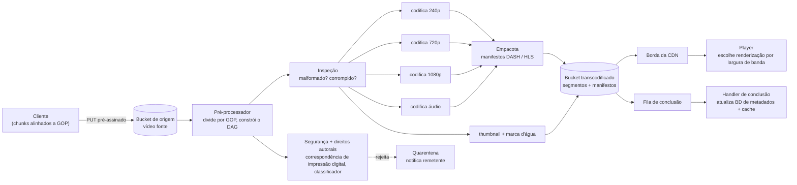

## Visão Geral

Armazenar vídeo é a parte fácil: armazenamento de objetos é barato, durável, e já resolvido. A parte difícil de uma plataforma de vídeo é o que acontece entre "os bytes chegaram em um bucket" e "um celular em uma conexão LTE degradando começa a reproduzir em menos de dois segundos" — um arquivo fonte arbitrário tem que se tornar uma matriz de renderizações através de resoluções, bitrates, codecs e contêineres, e cada uma dessas renderizações tem que estar sentada em um servidor de borda geograficamente próximo do espectador antes que ele aperte play. Transcodificação é onde o custo de computação vive, egresso de CDN é onde o dinheiro vai, e o arquivo fonte no bucket de origem é sem dúvida o artefato menos interessante em todo o sistema: depois que o pipeline roda, quase ninguém nunca o lê novamente.

## Requisitos

**Funcional:** enviar um vídeo de formato e resolução arbitrários (limitado, digamos, a 1 GB), e assistir a um vídeo em clientes web, mobile e smart TV. Tudo mais na superfície do produto — comentários, assinaturas, playlists, recomendações — está explicitamente fora do escopo para um design de 45 minutos; nomear essa fronteira é parte do exercício.

**Não funcional**, cada um anexado a um número em vez de um adjetivo:

- **Confiabilidade de upload** — um upload de 1 GB em uma conexão mobile será interrompido. Uma conexão perdida a 80% não pode reiniciar a transferência do zero.
- **Início rápido de reprodução** — o espectador vê o primeiro frame em ~1-2 segundos, o que descarta "baixar o arquivo, depois reproduzi-lo" e força streaming segmentado a partir de um servidor de borda.
- **Qualidade adaptativa** — o player tem que trocar de renderização no meio da reprodução conforme a largura de banda muda, sem travamento e sem o usuário tocar em um menu de qualidade.
- **Escala de armazenamento e largura de banda** — a 5M DAU com 10% dos usuários enviando um vídeo de ~300 MB por dia, isso é aproximadamente 150 TB de vídeo *fonte* ingerido diariamente, antes que a transcodificação multiplique isso. A 5 vídeos assistidos por usuário por dia, o egresso é ~7,5 PB/dia; a preço de commodity de CDN de ~$0,02/GB, isso sozinho é seis dígitos por dia. Custo de largura de banda, não custo de disco, é o número que molda a arquitetura.
- **Disponibilidade sobre consistência estrita** — uma contagem de visualizações que está obsoleta por alguns segundos está bem; um vídeo que não reproduz não está.

## Design de Alto Nível

Três camadas, e a decisão estrutural chave é que apenas uma delas alguma vez toca bytes de vídeo:

- **Servidores de API** tratam de tudo *exceto* vídeo: cadastro, leituras e escritas de metadados, geração de URLs de upload, consultas de feed. Sem estado, então a camada escala horizontalmente atrás de um balanceador de carga.
- **Camada de armazenamento** — um bucket de origem para uploads fonte, um bucket separado para renderizações transcodificadas.
- **CDN** — serve todo byte de reprodução real. A camada de API nunca faz proxy de vídeo.

### Upload

O caminho de upload é o [Object Storage and the Direct-Upload Pattern](object-storage-and-direct-upload) aplicado literalmente: o cliente pede a um servidor de API uma URL pré-assinada, o servidor de API escreve uma linha de metadados `pending` e cria uma assinatura de curta duração e estritamente escopada, e o cliente faz PUT dos bytes diretamente no bucket de origem. Os servidores de API nunca veem o payload, o que é o que os mantém baratos e sem estado.

Duas coisas estendem essa linha de base para vídeo. Primeiro, um arquivo de 1 GB precisa de [upload em chunks, resumível](chunked-upload-deduplication-and-delta-sync) em vez de um único PUT atômico — mas com uma reviravolta específica de vídeo sobre onde as fronteiras de chunk ficam: em vez de offsets arbitrários de 10 MB, o cliente divide no alinhamento de **GOP (Group of Pictures)**. Um GOP começa com um keyframe e contém os frames que dependem dele, então um chunk alinhado a GOP é uma unidade decodificável independentemente — o que significa que o transcodificador pode começar a codificar o chunk 3 sem esperar pelos chunks 1 e 2, e as mesmas fronteiras depois se tornam os segmentos que o player busca. Chunking para resumibilidade e chunking para codificação paralela acabam sendo a mesma operação. (Clientes velhos demais para dividir localmente só enviam o arquivo inteiro e deixam o servidor segmentá-lo.)

Segundo, o upload de metadados roda *em paralelo* com o upload de bytes, não depois: enquanto o arquivo é transmitido para o bucket, o cliente posta título, descrição e informação de formato para a camada de API, que a escreve no armazenamento de metadados. Não há razão para serializar uma pequena escrita JSON atrás de uma transferência de vários minutos.

### Transcodificação como um DAG

Um arquivo fonte é inútil para streaming como está. Vídeo bruto ou nativo de câmera é enorme, o suporte a codec de dispositivo é fragmentado, e um único bitrate não consegue servir tanto uma smart TV em fibra quanto um celular em 3G. Então o pipeline produz uma **matriz de renderização**: para cada resolução alvo (240p a 4K), uma codificação em um bitrate apropriado, nos codecs de que a frota de clientes precisa (H.264 para compatibilidade universal, VP9 ou HEVC/AV1 para melhor compressão em clientes que suportam), empacotado no contêiner correto.

Isso não é um job, é um grafo de jobs — e vídeos diferentes precisam de grafos diferentes. Um criador quer uma marca d'água, outro fornece sua própria thumbnail, um terceiro envia 4K quando a maioria envia 1080p. Codificar o pipeline como um **grafo acíclico dirigido** de tarefas (o modelo que o Streaming Video Engine do Facebook usa) torna a forma do trabalho configuração em vez de código: o grafo declara dependências, e tudo sem uma dependência entre eles roda em paralelo.

Ao redor desse grafo fica um scheduler e um gerenciador de recursos: o **scheduler do DAG** achata o grafo em estágios e empurra tarefas prontas para uma fila de tarefas com prioridade; o **gerenciador de recursos** combina tarefas enfileiradas contra um pool de capacidade de worker e rastreia o que está rodando atualmente. Workers de tarefa são computação sem estado comum — um worker de codificação, um worker de thumbnail, um worker de inspeção — puxando da fila. GOPs intermediários e artefatos por tarefa vão para armazenamento temporário (armazenamento de blob para mídia, um cache em memória para os pequenos e quentes metadados que os workers leem constantemente) e são liberados quando o vídeo termina, o que também significa que uma codificação falhada pode fazer retry a partir de segmentos persistidos em vez de rebaixar a fonte.

Filas de mensagens entre estágios são o que torna o paralelismo real. Sem elas, codificação espera por download, empacotamento espera por codificação, e o pipeline é uma cadeia serial cuja latência é a soma de seus estágios. Com uma fila em cada fronteira, cada estágio drena trabalho conforme ele aparece, e a vazão do pipeline é limitada pela *capacidade* do estágio mais lento em vez do caminho crítico de qualquer vídeo individual. A mesma fila fornece a semântica de retry: falhas de transcodificação são esmagadoramente transitórias (um worker morreu, armazenamento temporário engasgou), então erros recuperáveis fazem retry um número limitado de vezes, enquanto os não recuperáveis — um contêiner genuinamente malformado — cancelam as tarefas restantes daquele vídeo e mostram um erro ao remetente em vez de queimar capacidade de worker para sempre.

### Streaming de Bitrate Adaptativo

Reprodução não é um download de arquivo. O player busca um **manifesto** — um MPD para MPEG-DASH, uma playlist `.m3u8` para HLS — que descreve toda renderização disponível e a URL de cada segmento de poucos segundos dentro dela. O player então requisita segmentos um de cada vez via HTTP simples, mede a vazão e o nível de buffer que está realmente alcançando, e escolhe qual renderização requisitar *em seguida* de acordo: buffer esvaziando e taxa de download caindo significa reduzir para 480p; buffer saudável e largura de banda ampla significa subir para 1080p. Como toda renderização é cortada nas mesmas fronteiras de segmento, a troca acontece no próximo segmento sem rebuffering e sem costura visível.

Duas consequências decorrem disso. A reprodução começa rápido porque o player só precisa do manifesto mais o primeiro segmento, tipicamente em um bitrate conservador, não o arquivo inteiro. E o caminho de entrega inteiro é feito de GETs HTTP ordinários e cacheáveis de objetos imutáveis — o que é exatamente aquilo em que uma CDN é ótima, e por que streaming anda sobre HTTP em vez de um protocolo sob medida.

### Distribuição via CDN

Segmentos transcodificados são empurrados para a CDN, e toda requisição de reprodução é servida do servidor de borda mais próximo do espectador. Esse é o comportamento padrão de [CDN](caching-strategies-and-cdns) aplicado a objetos incomumente grandes, incomumente quentes, e perfeitamente imutáveis — um segmento de vídeo nunca muda depois de ser escrito, então invalidação de cache, a parte usualmente difícil, majoritariamente desaparece.

A pressão interessante aqui é custo, porque o egresso de CDN domina a conta. Visualização segue uma cauda longa: um pequeno número de vídeos toma uma grande fração das reproduções, e a maioria recebe quase nenhuma. As otimizações todas exploram essa forma — servir apenas vídeos populares da CDN e recorrer a servidores de armazenamento de origem para a cauda; pular a pré-codificação da matriz de renderização completa para conteúdo impopular e codificar sob demanda em vez disso; distribuir vídeos regionalmente populares apenas para as regiões que os assistem; e, em escala suficiente, construir sua própria CDN e colocar appliances dentro de redes de ISP em vez de pagar a taxa por GB de uma CDN comercial. Cada uma dessas troca uma experiência pior para conteúdo frio por uma conta de largura de banda materialmente menor, e cada uma delas depende de ter dados de visualização para segmentar — o que é por que isso é uma otimização de deep dive e não um design de primeiro dia.

Caminhos de upload se beneficiam da mesma geografia de borda em reverso: endpoints regionais de upload significam que um criador na Ásia não está empurrando 1 GB através de um oceano para alcançar um bucket na Virgínia.

## Metadados Vivem em Um Lugar Completamente Diferente

Títulos, descrições, contagens de visualização, comentários, assinaturas de canal, e o mapeamento de um id de vídeo para suas URLs de renderização são pequenos, altamente estruturados, fortemente consultados, e constantemente mutados. Segmentos de vídeo são enormes, opacos, escritos uma vez, e nunca atualizados. Essas duas cargas de trabalho têm essencialmente nada em comum, e forçá-las em um armazenamento significa escolher um sistema que é medíocre em ambos — isso é [Polyglot Persistence](polyglot-persistence) em sua forma mais óbvia.

Então a divisão é: um banco de dados sharded e replicado guarda metadados, com um cache na frente porque a proporção leitura:escrita em metadados de vídeo é extrema; os buckets guardam bytes; e o único link entre eles é uma chave de armazenamento ou URL de CDN na linha de metadados. As peças podem até diferir entre si — relacional para as relações vídeo/usuário/canal, algo wide-column para os dados de alto volume de escrita e somente-anexação como eventos de visualização ou comentários.

A consequência é que "o upload terminou" e "o vídeo está assistível" são eventos diferentes em momentos diferentes. O handler de conclusão consome eventos de conclusão de transcodificação da fila e vira a linha de metadados de `processing` para `ready`, escrevendo as URLs de renderização. Até então, o cliente mostra um estado de processamento — a linha de metadados existe, o vídeo simplesmente ainda não é reproduzível.

## Segurança e Direitos Autorais no Pipeline

O DAG é o lugar natural para impor política de conteúdo, porque é o único ponto por onde todo vídeo tem que passar antes de se tornar alcançável, e já é um grafo extensível de tarefas. Tarefas de inspeção capturam arquivos malformados ou corrompidos. Checagens de direitos autorais computam uma impressão digital perceptual do áudio e vídeo e a combinam contra um banco de dados de titulares de direitos, então uma correspondência pode bloquear, silenciar, ou monetizar-em-nome-de antes da publicação em vez de depois de uma solicitação de remoção. Tarefas de classificação sinalizam conteúdo proibido para revisão humana. Todas essas podem rodar em paralelo com a codificação — não há razão para serializar uma checagem de política atrás de uma codificação 4K — mas a publicação na CDN precisa depender dos resultados delas, ou o pipeline vai felizmente distribuir o exato conteúdo que deveria ter parado.

Para conteúdo que de fato é publicado, protegê-lo em trânsito e em repouso é um eixo separado: sistemas DRM (FairPlay, Widevine, PlayReady) para decodificação licenciada, criptografia AES de segmentos com um endpoint de chave protegido por autorização, e marca d'água visível gravada durante a codificação como um deterrente de baixa tecnologia. E nenhuma checagem em tempo de upload captura tudo, então remoção tem que funcionar pós-publicação também — sinalização de usuário mais a capacidade de puxar renderizações da CDN e marcar a linha de metadados como indisponível.

## Trade-offs

- **Pré-codificar a matriz de renderização completa dá reprodução instantânea em toda qualidade, mas multiplica armazenamento e queima computação em vídeos que ninguém assiste** — codificar sob demanda para a cauda longa inverte a troca: custo permanente próximo de zero, mas o primeiro espectador de um vídeo frio paga um atraso de codificação. A resposta certa depende da distribuição de popularidade, o que significa que você precisa de dados de visualização antes de poder escolher.
- **Chunking alinhado a GOP serve upload resumível e transcodificação paralela com um único mecanismo, ao custo de empurrar conhecimento de formato de vídeo para o cliente** — o cliente tem que parsear o suficiente do contêiner para encontrar fronteiras de keyframe, e qualquer cliente que não conseguir tem que recorrer a enviar inteiro e deixar o servidor dividir, então o caminho do lado do servidor nunca pode ser removido.
- **Servir tudo de uma CDN comercial dá reprodução global de baixa latência e é de longe o maior item de linha no orçamento** — as alternativas (fallback de origem para conteúdo frio, distribuição regional, appliances embutidos em ISP) cada uma economiza dinheiro real e cada uma adiciona superfície operacional, então elas só valem a pena acima de uma escala onde a conta de largura de banda excede o custo de engenharia de gerenciá-las.
- **Filas entre estágios do pipeline compram paralelismo e capacidade de retry, ao custo de um sistema sem nenhum lugar único que conheça o estado verdadeiro de um vídeo** — progresso vira um agregado sobre muitos resultados de tarefa independentes, e "por que este vídeo está travado em processamento?" exige rastrear através de filas em vez de ler uma linha.
- **Streaming de bitrate adaptativo mantém a reprodução suave através de redes mutáveis, mas entrega o controle de qualidade a uma heurística do lado do cliente** — um algoritmo agressivo oscila visivelmente entre renderizações, um conservador deixa largura de banda não usada e mostra ao espectador vídeo pior do que sua conexão poderia suportar, e o servidor só pode influenciar isso indiretamente através de quais renderizações torna disponíveis.
- **Separar metadados de blobs permite que cada armazenamento faça o que faz bem, e os torna capazes de discordar** — uma linha `ready` apontando para renderizações que a CDN removeu, ou segmentos transcodificados sem linha de metadados os referenciando, são ambos estados alcançáveis que precisam de reconciliação, o que um design de armazenamento único nunca produziria.

## Perguntas de Entrevista

- Por que o pipeline de vídeo faz chunk em fronteiras de GOP especificamente, em vez de offsets de byte fixos da forma como um produto genérico de sincronização de arquivos faz?
- A largura de banda de um espectador cai no meio da reprodução. Percorra exatamente o que acontece, e explique por que a troca não causa um rebuffer.
- Onde você colocaria a checagem de direitos autorais no DAG, e o que quebra se ela rodar em paralelo com a publicação na CDN em vez de depender dela?
- Sua conta de CDN é o maior custo único de infraestrutura. Quais vídeos você pararia de servir da CDN, e que dados você precisaria para fazer essa chamada com segurança?
- Por que o armazenamento de metadados precisa de uma fila de conclusão e handler, em vez dos workers de transcodificação escreverem no banco de dados de metadados diretamente quando terminam?

## Referências

- [Alex Xu, "System Design Interview – An Insider's Guide, Volume 1" (ByteByteGo, 2020) — Capítulo 14, "Design YouTube"](https://bytebytego.com)
- [IETF — RFC 8216, "HTTP Live Streaming"](https://datatracker.ietf.org/doc/html/rfc8216)
- [Huang et al. — "SVE: Distributed Video Processing at Facebook Scale" (SOSP 2017)](https://www.cs.princeton.edu/~wlloyd/papers/sve-sosp17.pdf)
- [Netflix Technology Blog — "Content Popularity for Open Connect"](https://netflixtechblog.com/content-popularity-for-open-connect-b86d56f613b)
