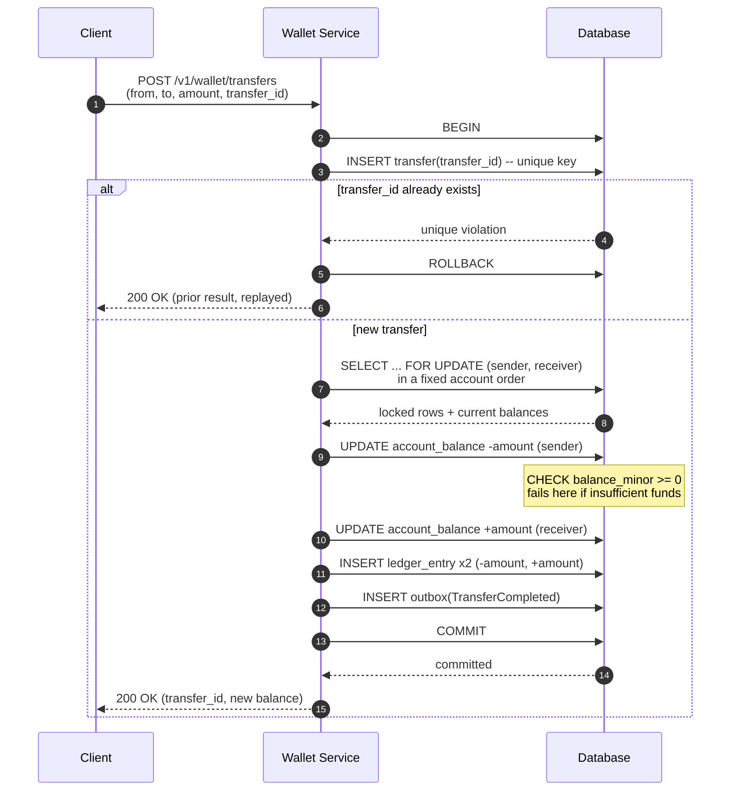

## Overview

A digital wallet holds money that users have already put into the platform and lets them spend it or send it to another user on the same platform. Its core guarantee is narrow and absolute: a user's balance is always exactly the sum of their transaction history, and no transfer can ever create or destroy money — not under concurrent transfers against the same account, not when a process dies halfway through, not when a client retries a request it never got an answer to. This is a different problem from [Designing a Payment System](payment-system-design), which is about talking to external payment providers, surviving their timeouts, and reconciling with their settlement files; here both sides of every movement live inside our own database, which makes correctness achievable with ordinary ACID transactions — and makes any violation of it entirely our fault.

## Functional Requirements

Scope a wallet interview down to the balance mechanics; the surrounding product (KYC, cards, rewards, currency conversion) is a distraction from the part that's actually hard.

- **Peer-to-peer transfer** — move an amount from one wallet to another wallet on the same platform, atomically.
- **Top-up and withdrawal** — move money in from an external funding source (bank card, bank account) and out to one. The external leg belongs to [Designing a Payment System](payment-system-design); the wallet's job is the internal ledger entry that mirrors it.
- **Balance query** — return a user's current spendable balance.
- **Transaction history** — return an ordered, immutable list of everything that has moved in or out of a wallet, which is also the audit trail.

Foreign exchange, fee schedules, and holds/authorizations are worth explicitly declaring out of scope; each one changes the ledger model in interesting ways, and naming them as deferred is more useful than half-designing them.

## Non-Functional Requirements

- **Strong consistency for balance-changing operations.** A wallet is the canonical example of a system that must pick consistency over availability for its write path. Showing a stale message in a chat app is a cosmetic bug; letting a balance go negative because two servers read the same stale number is a financial loss. Transfers serialize per account, and that is a feature.
- **Auditability and reproducibility.** Every balance must be explainable: for any point in time, the system should be able to reconstruct what a balance was and which entries produced it. Reconciliation can tell you two numbers disagree; only an immutable history can tell you *why*.
- **High availability for reads.** Balance and history reads vastly outnumber writes and can be served from replicas or a materialized view. The write path may briefly serialize on a hot account without the read path degrading — target availability like 99.99% is about keeping reads and the overall API alive, not about accepting a partially-applied transfer.
- **Throughput.** A large platform targets a million transfers per second, and each transfer touches two accounts — so the storage layer must sustain roughly twice that in account-level operations. Since a single relational node handles on the order of a thousand transactions per second, this forces sharding by account, which is what makes an otherwise trivial two-row update into a distributed systems problem.
- **Durability.** A committed transfer must survive node loss. Committed means replicated, not "written to one server's page cache."

## The Ledger: Balance Is Derived, Never Declared

The instinctive schema is a `accounts(user_id, balance)` table that gets mutated on every transfer. That model is wrong as a *source of truth*, for one reason: an `UPDATE` destroys information. After `balance = 40` becomes `balance = 39`, the row cannot tell you what happened, who did it, or whether it was supposed to happen. There is nothing to audit and nothing to replay.

The correct source of truth is an append-only ledger of entries, where the balance is a derived quantity:

```sql
CREATE TABLE ledger_entry (
    id            BIGSERIAL PRIMARY KEY,
    transfer_id   UUID        NOT NULL,          -- groups the two legs of one transfer
    account_id    BIGINT      NOT NULL,
    amount_minor  BIGINT      NOT NULL,          -- signed: negative = debit, positive = credit
    currency      CHAR(3)     NOT NULL,          -- ISO 4217
    entry_type    TEXT        NOT NULL,          -- TRANSFER | TOP_UP | WITHDRAWAL | REVERSAL
    created_at    TIMESTAMPTZ NOT NULL DEFAULT now()
);
CREATE INDEX ON ledger_entry (account_id, id);
CREATE UNIQUE INDEX ON ledger_entry (transfer_id, account_id);
```

Two details in that schema carry most of the weight. **Amounts are integers in the currency's minor unit** (cents), never `float` or `double`: binary floating point cannot represent 0.10 exactly, and a system that adds a hundred thousand such values will drift away from the truth by an amount no auditor will accept. If a decimal type is used instead, it must be a fixed-precision `NUMERIC`, and API payloads should carry the amount as a string so no JSON parser silently turns it into a double on the way in. **Rows are never updated or deleted** — a mistaken transfer is corrected by appending a compensating `REVERSAL` entry, so the history shows both the error and the correction rather than pretending the error never happened.

With this table, the balance is a query:

```sql
SELECT COALESCE(SUM(amount_minor), 0)
FROM ledger_entry
WHERE account_id = $1 AND currency = 'USD';
```

That query is correct and unusable in production — its cost grows without bound as an account accumulates history. The standard resolution is to keep **both**: the ledger as the authoritative audit trail, plus a materialized `account_balance` row updated *in the same transaction* as the entries that change it.

```sql
CREATE TABLE account_balance (
    account_id    BIGINT NOT NULL,
    currency      CHAR(3) NOT NULL,
    balance_minor BIGINT NOT NULL,
    version       BIGINT NOT NULL DEFAULT 0,
    PRIMARY KEY (account_id, currency),
    CONSTRAINT balance_non_negative CHECK (balance_minor >= 0)
);
```

Because the balance update and the ledger inserts commit together, the cached number can never drift from the log within a single-database deployment — and a periodic job that re-sums the ledger and compares it to `account_balance` turns that invariant into something continuously verified rather than merely assumed. Note the direction of authority: if the two ever disagree, the ledger is right and the balance row is repaired from it, never the reverse.

## A Transfer Is One Transaction, Not Two Updates

A peer-to-peer transfer is a *double-entry* operation: it writes a debit on the sender and a credit on the receiver, and the two amounts sum to zero. That sum-to-zero property is what makes "money cannot be created or destroyed" a checkable invariant rather than a slogan — at any moment, the sum of every `amount_minor` in the ledger for internal accounts equals the total money in the system, and any transfer that fails to preserve it is a bug you can detect with a single query.

Both legs must land or neither may, which in a single database is exactly what a transaction is for:



Everything inside `BEGIN … COMMIT` is one atomic unit: the two balance updates, the two ledger entries, the idempotency record, and the outbox row. A crash at any point before `COMMIT` leaves the database exactly as it was — there is no state in which the sender has been debited but the receiver not credited, because that state never becomes durable.

## Why Two Separate Updates Are Unsafe

The tempting shortcut is two independent statements, run outside a transaction or in separate ones:

```sql
UPDATE account_balance SET balance_minor = balance_minor - 500 WHERE account_id = 1;
-- ... crash here ...
UPDATE account_balance SET balance_minor = balance_minor + 500 WHERE account_id = 2;
```

This fails in two distinct ways, and it's worth keeping them apart because they have different fixes.

**Atomicity.** If the process dies, the node is evicted, or the network drops between the two statements, 500 minor units have vanished from the system. Wrapping both in one transaction fixes this completely — the database's own commit protocol is the guarantee, and no amount of application-level retry logic substitutes for it.

**Concurrency.** Even inside a transaction, correctness depends on how the balance is computed. Read-modify-write in application code is the classic lost update:

```sql
BEGIN;
SELECT balance_minor FROM account_balance WHERE account_id = 1;  -- reads 1000
-- application computes 1000 - 500 = 500
UPDATE account_balance SET balance_minor = 500 WHERE account_id = 1;
COMMIT;
```

Two concurrent transfers out of account 1 both read 1000, both compute their own result, and the second write overwrites the first — one of the two debits silently disappears while both transfers report success. Under PostgreSQL's default `READ COMMITTED` isolation this is entirely possible, because nothing about that isolation level prevents two transactions from reading the same row before either writes it.

There are three standard fixes, and an interview answer should be able to name the trade-offs:

- **Read-modify-write under a row lock.** `SELECT ... FOR UPDATE` takes an exclusive row lock, so the second transaction blocks on the `SELECT` until the first commits and then reads the already-decremented value. This is the general solution: it works when the new balance depends on business logic more complex than arithmetic (tiered limits, fee calculation), and it's what the sequence diagram above uses.
- **A single atomic statement.** `UPDATE account_balance SET balance_minor = balance_minor - 500 WHERE account_id = 1` reads and writes inside one statement, and the database takes a row lock for its duration — the second transaction re-reads the updated row when it unblocks. Cheaper than an explicit `SELECT ... FOR UPDATE` round trip, but only usable when the update is pure arithmetic on the stored value.
- **Optimistic concurrency.** Carry the `version` column into the `WHERE` clause and bump it; if zero rows are affected, someone else won the race and the transaction retries. This avoids holding locks but converts contention into retries, which is a good trade for accounts with rare contention and a bad one for hot accounts that would spend their time in a retry loop.

Whichever approach is chosen, **acquire locks on the two accounts in a deterministic order** — sorted by `account_id`, always. If transfer A→B locks A then B while a simultaneous transfer B→A locks B then A, the two deadlock; the database will detect it and abort one, but a wallet that returns spurious errors under normal peer-to-peer load is a wallet nobody trusts. A fixed ordering makes the cycle impossible in the first place.

## Preventing Negative Balances

Overdraft protection has to exist at two levels, and both are load-bearing.

The **application-level guard** runs inside the transaction after the sender's row is locked: read the balance, compare it to the amount, and roll back with a clean `INSUFFICIENT_FUNDS` error if it doesn't cover the transfer. This is the check that produces a good error message and is the one users actually experience. It is only correct because the row is locked — the same check performed before acquiring the lock is a time-of-check-to-time-of-use bug, since another transfer can drain the account between the check and the update.

The **database check constraint** (`CHECK (balance_minor >= 0)`) is the backstop. It cannot be bypassed by a buggy code path, a hand-run SQL fix, a new service that forgot the guard, or a race the application logic didn't anticipate — any transaction that would drive a balance below zero aborts at commit. Treat a constraint violation surfacing in production as a genuine incident: it means the application-level guard failed, and the constraint just prevented that failure from becoming a financial loss. This is the difference between a system that is correct and a system that is *provably* correct; the constraint costs nothing and removes an entire class of outcome from the space of possible bugs.

## Idempotency for Retried Transfers

Every transfer request must carry a client-generated `transfer_id` (a UUID), and the server must treat it as a uniqueness key. The reason is unavoidable: if a client sends a transfer and the connection drops before the response arrives, the client cannot distinguish "the transfer committed and the response was lost" from "the transfer never happened." Its only safe move is to retry — and without deduplication, a retry moves the money a second time.

The mechanism is a unique constraint doing the work, not a lookup:

```sql
CREATE TABLE transfer (
    transfer_id   UUID PRIMARY KEY,
    from_account  BIGINT NOT NULL,
    to_account    BIGINT NOT NULL,
    amount_minor  BIGINT NOT NULL,
    status        TEXT NOT NULL,
    created_at    TIMESTAMPTZ NOT NULL DEFAULT now()
);
```

The `INSERT` into `transfer` happens inside the same transaction as the balance updates and ledger entries. A duplicate request violates the primary key, the whole transaction rolls back, and the service returns the original stored result. A `SELECT`-then-`INSERT` check instead of relying on the constraint reintroduces exactly the race it was meant to close — two concurrent retries can both find nothing and both proceed. [Designing a Payment System](payment-system-design) covers the idempotency-key pattern in depth, including how long keys must be retained and how to handle a retry that arrives with the same key but a different payload.

## Emitting Events Without a Distributed Transaction

Once a transfer commits, other parts of the system need to know: notifications, fraud scoring, analytics, the user's activity feed. Publishing to a message broker after the commit is the dual-write problem — the commit can succeed and the publish fail, and the event is gone. Publishing before the commit is worse: consumers act on a transfer that then rolls back.

The fix is to insert the event into an `outbox` table *inside the transfer transaction*, so the event's durability is the same commit as the money movement, and let a separate relay forward outbox rows to the broker. [The Transactional Outbox Pattern](outbox-pattern) covers the relay implementations (polling versus CDC), the at-least-once guarantee it provides, and why every consumer of `TransferCompleted` must therefore be idempotent — a duplicate delivery must not send two push notifications or double-count a transfer in a fraud model.

## Reproducibility and Replay

The ledger being append-only buys something beyond auditing: the entire balance state is a pure function of the entry log. Feed the log through the same deterministic reducer and you get the same balances every time, which answers the three questions an auditor actually asks — what was this balance at 3pm last Tuesday, how do we know today's balance is right, and did last month's code change alter any outcomes. The first is a replay up to a timestamp, the second is a re-sum compared against `account_balance`, the third is replaying the same log through two code versions and diffing the results.

Replaying from the beginning gets expensive as the log grows, so production systems checkpoint: periodically persist a **snapshot** of all balances alongside the ledger id it was computed through, and replay only the entries after it. Financial teams typically want a snapshot at a fixed daily boundary so a day's activity can be verified in isolation. This is event sourcing in its most defensible form, and it composes naturally with a CQRS-style split where the write path appends entries and one or more read-only projections build the views that serve balance queries and statements.

## Scaling Past a Single Database

At a million transfers per second, all accounts cannot share one database, so accounts are sharded — typically by hashing `account_id`. Transfers between two accounts on the same shard remain a single local transaction and keep every guarantee above. Transfers that cross shards lose the ability to use one `COMMIT`, and something has to replace it:

- **Two-phase commit (2PC)** gives real atomicity at the database level but holds locks across network round trips to every participant and makes the coordinator a single point of failure. Throughput collapses well below the target, which is why it is rarely the answer at this scale.
- **Try-Confirm/Cancel (TC/C)** splits the transfer into a reservation phase (debit the sender, no-op on the receiver) and a confirm phase (credit the receiver) — or a cancel phase that appends a compensating entry restoring the sender. Each phase is its own local transaction, so no lock is held between them.
- **Saga** runs the same steps as an ordered sequence of local transactions, each with a compensating action, coordinated by an orchestrator that records progress in a phase-status table so it can resume after a crash.

All three application-level approaches share one consequence worth stating plainly in an interview: between the debit and the credit, the money is momentarily in neither account, and that intermediate state is *visible* to anything reading the two balances. The system is atomic end-to-end but not isolated in the way a single transaction is. Two design rules follow. **Always debit before crediting** — the reverse order lets a recipient spend money that a subsequent cancel needs to claw back, and the money may already be gone. And **make compensations tolerant of out-of-order delivery**: a cancel can reach a shard before the try it is cancelling, so a node must be able to record "cancelled" for a transfer it has never seen and reject the try when it eventually arrives.

## Trade-offs

- **Deriving balance from the ledger is auditable but slow; caching it is fast but adds an invariant to maintain** — keeping both is the standard compromise, and it only holds because the balance update and the ledger inserts share one commit. The moment those two writes can diverge (different databases, different services), the cached balance stops being trustworthy and becomes something that must be reconciled rather than relied on.
- **Row-level locking makes concurrent transfers correct but serializes writes per account** — fine for ordinary users, a real bottleneck for a merchant or platform account receiving thousands of credits per second. The escape hatch is to split a hot account into N sub-accounts that are credited independently and summed on read, trading a simple balance query for write parallelism.
- **Optimistic concurrency avoids lock contention but converts it into retries** — attractive because nothing blocks, but under genuine contention the retry loop wastes more work than a lock would have, and a starved writer can fail repeatedly while others succeed. Choose it for accounts that rarely see simultaneous writes, not for hot ones.
- **A check constraint is an unconditional guarantee but a poor user experience on its own** — it aborts the transaction with a database error rather than a meaningful `INSUFFICIENT_FUNDS` response. It is a backstop for the application-level guard, never a replacement for it.
- **Cross-shard transfers via TC/C or Saga scale past a single node but expose intermediate states** — the sum of the two balances is briefly wrong, monitoring and support tooling must understand that a transfer can legitimately be in-flight, and the compensation logic is application code that has to be correct in every failure ordering, including out-of-order delivery.
- **Event sourcing gives perfect reproducibility at the cost of storage and replay time** — the log grows forever and never shrinks, which is exactly what makes it valuable to auditors and expensive to operate. Snapshots make replay tractable but add their own correctness question: a snapshot computed from buggy logic silently propagates that bug forward until someone replays past it.

## Interview Questions

- The balance is stored in a column *and* derivable from the ledger. Which one is authoritative, what does it take for them to disagree, and how would you detect and repair a disagreement?
- Two concurrent transfers debit the same account with `SELECT balance` followed by `UPDATE balance = <computed>` inside a transaction. Under `READ COMMITTED`, what goes wrong, and give two different fixes with the reason you'd choose one over the other?
- A transfer request times out and the client retries with the same `transfer_id`. Walk through what the server does, and explain why checking for an existing transfer with a `SELECT` before inserting is not sufficient.
- You have a `CHECK (balance >= 0)` constraint and an application-level balance check. Why keep both, and what should happen operationally if the constraint ever fires?
- A cross-shard transfer debits the sender, then the credit to the receiver fails permanently. What does the system do, and why must the debit have happened before the credit rather than the other way around?

## References

- [Alex Xu and Sahn Lam, "System Design Interview – An Insider's Guide, Volume 2" (ByteByteGo, 2022) — Chapter 12, "Digital Wallet"](https://bytebytego.com)
- [PostgreSQL Documentation — Explicit Locking (row-level locks and `SELECT ... FOR UPDATE`)](https://www.postgresql.org/docs/current/explicit-locking.html)
- [Square Engineering — "Books, an immutable double-entry accounting database service"](https://developer.squareup.com/blog/books-an-immutable-double-entry-accounting-database-service/)
- [Stripe — "Ledger: Stripe's system for tracking and validating money movement"](https://stripe.com/blog/ledger-stripe-system-for-tracking-and-validating-money-movement)
