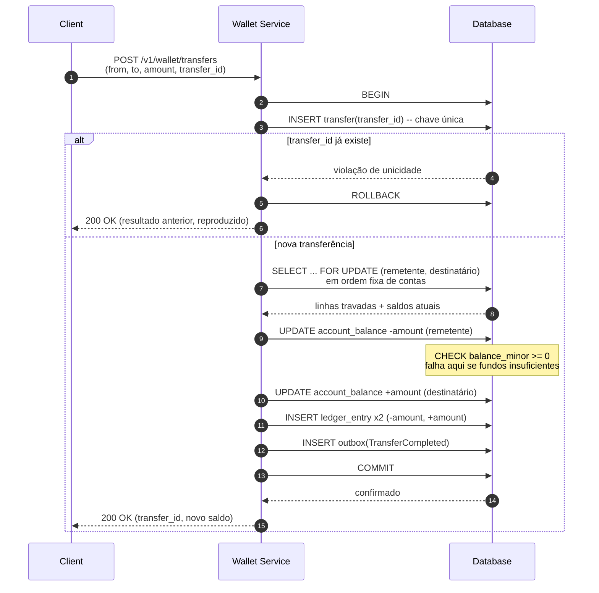

## Visão Geral

Uma carteira digital guarda dinheiro que os usuários já colocaram na plataforma e permite que eles o gastem ou o enviem para outro usuário na mesma plataforma. Sua garantia central é estreita e absoluta: o saldo de um usuário é sempre exatamente a soma do seu histórico de transações, e nenhuma transferência pode jamais criar ou destruir dinheiro — nem sob transferências concorrentes contra a mesma conta, nem quando um processo morre na metade do caminho, nem quando um cliente reenvia uma requisição para a qual nunca recebeu resposta. Este é um problema diferente de [Designing a Payment System](payment-system-design), que trata de conversar com provedores de pagamento externos, sobreviver aos timeouts deles e reconciliar com seus arquivos de liquidação; aqui, ambos os lados de cada movimentação vivem dentro do nosso próprio banco de dados, o que torna a correção alcançável com transações ACID comuns — e torna qualquer violação dela inteiramente nossa culpa.

## Requisitos Funcionais

Delimite uma entrevista sobre carteira à mecânica de saldo; o produto ao redor (KYC, cartões, recompensas, conversão de moeda) é uma distração da parte que é de fato difícil.

- **Transferência peer-to-peer** — mover um valor de uma carteira para outra carteira na mesma plataforma, atomicamente.
- **Depósito e saque** — mover dinheiro de uma fonte de financiamento externa (cartão bancário, conta bancária) para dentro, e de volta para fora. A perna externa pertence a [Designing a Payment System](payment-system-design); o trabalho da carteira é o lançamento interno no ledger que a espelha.
- **Consulta de saldo** — retornar o saldo disponível atual de um usuário.
- **Histórico de transações** — retornar uma lista ordenada e imutável de tudo que entrou ou saiu de uma carteira, que é também a trilha de auditoria.

Câmbio, tabelas de taxas e holds/autorizações valem a pena ser declarados explicitamente fora de escopo; cada um deles muda o modelo de ledger de formas interessantes, e nomeá-los como adiados é mais útil do que desenhá-los pela metade.

## Requisitos Não Funcionais

- **Consistência forte para operações que alteram saldo.** Uma carteira é o exemplo canônico de um sistema que precisa escolher consistência em vez de disponibilidade no seu caminho de escrita. Mostrar uma mensagem desatualizada em um app de chat é um bug cosmético; deixar um saldo ficar negativo porque dois servidores leram o mesmo número desatualizado é uma perda financeira. Transferências serializam por conta, e isso é uma feature.
- **Auditabilidade e reprodutibilidade.** Todo saldo precisa ser explicável: para qualquer ponto no tempo, o sistema deve conseguir reconstruir qual era o saldo e quais lançamentos o produziram. Reconciliação consegue dizer que dois números discordam; só um histórico imutável consegue dizer *por quê*.
- **Alta disponibilidade para leituras.** Leituras de saldo e histórico superam em muito as escritas e podem ser servidas a partir de réplicas ou de uma view materializada. O caminho de escrita pode brevemente serializar em uma conta quente sem que o caminho de leitura degrade — uma meta de disponibilidade como 99,99% é sobre manter leituras e a API geral no ar, não sobre aceitar uma transferência parcialmente aplicada.
- **Throughput.** Uma plataforma grande mira um milhão de transferências por segundo, e cada transferência toca duas contas — então a camada de armazenamento precisa sustentar aproximadamente o dobro disso em operações no nível de conta. Como um único nó relacional lida com algo na ordem de mil transações por segundo, isso força sharding por conta, o que transforma uma atualização de duas linhas, de outra forma trivial, em um problema de sistemas distribuídos.
- **Durabilidade.** Uma transferência confirmada precisa sobreviver à perda de um nó. Confirmada significa replicada, não "escrita no page cache de um servidor".

## O Ledger: o Saldo É Derivado, Nunca Declarado

O esquema instintivo é uma tabela `accounts(user_id, balance)` que é mutada a cada transferência. Esse modelo está errado como *fonte da verdade*, por um motivo: um `UPDATE` destrói informação. Depois que `balance = 40` vira `balance = 39`, a linha não consegue dizer o que aconteceu, quem fez e se era para acontecer. Não há nada para auditar e nada para reproduzir.

A fonte da verdade correta é um ledger somente-anexação de lançamentos, onde o saldo é uma quantidade derivada:

```sql
CREATE TABLE ledger_entry (
    id            BIGSERIAL PRIMARY KEY,
    transfer_id   UUID        NOT NULL,          -- agrupa as duas pernas de uma transferência
    account_id    BIGINT      NOT NULL,
    amount_minor  BIGINT      NOT NULL,          -- com sinal: negativo = débito, positivo = crédito
    currency      CHAR(3)     NOT NULL,          -- ISO 4217
    entry_type    TEXT        NOT NULL,          -- TRANSFER | TOP_UP | WITHDRAWAL | REVERSAL
    created_at    TIMESTAMPTZ NOT NULL DEFAULT now()
);
CREATE INDEX ON ledger_entry (account_id, id);
CREATE UNIQUE INDEX ON ledger_entry (transfer_id, account_id);
```

Dois detalhes nesse esquema carregam a maior parte do peso. **Os valores são inteiros na unidade menor da moeda** (centavos), nunca `float` ou `double`: ponto flutuante binário não consegue representar 0,10 exatamente, e um sistema que soma cem mil valores desses vai se distanciar da verdade em uma quantidade que nenhum auditor vai aceitar. Se um tipo decimal for usado no lugar, precisa ser um `NUMERIC` de precisão fixa, e os payloads da API devem carregar o valor como string para que nenhum parser JSON o transforme silenciosamente em double na entrada. **Linhas nunca são atualizadas ou apagadas** — uma transferência equivocada é corrigida anexando um lançamento compensatório `REVERSAL`, então o histórico mostra tanto o erro quanto a correção, em vez de fingir que o erro nunca aconteceu.

Com essa tabela, o saldo é uma consulta:

```sql
SELECT COALESCE(SUM(amount_minor), 0)
FROM ledger_entry
WHERE account_id = $1 AND currency = 'USD';
```

Essa consulta está correta e é inutilizável em produção — seu custo cresce sem limite conforme uma conta acumula histórico. A resolução padrão é manter **ambos**: o ledger como a trilha de auditoria autoritativa, mais uma linha materializada `account_balance` atualizada *na mesma transação* que os lançamentos que a alteram.

```sql
CREATE TABLE account_balance (
    account_id    BIGINT NOT NULL,
    currency      CHAR(3) NOT NULL,
    balance_minor BIGINT NOT NULL,
    version       BIGINT NOT NULL DEFAULT 0,
    PRIMARY KEY (account_id, currency),
    CONSTRAINT balance_non_negative CHECK (balance_minor >= 0)
);
```

Como a atualização do saldo e as inserções no ledger são confirmadas juntas, o número em cache nunca pode se distanciar do log dentro de uma implantação de banco de dados único — e um job periódico que re-soma o ledger e o compara com `account_balance` transforma esse invariante em algo continuamente verificado em vez de meramente presumido. Note a direção da autoridade: se os dois algum dia discordarem, o ledger está certo e a linha de saldo é reparada a partir dele, nunca o contrário.

## Uma Transferência É Uma Transação, Não Duas Atualizações

Uma transferência peer-to-peer é uma operação de *partida dobrada*: ela escreve um débito no remetente e um crédito no destinatário, e os dois valores somam zero. Essa propriedade de somar zero é o que torna "dinheiro não pode ser criado nem destruído" um invariante verificável em vez de um slogan — a qualquer momento, a soma de todo `amount_minor` no ledger para contas internas é igual ao dinheiro total no sistema, e qualquer transferência que falhe em preservar isso é um bug detectável com uma única consulta.

As duas pernas precisam ser confirmadas ou nenhuma pode ser, o que em um único banco de dados é exatamente para o que serve uma transação:



Tudo dentro de `BEGIN … COMMIT` é uma unidade atômica: as duas atualizações de saldo, os dois lançamentos no ledger, o registro de idempotência e a linha no outbox. Uma queda a qualquer momento antes do `COMMIT` deixa o banco de dados exatamente como estava — não existe estado em que o remetente foi debitado mas o destinatário não foi creditado, porque esse estado nunca se torna durável.

## Por Que Duas Atualizações Separadas São Inseguras

O atalho tentador é dois statements independentes, executados fora de uma transação ou em transações separadas:

```sql
UPDATE account_balance SET balance_minor = balance_minor - 500 WHERE account_id = 1;
-- ... queda aqui ...
UPDATE account_balance SET balance_minor = balance_minor + 500 WHERE account_id = 2;
```

Isso falha de duas maneiras distintas, e vale a pena mantê-las separadas porque têm correções diferentes.

**Atomicidade.** Se o processo morre, o nó é removido, ou a rede cai entre os dois statements, 500 unidades menores desapareceram do sistema. Envolver os dois em uma única transação corrige isso completamente — o próprio protocolo de commit do banco de dados é a garantia, e nenhuma quantidade de lógica de retry no nível da aplicação o substitui.

**Concorrência.** Mesmo dentro de uma transação, a correção depende de como o saldo é calculado. Read-modify-write no código da aplicação é o clássico lost update:

```sql
BEGIN;
SELECT balance_minor FROM account_balance WHERE account_id = 1;  -- lê 1000
-- a aplicação calcula 1000 - 500 = 500
UPDATE account_balance SET balance_minor = 500 WHERE account_id = 1;
COMMIT;
```

Duas transferências concorrentes saindo da conta 1 ambas leem 1000, ambas calculam seu próprio resultado, e a segunda escrita sobrescreve a primeira — um dos dois débitos desaparece silenciosamente enquanto ambas as transferências reportam sucesso. Sob o isolamento `READ COMMITTED` padrão do PostgreSQL isso é inteiramente possível, porque nada nesse nível de isolamento impede que duas transações leiam a mesma linha antes que qualquer uma delas escreva nela.

Existem três correções padrão, e uma resposta de entrevista deveria conseguir nomear os trade-offs:

- **Read-modify-write sob um lock de linha.** `SELECT ... FOR UPDATE` toma um lock exclusivo na linha, então a segunda transação bloqueia no `SELECT` até a primeira confirmar, e então lê o valor já decrementado. Essa é a solução geral: funciona quando o novo saldo depende de lógica de negócio mais complexa do que aritmética (limites escalonados, cálculo de taxas), e é o que o diagrama de sequência acima usa.
- **Um único statement atômico.** `UPDATE account_balance SET balance_minor = balance_minor - 500 WHERE account_id = 1` lê e escreve dentro de um statement, e o banco de dados toma um lock de linha durante sua duração — a segunda transação relê a linha atualizada quando desbloqueia. Mais barato do que um round trip explícito de `SELECT ... FOR UPDATE`, mas só é utilizável quando a atualização é aritmética pura sobre o valor armazenado.
- **Concorrência otimista.** Carregue a coluna `version` na cláusula `WHERE` e a incremente; se zero linhas forem afetadas, alguém mais ganhou a corrida e a transação tenta de novo. Isso evita segurar locks, mas converte contenção em retries, o que é uma boa troca para contas com contenção rara e uma má para contas quentes que passariam o tempo em um loop de retry.

Qualquer que seja a abordagem escolhida, **adquira os locks nas duas contas em uma ordem determinística** — ordenada por `account_id`, sempre. Se a transferência A→B trava A e depois B enquanto uma transferência simultânea B→A trava B e depois A, as duas entram em deadlock; o banco de dados vai detectar isso e abortar uma delas, mas uma carteira que retorna erros espúrios sob carga normal peer-to-peer é uma carteira em que ninguém confia. Uma ordenação fixa torna o ciclo impossível desde o início.

## Prevenindo Saldos Negativos

A proteção contra overdraft precisa existir em dois níveis, e ambos são estruturais.

A **guarda no nível de aplicação** roda dentro da transação depois que a linha do remetente é travada: lê o saldo, o compara com o valor, e faz rollback com um erro limpo `INSUFFICIENT_FUNDS` se ele não cobrir a transferência. Essa é a checagem que produz uma boa mensagem de erro e é a que os usuários de fato experimentam. Ela só está correta porque a linha está travada — a mesma checagem realizada antes de adquirir o lock é um bug de time-of-check-to-time-of-use, já que outra transferência pode drenar a conta entre a checagem e a atualização.

A **check constraint do banco de dados** (`CHECK (balance_minor >= 0)`) é o backstop. Ela não pode ser contornada por um caminho de código com bug, uma correção SQL manual, um novo serviço que esqueceu a guarda, ou uma corrida que a lógica de aplicação não previu — qualquer transação que levaria um saldo abaixo de zero aborta no commit. Trate uma violação de constraint surgindo em produção como um incidente genuíno: significa que a guarda no nível de aplicação falhou, e a constraint apenas impediu que essa falha se tornasse uma perda financeira. Essa é a diferença entre um sistema que é correto e um sistema que é *provadamente* correto; a constraint não custa nada e remove uma classe inteira de resultado do espaço de bugs possíveis.

## Idempotência para Transferências Reenviadas

Toda requisição de transferência precisa carregar um `transfer_id` gerado pelo cliente (um UUID), e o servidor precisa tratá-lo como uma chave de unicidade. O motivo é inevitável: se um cliente envia uma transferência e a conexão cai antes da resposta chegar, o cliente não consegue distinguir "a transferência foi confirmada e a resposta se perdeu" de "a transferência nunca aconteceu". Sua única jogada segura é reenviar — e sem deduplicação, um reenvio move o dinheiro uma segunda vez.

O mecanismo é uma constraint única fazendo o trabalho, não uma busca:

```sql
CREATE TABLE transfer (
    transfer_id   UUID PRIMARY KEY,
    from_account  BIGINT NOT NULL,
    to_account    BIGINT NOT NULL,
    amount_minor  BIGINT NOT NULL,
    status        TEXT NOT NULL,
    created_at    TIMESTAMPTZ NOT NULL DEFAULT now()
);
```

O `INSERT` em `transfer` acontece dentro da mesma transação que as atualizações de saldo e os lançamentos no ledger. Uma requisição duplicada viola a chave primária, a transação inteira faz rollback, e o serviço retorna o resultado originalmente armazenado. Um checagem `SELECT`-depois-`INSERT` no lugar de confiar na constraint reintroduz exatamente a corrida que era para fechar — dois reenvios concorrentes podem ambos não encontrar nada e ambos prosseguirem. [Designing a Payment System](payment-system-design) cobre o padrão de chave de idempotência em profundidade, incluindo por quanto tempo as chaves precisam ser retidas e como lidar com um reenvio que chega com a mesma chave mas um payload diferente.

## Emitindo Eventos Sem uma Transação Distribuída

Uma vez que uma transferência é confirmada, outras partes do sistema precisam saber: notificações, pontuação de fraude, analytics, o feed de atividade do usuário. Publicar em um message broker depois do commit é o problema de dual-write — o commit pode ter sucesso e a publicação falhar, e o evento se perde. Publicar antes do commit é pior: consumidores agem sobre uma transferência que depois faz rollback.

A correção é inserir o evento em uma tabela `outbox` *dentro da transação de transferência*, de modo que a durabilidade do evento seja o mesmo commit que a movimentação do dinheiro, e deixar um relay separado encaminhar as linhas do outbox para o broker. [The Transactional Outbox Pattern](outbox-pattern) cobre as implementações do relay (polling versus CDC), a garantia de pelo-menos-uma-vez que ele fornece, e por que todo consumidor de `TransferCompleted` precisa, portanto, ser idempotente — uma entrega duplicada não pode enviar duas notificações push ou contar uma transferência em dobro em um modelo de fraude.

## Reprodutibilidade e Replay

O ledger ser somente-anexação compra algo além de auditoria: o estado de saldo inteiro é uma função pura do log de lançamentos. Alimente o log pelo mesmo reducer determinístico e você obtém os mesmos saldos todas as vezes, o que responde as três perguntas que um auditor de fato faz — qual era esse saldo às 15h da última terça, como sabemos que o saldo de hoje está certo, e a mudança de código do mês passado alterou algum resultado. A primeira é um replay até um timestamp, a segunda é uma re-soma comparada contra `account_balance`, a terceira é reproduzir o mesmo log através de duas versões de código e comparar os resultados.

Reproduzir desde o início fica caro conforme o log cresce, então sistemas de produção fazem checkpoint: persistir periodicamente um **snapshot** de todos os saldos junto com o id do ledger até o qual foi calculado, e reproduzir apenas os lançamentos depois dele. Times financeiros tipicamente querem um snapshot em um limite diário fixo, para que a atividade de um dia possa ser verificada isoladamente. Isso é event sourcing em sua forma mais defensável, e compõe naturalmente com uma divisão estilo CQRS onde o caminho de escrita anexa lançamentos e uma ou mais projeções somente-leitura constroem as views que servem consultas de saldo e extratos.

## Escalando Além de um Único Banco de Dados

A um milhão de transferências por segundo, todas as contas não podem compartilhar um banco de dados, então as contas são shardadas — tipicamente fazendo hash de `account_id`. Transferências entre duas contas no mesmo shard continuam sendo uma única transação local e mantêm todas as garantias acima. Transferências que cruzam shards perdem a capacidade de usar um único `COMMIT`, e algo precisa substituí-lo:

- **Two-phase commit (2PC)** dá atomicidade real no nível do banco de dados, mas segura locks através de round trips de rede até cada participante e torna o coordenador um ponto único de falha. O throughput colapsa bem abaixo da meta, motivo pelo qual raramente é a resposta nessa escala.
- **Try-Confirm/Cancel (TC/C)** divide a transferência em uma fase de reserva (debita o remetente, no-op no destinatário) e uma fase de confirmação (credita o destinatário) — ou uma fase de cancelamento que anexa um lançamento compensatório restaurando o remetente. Cada fase é sua própria transação local, então nenhum lock é segurado entre elas.
- **Saga** roda os mesmos passos como uma sequência ordenada de transações locais, cada uma com uma ação compensatória, coordenada por um orquestrador que registra o progresso em uma tabela de status de fase para poder retomar após uma queda.

As três abordagens no nível de aplicação compartilham uma consequência que vale a pena declarar claramente em uma entrevista: entre o débito e o crédito, o dinheiro está momentaneamente em nenhuma das duas contas, e esse estado intermediário é *visível* para qualquer coisa que leia os dois saldos. O sistema é atômico de ponta a ponta, mas não isolado da forma como uma única transação é. Disso seguem duas regras de design. **Sempre debite antes de creditar** — a ordem inversa permite que um destinatário gaste dinheiro que um cancelamento subsequente precisa recuperar, e o dinheiro pode já ter ido embora. E **torne as compensações tolerantes a entrega fora de ordem**: um cancelamento pode chegar a um shard antes da tentativa que está cancelando, então um nó precisa conseguir registrar "cancelado" para uma transferência que nunca viu e rejeitar a tentativa quando ela eventualmente chegar.

## Trade-offs

- **Derivar o saldo do ledger é auditável mas lento; fazer cache dele é rápido mas adiciona um invariante para manter** — manter ambos é o compromisso padrão, e isso só se sustenta porque a atualização do saldo e as inserções no ledger compartilham um commit. No momento em que essas duas escritas podem divergir (bancos de dados diferentes, serviços diferentes), o saldo em cache deixa de ser confiável e vira algo que precisa ser reconciliado em vez de dependido.
- **Locking no nível de linha torna transferências concorrentes corretas mas serializa escritas por conta** — bom para usuários comuns, um gargalo real para uma conta de comerciante ou plataforma recebendo milhares de créditos por segundo. A válvula de escape é dividir uma conta quente em N subcontas creditadas independentemente e somadas na leitura, trocando uma consulta de saldo simples por paralelismo de escrita.
- **Concorrência otimista evita contenção de locks mas a converte em retries** — atraente porque nada bloqueia, mas sob contenção genuína o loop de retry desperdiça mais trabalho do que um lock teria, e um writer faminto pode falhar repetidamente enquanto outros têm sucesso. Escolha isso para contas que raramente veem escritas simultâneas, não para as quentes.
- **Uma check constraint é uma garantia incondicional mas uma experiência de usuário ruim por si só** — ela aborta a transação com um erro de banco de dados em vez de uma resposta `INSUFFICIENT_FUNDS` significativa. É um backstop para a guarda no nível de aplicação, nunca um substituto para ela.
- **Transferências cross-shard via TC/C ou Saga escalam além de um único nó mas expõem estados intermediários** — a soma dos dois saldos está brevemente errada, monitoramento e ferramentas de suporte precisam entender que uma transferência pode legitimamente estar em trânsito, e a lógica de compensação é código de aplicação que precisa estar correto em toda ordenação de falha, incluindo entrega fora de ordem.
- **Event sourcing dá reprodutibilidade perfeita ao custo de armazenamento e tempo de replay** — o log cresce para sempre e nunca encolhe, o que é exatamente o que o torna valioso para auditores e caro de operar. Snapshots tornam o replay tratável, mas adicionam sua própria questão de correção: um snapshot calculado a partir de lógica com bug propaga esse bug silenciosamente adiante até que alguém reproduza além dele.

## Perguntas de Entrevista

- O saldo é armazenado em uma coluna *e* derivável do ledger. Qual é o autoritativo, o que é preciso para eles discordarem, e como você detectaria e repararia uma discordância?
- Duas transferências concorrentes debitam a mesma conta com `SELECT balance` seguido de `UPDATE balance = <calculado>` dentro de uma transação. Sob `READ COMMITTED`, o que dá errado, e dê duas correções diferentes com o motivo de escolher uma em vez da outra?
- Uma requisição de transferência dá timeout e o cliente a reenvia com o mesmo `transfer_id`. Percorra o que o servidor faz, e explique por que checar uma transferência existente com um `SELECT` antes de inserir não é suficiente.
- Você tem uma constraint `CHECK (balance >= 0)` e uma checagem de saldo no nível de aplicação. Por que manter ambas, e o que deveria acontecer operacionalmente se a constraint algum dia disparar?
- Uma transferência cross-shard debita o remetente, e então o crédito ao destinatário falha permanentemente. O que o sistema faz, e por que o débito precisa ter acontecido antes do crédito em vez do contrário?

## Referências

- [Alex Xu and Sahn Lam, "System Design Interview – An Insider's Guide, Volume 2" (ByteByteGo, 2022) — Chapter 12, "Digital Wallet"](https://bytebytego.com)
- [PostgreSQL Documentation — Explicit Locking (row-level locks and `SELECT ... FOR UPDATE`)](https://www.postgresql.org/docs/current/explicit-locking.html)
- [Square Engineering — "Books, an immutable double-entry accounting database service"](https://developer.squareup.com/blog/books-an-immutable-double-entry-accounting-database-service/)
- [Stripe — "Ledger: Stripe's system for tracking and validating money movement"](https://stripe.com/blog/ledger-stripe-system-for-tracking-and-validating-money-movement)
