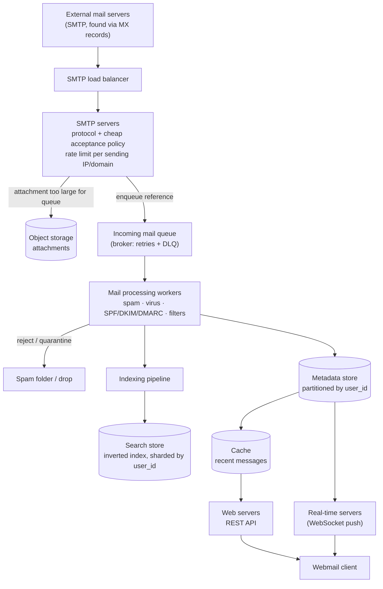

## Overview

"Design Gmail" looks like one system but is really three, and treating it as one is the fastest way to get the design wrong. **Receiving mail** means accepting SMTP connections from the entire public internet — servers you don't control, sending traffic you didn't ask for, at a volume you can't schedule. **Storing a mailbox** means absorbing a relentless write stream of small metadata rows plus occasional 25 MB attachments, durably, for a billion users. **Serving a mailbox** means loading an inbox in under a couple hundred milliseconds and running full-text search over half a million messages a user might have accumulated. Each of those three has a different bottleneck — connection handling, write throughput and storage cost, read latency and index freshness — and the design's job is to keep them from contaminating each other.

## Functional Requirements

Scope this down hard; a real mail service has hundreds of features and an interview has 45 minutes:

- **Send and receive email**, including to and from external providers (the recipient is often not on your system at all).
- **Fetch a folder's messages**, sorted newest-first, paginated.
- **Filter by read/unread status** — the single most-used view after "inbox".
- **Search by subject, sender, and body** across the user's own mailbox.
- **Anti-spam and anti-virus** on inbound mail.
- **Attachments**, up to ~25 MB per message.

Out of scope for the walkthrough: authentication, calendar, contacts, labels/rules, and the full IMAP/POP protocol surface. Assume clients talk HTTP to your servers; SMTP is reserved for server-to-server traffic.

## Non-Functional Requirements

The numbers are what make this design interesting, so state them early:

- **Storage-heavy by nature.** At 1 billion users receiving ~40 emails/day with ~50 KB of metadata each, one year of metadata is roughly `10^9 × 40 × 365 × 50 KB ≈ 730 PB`. If 20% of messages carry a 500 KB attachment on average, attachments alone add roughly 1,460 PB/year. No single-node anything survives contact with those numbers, and metadata and attachments obviously do not belong in the same store.
- **Write-dominated ingestion.** Sending is ~10 emails/user/day → `10^9 × 10 / 10^5 s ≈ 100k QPS` of outbound, and inbound is four times that in message count. This arrives continuously, spread across a billion independent mailboxes.
- **No silent loss.** Email carries an implicit contract: once your SMTP server returns a `250 OK`, the sending server discards its copy and considers the message delivered. Losing it after that point is unrecoverable — there is no upstream retry to fall back on. Durability requirements here are closer to a financial ledger than to a chat system.
- **Fast inbox load.** Users read recent mail overwhelmingly — the large majority of read queries target messages younger than a couple of weeks — so the hot working set is tiny relative to total storage and should be cached aggressively.
- **Near-real-time, exact search.** Unlike web search, email search is scoped to one mailbox, sorted by attributes (time, unread, has-attachment) rather than relevance, and must be *complete*: a message received thirty seconds ago and not showing up in search reads as data loss to the user.

## High-Level Architecture

The system splits along the three pressures named above.

**Ingestion (SMTP).** External mail servers find you by looking up your domain's MX records in DNS and connecting to the SMTP server behind them. An SMTP load balancer fronts a pool of stateless SMTP servers whose only job is to speak the protocol correctly, apply cheap connection-level acceptance policy (is this domain deliverable? is the message under the size limit? is this IP already known-bad?), and either bounce the message immediately or accept it. Cheap rejections at connection time are the highest-leverage filter you have, because everything you reject here costs you nothing downstream.

**Async processing.** Accepting a message and *processing* it are separate steps, and conflating them is the design's central mistake. Spam classification, virus scanning, DKIM/SPF/DMARC verification, and indexing all take variable, occasionally long amounts of time. Doing them inside the SMTP transaction means the sending server's connection stays open while you scan a 25 MB attachment, your SMTP servers hold connections instead of accepting new ones, and a slow scanner turns into refused connections at the edge. Instead, the SMTP server persists the raw message, enqueues a reference to it, and returns `250 OK`; a pool of processing workers consumes that queue independently. This is exactly the decoupling described in [Message Brokers: Queues vs. Log-Based Streaming](message-brokers-queues-vs-logs) — the queue absorbs volume surges, lets scanning workers scale on a different curve from connection handling, and gives you at-least-once delivery with retries and a dead-letter queue for messages that repeatedly fail to process, so nothing is dropped silently just because a scanner crashed.

**Storage, split two ways.** Message *metadata* — sender, recipients, subject, body, flags, folder — is small, structured, and queried constantly; it lives in a distributed database partitioned by user. *Attachments* are large, opaque, written once and read rarely; they belong in object storage, with the metadata row holding only a storage key. See [Object Storage and the Direct-Upload Pattern](object-storage-and-direct-upload) for why blobs don't belong in the row store and how the pointer-plus-metadata split works. This matters even earlier than storage: an attachment too large to sit comfortably in a queue message should be written to object storage first, with only its reference enqueued, so the broker never becomes a file transfer mechanism.

**Serving.** Web servers handle the client-facing REST API (list folders, list a folder's messages, fetch a message, mark read). A distributed cache holds recent messages per mailbox. A separate search store holds an inverted index. Real-time servers hold WebSocket connections to online clients so a newly-arrived message can be pushed rather than polled for.



Note where the `250 OK` is returned: at the SMTP server, once the message is durably enqueued — not after scanning completes. That's what keeps a spam flood from turning into connection exhaustion. The cost is that a message can be accepted and then classified as spam a second later, which is why "accepted" and "in the inbox" are genuinely different states.

## Why the Write Path and the Read Path Diverge

Inbound mail is a firehose of small, independent writes: a billion mailboxes each receiving a few dozen messages a day, uncorrelated, never batched, never idle. Nothing about that workload benefits from a store optimized for ad-hoc joins or secondary-index queries. What it needs is cheap, sequential, append-friendly writes and horizontal partitioning that spreads load evenly — which is why LSM-tree-backed stores (Bigtable, Cassandra, RocksDB) dominate here: they turn random writes into sequential ones by buffering in memory and merging to disk in sorted runs.

Reads look nothing like that. A user opens their inbox and wants the 50 most recent messages in one folder, right now. The natural data model follows the queries rather than a normalized schema:

```
folders_by_user
  partition key: user_id
  columns:       folder_id, name

emails_by_folder
  partition key: (user_id, folder_id)     -- one folder = one partition
  clustering key: email_id (TIMEUUID)     -- sorts newest-first for free
  columns:       from, subject, preview, is_read, has_attachment

emails_by_user
  partition key: user_id
  clustering key: email_id
  columns:       from, to, subject, body, attachment_keys[]
```

Making `email_id` a time-ordered UUID is what makes "newest 50 in this folder" a single contiguous partition read with no sort step. The cost shows up on the read/unread filter: in a partitioned store you can generally only query on partition and clustering keys, and `is_read` is neither. Fetching an entire folder and filtering in the application works at small scale and collapses at large scale. The standard answer is **denormalization** — maintain `read_emails` and `unread_emails` as separate tables, and mark-as-read becomes a delete from one plus an insert into the other. That's two writes and more application logic to keep correct, bought in exchange for the unread view being a single partition scan. It's the same instinct as [read/write splitting and CQRS](read-write-splitting-and-cqrs-lite): shape the stored data around the queries you actually serve.

Consistency deserves an explicit position. A mailbox is a single-writer domain — one user, their own mail — so there's no reason to accept the anomalies that come with multi-primary replication. Designate a single primary per mailbox; during failover, that mailbox's sync and update operations pause until a new primary is elected. That trades availability for consistency at mailbox granularity, which is the right call when the failure a user notices most is a message that appears, disappears, and reappears.

## Search

Email search inverts the usual assumption. Every send, receive, delete, and flag change requires reindexing, while an actual search query only happens when a user clicks the search box — so the index is written far more often than it is read. And the accuracy bar is absolute: scoped to one mailbox, sorted by time or attributes rather than relevance, and expected to include a message that arrived seconds ago.

The pragmatic option is a dedicated search cluster (Elasticsearch or similar) built on an **inverted index** — a map from each term to the list of documents containing it, which is what makes full-text lookup fast without scanning message bodies. Shard it by `user_id` so a query touches exactly one node's worth of data, and drive reindexing off the same broker that carries the ingestion pipeline: the mail processing worker publishes a "message stored" event, and an indexing consumer applies it asynchronously. Search queries are synchronous (the user is waiting); indexing is not (nothing is returned to the client when mail arrives), and separating them along that line is what lets each scale on its own terms.

The cost is a second copy of the data and a consistency problem between the primary store and the index — a message present in one and not the other is a bug the user experiences as missing mail. The index is rebuildable from the primary store, so this is a correctness-and-lag problem rather than a data-loss problem, but at very large scale it's real enough that Gmail-class providers embed search in the storage layer instead, keeping one copy of the data and optimizing the index's disk I/O directly with LSM-structured writes. Small-to-medium scale: use the off-the-shelf search cluster. Gmail scale: expect to own the index.

## Rate Limiting the Front Door

An email service's ingestion point is open to the entire internet by design — you cannot require authentication from a sending server you've never met. That makes per-sender throttling not a nice-to-have but the primary structural defense: cap connections and messages per source IP, per sending domain, and per recipient mailbox, and enforce it at the SMTP load balancer before a connection reaches a worker or a byte reaches storage. [Rate Limiting](rate-limiting) covers the algorithms; token bucket fits here particularly well, because legitimate bulk senders do burst (a newsletter blast is not abuse) while sustained high rates from a single unknown source almost always are.

Outbound needs the mirror-image treatment, for a different reason: **deliverability**. More than half of all email sent is spam, so receiving providers judge you by your IP's reputation, and a compromised account blasting spam from your IPs will get your entire outbound range blocklisted. That means rate-limiting *your own users'* sending, banning spammers fast, warming new IP addresses slowly over weeks rather than blasting from day one, and segregating traffic classes onto separate IPs so marketing volume doesn't drag transactional mail's reputation down with it. Closing the loop requires consuming ISP feedback: hard bounces (invalid address — stop sending), soft bounces (temporary failure — retry with exponential backoff), and spam complaints, each routed to its own queue because each demands a different action. Publishing SPF, DKIM, and DMARC records is table stakes; without them, receiving providers have no cryptographic reason to believe mail claiming to be from your domain actually is.

## Trade-offs

- **Returning `250 OK` before spam and virus scanning protects the SMTP tier but makes "accepted" and "delivered to inbox" two different events** — the alternative, scanning inline, means a slow scanner shows up as refused connections at the edge and senders retrying, which is strictly worse; the cost is that a message can be accepted and then quarantined moments later, and the UI has to tolerate that gap.
- **Splitting metadata from attachments cuts storage cost by orders of magnitude but creates two systems that can disagree** — a metadata row pointing at an object that was never fully written, or an orphaned object whose row was deleted, both require reconciliation; putting a 25 MB blob in the row store instead would keep them atomic and destroy your read latency and cache hit rate.
- **Denormalizing into `read_emails` and `unread_emails` makes the most common filter a single partition scan, at the cost of correctness surface** — every mark-as-read is now a delete plus an insert that must not half-fail, and the same message exists in two places; you're trading application complexity for a read pattern that scales.
- **Choosing a single primary per mailbox buys strong consistency but makes a mailbox unavailable during failover** — for a system where messages appearing and disappearing is the most alarming possible bug, a brief pause is the cheaper failure; a globally available multi-primary design would be the right call for a different workload with different anomalies.
- **A separate search cluster is fast to adopt but adds a second copy of every message that can drift from the primary** — an embedded, storage-layer index eliminates the drift and the duplicate storage, but is a multi-team engineering project rather than an integration.
- **Aggressive inbound rate limiting stops spam floods but will occasionally throttle a legitimate high-volume sender** — the mitigation is reputation-aware limits (known-good domains get higher ceilings) rather than a single flat cap, which means maintaining sender reputation state as part of the limiter.

## Interview Questions

- Why does the SMTP server return `250 OK` before spam and virus scanning has run, and what specifically breaks if you scan inline instead?
- Email is described as both write-heavy and read-heavy. Which subsystem is which, and what different storage property does each one need?
- Why does the search index get more writes than reads in an email system, and how does that change the indexing design compared to a web search engine?
- `is_read` is neither a partition key nor a clustering key. Why does that matter, and what does the standard workaround cost you?
- Why is a single primary per mailbox defensible here when a chat system would choose availability instead?

## References

- [Alex Xu and Sahn Lam, "System Design Interview – An Insider's Guide, Volume 2" (ByteByteGo, 2022) — Chapter 8, "Distributed Email Service"](https://bytebytego.com)
- [IETF — RFC 5321, "Simple Mail Transfer Protocol"](https://datatracker.ietf.org/doc/html/rfc5321)
- [AWS SES Documentation — Warming up dedicated IP addresses](https://docs.aws.amazon.com/ses/latest/dg/dedicated-ip-warming.html)
- [Patrick O'Neil et al., "The Log-Structured Merge-Tree (LSM-Tree)" (Acta Informatica, 1996)](https://www.cs.umb.edu/~poneil/lsmtree.pdf)
