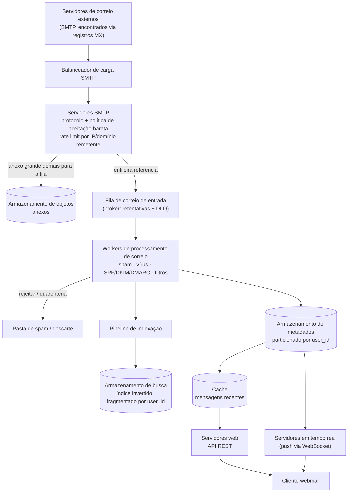

## Visão Geral

"Projete o Gmail" parece um sistema só, mas na verdade são três, e tratá-lo como um só é o jeito mais rápido de errar o design. **Receber correio** significa aceitar conexões SMTP da internet pública inteira — servidores que você não controla, enviando tráfego que você não pediu, num volume que você não consegue programar. **Armazenar uma caixa de entrada** significa absorver um fluxo implacável de escritas de linhas de metadados pequenas mais anexos ocasionais de 25 MB, de forma durável, para um bilhão de usuários. **Servir uma caixa de entrada** significa carregar uma caixa de entrada em menos de algumas centenas de milissegundos e rodar busca de texto completo sobre meio milhão de mensagens que um usuário pode ter acumulado. Cada um desses três tem um gargalo diferente — manuseio de conexões, throughput de escrita e custo de armazenamento, latência de leitura e atualização do índice — e o trabalho do design é impedir que eles se contaminem mutuamente.

## Requisitos Funcionais

Restrinja isso bastante; um serviço de e-mail real tem centenas de funcionalidades e uma entrevista tem 45 minutos:

- **Enviar e receber e-mail**, inclusive de e para provedores externos (o destinatário frequentemente nem está no seu sistema).
- **Buscar as mensagens de uma pasta**, ordenadas do mais novo para o mais antigo, paginadas.
- **Filtrar por status lido/não lido** — a visão mais usada depois de "caixa de entrada".
- **Buscar por assunto, remetente e corpo** dentro da própria caixa de entrada do usuário.
- **Anti-spam e antivírus** no correio de entrada.
- **Anexos**, até ~25 MB por mensagem.

Fora do escopo desta explicação: autenticação, calendário, contatos, marcadores/regras, e a superfície completa do protocolo IMAP/POP. Assuma que os clientes falam HTTP com seus servidores; SMTP é reservado para tráfego servidor-a-servidor.

## Requisitos Não Funcionais

Os números são o que torna este design interessante, então declare-os cedo:

- **Intensivo em armazenamento por natureza.** Com 1 bilhão de usuários recebendo ~40 e-mails/dia com ~50 KB de metadados cada, um ano de metadados é aproximadamente `10^9 × 40 × 365 × 50 KB ≈ 730 PB`. Se 20% das mensagens carregam um anexo de 500 KB em média, os anexos sozinhos adicionam aproximadamente 1.460 PB/ano. Nenhum sistema de nó único sobrevive ao contato com esses números, e metadados e anexos obviamente não pertencem ao mesmo armazenamento.
- **Ingestão dominada por escrita.** Enviar é ~10 e-mails/usuário/dia → `10^9 × 10 / 10^5 s ≈ 100 mil QPS` de saída, e a entrada é quatro vezes isso em número de mensagens. Isso chega continuamente, espalhado por um bilhão de caixas de entrada independentes.
- **Nenhuma perda silenciosa.** O e-mail carrega um contrato implícito: uma vez que seu servidor SMTP retorna um `250 OK`, o servidor remetente descarta sua cópia e considera a mensagem entregue. Perdê-la depois desse ponto é irrecuperável — não há retentativa upstream para recorrer. Os requisitos de durabilidade aqui são mais próximos de um livro-razão financeiro do que de um sistema de chat.
- **Carregamento rápido de caixa de entrada.** Usuários leem correio recente esmagadoramente — a grande maioria das consultas de leitura tem como alvo mensagens com menos de duas semanas — então o conjunto de trabalho quente é minúsculo em relação ao armazenamento total e deve ser cacheado agressivamente.
- **Busca exata em quase tempo real.** Diferente da busca web, a busca de e-mail é restrita a uma caixa de entrada, ordenada por atributos (tempo, não lido, tem anexo) em vez de relevância, e precisa ser *completa*: uma mensagem recebida trinta segundos atrás e que não aparece na busca é lida pelo usuário como perda de dados.

## Arquitetura de Alto Nível

O sistema se divide ao longo das três pressões nomeadas acima.

**Ingestão (SMTP).** Servidores de correio externos te encontram consultando os registros MX do seu domínio no DNS e conectando ao servidor SMTP por trás deles. Um balanceador de carga SMTP fica na frente de um pool de servidores SMTP sem estado cujo único trabalho é falar o protocolo corretamente, aplicar política de aceitação barata em nível de conexão (esse domínio é entregável? a mensagem está dentro do limite de tamanho? esse IP já é conhecido como ruim?), e ou rejeitar a mensagem imediatamente ou aceitá-la. Rejeições baratas no momento da conexão são o filtro de maior alavancagem que você tem, porque tudo que você rejeita aqui não custa nada downstream.

**Processamento assíncrono.** Aceitar uma mensagem e *processá-la* são passos separados, e confundi-los é o erro central do design. Classificação de spam, verificação de vírus, verificação DKIM/SPF/DMARC e indexação levam quantidades de tempo variáveis, ocasionalmente longas. Fazê-los dentro da transação SMTP significa que a conexão do servidor remetente fica aberta enquanto você escaneia um anexo de 25 MB, seus servidores SMTP seguram conexões em vez de aceitar novas, e um scanner lento vira conexões recusadas na borda. Em vez disso, o servidor SMTP persiste a mensagem bruta, enfileira uma referência a ela, e retorna `250 OK`; um pool de workers de processamento consome essa fila independentemente. Isso é exatamente o desacoplamento descrito em [Message Brokers: Queues vs. Log-Based Streaming](message-brokers-queues-vs-logs) — a fila absorve picos de volume, permite que workers de escaneamento escalem numa curva diferente do manuseio de conexões, e fornece entrega pelo menos-uma-vez com retentativas e uma fila de mensagens mortas para mensagens que falham repetidamente ao processar, então nada é descartado silenciosamente só porque um scanner travou.

**Armazenamento, dividido de duas formas.** *Metadados* de mensagem — remetente, destinatários, assunto, corpo, flags, pasta — são pequenos, estruturados, e consultados constantemente; vivem em um banco de dados distribuído particionado por usuário. *Anexos* são grandes, opacos, escritos uma vez e lidos raramente; pertencem ao armazenamento de objetos, com a linha de metadados guardando apenas uma chave de armazenamento. Veja [Object Storage and the Direct-Upload Pattern](object-storage-and-direct-upload) para entender por que blobs não pertencem ao armazenamento em linhas e como funciona a divisão ponteiro-mais-metadados. Isso importa ainda mais cedo do que no armazenamento: um anexo grande demais para caber confortavelmente numa mensagem de fila deve ser escrito no armazenamento de objetos primeiro, com apenas sua referência enfileirada, para que o broker nunca vire um mecanismo de transferência de arquivos.

**Servindo.** Servidores web tratam a API REST voltada ao cliente (listar pastas, listar mensagens de uma pasta, buscar uma mensagem, marcar como lida). Um cache distribuído guarda mensagens recentes por caixa de entrada. Um armazenamento de busca separado guarda um índice invertido. Servidores em tempo real mantêm conexões WebSocket com clientes online para que uma mensagem recém-chegada possa ser enviada em vez de aguardar polling.



Note onde o `250 OK` é retornado: no servidor SMTP, uma vez que a mensagem é enfileirada de forma durável — não depois que o escaneamento termina. É isso que impede que uma inundação de spam vire exaustão de conexões. O custo é que uma mensagem pode ser aceita e depois classificada como spam um segundo depois, e é por isso que "aceita" e "na caixa de entrada" são genuinamente estados diferentes.

## Por Que o Caminho de Escrita e o de Leitura Divergem

O correio de entrada é uma torrente de escritas pequenas e independentes: um bilhão de caixas de entrada, cada uma recebendo algumas dezenas de mensagens por dia, sem correlação, nunca em lote, nunca ociosa. Nada nessa carga de trabalho se beneficia de um armazenamento otimizado para joins ad-hoc ou consultas em índice secundário. O que ela precisa é de escritas baratas, sequenciais, amigáveis a append, e particionamento horizontal que espalhe a carga uniformemente — é por isso que armazenamentos baseados em LSM-tree (Bigtable, Cassandra, RocksDB) dominam aqui: eles transformam escritas aleatórias em sequenciais, armazenando em buffer na memória e mesclando em disco em séries ordenadas.

Leituras não se parecem nada com isso. Um usuário abre sua caixa de entrada e quer as 50 mensagens mais recentes em uma pasta, agora. O modelo de dados natural segue as consultas em vez de um esquema normalizado:

```
folders_by_user
  partition key: user_id
  columns:       folder_id, name

emails_by_folder
  partition key: (user_id, folder_id)     -- uma pasta = uma partição
  clustering key: email_id (TIMEUUID)     -- ordena do mais novo para o mais antigo de graça
  columns:       from, subject, preview, is_read, has_attachment

emails_by_user
  partition key: user_id
  clustering key: email_id
  columns:       from, to, subject, body, attachment_keys[]
```

Fazer de `email_id` um UUID ordenado por tempo é o que torna "as 50 mais recentes nesta pasta" uma única leitura de partição contígua sem passo de ordenação. O custo aparece no filtro lido/não lido: em um armazenamento particionado você geralmente só consegue consultar por chave de partição e de clustering, e `is_read` não é nenhuma das duas. Buscar uma pasta inteira e filtrar na aplicação funciona em pequena escala e desmorona em grande escala. A resposta padrão é **desnormalização** — manter `read_emails` e `unread_emails` como tabelas separadas, e marcar-como-lido vira um delete de uma mais um insert na outra. São duas escritas e mais lógica de aplicação para manter correta, compradas em troca da visão de não lidos ser um único scan de partição. É o mesmo instinto de [read/write splitting e CQRS](read-write-splitting-and-cqrs-lite): moldar os dados armazenados em torno das consultas que você realmente serve.

Consistência merece uma posição explícita. Uma caixa de entrada é um domínio de escritor único — um usuário, seu próprio correio — então não há razão para aceitar as anomalias que vêm com replicação multi-primária. Designe um único primário por caixa de entrada; durante failover, as operações de sincronização e atualização daquela caixa de entrada pausam até que um novo primário seja eleito. Isso troca disponibilidade por consistência na granularidade da caixa de entrada, que é a decisão certa quando a falha que o usuário mais nota é uma mensagem que aparece, desaparece e reaparece.

## Busca

A busca de e-mail inverte a suposição usual. Todo envio, recebimento, exclusão e mudança de flag exige reindexação, enquanto uma consulta de busca real só acontece quando um usuário clica na caixa de busca — então o índice é escrito com muito mais frequência do que é lido. E a barra de precisão é absoluta: restrita a uma caixa de entrada, ordenada por tempo ou atributos em vez de relevância, e esperada para incluir uma mensagem que chegou segundos atrás.

A opção pragmática é um cluster de busca dedicado (Elasticsearch ou similar) construído sobre um **índice invertido** — um mapa de cada termo para a lista de documentos que o contêm, que é o que torna a busca de texto completo rápida sem escanear corpos de mensagem. Fragmente-o por `user_id` para que uma consulta toque apenas os dados de um nó, e conduza a reindexação a partir do mesmo broker que carrega o pipeline de ingestão: o worker de processamento de correio publica um evento de "mensagem armazenada", e um consumidor de indexação o aplica assincronamente. Consultas de busca são síncronas (o usuário está esperando); a indexação não é (nada é retornado ao cliente quando o correio chega), e separá-los por essa linha é o que permite que cada um escale nos seus próprios termos.

O custo é uma segunda cópia dos dados e um problema de consistência entre o armazenamento primário e o índice — uma mensagem presente em um e não no outro é um bug que o usuário experiencia como correio faltando. O índice é reconstruível a partir do armazenamento primário, então isso é um problema de correção e atraso em vez de perda de dados, mas em escala muito grande é real o suficiente para que provedores de classe Gmail incorporem a busca na camada de armazenamento em vez disso, mantendo uma cópia dos dados e otimizando o I/O de disco do índice diretamente com escritas estruturadas em LSM. Escala pequena a média: use o cluster de busca pronto. Escala Gmail: espere ter que possuir o índice.

## Rate Limiting na Porta de Entrada

O ponto de ingestão de um serviço de e-mail está aberto para a internet inteira por design — você não pode exigir autenticação de um servidor remetente que nunca conheceu. Isso torna o throttling por remetente não um bônus, mas a defesa estrutural primária: limite conexões e mensagens por IP de origem, por domínio remetente, e por caixa de entrada destinatária, e imponha isso no balanceador de carga SMTP antes que uma conexão chegue a um worker ou um byte chegue ao armazenamento. [Rate Limiting](rate-limiting) cobre os algoritmos; token bucket se encaixa aqui particularmente bem, porque remetentes de volume legítimos realmente têm rajadas (uma newsletter em massa não é abuso), enquanto taxas altas sustentadas de uma única fonte desconhecida quase sempre são.

A saída precisa do tratamento espelhado, por uma razão diferente: **deliverability**. Mais da metade de todo e-mail enviado é spam, então provedores receptores te julgam pela reputação do seu IP, e uma conta comprometida disparando spam dos seus IPs vai colocar toda sua faixa de saída em blocklist. Isso significa fazer rate-limiting no envio *dos seus próprios usuários*, banir spammers rapidamente, aquecer novos endereços IP lentamente ao longo de semanas em vez de disparar desde o dia um, e segregar classes de tráfego em IPs separados para que o volume de marketing não arraste a reputação do correio transacional junto. Fechar o loop exige consumir feedback do ISP: hard bounces (endereço inválido — pare de enviar), soft bounces (falha temporária — tente de novo com backoff exponencial), e reclamações de spam, cada um roteado para sua própria fila porque cada um exige uma ação diferente. Publicar registros SPF, DKIM e DMARC é o básico; sem eles, provedores receptores não têm razão criptográfica para acreditar que o correio alegando ser do seu domínio realmente é.

## Trade-offs

- **Retornar `250 OK` antes da varredura de spam e vírus protege a camada SMTP mas torna "aceito" e "entregue na caixa de entrada" dois eventos diferentes** — a alternativa, escanear inline, significa que um scanner lento aparece como conexões recusadas na borda e remetentes tentando de novo, o que é estritamente pior; o custo é que uma mensagem pode ser aceita e depois colocada em quarentena momentos depois, e a UI precisa tolerar essa lacuna.
- **Dividir metadados de anexos reduz o custo de armazenamento em ordens de magnitude mas cria dois sistemas que podem discordar** — uma linha de metadados apontando para um objeto que nunca foi totalmente escrito, ou um objeto órfão cuja linha foi excluída, ambos exigem reconciliação; colocar um blob de 25 MB no armazenamento de linhas em vez disso manteria-os atômicos e destruiria sua latência de leitura e taxa de acerto de cache.
- **Desnormalizar em `read_emails` e `unread_emails` torna o filtro mais comum um único scan de partição, ao custo de superfície de correção** — todo marcar-como-lido agora é um delete mais um insert que não pode falhar pela metade, e a mesma mensagem existe em dois lugares; você está trocando complexidade de aplicação por um padrão de leitura que escala.
- **Escolher um único primário por caixa de entrada compra consistência forte mas torna uma caixa de entrada indisponível durante failover** — para um sistema onde mensagens aparecendo e desaparecendo é o bug mais alarmante possível, uma pausa breve é a falha mais barata; um design multi-primário globalmente disponível seria a decisão certa para uma carga de trabalho diferente com anomalias diferentes.
- **Um cluster de busca separado é rápido de adotar mas adiciona uma segunda cópia de cada mensagem que pode divergir do primário** — um índice embutido, na camada de armazenamento, elimina o desvio e o armazenamento duplicado, mas é um projeto de engenharia multi-time em vez de uma integração.
- **Rate limiting agressivo de entrada para inundações de spam mas ocasionalmente vai limitar um remetente legítimo de alto volume** — a mitigação são limites cientes de reputação (domínios conhecidos-bons recebem tetos maiores) em vez de um teto fixo único, o que significa manter estado de reputação de remetente como parte do limitador.

## Perguntas de Entrevista

- Por que o servidor SMTP retorna `250 OK` antes que a varredura de spam e vírus tenha rodado, e o que especificamente quebra se você escanear inline em vez disso?
- E-mail é descrito como intensivo em escrita e em leitura. Qual subsistema é qual, e qual propriedade de armazenamento diferente cada um precisa?
- Por que o índice de busca recebe mais escritas do que leituras em um sistema de e-mail, e como isso muda o design de indexação comparado a um motor de busca web?
- `is_read` não é chave de partição nem chave de clustering. Por que isso importa, e quanto custa a solução alternativa padrão?
- Por que um único primário por caixa de entrada é defensável aqui quando um sistema de chat escolheria disponibilidade em vez disso?

## Referências

- [Alex Xu e Sahn Lam, "System Design Interview – An Insider's Guide, Volume 2" (ByteByteGo, 2022) — Capítulo 8, "Distributed Email Service"](https://bytebytego.com)
- [IETF — RFC 5321, "Simple Mail Transfer Protocol"](https://datatracker.ietf.org/doc/html/rfc5321)
- [AWS SES Documentation — Warming up dedicated IP addresses](https://docs.aws.amazon.com/ses/latest/dg/dedicated-ip-warming.html)
- [Patrick O'Neil et al., "The Log-Structured Merge-Tree (LSM-Tree)" (Acta Informatica, 1996)](https://www.cs.umb.edu/~poneil/lsmtree.pdf)
