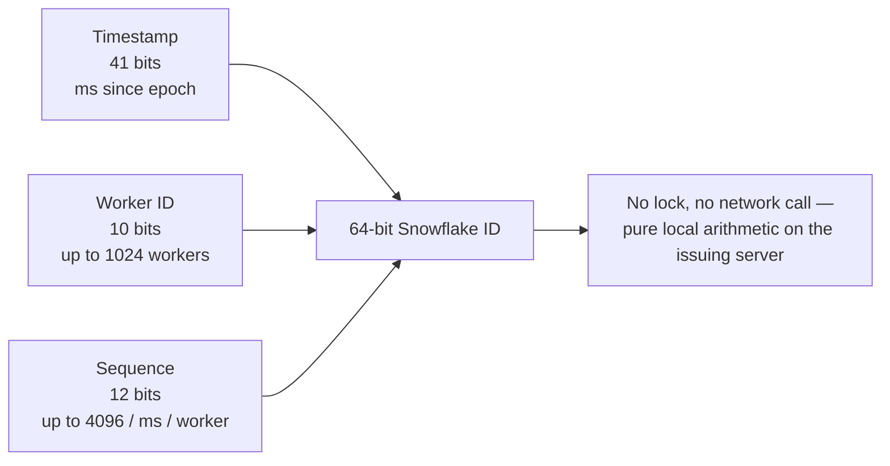

## Overview

A single-node database's `AUTO_INCREMENT` or `SEQUENCE` solves uniqueness trivially — there's one authority handing out the next integer, so collisions are impossible by construction. That authority becomes exactly the problem once you need more write throughput than one sequence (and the row lock it takes on every insert) can sustain, or once IDs are minted by multiple independent servers that can't coordinate on every request without giving up the latency you sharded for in the first place. Distributed ID generation is the family of techniques for producing unique, ideally sortable, IDs without a single serialization point.

## Why Auto-Increment Doesn't Scale Across Shards

If you shard a table across 4 databases, each with its own `AUTO_INCREMENT`, two different shards will both mint `id = 501` — the IDs are only unique *within* a shard, not globally. Fixes exist (start shard N's counter at an offset and increment by the shard count, e.g. shard 0 emits 0, 4, 8…; shard 1 emits 1, 5, 9…) but they hardcode the shard count into every ID ever generated — adding a 5th shard later means the increment scheme for all four existing shards is now wrong.

## UUIDs: The Default Escape Hatch

A random 128-bit UUID (v4) sidesteps coordination entirely — any server can generate one independently with a negligible collision probability. The cost is that a v4 UUID is unsorted: `f47ac10b-...` and `a3bb189e-...` carry no information about which was created first, which is bad for a database index (random insertion order into a B-tree causes page splits all over the tree instead of appending at the end) and bad for anyone debugging who needs to eyeball creation order. **UUIDv7** (standardized in [RFC 9562](https://www.rfc-editor.org/rfc/rfc9562), 2024) fixes exactly this: the high bits are a millisecond timestamp, the rest is random, so UUIDs sort chronologically while keeping the "any node can generate one, no coordination" property.

```
UUIDv4: f47ac10b-58cc-4372-a567-0e02b2c3d479   (fully random, no order)
UUIDv7: 018f5a3c-1b2e-7a3d-9c4e-1a2b3c4d5e6f   (leading bits = timestamp, sorts by creation time)
```

## Twitter Snowflake: Timestamp + Worker ID + Sequence

[Twitter's Snowflake](https://github.com/twitter-archive/snowflake) generates a 64-bit ID, entirely in memory on the issuing server, with no round trip to any shared store:

```
| 1 bit unused | 41 bits timestamp (ms since epoch) | 10 bits worker id | 12 bits sequence |
```

- **Timestamp (41 bits)** — milliseconds since a custom epoch, giving IDs a natural, mostly-sortable-by-creation-time property (Twitter's own choice of epoch, ~2010, buys ~69 years before overflow).
- **Worker ID (10 bits)** — up to 1024 distinct machines/processes can mint IDs concurrently with zero coordination between them, because each owns a disjoint slice of the ID space by construction.
- **Sequence (12 bits)** — a per-millisecond counter on that one worker, allowing up to 4096 IDs per millisecond per worker before it has to wait for the next millisecond tick.



Because the worker ID is baked into every bit pattern, two workers can never produce the same ID, and because generation is purely local arithmetic (no lock, no network call), it's extremely fast — this is the same shape used by Instagram's ID scheme (documented in their [engineering blog](https://instagram-engineering.com/sharding-ids-at-instagram-1cf5a71e5a5c)) and by most "Snowflake-style" generators since (Sonyflake, Baidu's UidGenerator).

## Designing a 7-Character Short Code (the URL Shortener Case)

A classic interview problem — "shorten a URL to 7 characters" — is really this same question with a hard length budget. Base62 (`[0-9a-zA-Z]`) gives `62^7 ≈ 3.5 trillion` possible codes, which sounds like plenty, but the *generation strategy*, not the alphabet size, is what an interviewer is actually probing:

- **Random + check** — generate 7 random base62 characters, check the database for a collision, retry if one exists. Simple, but every retry is an extra database round trip, and the collision *rate* rises as the keyspace fills (a birthday-paradox problem, not a linear one).
- **Counter-based (encode a sequence number)** — take a global or per-shard monotonic counter and base62-encode it directly (`12345` → `dnh`). Guarantees zero collisions by construction (no two counter values are ever equal) and needs no collision check at all, at the cost of reintroducing a shared counter as a potential bottleneck — which is exactly why it's typically built on a Snowflake-style ID (timestamp + worker id + sequence) *truncated or re-encoded* to fit 7 base62 characters, rather than a single naive database sequence.
- **Hash of the input URL** — take `md5(long_url)` and base62-encode the first 7 characters. Deterministic (shortening the same URL twice gives the same code, which can be a feature or a bug depending on requirements) but collisions between *different* URLs sharing a truncated hash prefix are inevitable at scale and must still be handled with a retry-with-salt strategy.

## Collision Handling

Whichever generation strategy is used, a production system still needs an explicit, testable answer to "what happens when two workers produce the same code at the same instant" — this is precisely the gap an interviewer (or, per this concept's motivating case, an AI design-review judge) will probe for if it's left unstated:

```sql
INSERT INTO short_urls (code, long_url) VALUES ($1, $2)
ON CONFLICT (code) DO NOTHING
RETURNING code;
-- if no row is returned, code was already taken: regenerate and retry
```

A unique constraint on the code column plus an atomic `INSERT ... ON CONFLICT` (or equivalent) turns "hope collisions don't happen" into "detect and retry the rare case," which is the actual guarantee an interview answer needs to state — not just the generation scheme.

## Trade-offs

- **Snowflake-style IDs leak generation time and worker identity** — anyone can decode roughly when an ID was minted and, in many implementations, which worker minted it. Fine for internal database keys, a real consideration if the ID is ever exposed publicly (sequential-looking public IDs invite enumeration attacks on APIs that trust obscurity).
- **Clock skew breaks the ordering guarantee, not the uniqueness one** — if a worker's system clock jumps backward (NTP correction), it can generate a timestamp segment lower than one it already issued, breaking monotonic ordering across that worker's own IDs. Uniqueness within a single worker still holds only if the implementation detects the clock rollback and refuses to generate until it catches up — a detail production Snowflake implementations handle explicitly and naive reimplementations often skip.
- **Counter-based short codes make total URL count guessable** — a purely sequential base62 encoding lets anyone estimate how many URLs exist by shortening two and diffing the codes, which some products consider an information leak worth avoiding by mixing in a worker/shard segment or a bit of permutation.

## Interview Questions

- Why can't 4 independently-sharded databases each just use their own `AUTO_INCREMENT` and call the result globally unique?
- Walk through the bit layout of a Snowflake-style ID and explain what property each segment buys you.
- For a 7-character short code, what's the actual failure mode if you generate randomly and just retry on collision, and at what scale does it become a problem?
- Why does UUIDv7 sort chronologically when UUIDv4 doesn't, and why would a database index care?
- What happens to a Snowflake-style generator's guarantees if the server's clock moves backward?

## References

- [Twitter (archived) — Snowflake ID generator](https://github.com/twitter-archive/snowflake)
- Instagram Engineering, ["Sharding & IDs at Instagram"](https://instagram-engineering.com/sharding-ids-at-instagram-1cf5a71e5a5c)
- [RFC 9562 — UUID Version 7](https://www.rfc-editor.org/rfc/rfc9562) (IETF, 2024)
- [PostgreSQL Documentation — CREATE SEQUENCE](https://www.postgresql.org/docs/current/sql-createsequence.html)
