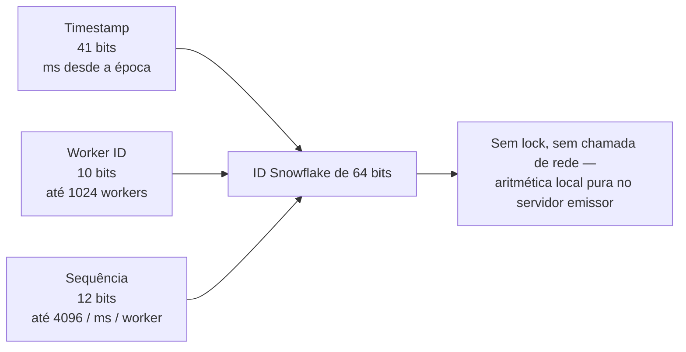

## Visão Geral

O `AUTO_INCREMENT` ou `SEQUENCE` de um banco de dados de nó único resolve unicidade trivialmente — existe uma única autoridade distribuindo o próximo inteiro, então colisões são impossíveis por construção. Essa autoridade se torna exatamente o problema assim que você precisa de mais throughput de escrita do que uma sequência (e o lock de linha que ela toma em cada inserção) consegue sustentar, ou assim que os IDs são cunhados por múltiplos servidores independentes que não conseguem coordenar a cada requisição sem abrir mão da latência pela qual você fez sharding em primeiro lugar. Geração distribuída de IDs é a família de técnicas para produzir IDs únicos, idealmente ordenáveis, sem um único ponto de serialização.

## Por Que Auto-Incremento Não Escala Entre Shards

Se você fizer sharding de uma tabela em 4 bancos de dados, cada um com seu próprio `AUTO_INCREMENT`, dois shards diferentes vão cunhar `id = 501` — os IDs só são únicos *dentro* de um shard, não globalmente. Correções existem (comece o contador do shard N em um offset e incremente pela contagem de shards, ex.: shard 0 emite 0, 4, 8…; shard 1 emite 1, 5, 9…), mas elas fixam a contagem de shards em cada ID já gerado — adicionar um 5º shard depois significa que o esquema de incremento dos quatro shards existentes agora está errado.

## UUIDs: A Saída de Emergência Padrão

Um UUID de 128 bits aleatório (v4) contorna a coordenação inteiramente — qualquer servidor pode gerar um independentemente com uma probabilidade de colisão desprezível. O custo é que um UUID v4 não é ordenado: `f47ac10b-...` e `a3bb189e-...` não carregam informação sobre qual foi criado primeiro, o que é ruim para um índice de banco de dados (ordem de inserção aleatória em uma B-tree causa divisões de página por toda a árvore em vez de anexar no final) e ruim para quem está depurando e precisa observar a ordem de criação a olho nu. O **UUIDv7** (padronizado na [RFC 9562](https://www.rfc-editor.org/rfc/rfc9562), 2024) corrige exatamente isso: os bits altos são um timestamp em milissegundos, o resto é aleatório, então os UUIDs se ordenam cronologicamente mantendo a propriedade de "qualquer nó pode gerar um, sem coordenação".

```
UUIDv4: f47ac10b-58cc-4372-a567-0e02b2c3d479   (totalmente aleatório, sem ordem)
UUIDv7: 018f5a3c-1b2e-7a3d-9c4e-1a2b3c4d5e6f   (bits iniciais = timestamp, ordena por horário de criação)
```

## Twitter Snowflake: Timestamp + Worker ID + Sequência

O [Snowflake do Twitter](https://github.com/twitter-archive/snowflake) gera um ID de 64 bits, inteiramente na memória do servidor emissor, sem nenhuma viagem de ida e volta a nenhum armazenamento compartilhado:

```
| 1 bit não usado | 41 bits timestamp (ms desde a época) | 10 bits worker id | 12 bits sequência |
```

- **Timestamp (41 bits)** — milissegundos desde uma época customizada, dando aos IDs uma propriedade natural, majoritariamente ordenável por horário de criação (a própria escolha de época do Twitter, ~2010, compra ~69 anos antes de overflow).
- **Worker ID (10 bits)** — até 1024 máquinas/processos distintos podem cunhar IDs concorrentemente com zero coordenação entre eles, porque cada um possui uma fatia disjunta do espaço de IDs por construção.
- **Sequência (12 bits)** — um contador por milissegundo naquele único worker, permitindo até 4096 IDs por milissegundo por worker antes de ter que esperar o próximo tick de milissegundo.



Como o worker ID está embutido em cada padrão de bits, dois workers nunca podem produzir o mesmo ID, e como a geração é aritmética puramente local (sem lock, sem chamada de rede), é extremamente rápida — esse é o mesmo formato usado pelo esquema de ID do Instagram (documentado no [blog de engenharia deles](https://instagram-engineering.com/sharding-ids-at-instagram-1cf5a71e5a5c)) e pela maioria dos geradores "estilo Snowflake" desde então (Sonyflake, UidGenerator do Baidu).

## Projetando um Código Curto de 7 Caracteres (o Caso do Encurtador de URL)

Um problema de entrevista clássico — "encurte uma URL para 7 caracteres" — é na verdade a mesma questão com um orçamento de comprimento rígido. Base62 (`[0-9a-zA-Z]`) dá `62^7 ≈ 3,5 trilhões` de códigos possíveis, o que soa como bastante, mas a *estratégia de geração*, não o tamanho do alfabeto, é o que um entrevistador está realmente sondando:

- **Aleatório + verificação** — gere 7 caracteres base62 aleatórios, verifique o banco de dados por colisão, tente de novo se uma existir. Simples, mas cada nova tentativa é uma viagem extra de ida e volta ao banco de dados, e a *taxa* de colisão sobe conforme o espaço de chaves se enche (um problema de paradoxo do aniversário, não linear).
- **Baseado em contador (codifica um número de sequência)** — pega um contador monotônico global ou por shard e codifica-o diretamente em base62 (`12345` → `dnh`). Garante zero colisões por construção (nenhum valor de contador é igual a outro) e não precisa de nenhuma verificação de colisão, ao custo de reintroduzir um contador compartilhado como potencial gargalo — o que é exatamente por que ele é tipicamente construído sobre um ID estilo Snowflake (timestamp + worker id + sequência) *truncado ou recodificado* para caber em 7 caracteres base62, em vez de uma sequência de banco de dados ingênua única.
- **Hash da URL de entrada** — pega `md5(long_url)` e codifica os primeiros 7 caracteres em base62. Determinístico (encurtar a mesma URL duas vezes dá o mesmo código, o que pode ser uma funcionalidade ou um bug dependendo dos requisitos), mas colisões entre URLs *diferentes* compartilhando um prefixo de hash truncado são inevitáveis em escala e ainda precisam ser tratadas com uma estratégia de retentativa com salt.

## Tratamento de Colisões

Qualquer que seja a estratégia de geração usada, um sistema de produção ainda precisa de uma resposta explícita e testável para "o que acontece quando dois workers produzem o mesmo código no mesmo instante" — essa é precisamente a lacuna que um entrevistador (ou, conforme o caso motivador deste conceito, um juiz de IA de revisão de design) vai sondar se ela ficar não declarada:

```sql
INSERT INTO short_urls (code, long_url) VALUES ($1, $2)
ON CONFLICT (code) DO NOTHING
RETURNING code;
-- se nenhuma linha for retornada, o código já estava em uso: regenere e tente de novo
```

Uma restrição única na coluna de código mais um `INSERT ... ON CONFLICT` atômico (ou equivalente) transforma "espero que colisões não aconteçam" em "detecte e tente de novo o caso raro", que é a garantia real que uma resposta de entrevista precisa declarar — não apenas o esquema de geração.

## Trade-offs

- **IDs estilo Snowflake vazam horário de geração e identidade do worker** — qualquer um pode decodificar aproximadamente quando um ID foi cunhado e, em muitas implementações, qual worker o cunhou. Tudo bem para chaves internas de banco de dados, uma consideração real se o ID for exposto publicamente algum dia (IDs públicos com aparência sequencial convidam ataques de enumeração em APIs que confiam na obscuridade).
- **Desvio de relógio quebra a garantia de ordenação, não a de unicidade** — se o relógio do sistema de um worker pular para trás (correção NTP), ele pode gerar um segmento de timestamp menor que um que já emitiu, quebrando a ordenação monotônica através dos próprios IDs daquele worker. A unicidade dentro de um único worker ainda se mantém somente se a implementação detectar o retrocesso do relógio e se recusar a gerar até se recuperar — um detalhe que implementações Snowflake de produção tratam explicitamente e reimplementações ingênuas frequentemente ignoram.
- **Códigos curtos baseados em contador tornam a contagem total de URLs adivinhável** — uma codificação base62 puramente sequencial permite que qualquer um estime quantas URLs existem encurtando duas e comparando os códigos, o que alguns produtos consideram um vazamento de informação que vale a pena evitar misturando um segmento de worker/shard ou um pouco de permutação.

## Perguntas de Entrevista

- Por que 4 bancos de dados fragmentados independentemente não podem simplesmente usar seus próprios `AUTO_INCREMENT` e chamar o resultado de globalmente único?
- Percorra o layout de bits de um ID estilo Snowflake e explique qual propriedade cada segmento compra.
- Para um código curto de 7 caracteres, qual é o modo de falha real se você gerar aleatoriamente e simplesmente tentar de novo na colisão, e em que escala isso se torna um problema?
- Por que o UUIDv7 ordena cronologicamente quando o UUIDv4 não ordena, e por que um índice de banco de dados se importaria?
- O que acontece com as garantias de um gerador estilo Snowflake se o relógio do servidor se mover para trás?

## Referências

- [Twitter (arquivado) — Gerador de ID Snowflake](https://github.com/twitter-archive/snowflake)
- Instagram Engineering, ["Sharding & IDs at Instagram"](https://instagram-engineering.com/sharding-ids-at-instagram-1cf5a71e5a5c)
- [RFC 9562 — UUID Version 7](https://www.rfc-editor.org/rfc/rfc9562) (IETF, 2024)
- [PostgreSQL Documentation — CREATE SEQUENCE](https://www.postgresql.org/docs/current/sql-createsequence.html)
