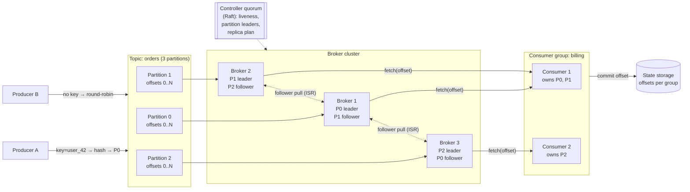

## Overview

[Message Brokers: Queues vs. Log-Based Streaming](message-brokers-queues-vs-logs) covers *when* to reach for a broker and which broker model fits which workload. This concept is the other half: how you'd actually build the log-based one. "Design a distributed message queue" is a standard interview prompt precisely because it forces you to assemble an append-only storage engine, a partitioning scheme, a replication protocol, a group membership protocol, and a leader election mechanism into one system — and then defend the delivery guarantee that falls out of those choices.

## Requirements

The prompt is one line, so scope it. The interesting version — and the one that makes the design harder — is a broker with data streaming features rather than a plain transient queue:

**Functional:**

- Producers publish messages (text, kilobyte-range) to a named **topic**; consumers subscribe and read from it.
- Messages are **retained** after delivery — assume two weeks — so they can be consumed repeatedly by independent consumers, and replayed after a bug fix.
- Messages are delivered in the order they were produced (with a caveat about *where* that order holds, below).
- Old data can be truncated once it exceeds the retention window.
- Delivery semantics — at-most-once, at-least-once, exactly-once — are **configurable per use case**, not baked in.

**Non-functional:**

- **High throughput or low latency, configurable.** Log aggregation wants throughput and tolerates hundreds of milliseconds; a request/response-adjacent workflow wants the opposite. One knob — batch size — moves the system between them, so the design must expose it rather than pick for the user.
- **Horizontal scalability.** Adding brokers must add capacity, and a topic must be able to outgrow any single machine.
- **Durability.** Messages are persisted on disk and replicated across nodes; losing a broker must not lose data.

A traditional queue (RabbitMQ-style) drops the retention and ordering requirements entirely — messages live in memory just long enough to be consumed, with a comparatively tiny on-disk overflow. That deletes most of the storage design below. The retention requirement is what makes this a *log*, and the log is what makes everything else work.

## Storage: Why an Append-Only Log, Not a Database

Look at the access pattern before picking the store. A message queue is write-heavy and read-heavy, has **no updates and no deletes** (only bulk truncation of old data), and is overwhelmingly **sequential** in both directions. A relational table or document collection can hold this, but it's built for random access and mutation — B-tree maintenance, index updates, MVCC bookkeeping — and none of that is paid for by this workload. At scale the database becomes the bottleneck.

The right structure is a **write-ahead log**: a plain file that new records are appended to and nothing is ever modified in. Sequential access is where disks are fast — a modern RAID array sustains hundreds of MB/sec of sequential reads and writes — and the "disks are slow" instinct is really about *random* access. Sequential also means the OS page cache works in the system's favor: the kernel aggressively caches recently written pages, so consumers reading near the tail of the log are usually served from memory without the broker managing a cache of its own.

A single file can't grow forever, so each partition's log is split into **segments**. Only the newest segment is active and accepting appends; when it hits a size threshold it's closed and a fresh one takes over. Closed segments serve reads only, and expiring old data is a matter of deleting whole segment files — an O(1) unlink, not a delete query.

```
partition-1/
  00000000000000000000.log   (closed)
  00000000000000524288.log   (closed)
  00000000000001048576.log   (active — appends land here)
```

The message itself is designed to travel **unmodified** from producer through broker to consumer: `key`, `value` (opaque bytes), `topic`, `partition`, `offset`, `timestamp`, `size`, `crc`. If any layer needs to reshape a message, the system pays for a copy on every hop, and copying is what kills throughput at volume. The broker treats `value` as bytes it never parses.

**Batching is pervasive** and is the single biggest throughput lever: producers accumulate messages in memory and ship them in one request, the broker appends them to the log in large contiguous chunks, and consumers fetch a range in one round trip. Batching amortizes network round trips and turns many small writes into few large sequential ones. Its cost is latency — a bigger batch means waiting longer to fill it — which is exactly the throughput/latency knob the non-functional requirements asked for.

## Partitioning: The Unit of Both Parallelism and Ordering

A topic that outgrows one machine is split into **partitions**, each an independent log, spread across the **brokers** in the cluster. Adding partitions is how a topic scales: more partitions means more machines can absorb writes for the same topic in parallel.

The critical consequence: each partition is a FIFO log with monotonically increasing **offsets**, so ordering is total *within* a partition and **undefined across partitions**. There is no global topic order and building one would defeat the point of partitioning. So "messages are delivered in order" is only ever a per-partition promise, and it's the producer's routing decision that determines whether that promise is useful.

That routing is the **message key**. The producer picks a partition as `hash(key) % numPartitions`; with no key, the message is spread randomly. Everything that must stay ordered relative to each other needs the same key — all events for one `user_id`, all updates for one `order_id` — so they land in the same partition and inherit its total order. Note that the key is business data, not a partition number: the partition is an internal concept and shouldn't leak into the client's domain model.

Increasing partition count is cheap: existing messages stay where they are (there's no rehashing migration), new messages simply spread across more partitions, and producers and consumers both find out and adapt. Decreasing is the awkward direction — a decommissioned partition stops receiving writes but can't be deleted until its retention window expires, because consumers may still be reading it. Shrinking partitions is not a way to reclaim disk space quickly.

## Replication and In-Sync Replicas

Disks fail and machines die, so each partition has N replicas (3 is typical) on **different broker nodes** — replicas on the same node defeat the purpose and waste storage. One replica per partition is the **leader**; the rest are followers.

All writes go to the leader. Followers continuously pull from it, exactly like a consumer would. Once "enough" replicas have the record, the leader commits it — and only committed records are visible to consumers, which is what prevents a consumer from reading a record that a subsequent leader failover would erase.

"Enough" is defined by the **in-sync replica (ISR)** set: the replicas that are currently caught up with the leader, within a configured lag threshold. A follower that falls too far behind is ejected from the ISR and can rejoin once it catches up. The ISR exists because the alternative definitions of "enough" are both bad: waiting for *all* replicas means one slow disk stalls the entire partition, while waiting for *none* means acknowledged data can vanish. The ISR is the moving set of replicas that are actually keeping up, so durability is measured against a healthy quorum rather than against the slowest machine in the cluster.

The producer chooses where on that spectrum it sits, per topic:

| Setting | Producer waits for | Durability | Cost |
|---|---|---|---|
| `ack=all` | Every in-sync replica | Strongest — survives leader loss | Bounded by the slowest ISR member |
| `ack=1` | Leader's local write only | Loses data if the leader dies before followers pull | Low latency |
| `ack=0` | Nothing; fire and forget, no retry | Message loss on any hiccup | Lowest possible latency |

`ack=0` is defensible for metrics and log shipping where volume is huge and a dropped record is noise; `ack=all` is the only honest choice when the message represents money or state.

Consumers read from the **leader** too, not from followers. That seems like it should overload the leader, but a partition is read by at most one consumer per group, so the connection count stays proportional to the number of groups, not the number of machines. Where it does hurt is cross-datacenter reads — a consumer paying a WAN round trip to a leader in another region is a case for allowing reads from the nearest in-sync replica instead.

## Consumer Groups, Offsets, and Rebalancing

A **consumer group** is a set of consumers cooperating to read a topic. Two rules give the group its semantics:

1. Within one group, **each partition is assigned to exactly one consumer**. That preserves per-partition ordering (two consumers on one partition would interleave unpredictably) and load-balances the topic across the group.
2. **Different groups are independent** and each sees every message, with its own offsets. That's publish/subscribe fan-out.

Put every consumer in one group and you've rebuilt point-to-point queue semantics on top of a log. Rule 1 also caps parallelism: a group can never usefully have more consumers than partitions — the extras sit idle. Provision partitions generously up front, then scale by adding consumers.

Position is tracked as a **committed offset** per (group, partition): "everything at or below offset 6 is processed." That single number replaces the per-message acknowledgment bookkeeping a traditional broker maintains, which is why the log design is cheaper and batches so well. If a consumer dies, its replacement reads the committed offset from state storage and resumes from there.

Consumers **pull**; the broker does not push. A push model gives lower latency but lets a fast producer overwhelm a slow consumer, and forces the broker to reason about the processing capacity of every client. Pull inverts that: each consumer sets its own pace, a backlogged consumer just falls behind instead of falling over, and a fetch naturally returns everything available from the current position — a batch, for free. The one downside, consumers spinning on an empty topic, is solved with **long polling**: the fetch blocks server-side for a configured interval waiting for new data.

Group membership is managed by a **coordinator** — one broker, chosen by hashing the group name, so every member of a group talks to the same one. Consumers heartbeat to it. **Rebalancing** triggers whenever membership or partition count changes:

1. A consumer joins, leaves, or stops heartbeating (a crash looks like a missed heartbeat and nothing else — see [The Trouble with Distributed Systems](distributed-systems-partial-failures) for why "crashed" and "slow" are indistinguishable from the outside).
2. The coordinator asks all members to rejoin on their next heartbeat.
3. Once everyone has rejoined, the coordinator picks one consumer as the **group leader**.
4. That leader computes the new partition assignment (round-robin, range, sticky) and hands it to the coordinator, which broadcasts it.
5. Consumers begin reading their newly assigned partitions from each partition's committed offset.

Note the split: the coordinator handles membership and offsets, the elected group leader computes the assignment. Keeping assignment logic on the client means changing the strategy doesn't require a broker upgrade. The cost of the whole protocol is a **stop-the-world pause** — during a rebalance, consumption stops — which is why an aggressive heartbeat timeout that occasionally misfires on a GC pause is a real availability problem.

## Cluster Coordination: Who Leads What

Several questions in this design have no local answer: which brokers are alive right now, which replica leads each partition, and who decides when a leader is dead. Every broker having its own opinion is exactly the split-brain scenario that loses data — two nodes both accepting writes as leader of the same partition.

The standard structure elects **one broker as the cluster controller**, and it owns the **replica distribution plan**: which brokers hold which partitions, and which replica leads each. It persists that plan to metadata storage, and every broker works from it. When the controller detects a broker is down, it produces a new plan — promoting a surviving in-sync replica to leader for each affected partition, and scheduling new followers on healthy nodes to restore the replication factor.

Electing that single controller, and detecting failure without two nodes disagreeing, is the consensus problem — see [Consensus and Coordination Services](consensus-and-coordination-services). Historically this meant an external ZooKeeper (or etcd) ensemble holding cluster metadata, offsets, and the controller lease. Kafka now runs its own internal Raft quorum across dedicated controller nodes (**KRaft**), and ZooKeeper support was removed entirely in Kafka 4.0 — the metadata log became just another replicated log inside the system it coordinates. The requirement didn't change; only where the consensus algorithm runs did.

Three storage responsibilities fall out, and they have genuinely different access patterns:

- **Data storage** — the message logs. Huge, sequential, append-only. The custom segment files described above.
- **State storage** — consumer/partition assignments and committed offsets. Small volume, frequent random reads and writes, needs consistency. Kafka moved this out of ZooKeeper into an internal compacted topic on the brokers themselves.
- **Metadata storage** — topic configuration, partition counts, retention, replica plan. Tiny, rarely written, must be strongly consistent. This is what the consensus layer holds.



## Delivery Semantics

The guarantee isn't a property the broker provides on its own — it's the product of the producer's ack setting, its retry behavior, and the order in which the consumer commits its offset relative to doing the work.

**At-most-once.** Producer sends with `ack=0` and never retries. Consumer commits the offset *before* processing. A crash mid-processing means the record is skipped forever, because its offset is already committed. Messages can be lost, never duplicated. Fine for metrics and sampled telemetry.

**At-least-once.** Producer uses `ack=1` or `ack=all` and retries on failure or timeout. Consumer commits the offset *after* processing succeeds. Nothing is lost, but two duplication sources remain: a producer retry after an ack that was actually delivered but whose response was lost, and a consumer that finishes processing and crashes before committing. This is the practical default — and it pushes deduplication onto the consumer, usually via an idempotent write keyed on a unique message id, so replaying a record is a no-op rather than a double charge.

**Exactly-once.** Every record affects the end state once, no matter what fails. Nothing about it is free:

- **Producer idempotence** — each producer gets an id and stamps a monotonic sequence number per partition, so the broker can recognize and discard a retried duplicate instead of appending it twice.
- **Transactions across partitions** — writes to multiple partitions, plus the consumer's own offset commit, are wrapped in a transaction that commits atomically. A transaction coordinator writes markers into the log, and consumers configured to read committed data skip records from aborted transactions.
- **The boundary is the system's edge.** Exactly-once holds *within* the broker — read, process, write result, commit offset, all one atomic unit. The moment a consumer's side effect is an external HTTP call or a write to a system that isn't in the transaction, the guarantee stops at that boundary and you are back to needing idempotence downstream.

The cost is extra round trips, coordinator state, transaction markers in the log, and consumers that must buffer until a commit marker arrives — which is why systems that could enable it often ship at-least-once plus idempotent consumers instead, and get the same end state for a fraction of the machinery.

## Trade-offs

- **Partitions buy parallelism and cost you global ordering** — the only total order is per partition, so a system that genuinely needs one order across everything is capped at a single partition and therefore a single machine's throughput. In practice the fix is to narrow the ordering requirement to a key (per user, per order) rather than to widen the partition.
- **Batch size is a single knob that trades latency for throughput, and there is no setting that wins both** — large batches amortize network round trips and produce big sequential disk writes; small batches ship sooner. Tuning for low latency means smaller batches and usually more partitions to recover the lost throughput.
- **The ISR is a deliberate compromise between the two bad definitions of durable** — waiting for all replicas makes the slowest disk in the cluster the write latency of the partition; waiting for none silently loses acknowledged data on failover. Tracking the set that's actually keeping up gives strong durability without letting one sick node halt a partition.
- **Pull-based consumers trade a little latency for full control of consumption rate** — the broker never has to model consumer capacity, a backlogged consumer degrades alone instead of being overwhelmed, and fetches batch naturally; the price is a poll interval of added latency, partly recovered with long polling.
- **Exactly-once is real but its scope is smaller than the name suggests** — it covers read-process-write inside the broker's transactional boundary, not arbitrary side effects. If the consumer calls an external API, you still need idempotence there, at which point at-least-once plus an idempotent sink is often the cheaper design with the same outcome.
- **Retention turns the broker into a system of record, with the operational weight that implies** — replay after a bug fix becomes routine, but you are now capacity-planning, replicating, and securing weeks of business data on the broker's disks, and consumers can silently fall past the retention edge and lose data they never read.

## Interview Questions

- A requirement says "all events must be processed in the order they were produced." What do you need to ask before you can tell whether that's achievable, and what does the answer imply about maximum throughput?
- Why is an append-only segmented log a better fit here than a relational table, given both can store the messages durably?
- A partition has 3 replicas and the producer uses `ack=all`. One follower's disk gets slow. What happens to write latency, and how does the ISR mechanism change the outcome versus a design that waits for all replicas unconditionally?
- Your consumer group has 12 consumers and the topic has 4 partitions. What's the actual parallelism, and what do you change to increase it?
- A consumer processes a message, writes the result to Postgres, then crashes before committing its offset. What happens on restart, and what would you change to make the end state correct without enabling exactly-once semantics?

## References

- [Alex Xu and Sahn Lam, "System Design Interview – An Insider's Guide, Volume 2" (ByteByteGo, 2022) — Chapter 4, "Distributed Message Queue"](https://bytebytego.com)
- [Jay Kreps, Neha Narkhede, and Jun Rao, "Kafka: a Distributed Messaging System for Log Processing" (LinkedIn, NetDB 2011)](https://notes.stephenholiday.com/Kafka.pdf)
- [Apache Kafka Documentation — Design (persistence, batching, push vs. pull, replication, delivery semantics)](https://kafka.apache.org/documentation/#design)
- [Confluent Engineering — "Hands-Free Kafka Replication: A Lesson in Operational Simplicity"](https://www.confluent.io/blog/hands-free-kafka-replication-a-lesson-in-operational-simplicity/)
