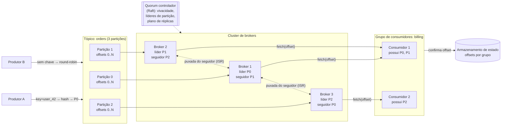

## Visão Geral

[Message Brokers: Queues vs. Log-Based Streaming](message-brokers-queues-vs-logs) cobre *quando* recorrer a um broker e qual modelo de broker se encaixa em qual carga de trabalho. Este conceito é a outra metade: como você de fato construiria o baseado em log. "Projete uma fila de mensagens distribuída" é um prompt de entrevista padrão precisamente porque força você a montar um motor de armazenamento append-only, um esquema de particionamento, um protocolo de replicação, um protocolo de associação a grupo, e um mecanismo de eleição de líder em um único sistema — e então defender a garantia de entrega que resulta dessas escolhas.

## Requisitos

O prompt é uma linha, então delimite-o. A versão interessante — e a que torna o design mais difícil — é um broker com recursos de streaming de dados em vez de uma fila transiente simples:

**Funcionais:**

- Produtores publicam mensagens (texto, na faixa de kilobytes) em um **tópico** nomeado; consumidores se inscrevem e leem dele.
- Mensagens são **retidas** após a entrega — assuma duas semanas — para que possam ser consumidas repetidamente por consumidores independentes, e reproduzidas após uma correção de bug.
- Mensagens são entregues na ordem em que foram produzidas (com uma ressalva sobre *onde* essa ordem se mantém, abaixo).
- Dados antigos podem ser truncados uma vez que excedam a janela de retenção.
- Semânticas de entrega — no máximo uma vez, pelo menos uma vez, exatamente uma vez — são **configuráveis por caso de uso**, não fixas.

**Não funcionais:**

- **Alto throughput ou baixa latência, configurável.** Agregação de logs quer throughput e tolera centenas de milissegundos; um fluxo de trabalho próximo de requisição/resposta quer o oposto. Um único ajuste — tamanho do lote — move o sistema entre eles, então o design precisa expor isso em vez de escolher pelo usuário.
- **Escalabilidade horizontal.** Adicionar brokers deve adicionar capacidade, e um tópico deve poder crescer além de qualquer máquina única.
- **Durabilidade.** Mensagens são persistidas em disco e replicadas entre nós; perder um broker não pode perder dados.

Uma fila tradicional (estilo RabbitMQ) descarta os requisitos de retenção e ordenação inteiramente — mensagens vivem na memória apenas o tempo suficiente para serem consumidas, com um overflow em disco comparativamente minúsculo. Isso elimina a maior parte do design de armazenamento abaixo. O requisito de retenção é o que torna isso um *log*, e o log é o que faz tudo mais funcionar.

## Armazenamento: Por Que um Log Append-Only, Não um Banco de Dados

Olhe o padrão de acesso antes de escolher o armazenamento. Uma fila de mensagens é intensiva em escrita e em leitura, **não tem updates e não tem deletes** (só truncamento em massa de dados antigos), e é esmagadoramente **sequencial** em ambas as direções. Uma tabela relacional ou coleção de documentos consegue guardar isso, mas é construída para acesso aleatório e mutação — manutenção de B-tree, atualizações de índice, contabilidade MVCC — e nada disso é pago por essa carga de trabalho. Em escala, o banco de dados vira o gargalo.

A estrutura certa é um **write-ahead log**: um arquivo simples ao qual novos registros são anexados e nada nunca é modificado. Acesso sequencial é onde discos são rápidos — um array RAID moderno sustenta centenas de MB/s de leituras e escritas sequenciais — e o instinto de "discos são lentos" é na verdade sobre acesso *aleatório*. Sequencial também significa que o page cache do SO trabalha a favor do sistema: o kernel cacheia agressivamente páginas escritas recentemente, então consumidores lendo perto do fim do log geralmente são servidos da memória sem que o broker gerencie seu próprio cache.

Um único arquivo não pode crescer para sempre, então o log de cada partição é dividido em **segmentos**. Apenas o segmento mais novo está ativo e aceitando appends; quando atinge um limite de tamanho, é fechado e um novo assume. Segmentos fechados servem apenas leituras, e expirar dados antigos é uma questão de deletar arquivos de segmento inteiros — um unlink O(1), não uma consulta de exclusão.

```
partition-1/
  00000000000000000000.log   (fechado)
  00000000000000524288.log   (fechado)
  00000000000001048576.log   (ativo — appends chegam aqui)
```

A mensagem em si é projetada para viajar **inalterada** do produtor através do broker até o consumidor: `key`, `value` (bytes opacos), `topic`, `partition`, `offset`, `timestamp`, `size`, `crc`. Se qualquer camada precisar remodelar uma mensagem, o sistema paga por uma cópia a cada salto, e copiar é o que mata o throughput em volume. O broker trata `value` como bytes que nunca analisa.

**Batching é onipresente** e é a maior alavanca de throughput única: produtores acumulam mensagens na memória e as enviam em uma requisição, o broker as anexa ao log em blocos contíguos grandes, e consumidores buscam um intervalo em uma única viagem de ida e volta. Batching amortiza viagens de rede e transforma muitas escritas pequenas em poucas grandes sequenciais. Seu custo é latência — um lote maior significa esperar mais para preenchê-lo — que é exatamente o ajuste throughput/latência que os requisitos não funcionais pediram.

## Particionamento: A Unidade de Paralelismo e Ordenação

Um tópico que cresce além de uma máquina é dividido em **partições**, cada uma um log independente, espalhadas pelos **brokers** no cluster. Adicionar partições é como um tópico escala: mais partições significa que mais máquinas podem absorver escritas para o mesmo tópico em paralelo.

A consequência crítica: cada partição é um log FIFO com **offsets** monotonicamente crescentes, então a ordenação é total *dentro* de uma partição e **indefinida entre partições**. Não existe uma ordem global de tópico e construir uma derrotaria o propósito do particionamento. Então "mensagens são entregues em ordem" é sempre apenas uma promessa por partição, e é a decisão de roteamento do produtor que determina se essa promessa é útil.

Esse roteamento é a **chave da mensagem**. O produtor escolhe uma partição como `hash(key) % numPartitions`; sem chave, a mensagem se espalha aleatoriamente. Tudo que deve permanecer ordenado em relação um ao outro precisa da mesma chave — todos os eventos de um `user_id`, todas as atualizações de um `order_id` — para que caiam na mesma partição e herdem sua ordem total. Note que a chave é dado de negócio, não um número de partição: a partição é um conceito interno e não deveria vazar para o modelo de domínio do cliente.

Aumentar a contagem de partições é barato: mensagens existentes permanecem onde estão (não há migração de re-hashing), novas mensagens simplesmente se espalham por mais partições, e produtores e consumidores ambos descobrem e se adaptam. Diminuir é a direção incômoda — uma partição desativada para de receber escritas mas não pode ser deletada até que sua janela de retenção expire, porque consumidores ainda podem estar lendo-a. Encolher partições não é uma forma de recuperar espaço em disco rapidamente.

## Replicação e Réplicas em Sincronia

Discos falham e máquinas morrem, então cada partição tem N réplicas (3 é típico) em **nós de broker diferentes** — réplicas no mesmo nó derrotam o propósito e desperdiçam armazenamento. Uma réplica por partição é o **líder**; o resto são seguidores.

Todas as escritas vão para o líder. Seguidores continuamente puxam dele, exatamente como um consumidor faria. Uma vez que "o suficiente" de réplicas tenham o registro, o líder o confirma (commit) — e apenas registros confirmados são visíveis para os consumidores, o que é o que impede um consumidor de ler um registro que um failover de líder subsequente apagaria.

"O suficiente" é definido pelo conjunto de **réplicas em sincronia (ISR)**: as réplicas que estão atualmente em dia com o líder, dentro de um limite de atraso configurado. Um seguidor que fica muito atrasado é ejetado do ISR e pode se reintegrar quando se atualizar. O ISR existe porque as definições alternativas de "o suficiente" são ambas ruins: esperar por *todas* as réplicas significa que um disco lento trava a partição inteira, enquanto esperar por *nenhuma* significa que dados confirmados podem sumir. O ISR é o conjunto móvel de réplicas que realmente estão acompanhando, então a durabilidade é medida contra um quorum saudável em vez da máquina mais lenta do cluster.

O produtor escolhe onde nesse espectro ele se posiciona, por tópico:

| Configuração | Produtor espera por | Durabilidade | Custo |
|---|---|---|---|
| `ack=all` | Toda réplica em sincronia | Mais forte — sobrevive à perda do líder | Limitado pelo membro mais lento do ISR |
| `ack=1` | Apenas a escrita local do líder | Perde dados se o líder morrer antes dos seguidores puxarem | Baixa latência |
| `ack=0` | Nada; dispara e esquece, sem retentativa | Perda de mensagem em qualquer soluço | Menor latência possível |

`ack=0` é defensável para métricas e envio de logs onde o volume é enorme e um registro perdido é ruído; `ack=all` é a única escolha honesta quando a mensagem representa dinheiro ou estado.

Consumidores leem do **líder** também, não dos seguidores. Isso parece que deveria sobrecarregar o líder, mas uma partição é lida por no máximo um consumidor por grupo, então a contagem de conexões permanece proporcional ao número de grupos, não ao número de máquinas. Onde isso realmente machuca é em leituras entre datacenters — um consumidor pagando uma viagem WAN para um líder em outra região é um caso para permitir leituras da réplica em sincronia mais próxima em vez disso.

## Grupos de Consumidores, Offsets e Rebalanceamento

Um **grupo de consumidores** é um conjunto de consumidores cooperando para ler um tópico. Duas regras dão ao grupo sua semântica:

1. Dentro de um grupo, **cada partição é atribuída a exatamente um consumidor**. Isso preserva a ordenação por partição (dois consumidores em uma partição intercalariam de forma imprevisível) e balanceia a carga do tópico pelo grupo.
2. **Grupos diferentes são independentes** e cada um vê cada mensagem, com seus próprios offsets. Isso é fan-out de publish/subscribe.

Coloque todo consumidor em um grupo e você reconstruiu a semântica de fila ponto-a-ponto em cima de um log. A regra 1 também limita o paralelismo: um grupo nunca pode ter mais consumidores úteis do que partições — os extras ficam ociosos. Provisione partições generosamente desde o início, depois escale adicionando consumidores.

A posição é rastreada como um **offset confirmado** por (grupo, partição): "tudo em ou abaixo do offset 6 está processado." Esse único número substitui a contabilidade de confirmação por mensagem que um broker tradicional mantém, o que é por que o design do log é mais barato e faz batching tão bem. Se um consumidor morre, seu substituto lê o offset confirmado do armazenamento de estado e retoma dali.

Consumidores **puxam**; o broker não empurra. Um modelo push dá menor latência mas permite que um produtor rápido sobrecarregue um consumidor lento, e força o broker a raciocinar sobre a capacidade de processamento de cada cliente. Pull inverte isso: cada consumidor define seu próprio ritmo, um consumidor atrasado simplesmente fica para trás em vez de desabar, e uma busca naturalmente retorna tudo disponível a partir da posição atual — um lote, de graça. A única desvantagem, consumidores girando em um tópico vazio, é resolvida com **long polling**: a busca bloqueia do lado do servidor por um intervalo configurado esperando novos dados.

A associação ao grupo é gerenciada por um **coordenador** — um broker, escolhido fazendo hash do nome do grupo, então todo membro de um grupo fala com o mesmo. Consumidores enviam heartbeat para ele. O **rebalanceamento** dispara sempre que a associação ou a contagem de partições muda:

1. Um consumidor entra, sai, ou para de enviar heartbeat (uma queda parece uma falta de heartbeat e nada mais — veja [The Trouble with Distributed Systems](distributed-systems-partial-failures) para entender por que "travado" e "lento" são indistinguíveis de fora).
2. O coordenador pede que todos os membros se reintegrem no próximo heartbeat.
3. Uma vez que todos se reintegraram, o coordenador escolhe um consumidor como o **líder do grupo**.
4. Esse líder computa a nova atribuição de partições (round-robin, range, sticky) e a entrega ao coordenador, que a transmite.
5. Consumidores começam a ler suas partições recém-atribuídas a partir do offset confirmado de cada partição.

Note a divisão: o coordenador trata associação e offsets, o líder de grupo eleito computa a atribuição. Manter a lógica de atribuição no cliente significa que mudar a estratégia não exige uma atualização do broker. O custo do protocolo inteiro é uma **pausa total (stop-the-world)** — durante um rebalanceamento, o consumo para — o que é por que um timeout de heartbeat agressivo que ocasionalmente dispara em falso numa pausa de GC é um problema real de disponibilidade.

## Coordenação de Cluster: Quem Lidera O Quê

Várias perguntas neste design não têm resposta local: quais brokers estão vivos agora, qual réplica lidera cada partição, e quem decide quando um líder está morto. Cada broker ter sua própria opinião é exatamente o cenário split-brain que perde dados — dois nós ambos aceitando escritas como líder da mesma partição.

A estrutura padrão elege **um broker como o controlador do cluster**, e ele possui o **plano de distribuição de réplicas**: quais brokers guardam quais partições, e qual réplica lidera cada uma. Ele persiste esse plano no armazenamento de metadados, e todo broker trabalha a partir dele. Quando o controlador detecta que um broker está fora do ar, ele produz um novo plano — promovendo uma réplica sobrevivente em sincronia para líder de cada partição afetada, e agendando novos seguidores em nós saudáveis para restaurar o fator de replicação.

Eleger esse único controlador, e detectar falha sem que dois nós discordem, é o problema de consenso — veja [Consensus and Coordination Services](consensus-and-coordination-services). Historicamente isso significava um ensemble externo do ZooKeeper (ou etcd) guardando metadados do cluster, offsets, e o lease do controlador. O Kafka agora roda seu próprio quorum Raft interno através de nós controladores dedicados (**KRaft**), e o suporte ao ZooKeeper foi removido inteiramente no Kafka 4.0 — o log de metadados virou apenas mais um log replicado dentro do sistema que ele coordena. O requisito não mudou; só onde o algoritmo de consenso roda.

Três responsabilidades de armazenamento surgem, e elas têm padrões de acesso genuinamente diferentes:

- **Armazenamento de dados** — os logs de mensagens. Enorme, sequencial, append-only. Os arquivos de segmento customizados descritos acima.
- **Armazenamento de estado** — atribuições de consumidor/partição e offsets confirmados. Volume pequeno, leituras e escritas aleatórias frequentes, precisa de consistência. O Kafka moveu isso para fora do ZooKeeper para um tópico compactado interno nos próprios brokers.
- **Armazenamento de metadados** — configuração de tópico, contagens de partição, retenção, plano de réplicas. Minúsculo, raramente escrito, deve ser fortemente consistente. É isso que a camada de consenso guarda.



## Semânticas de Entrega

A garantia não é uma propriedade que o broker fornece sozinho — é o produto da configuração de ack do produtor, seu comportamento de retentativa, e a ordem em que o consumidor confirma seu offset em relação a fazer o trabalho.

**No máximo uma vez.** Produtor envia com `ack=0` e nunca tenta de novo. Consumidor confirma o offset *antes* de processar. Uma queda no meio do processamento significa que o registro é pulado para sempre, porque seu offset já foi confirmado. Mensagens podem ser perdidas, nunca duplicadas. Bom para métricas e telemetria amostrada.

**Pelo menos uma vez.** Produtor usa `ack=1` ou `ack=all` e tenta de novo em falha ou timeout. Consumidor confirma o offset *depois* que o processamento tem sucesso. Nada é perdido, mas duas fontes de duplicação permanecem: uma retentativa do produtor após um ack que foi de fato entregue mas cuja resposta se perdeu, e um consumidor que termina de processar e trava antes de confirmar. Esse é o padrão prático — e ele empurra a deduplicação para o consumidor, geralmente via uma escrita idempotente indexada por um id de mensagem único, então reproduzir um registro é um no-op em vez de uma cobrança dupla.

**Exatamente uma vez.** Todo registro afeta o estado final uma vez, não importa o que falhe. Nada nisso é de graça:

- **Idempotência do produtor** — cada produtor recebe um id e carimba um número de sequência monotônico por partição, então o broker pode reconhecer e descartar uma duplicata retentada em vez de anexá-la duas vezes.
- **Transações através de partições** — escritas em múltiplas partições, mais a confirmação de offset do próprio consumidor, são embrulhadas em uma transação que confirma atomicamente. Um coordenador de transação escreve marcadores no log, e consumidores configurados para ler dados confirmados pulam registros de transações abortadas.
- **A fronteira é a borda do sistema.** Exatamente uma vez se mantém *dentro* do broker — ler, processar, escrever resultado, confirmar offset, tudo uma unidade atômica. No momento em que o efeito colateral de um consumidor é uma chamada HTTP externa ou uma escrita para um sistema que não está na transação, a garantia para naquela fronteira e você está de volta precisando de idempotência downstream.

O custo é viagens de rede extras, estado do coordenador, marcadores de transação no log, e consumidores que precisam armazenar em buffer até que um marcador de commit chegue — o que é por que sistemas que poderiam habilitá-lo frequentemente entregam pelo menos-uma-vez mais consumidores idempotentes em vez disso, e obtêm o mesmo estado final por uma fração da maquinaria.

## Trade-offs

- **Partições compram paralelismo e custam ordenação global** — a única ordem total é por partição, então um sistema que genuinamente precisa de uma ordem através de tudo está limitado a uma única partição e portanto ao throughput de uma única máquina. Na prática, a correção é estreitar o requisito de ordenação para uma chave (por usuário, por pedido) em vez de alargar a partição.
- **Tamanho do lote é um único ajuste que troca latência por throughput, e não há configuração que ganhe ambos** — lotes grandes amortizam viagens de rede e produzem grandes escritas sequenciais em disco; lotes pequenos enviam antes. Ajustar para baixa latência significa lotes menores e geralmente mais partições para recuperar o throughput perdido.
- **O ISR é um compromisso deliberado entre as duas definições ruins de durável** — esperar por todas as réplicas torna o disco mais lento do cluster a latência de escrita da partição; esperar por nenhuma perde silenciosamente dados confirmados no failover. Rastrear o conjunto que realmente está acompanhando dá durabilidade forte sem deixar um nó doente parar uma partição.
- **Consumidores baseados em pull trocam um pouco de latência por controle total da taxa de consumo** — o broker nunca precisa modelar a capacidade do consumidor, um consumidor atrasado degrada sozinho em vez de ser sobrecarregado, e buscas fazem batching naturalmente; o preço é um intervalo de polling de latência adicionada, parcialmente recuperado com long polling.
- **Exatamente uma vez é real mas seu escopo é menor do que o nome sugere** — cobre ler-processar-escrever dentro da fronteira transacional do broker, não efeitos colaterais arbitrários. Se o consumidor chama uma API externa, você ainda precisa de idempotência ali, ponto em que pelo menos-uma-vez mais um destino idempotente é frequentemente o design mais barato com o mesmo resultado.
- **Retenção transforma o broker em um sistema de registro, com o peso operacional que isso implica** — reproduzir após uma correção de bug se torna rotina, mas agora você está fazendo planejamento de capacidade, replicando e protegendo semanas de dados de negócio nos discos do broker, e consumidores podem silenciosamente cair além da borda de retenção e perder dados que nunca leram.

## Perguntas de Entrevista

- Um requisito diz "todos os eventos devem ser processados na ordem em que foram produzidos." O que você precisa perguntar antes de conseguir dizer se isso é alcançável, e o que a resposta implica sobre o throughput máximo?
- Por que um log segmentado append-only é mais adequado aqui do que uma tabela relacional, dado que ambos podem armazenar as mensagens de forma durável?
- Uma partição tem 3 réplicas e o produtor usa `ack=all`. O disco de um seguidor fica lento. O que acontece com a latência de escrita, e como o mecanismo de ISR muda o resultado versus um design que espera por todas as réplicas incondicionalmente?
- Seu grupo de consumidores tem 12 consumidores e o tópico tem 4 partições. Qual é o paralelismo real, e o que você muda para aumentá-lo?
- Um consumidor processa uma mensagem, escreve o resultado no Postgres, e trava antes de confirmar seu offset. O que acontece na reinicialização, e o que você mudaria para tornar o estado final correto sem habilitar semântica de exatamente-uma-vez?

## Referências

- [Alex Xu e Sahn Lam, "System Design Interview – An Insider's Guide, Volume 2" (ByteByteGo, 2022) — Capítulo 4, "Distributed Message Queue"](https://bytebytego.com)
- [Jay Kreps, Neha Narkhede, e Jun Rao, "Kafka: a Distributed Messaging System for Log Processing" (LinkedIn, NetDB 2011)](https://notes.stephenholiday.com/Kafka.pdf)
- [Apache Kafka Documentation — Design (persistence, batching, push vs. pull, replication, delivery semantics)](https://kafka.apache.org/documentation/#design)
- [Confluent Engineering — "Hands-Free Kafka Replication: A Lesson in Operational Simplicity"](https://www.confluent.io/blog/hands-free-kafka-replication-a-lesson-in-operational-simplicity/)
