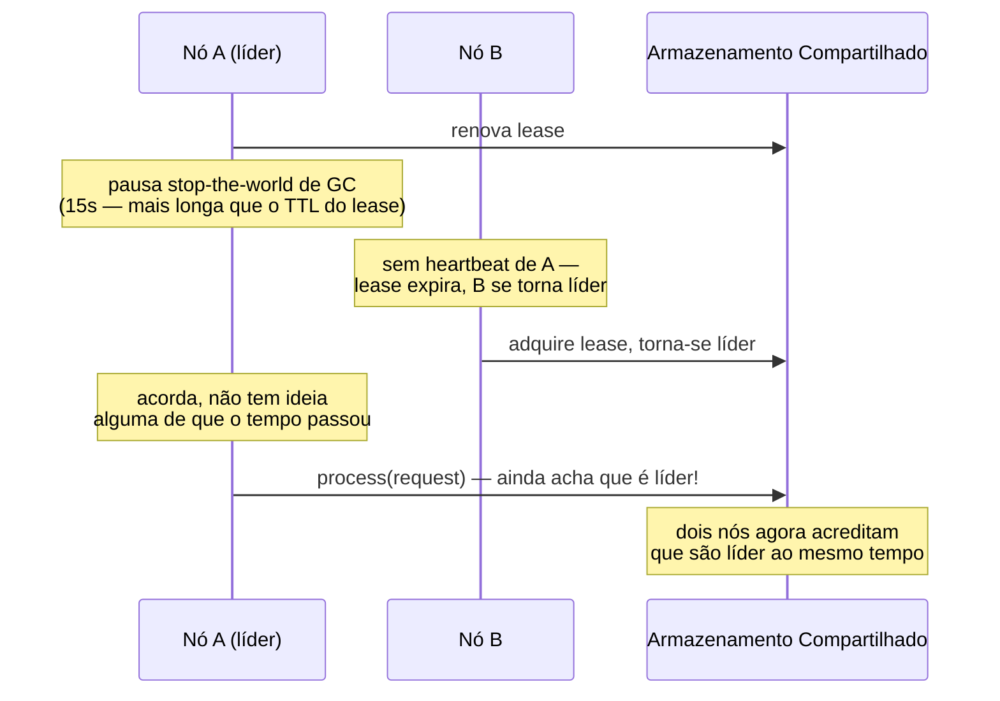

## Visão Geral

Um programa rodando em uma única máquina ou funciona ou não funciona — se trava, tudo para, e não há ambiguidade sobre seu estado. Um sistema distribuído não tem esse luxo: partes dele podem falhar enquanto outras partes continuam rodando, mensagens podem ser atrasadas por uma quantidade de tempo desconhecida ou perdidas completamente, e o próprio relógio de um nó e até seu próprio escalonador de thread podem mentir para ele sobre quanto tempo passou. Isso se chama *falha parcial*, e é a causa raiz de quase todo bug de sistemas distribuídos que não aparece em testes de nó único.

## Redes Não Confiáveis: Você Não Consegue Distinguir "Lento" de "Morto"

Se o nó A envia uma requisição para o nó B e não recebe resposta, A não consegue dizer qual destes aconteceu: a requisição se perdeu em trânsito, B está fora do ar, B está no ar mas sobrecarregado e ainda não a processou, B a processou e sua *resposta* se perdeu, ou B a processou e a resposta está apenas lenta. TCP garante entrega ordenada e confiável em uma conexão, mas não faz nada para limitar *quanto tempo* a entrega leva — um switch pode silenciosamente descartar pacotes, uma fila pode acumular, um firewall pode manter uma conexão aberta sem tráfego nela. A única ferramenta disponível é um timeout, e todo timeout é um chute: curto demais, e um nó apenas lento é declarado morto e seu trabalho é duplicado em outro lugar; longo demais, e a falha de um nó genuinamente morto leva muito mais tempo para ser detectada.

## Relógios Não Confiáveis: Dois Relógios Diferentes, Dois Modos de Falha Diferentes

Toda máquina tem (pelo menos) dois tipos de relógio, e confundi-los é uma fonte comum de bugs:

- Um **relógio de hora do dia** (estilo `System.currentTimeMillis()`) retorna tempo de relógio de parede sincronizado com NTP — e a sincronização NTP pode fazê-lo **saltar para trás** quando corrige o drift. Nunca o use para medir uma duração ou ordenar eventos entre máquinas.
- Um **relógio monotônico** só se move para frente, e é seguro para medir tempo decorrido em uma máquina — mas os relógios monotônicos de duas máquinas diferentes não são comparáveis entre si de forma alguma.

Relógios sincronizados ainda derivam entre intervalos de sincronização — NTP comum pela internet pública pode estar errado por dezenas de milissegundos mesmo funcionando corretamente, e muito pior se uma sincronização falha silenciosamente. O Spanner do Google contorna isso não tentando obter um único tempo exato de forma alguma: usa a **API TrueTime**, que reporta um *intervalo de confiança* (`[earliest, latest]`) apoiado por GPS e relógios atômicos em cada datacenter, mantendo esse intervalo em cerca de 7ms. Dois eventos só podem ser ordenados com segurança quando seus intervalos não se sobrepõem — e o Spanner deliberadamente espera o comprimento do intervalo passar antes de confirmar uma transação, trocando uma pequena quantidade de latência por uma garantia de correção real em vez de esperar que um relógio sincronizado seja preciso o suficiente. Outros sistemas desde então adotaram uma ideia similar sem precisar do próprio hardware do Google — o YugabyteDB, por exemplo, pode usar o daemon ClockBound de código aberto da AWS (emparelhado com o Amazon Time Sync Service aprimorado da EC2) para obter um intervalo de confiança limitado em instâncias comuns da AWS em vez de relógios atômicos/GPS dedicados.

## Pausas de Processo: O Bug de Renovação de Lease

Digamos que um sistema elege um líder por shard, e esse líder precisa manter um *lease* baseado em tempo para continuar aceitando escritas — ele o renova antes de expirar, e para de ser líder se o lease expirar. Uma implementação ingênua verifica "meu lease ainda é válido?" logo antes de processar cada requisição:

```java
while (true) {
    request = getIncomingRequest();
    if (lease.expiryTimeMillis - System.currentTimeMillis() < 10000) {
        lease = lease.renew();
    }
    if (lease.isValid()) {
        process(request);   // <-- e se a thread pausar bem aqui?
    }
}
```

Isso parece seguro — um buffer de 10 segundos deveria ser tempo mais que suficiente para perceber que o lease está perto de expirar. Mas assume que quase nenhum tempo passa entre a verificação e `process(request)` realmente rodar. Se a thread é pausada por, digamos, 15 segundos exatamente naquela linha — uma pausa stop-the-world de GC, uma pausa de live-migration de VM, uma troca de contexto de SO sob carga, um page fault disparando swap-para-disco, ou até o `SIGSTOP`/`Ctrl-Z` de alguém — o lease pode expirar *durante* a pausa. Outro nó, não vendo heartbeat, assume a liderança. A thread original acorda sem ideia alguma de que algum tempo passou, e procede a processar a requisição como se ainda fosse líder — dois nós agora acreditam que são o líder do mesmo shard ao mesmo tempo.

A correção não é uma mudança inteligente de código; é aceitar que uma thread pode ser preemptada por uma quantidade de tempo ilimitada e imprevisível, e construir o protocolo (tokens de fencing que incrementam a cada aquisição de lease, verificados por qualquer coisa que o líder escreve) para que as escritas de um líder "zumbi" sejam rejeitadas mesmo que ele nunca perceba que parou de ser líder.



## Trade-offs

- **Um timeout mais longo reduz falsa detecção de falha mas desacelera a recuperação de falha genuína — não há um valor que seja simplesmente "correto".**
  ```
  timeout=1s:  uma pausa de GC ou GC lento facilmente dispara um failover falso
  timeout=30s: o tráfego de um nó genuinamente morto continua falhando por 30s antes que alguém reaja
  ```
- **Algoritmos de GC modernos (G1, ZGC, Shenandoah) reduziram tempos de pausa típicos de "stop-the-world por minutos" (historicamente) para poucos milissegundos — mas não eliminaram a possibilidade de uma pausa longa**, e um protocolo distribuído que assume que pausas não podem acontecer eventualmente estará errado independentemente de quão rara seja a pausa.
- **Tokens de fencing corrigem o bug específico do "líder zumbi", mas apenas se todo sistema downstream que aceita as escritas do líder realmente verifica o token** — um protocolo baseado em lease sem fencing aplicado não é realmente seguro, apenas falha raramente o suficiente para que o bug se esconda durante testes normais.

## Perguntas de Entrevista

- Por que um nó não consegue confiavelmente distinguir entre "a rede está lenta" e "o outro nó está morto"?
- Qual é a diferença entre um relógio monotônico e um relógio de hora do dia, e por que essa diferença importa para medir tempo decorrido?
- Percorra como uma pausa de GC poderia fazer dois nós ambos acreditarem que são o líder ao mesmo tempo.
- O que é um token de fencing, e que modo de falha específico ele previne que um lease/heartbeat sozinho não previne?
- Por que o Spanner usa um *intervalo* de confiança em vez de tentar obter um timestamp sincronizado exato?

## Referências

- Martin Kleppmann, [*Designing Data-Intensive Applications*](https://www.oreilly.com/library/view/designing-data-intensive-applications/9781098119058/), 2ª Edição (O'Reilly, 2024) — Capítulo 9, "The Trouble with Distributed Systems"
- Google Research, ["Spanner: Google's Globally-Distributed Database"](https://research.google/pubs/spanner-googles-globally-distributed-database/) (OSDI 2012) — a API TrueTime
- [AWS — Amazon Time Sync Service](https://docs.aws.amazon.com/AmazonElasticComputeCloud/latest/UserGuide/set-time.html) — orientação atual de sincronização de relógio de provedor de nuvem
- [Java Platform — Understanding G1 GC pause times](https://docs.oracle.com/en/java/javase/25/gctuning/garbage-first-g1-garbage-collector1.html)
