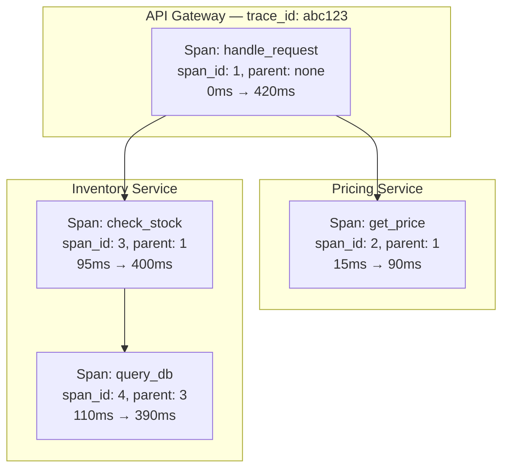

## Overview

A single request into a modern microservice architecture — "load the product page," "place the order" — can fan out into dozens of downstream calls across services owned by different teams, running on different machines, each writing its own logs and feeding its own dashboards. When that request is slow or fails, no single log file or dashboard has the full story: the gateway's log shows it took 900ms and gave up; the pricing service's log, in a different aggregator, shows it took 40ms and succeeded; the inventory service's log doesn't mention this request at all because nobody thought to correlate them by a shared identifier. Reconstructing what actually happened by hand — grepping half a dozen log stores for a timestamp and hoping the clocks agree — is exactly the manual work distributed tracing replaces with one data structure: a **trace**, a single causally-ordered tree of the work done across every service that touched one request, built for the express purpose of answering where the time went and what actually happened, for *this* request, not the fleet in aggregate.

## Traces, Spans, and Context Propagation

The unit of work in a trace is a **span**: a named, timed operation, such as "handle HTTP request," "query database," or "call pricing service." A span records at least a start timestamp, an end timestamp, a name, and a set of key-value attributes describing what happened (the URL called, the HTTP status returned, the SQL statement run). A single request produces many spans — one for each meaningful unit of work in each service it touches — and those spans are related to each other as parent and child: the gateway's span is the parent of the span for its call to the pricing service, which is in turn the parent of the pricing service's span for its call to the database. A **trace** is the complete tree formed by all the spans belonging to one request, rooted at the span that started it.

What makes this tree reconstructable *after the fact*, from spans emitted independently by processes that never talk to each other directly, is **context propagation**: every outgoing call — an HTTP request, an RPC, a message put on a queue — carries a small piece of identifying state alongside the actual payload, and every span created while handling that call reads and re-emits the same state. That state is, at minimum, a trace id (shared by every span in the trace) and the id of the span that caused this one (the parent span id). A tracing backend can later collect every span from every service, group them by trace id, and use the parent-child ids to rebuild the exact tree — without any service needing to know the topology of the whole request, only the id it was handed and the id it hands onward.

The current interoperable standard for carrying that state across an HTTP hop is the W3C **Trace Context** specification's `traceparent` header:

```
traceparent: 00-4bf92f3577b34da6a3ce929d0e0e4736-00f067aa0ba902b7-01
             │  │                                │                │
             │  trace-id (32 hex chars)           parent-id        trace-flags
             version                              (16 hex chars,   (01 = sampled)
                                                    "this span's id")
```

A service receiving this header extracts the trace id and treats the incoming `parent-id` as the parent for the span it's about to create; when it calls a downstream service, it generates a *new* span id for that call and propagates a `traceparent` with the same trace id but the new span id as parent — one level deeper in the tree.

```javascript
// Simplified context propagation across an outgoing HTTP call
function callDownstream(incomingContext, url) {
  const span = startSpan({
    traceId: incomingContext.traceId,      // unchanged — same trace
    parentSpanId: incomingContext.spanId,  // this call's parent
    spanId: generateSpanId(),              // new id for this hop
  });

  fetch(url, {
    headers: {
      traceparent: `00-${span.traceId}-${span.spanId}-01`,
    },
  }).finally(() => span.end());
}
```

## The Dapper Model

The blueprint nearly every modern tracing system follows was published by Google as **Dapper** (Sigelman, Barroso, Burrows, et al., 2010), describing the tracing infrastructure Google had already run in production across its fleet. Dapper's data model is exactly the trace-of-spans structure above, formalized: each span carries a trace id, a span id, a parent span id (absent only for the root span), a human-readable name, start and end timestamps, and a set of annotations — arbitrary application-supplied key-value tags or timestamped log messages attached to the span. Crucially, Dapper's spans also record which host and process produced them, which is what lets spans generated on entirely different machines, with no shared clock beyond loosely synchronized wall time, be reassembled into one tree purely from the trace id and parent-child span ids embedded in each one.

The paper's other lasting contribution is how it kept tracing's overhead low enough to run on *every* request in production rather than only during debugging sessions: **sample at the root, not per span**. Rather than deciding, span by span, whether to record that unit of work — which would produce incoherent, gap-riddled traces, since a parent might be recorded while its child isn't — Dapper makes one sampling decision at the very start of a trace, when the root span is created, and that single decision (encoded in the propagated context, e.g. the trace-flags byte in `traceparent`) determines whether *every* span in the entire tree gets recorded. A small fixed percentage of traces (Dapper's paper describes sampling as low as 1 in 1,024, tunable per workload) are captured in full detail; the rest incur only the negligible cost of generating and propagating an id, not the cost of recording and exporting spans. This is what makes "trace every request, in production, at Google's scale" tractable at all: the expensive part (recording and shipping detailed span data) only happens for the sampled fraction, decided once per trace instead of paid by every span independently.



Read as a tree, this immediately answers the question logs alone can't: the request took 420ms total, pricing was cheap (75ms) and ran early, and almost the entire remaining time (280ms of 420ms) was one slow database query nested three levels deep inside the inventory service's stock check — not the inventory service's own logic, and not anything visible from the gateway's log line alone.

## Sampling: You Cannot Trace Everything

Dapper's root-level sampling is one strategy among a family generally called **head-based sampling**: the decision to keep or discard a trace is made at (or near) the root span, before anything is known about how the request will turn out. Head-based sampling is cheap and simple — a random draw against a fixed rate, made once — but it's blind: it samples a slow, error-riddled trace with exactly the same low probability as a boring, fast, successful one, which means the traces you actually want when debugging an incident (the failing 0.1%) are disproportionately likely to be among the 99% that got thrown away.

**Tail-based sampling** flips the decision point: buffer every span belonging to a trace until the trace is complete (or a timeout passes), then decide whether to keep it based on the *whole trace* — always keep it if any span has an error status, or if total latency exceeds some threshold, and only apply the low-probability random sampling to traces with none of those properties. This lets a system keep effectively 100% of the interesting traces — errors, tail-latency outliers — while still discarding most routine traffic, which head-based sampling cannot do because it has to commit before it knows the outcome.

The cost is real and structural, not just implementation detail: tail-based sampling requires buffering every span of every in-flight trace somewhere (typically a collector layer, not the application) until a decision can be made, which means holding memory proportional to concurrent trace volume and duration, and it delays export of every trace — even the ones ultimately dropped — by however long that trace takes to complete. For traces that are long-running or straddle async boundaries (a request that triggers a background job finishing minutes later), "wait until the trace is complete" is itself an ambiguous instruction, forcing a timeout-based approximation. Head-based sampling has none of this cost, because a per-span decision to drop happens immediately and nothing has to be held anywhere.

## Observability vs. Monitoring: Known-Unknowns vs. Unknown-Unknowns

*Observability Engineering* (Majors, Fong-Jones, and Miranda, 2022) draws a distinction that's easy to blur but has real operational consequences: **monitoring** answers questions you knew to ask *in advance* — a dashboard is a pre-aggregated view built around metrics someone decided, ahead of time, were worth tracking, and an alert fires on a threshold someone decided, ahead of time, indicated trouble. Monitoring is well-suited to **known-unknowns**: failure modes you've seen before, or anticipated, and instrumented for specifically.

**Observability**, in that book's argument, is a different capability: the ability to ask an *arbitrary new question* about a system's internal state — one nobody anticipated when the system was instrumented — and get an answer, without shipping new code to add the instrumentation that question needs. This matters because production incidents are disproportionately **unknown-unknowns**: novel failure modes, unique combinations of request shape and infrastructure state that nobody wrote a dashboard for, because nobody knew to. Answering "why is *this specific* customer's checkout failing, on *this* build, only when they use *this* payment method, only in *this* region" requires slicing and filtering on dimensions nobody pre-aggregated into a metric — which is only possible if the underlying data retains enough detail (high cardinality — many distinct values, like user ids or request ids; high dimensionality — many distinct fields per event) to be sliced arbitrarily after the fact.

This is the book's specific objection to the popular "three pillars of observability" framing (logs, metrics, traces as three separate, siloed data types each with its own tool and storage engine): treating them as three pillars encourages generating three narrower, lossier views of the same underlying events instead of one. Its argument for a different foundation: capture **wide, structured events** — one arbitrarily-wide record per unit of work, with as many fields as are useful, including a trace and span id as just two fields among many — and derive metrics, logs, and trace views from that single source as needed, rather than deciding up front which of three narrow formats to write. A span, in this framing, already *is* a wide structured event (a name, a duration, and an open-ended bag of attributes); tracing infrastructure and observability's wide-event model converge because they're solving the same underlying problem, which is why mature tracing tooling and "observability" tooling look increasingly like the same system.

## OpenTelemetry as the Current Standard

**OpenTelemetry** (OTel) is the vendor-neutral standard that has, since roughly 2021, absorbed the earlier competing tracing standards (OpenTracing and OpenCensus merged into it) and become the default instrumentation layer most new tracing deployments target. It defines the API and SDK a service uses to create spans and propagate context (implementing the same trace id / span id / parent id model Dapper described, over the W3C Trace Context wire format), and it defines the **OpenTelemetry Collector** — a standalone process that receives spans from instrumented services, can batch, sample (including tail-based sampling, since the collector is a natural place to buffer whole traces before deciding), and export them to one or more backends (Jaeger, Tempo, Honeycomb, a vendor APM product, or several at once).

The practical value of standardizing on OTel is decoupling instrumentation from backend choice: a service instrumented with the OTel SDK doesn't hardcode "send spans to Jaeger" — it exports to the Collector, or to any OTLP-compatible endpoint, and which specific backend receives that data becomes a deployment-time configuration decision instead of an application code change. That's what makes it realistic for an organization to switch tracing backends, or run two in parallel during a migration, without re-instrumenting every service.

## Trade-offs

- **Tracing needs propagation discipline everywhere, and one gap breaks the tree.** A single service, queue consumer, or async job that doesn't read and re-emit the trace context turns the trace into two disconnected fragments at exactly that boundary — often the async/queue boundary, which is also where "what happened to this request after it left the request-response path" is hardest to answer any other way.
- **Sampling is a tax on completeness, whichever kind you pick.** Head-based sampling is cheap but risks discarding the specific slow or failing trace an engineer needs mid-incident; tail-based sampling keeps the interesting traces but costs memory, buffering infrastructure, and export latency on every trace, including the ones eventually dropped.
- **Wide structured events cost more to store than pre-aggregated metrics, by design.** A counter that's incremented is O(1) to store regardless of traffic; a wide event per request scales with request volume, which is real storage and ingestion cost paid specifically to preserve the ability to ask unanticipated questions later.
- **A trace shows one request's story well; it's a poor tool for fleet-wide trends.** "Is p99 latency for this endpoint degrading over the last week" is answered far more cheaply by an aggregated metric than by scanning traces — tracing and metrics remain complementary, not substitutes for each other, whatever the storage layer underneath them looks like.
- **Instrumentation is an ongoing tax on every service, not a one-time setup cost.** Every new library, framework version, or internal RPC path needs someone to either rely on auto-instrumentation (which doesn't cover custom internal boundaries) or add spans by hand — coverage gaps are the default outcome, not the exception, unless it's actively maintained.

## Interview Questions

- Walk through what happens, field by field, when a `traceparent` header crosses a service boundary — what does the receiving service do with the trace id versus the parent id?
- Why did Dapper choose to sample at the root of a trace rather than sampling individual spans, and what would go wrong with per-span sampling?
- Explain the difference between head-based and tail-based sampling, and describe a production scenario where only tail-based sampling would let you keep the traces you actually need.
- What's the concrete difference between "monitoring" and "observability" as argued in *Observability Engineering* — and what does high-cardinality, high-dimensionality data have to do with that difference?
- Why does that book criticize the "three pillars" (logs/metrics/traces) framing, and what does it propose instead?
- A queue consumer picks up a job with no trace context attached and the resulting trace is missing that entire branch of work — where in the pipeline did this most likely go wrong, and how would you fix it without re-architecting the queue?

## References

- [Sigelman, Barroso, Burrows, et al. — "Dapper, a Large-Scale Distributed Systems Tracing Infrastructure" (Google Technical Report, 2010)](https://research.google/pubs/dapper-a-large-scale-distributed-systems-tracing-infrastructure/)
- Charity Majors, Liz Fong-Jones, George Miranda, [*Observability Engineering*](https://www.oreilly.com/library/view/observability-engineering/9781492076445/) (O'Reilly, 2022)
- [OpenTelemetry Documentation — Traces](https://opentelemetry.io/docs/concepts/signals/traces/)
- [OpenTelemetry Documentation — Sampling](https://opentelemetry.io/docs/concepts/sampling/)
- [W3C Recommendation — Trace Context](https://www.w3.org/TR/trace-context/)
