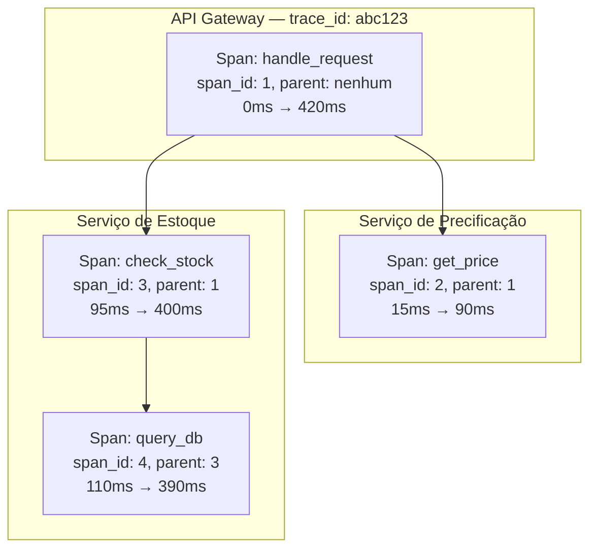

## Visão Geral

Uma única requisição em uma arquitetura de microsserviços moderna — "carregar a página do produto", "fazer o pedido" — pode se ramificar em dezenas de chamadas downstream através de serviços possuídos por times diferentes, rodando em máquinas diferentes, cada um escrevendo seus próprios logs e alimentando seus próprios dashboards. Quando essa requisição é lenta ou falha, nenhum arquivo de log ou dashboard sozinho tem a história completa: o log do gateway mostra que levou 900ms e desistiu; o log do serviço de precificação, em um agregador diferente, mostra que levou 40ms e teve sucesso; o log do serviço de estoque nem menciona essa requisição porque ninguém pensou em correlacioná-los por um identificador compartilhado. Reconstruir manualmente o que realmente aconteceu — fazendo grep em meia dúzia de armazenamentos de log por um timestamp e esperando que os relógios concordem — é exatamente o trabalho manual que o rastreamento distribuído substitui por uma estrutura de dados: um **trace**, uma única árvore causalmente ordenada do trabalho feito através de todo serviço que tocou uma requisição, construída com o propósito expresso de responder para onde foi o tempo e o que realmente aconteceu, para *esta* requisição, não a frota agregada.

## Traces, Spans, e Propagação de Contexto

A unidade de trabalho em um trace é um **span**: uma operação nomeada e cronometrada, como "tratar requisição HTTP", "consultar banco de dados", ou "chamar serviço de precificação". Um span registra pelo menos um timestamp de início, um timestamp de fim, um nome, e um conjunto de atributos chave-valor descrevendo o que aconteceu (a URL chamada, o status HTTP retornado, a instrução SQL executada). Uma única requisição produz muitos spans — um para cada unidade significativa de trabalho em cada serviço que ela toca — e esses spans se relacionam entre si como pai e filho: o span do gateway é o pai do span para sua chamada ao serviço de precificação, que por sua vez é o pai do span do serviço de precificação para sua chamada ao banco de dados. Um **trace** é a árvore completa formada por todos os spans pertencentes a uma requisição, com raiz no span que a iniciou.

O que torna essa árvore reconstruível *depois do fato*, a partir de spans emitidos independentemente por processos que nunca falam diretamente entre si, é a **propagação de contexto**: toda chamada de saída — uma requisição HTTP, um RPC, uma mensagem colocada em uma fila — carrega um pequeno pedaço de estado identificador junto com o payload real, e todo span criado ao tratar essa chamada lê e reemite o mesmo estado. Esse estado é, no mínimo, um id de trace (compartilhado por todo span no trace) e o id do span que causou este (o id do span pai). Um backend de rastreamento pode depois coletar todo span de todo serviço, agrupá-los por id de trace, e usar os ids pai-filho para reconstruir a árvore exata — sem que nenhum serviço precise conhecer a topologia da requisição inteira, apenas o id que recebeu e o id que passa adiante.

O padrão interoperável atual para carregar esse estado através de um salto HTTP é o cabeçalho `traceparent` da especificação **Trace Context** do W3C:

```
traceparent: 00-4bf92f3577b34da6a3ce929d0e0e4736-00f067aa0ba902b7-01
             │  │                                │                │
             │  trace-id (32 caracteres hex)      parent-id        trace-flags
             versão                               (16 caracteres   (01 = amostrado)
                                                    hex, "id deste
                                                    span")
```

Um serviço que recebe esse cabeçalho extrai o id do trace e trata o `parent-id` recebido como o pai para o span que está prestes a criar; quando chama um serviço downstream, gera um *novo* id de span para essa chamada e propaga um `traceparent` com o mesmo id de trace mas o novo id de span como pai — um nível mais fundo na árvore.

```javascript
// Propagação de contexto simplificada através de uma chamada HTTP de saída
function callDownstream(incomingContext, url) {
  const span = startSpan({
    traceId: incomingContext.traceId,      // inalterado — mesmo trace
    parentSpanId: incomingContext.spanId,  // pai desta chamada
    spanId: generateSpanId(),              // novo id para este salto
  });

  fetch(url, {
    headers: {
      traceparent: `00-${span.traceId}-${span.spanId}-01`,
    },
  }).finally(() => span.end());
}
```

## O Modelo Dapper

O projeto que quase todo sistema de rastreamento moderno segue foi publicado pelo Google como **Dapper** (Sigelman, Barroso, Burrows, et al., 2010), descrevendo a infraestrutura de rastreamento que o Google já rodava em produção em toda sua frota. O modelo de dados do Dapper é exatamente a estrutura de trace-de-spans acima, formalizada: cada span carrega um id de trace, um id de span, um id de span pai (ausente apenas para o span raiz), um nome legível por humanos, timestamps de início e fim, e um conjunto de anotações — tags chave-valor arbitrárias fornecidas pela aplicação ou mensagens de log com timestamp anexadas ao span. Crucialmente, os spans do Dapper também registram qual host e processo os produziram, o que é o que permite que spans gerados em máquinas inteiramente diferentes, sem relógio compartilhado além de tempo de relógio frouxamente sincronizado, sejam remontados em uma árvore puramente a partir do id de trace e dos ids de span pai-filho embutidos em cada um.

A outra contribuição duradoura do artigo é como ele manteve a sobrecarga do rastreamento baixa o suficiente para rodar em *cada* requisição em produção em vez de apenas durante sessões de depuração: **amostrar na raiz, não por span**. Em vez de decidir, span por span, se deve registrar aquela unidade de trabalho — o que produziria traces incoerentes, cheios de lacunas, já que um pai poderia ser registrado enquanto seu filho não — o Dapper toma uma única decisão de amostragem bem no início de um trace, quando o span raiz é criado, e essa única decisão (codificada no contexto propagado, ex.: o byte trace-flags em `traceparent`) determina se *todo* span na árvore inteira é registrado. Uma pequena porcentagem fixa de traces (o artigo do Dapper descreve amostragem tão baixa quanto 1 em 1.024, ajustável por carga de trabalho) é capturada em detalhe completo; o resto incorre apenas no custo desprezível de gerar e propagar um id, não o custo de registrar e exportar spans. Isso é o que torna "rastrear cada requisição, em produção, na escala do Google" tratável: a parte cara (registrar e enviar dados detalhados de span) só acontece para a fração amostrada, decidida uma vez por trace em vez de paga por cada span independentemente.



Lido como uma árvore, isso responde imediatamente a pergunta que logs sozinhos não conseguem: a requisição levou 420ms no total, a precificação foi barata (75ms) e rodou cedo, e quase todo o tempo restante (280ms de 420ms) foi uma única consulta lenta ao banco de dados aninhada três níveis dentro da verificação de estoque do serviço de inventário — não a própria lógica do serviço de estoque, e nada visível a partir da linha de log do gateway sozinha.

## Amostragem: Você Não Pode Rastrear Tudo

A amostragem em nível de raiz do Dapper é uma estratégia dentro de uma família geralmente chamada de **amostragem head-based**: a decisão de manter ou descartar um trace é tomada no (ou perto do) span raiz, antes que qualquer coisa seja sabida sobre como a requisição vai terminar. Amostragem head-based é barata e simples — um sorteio aleatório contra uma taxa fixa, feito uma vez — mas é cega: ela amostra um trace lento, cheio de erros, com exatamente a mesma probabilidade baixa que um trace chato, rápido, bem-sucedido, o que significa que os traces que você realmente quer ao depurar um incidente (a falha de 0,1%) são desproporcionalmente propensos a estar entre os 99% que foram descartados.

**Amostragem tail-based** inverte o ponto de decisão: armazena em buffer cada span pertencente a um trace até que o trace esteja completo (ou um timeout passe), então decide se deve mantê-lo baseado no *trace inteiro* — sempre mantê-lo se algum span tiver status de erro, ou se a latência total exceder algum limite, e só aplicar a amostragem aleatória de baixa probabilidade a traces sem nenhuma dessas propriedades. Isso permite que um sistema mantenha efetivamente 100% dos traces interessantes — erros, outliers de latência de cauda — enquanto ainda descarta a maior parte do tráfego rotineiro, o que amostragem head-based não pode fazer porque tem que se comprometer antes de saber o resultado.

O custo é real e estrutural, não apenas detalhe de implementação: amostragem tail-based exige armazenar em buffer cada span de cada trace em voo em algum lugar (tipicamente uma camada de coletor, não a aplicação) até que uma decisão possa ser tomada, o que significa manter memória proporcional ao volume e duração de traces concorrentes, e atrasa a exportação de cada trace — mesmo os que são eventualmente descartados — pelo tempo que aquele trace leva para completar. Para traces que são de longa duração ou atravessam fronteiras assíncronas (uma requisição que dispara um job em background que termina minutos depois), "esperar até que o trace esteja completo" é em si uma instrução ambígua, forçando uma aproximação baseada em timeout. Amostragem head-based não tem nenhum desse custo, porque uma decisão de descarte por span acontece imediatamente e nada precisa ser mantido em lugar nenhum.

## Observabilidade vs. Monitoramento: Não-Conhecidos Conhecidos vs. Não-Conhecidos Desconhecidos

*Observability Engineering* (Majors, Fong-Jones, e Miranda, 2022) traça uma distinção fácil de confundir mas com consequências operacionais reais: **monitoramento** responde perguntas que você sabia fazer *com antecedência* — um dashboard é uma visão pré-agregada construída em torno de métricas que alguém decidiu, com antecedência, que valia a pena rastrear, e um alerta dispara em um limite que alguém decidiu, com antecedência, indicar problema. Monitoramento é bem adequado para **não-conhecidos conhecidos**: modos de falha que você já viu antes, ou antecipou, e instrumentou especificamente.

**Observabilidade**, no argumento daquele livro, é uma capacidade diferente: a habilidade de fazer uma *pergunta nova arbitrária* sobre o estado interno de um sistema — uma que ninguém antecipou quando o sistema foi instrumentado — e obter uma resposta, sem enviar código novo para adicionar a instrumentação que aquela pergunta precisa. Isso importa porque incidentes de produção são desproporcionalmente **não-conhecidos desconhecidos**: modos de falha inéditos, combinações únicas de formato de requisição e estado de infraestrutura para os quais ninguém escreveu um dashboard, porque ninguém sabia. Responder "por que o checkout *deste cliente específico* está falhando, nesta build específica, só quando ele usa este método de pagamento, só nesta região" exige fatiar e filtrar em dimensões que ninguém pré-agregou em uma métrica — o que só é possível se os dados subjacentes retiverem detalhe suficiente (alta cardinalidade — muitos valores distintos, como ids de usuário ou ids de requisição; alta dimensionalidade — muitos campos distintos por evento) para serem fatiados arbitrariamente depois do fato.

Esta é a objeção específica do livro ao popular enquadramento de "três pilares da observabilidade" (logs, métricas, traces como três tipos de dados separados e isolados, cada um com sua própria ferramenta e motor de armazenamento): tratá-los como três pilares incentiva gerar três visões mais estreitas e com mais perda do mesmo conjunto de eventos subjacente, em vez de uma. Seu argumento por uma fundação diferente: capturar **eventos amplos e estruturados** — um registro arbitrariamente amplo por unidade de trabalho, com quantos campos forem úteis, incluindo um id de trace e de span como apenas dois campos entre muitos — e derivar visões de métricas, logs e traces daquela única fonte conforme necessário, em vez de decidir de antemão qual dos três formatos estreitos escrever. Um span, neste enquadramento, já *é* um evento amplo estruturado (um nome, uma duração, e um saco aberto de atributos); a infraestrutura de rastreamento e o modelo de evento amplo da observabilidade convergem porque estão resolvendo o mesmo problema subjacente, o que é por que ferramentas maduras de rastreamento e ferramentas de "observabilidade" parecem cada vez mais o mesmo sistema.

## OpenTelemetry como o Padrão Atual

**OpenTelemetry** (OTel) é o padrão neutro em relação a fornecedores que, desde aproximadamente 2021, absorveu os padrões de rastreamento concorrentes anteriores (OpenTracing e OpenCensus se fundiram nele) e se tornou a camada de instrumentação padrão que a maioria das novas implantações de rastreamento tem como alvo. Ele define a API e o SDK que um serviço usa para criar spans e propagar contexto (implementando o mesmo modelo de id de trace / id de span / id pai que o Dapper descreveu, sobre o formato de fio do W3C Trace Context), e define o **OpenTelemetry Collector** — um processo independente que recebe spans de serviços instrumentados, pode fazer batching, amostrar (incluindo amostragem tail-based, já que o coletor é um lugar natural para armazenar em buffer traces inteiros antes de decidir), e exportá-los para um ou mais backends (Jaeger, Tempo, Honeycomb, um produto APM de fornecedor, ou vários de uma vez).

O valor prático de padronizar em OTel é desacoplar a instrumentação da escolha de backend: um serviço instrumentado com o SDK do OTel não fixa "enviar spans para o Jaeger" — ele exporta para o Collector, ou para qualquer endpoint compatível com OTLP, e qual backend específico recebe aqueles dados se torna uma decisão de configuração em tempo de implantação em vez de uma mudança de código da aplicação. Isso é o que torna realista para uma organização trocar de backend de rastreamento, ou rodar dois em paralelo durante uma migração, sem reinstrumentar cada serviço.

## Trade-offs

- **Rastreamento precisa de disciplina de propagação em todo lugar, e uma lacuna quebra a árvore.** Um único serviço, consumidor de fila, ou job assíncrono que não lê e reemite o contexto de trace transforma o trace em dois fragmentos desconectados exatamente naquela fronteira — frequentemente a fronteira de fila/assíncrona, que também é onde "o que aconteceu com esta requisição depois que ela saiu do caminho requisição-resposta" é mais difícil de responder de qualquer outra forma.
- **Amostragem é um imposto sobre completude, qualquer tipo que você escolha.** Amostragem head-based é barata mas arrisca descartar o trace específico lento ou falho que um engenheiro precisa no meio de um incidente; amostragem tail-based mantém os traces interessantes mas custa memória, infraestrutura de buffer, e latência de exportação em cada trace, incluindo os eventualmente descartados.
- **Eventos amplos estruturados custam mais para armazenar do que métricas pré-agregadas, por design.** Um contador que é incrementado é O(1) para armazenar independente do tráfego; um evento amplo por requisição escala com o volume de requisição, o que é custo real de armazenamento e ingestão pago especificamente para preservar a habilidade de fazer perguntas não antecipadas depois.
- **Um trace mostra bem a história de uma requisição; é uma ferramenta fraca para tendências de frota inteira.** "O p99 de latência para este endpoint está degradando na última semana" é respondido muito mais barato por uma métrica agregada do que escaneando traces — rastreamento e métricas permanecem complementares, não substitutos um do outro, seja qual for a aparência da camada de armazenamento por baixo.
- **Instrumentação é um imposto contínuo em cada serviço, não um custo de configuração único.** Toda nova biblioteca, versão de framework, ou caminho de RPC interno precisa que alguém confie em auto-instrumentação (que não cobre fronteiras internas customizadas) ou adicione spans manualmente — lacunas de cobertura são o resultado padrão, não a exceção, a menos que seja mantido ativamente.

## Perguntas de Entrevista

- Percorra o que acontece, campo por campo, quando um cabeçalho `traceparent` cruza uma fronteira de serviço — o que o serviço receptor faz com o id de trace versus o id pai?
- Por que o Dapper escolheu amostrar na raiz de um trace em vez de amostrar spans individuais, e o que daria errado com amostragem por span?
- Explique a diferença entre amostragem head-based e tail-based, e descreva um cenário de produção onde só amostragem tail-based permitiria que você mantivesse os traces que realmente precisa.
- Qual é a diferença concreta entre "monitoramento" e "observabilidade" como argumentado em *Observability Engineering* — e o que dados de alta cardinalidade e alta dimensionalidade têm a ver com essa diferença?
- Por que aquele livro critica o enquadramento de "três pilares" (logs/métricas/traces), e o que ele propõe em vez disso?
- Um consumidor de fila pega um job sem contexto de trace anexado e o trace resultante está faltando aquele ramo inteiro de trabalho — onde no pipeline isso provavelmente deu errado, e como você corrigiria sem re-arquitetar a fila?

## Referências

- [Sigelman, Barroso, Burrows, et al. — "Dapper, a Large-Scale Distributed Systems Tracing Infrastructure" (Google Technical Report, 2010)](https://research.google/pubs/dapper-a-large-scale-distributed-systems-tracing-infrastructure/)
- Charity Majors, Liz Fong-Jones, George Miranda, [*Observability Engineering*](https://www.oreilly.com/library/view/observability-engineering/9781492076445/) (O'Reilly, 2022)
- [OpenTelemetry Documentation — Traces](https://opentelemetry.io/docs/concepts/signals/traces/)
- [OpenTelemetry Documentation — Sampling](https://opentelemetry.io/docs/concepts/sampling/)
- [W3C Recommendation — Trace Context](https://www.w3.org/TR/trace-context/)
