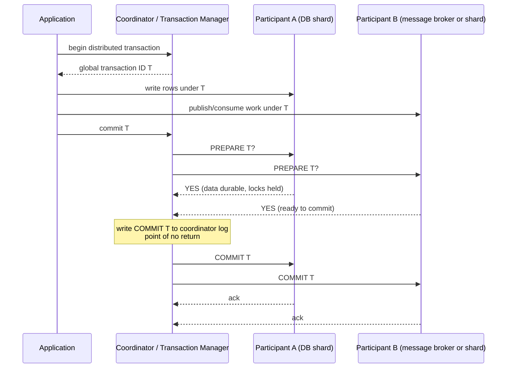

## Overview

A local [ACID transaction](transactions-acid-and-isolation-levels) has one storage engine, one write-ahead log, and one decisive moment when the commit record becomes durable. A distributed transaction has several participants — shards, replicas, databases, or even a database plus a message broker — and the hard problem is no longer just isolation. It is **atomic commit**: once one participant makes the transaction visible, every participant must make the same decision, because a later "undo" may invalidate reads and side effects that have already escaped.

**Two-phase commit** (2PC) is the classic answer. It turns commit into a protocol of promises between a coordinator and participants, and it is still the foundation for XA/JTA transactions and for many database-internal distributed transactions. The catch is liveness: plain 2PC is a blocking protocol, so modern service architectures often avoid it with the [outbox pattern](outbox-pattern) and sagas, while distributed SQL systems combine 2PC with replicated state machines from [consensus and coordination services](consensus-and-coordination-services).

## The Atomic Commit Problem

A transaction that updates two shards cannot safely send `COMMIT` to both and hope. One shard might detect a constraint violation, another might crash after writing its commit record, and a network packet might be lost on the way to a third. If some participants commit while others abort, the system has acknowledged a fact in one place and denied it in another.

The problem is stricter than eventual convergence. Once committed data is visible under read committed or stronger isolation, other transactions can read it, derive new writes from it, send messages about it, or show it to users. Retrospectively declaring that committed value nonexistent would require cascading rollback through the rest of the world. Atomic commit therefore asks for a single global outcome: **all commit or all abort**.

### Participants, coordinator, and transaction identity

2PC introduces a **coordinator** (also called a transaction manager) and gives the distributed transaction a globally unique transaction ID. Each participant runs its own local transaction, records work under that ID, and waits for the coordinator to decide the global outcome. Participants do not independently choose the final result; the coordinator collects their votes and publishes the decision.

That split of responsibility is what lets a transaction span shards or systems. It is also what creates 2PC's central failure mode: after a participant has promised that it can commit, it cannot safely change its mind just because the coordinator is temporarily unreachable.

## How Two-Phase Commit Works

2PC has two network phases and two durable promises. In the first phase, the coordinator asks whether every participant can definitely commit. In the second phase, after logging a decision, it tells every participant to commit or abort.

### Phase 1: prepare and vote

During **prepare**, each participant checks everything that could still make the transaction impossible: constraint violations, conflicts, disk space, durability of redo information, and any local condition required by its storage engine. If a participant votes **no** or times out before preparing, the coordinator can abort the transaction everywhere.

A **yes** vote is much stronger than "looks good." The participant has written enough state to recover after a crash, keeps the necessary locks, and promises that if the coordinator later says commit, it will commit even after restart. The participant has surrendered its unilateral right to abort, but the transaction is not yet committed because the coordinator may still choose abort if another participant voted no.

### Phase 2: decision and completion

Once every participant votes yes, the coordinator makes the global decision and writes it to its own write-ahead log. That durable record is the **commit point**: after it exists, the coordinator must keep retrying commit messages until every participant learns the outcome. If the coordinator crashes after logging commit, recovery reads the log and resumes sending commit; if no commit decision was logged, recovery can abort.

The promises are what make 2PC atomic. Participants promise they can obey a future commit, and the coordinator promises that once its decision is durable it will not change. A one-phase broadcast lacks those promises, so it can leave the system split between committed and aborted outcomes.

## Blocking, XA, and Operational Reality

Plain 2PC is safe but not always live. If the coordinator crashes before prepare, participants can abort. If a participant crashes before voting yes, the coordinator can abort. The painful window is after one or more participants have prepared and before they have received the final decision.

### In-doubt transactions hold locks

A prepared participant is **in doubt**: it knows it promised to commit if asked, but it does not know whether the coordinator chose commit or abort. It cannot safely abort, because another participant may already have committed after receiving the coordinator's decision. It cannot safely commit, because the coordinator may have decided abort after another participant voted no. The only correct action in vanilla 2PC is to wait for the coordinator to recover.

While waiting, the participant must keep the transaction's locks and durable prepared state. Rows written by the transaction may be unmodifiable, and under stricter isolation even reads may be blocked. If the coordinator's log is lost or corrupted, an administrator may have to inspect the participants and manually resolve the transaction. XA systems sometimes expose **heuristic** commit or rollback as an emergency escape hatch, but that is a controlled way of risking atomicity, not a normal recovery path.

### XA and JTA across heterogeneous systems

**XA** is the X/Open standard interface for running 2PC across heterogeneous resource managers: for example, Oracle plus PostgreSQL, or a relational database plus a JMS message broker. In Java enterprise systems, **JTA** gives applications and containers standard transaction interfaces, while JDBC and JMS drivers enlist databases and brokers as XA participants.

The attraction is obvious: application code can wrap a database update and a message acknowledgment in one transaction. The operational cost is also obvious. The transaction manager's local log becomes critical durable state, drivers and resources must all correctly implement the same protocol, locks span products with different failure behavior, and the lowest common denominator makes cross-system deadlock detection, modern isolation algorithms, and coordinated observability hard.

### Database-internal distributed transactions

Database-internal distributed transactions are different. In Spanner, CockroachDB, YugabyteDB, FoundationDB, TiDB, or similar systems, the participants are shards of one database, running one protocol stack, under one operations model. The database can replicate transaction records, let coordinators and shards communicate directly, tune locking and timestamp rules together, and recover automatically without waiting for an application server's XA log to come back.

That does not make distributed transactions free. Cross-shard writes still require extra round trips, durable metadata, conflict handling, and sometimes lock waits. But the system designer controls every layer, so the protocol can be integrated with replication, timestamps, and concurrency control instead of being bolted across unrelated products.

## Exactly-Once Messages and Modern Alternatives

A classic heterogeneous 2PC use case is **exactly-once message processing**. Suppose a worker consumes a message, writes a database side effect, and acknowledges the message. Without atomicity, a crash between the database commit and the broker acknowledgment can cause a duplicate; a crash between acknowledgment and commit can lose work. With XA, the consume/ack, side effect, and commit decision can be part of one distributed transaction, so a failure aborts both and the broker can redeliver safely.

That guarantee only covers participants in the same atomic commit protocol. If processing sends an email, charges a card through an external API, or calls a service that cannot prepare and roll back, 2PC cannot make that side effect disappear. This is why exactly-once discussions with [message brokers: queues vs logs](message-brokers-queues-vs-logs) usually reduce to idempotency, deduplication keys, transactional offsets, and carefully bounded side effects rather than magic delivery semantics.

### Sagas over service boundaries

Most microservice architectures avoid XA between services. A **saga** models a cross-service business operation as a sequence of local transactions, each committed by the service that owns its data. If a later step fails, the saga runs compensating actions: cancel the order, release the credit reservation, refund the payment, or mark the shipment void.

Sagas trade atomic rollback for availability, autonomy, and explicit business semantics. They can be choreographed through events or orchestrated by a workflow component, but either way the application must define intermediate states, retries, timeouts, and compensation. That is work 2PC hides, yet it is often work the business needed anyway because real-world actions are rarely perfectly reversible.

### Outbox instead of dual writes

The [outbox pattern](outbox-pattern) addresses the database-plus-broker dual-write problem without XA. A service writes its domain change and an outbox row in the same local database transaction. A relay later reads the outbox and publishes messages to the broker, retrying until successful. Consumers use idempotency keys because the relay may publish more than once.

The result is not global atomic commit between database and broker, but it preserves the important invariant: if the database transaction commits, the event will eventually be published; if it rolls back, no event should be published. For service boundaries, that is usually a better fit than holding distributed locks across independently deployed systems.

## Distributed SQL: 2PC on Consensus

Modern distributed SQL databases prove that 2PC is not obsolete; it is dangerous when used without the right failure model. Spanner partitions data into splits, replicates each split with Paxos, and provides externally consistent distributed transactions. CockroachDB stores ranges in Raft groups, replicates write intents and transaction records, and uses its Parallel Commits protocol to reduce commit latency. YugabyteDB similarly provides ACID transactions across tablets and nodes with a transaction manager and replicated transaction status.

The key change is that the coordinator and participants are no longer single unreplicated processes. Transaction state lives in replicated consensus groups, and if a node fails, another replica can take over. Layering atomic commit on Paxos or Raft does not remove coordination cost, but it removes the classic single-coordinator blocking problem as long as the relevant quorums remain available.

### When to choose which model

Use database-internal distributed transactions when the invariant truly belongs inside one logical database: money movements between accounts in the same ledger, uniqueness constraints across shards, or multi-row updates that must be serializable. Use sagas and outboxes when the operation crosses service ownership boundaries, external APIs, or human workflows. Use XA only when every participant is under tight operational control, the failure modes are tested, and the consistency requirement is worth the availability and recovery cost.

## Trade-offs

- **2PC gives atomic commit by turning commit into durable promises** — a participant's yes vote means it can no longer unilaterally abort, and the coordinator's logged decision means it can no longer change the outcome. That is stronger than best-effort broadcast, and it costs extra fsyncs, messages, and recovery machinery.
- **Plain 2PC is blocking exactly where operators most want progress** — after prepare, an in-doubt participant must hold locks until it learns the decision. A coordinator crash, lost log, or broken recovery process can turn one transaction into an application-wide outage on hot rows.
- **XA solves the dual-write problem only inside the XA boundary** — it can atomically combine a database and a broker if both enlist correctly, but it cannot roll back emails, payment-network calls, or arbitrary HTTP side effects. It also couples availability to drivers, transaction-manager logs, and heterogeneous resource behavior.
- **Database-internal distributed transactions are more reliable because the system owns the whole stack** — the database can replicate coordinators, transaction records, and shards with consensus, integrate deadlock detection and timestamp rules, and recover without waiting for application code. The trade is vendor complexity and cross-shard latency.
- **Sagas and outboxes trade automatic rollback for explicit, observable recovery** — each service commits locally and publishes durable intent, so failures are retried or compensated rather than blocked behind distributed locks. The price is application-level design for intermediate states, idempotency, and imperfect compensation.
- **Distributed SQL keeps 2PC but changes its liveness story with consensus** — Paxos or Raft replicated shards and transaction records let another node continue after a coordinator failure. That improves availability under node crashes, but quorum loss, contention, and wide transactions still hurt latency and throughput.

## Interview Questions

- In 2PC, what exactly has a participant promised when it votes yes to prepare, and why is that promise stronger than simply saying "I have no error yet"?
- A coordinator crashes after logging commit, one participant commits, and another remains in doubt. Why can the in-doubt participant neither commit nor abort by timeout alone?
- Why are XA/JTA transactions across a database and a message broker operationally harder than distributed transactions inside Spanner or CockroachDB?
- A service consumes a message, writes to a database, and acknowledges the broker. Compare the XA solution with an outbox or deduplication-based solution, including what each does after a crash.
- In a microservice order workflow, when would you choose a saga with compensating actions over 2PC, and what business states must you make explicit for the saga to be safe?

## References

- [Martin Kleppmann, "Designing Data-Intensive Applications", 2nd Edition (O'Reilly) — Chapter 8, "Transactions", sections "Distributed Transactions" and "Exactly-Once Message Processing Revisited"](https://www.oreilly.com/library/view/designing-data-intensive-applications/9781098119058/)
- [Jim Gray and Leslie Lamport — "Consensus on Transaction Commit" (ACM Transactions on Database Systems, 2006)](https://www.microsoft.com/en-us/research/publication/consensus-on-transaction-commit/)
- [Chris Richardson — "Pattern: Saga" (microservices.io)](https://microservices.io/patterns/data/saga.html)
- [Chris Richardson — "Pattern: Transactional outbox" (microservices.io)](https://microservices.io/patterns/data/transactional-outbox.html)
- [Oracle Java EE Tutorial — "Transactions in Java EE Applications"](https://docs.oracle.com/javaee/7/tutorial/transactions001.htm)
- [Google Cloud Spanner Documentation — "Transactions overview"](https://cloud.google.com/spanner/docs/transactions)
- [Google Cloud Spanner Whitepaper — "Life of Spanner Reads and Writes"](https://cloud.google.com/spanner/docs/whitepapers/life-of-reads-and-writes)
- [CockroachDB Docs — "Transaction Layer"](https://www.cockroachlabs.com/docs/stable/architecture/transaction-layer)
- [YugabyteDB Docs — "DocDB transactions layer"](https://docs.yugabyte.com/stable/architecture/transactions/)
