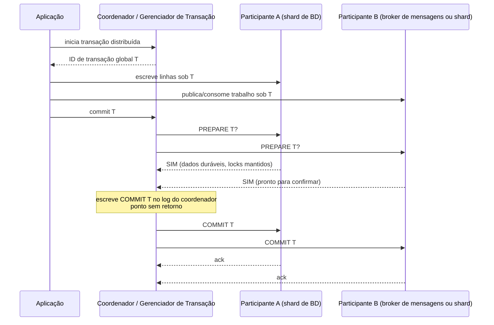

## Visão Geral

Uma [transação ACID](transactions-acid-and-isolation-levels) local tem um motor de armazenamento, um write-ahead log, e um momento decisivo quando o registro de commit se torna durável. Uma transação distribuída tem vários participantes — shards, réplicas, bancos de dados, ou até um banco de dados mais um broker de mensagens — e o problema difícil não é mais apenas isolamento. É **commit atômico**: uma vez que um participante torna a transação visível, todo participante precisa tomar a mesma decisão, porque um "desfazer" posterior pode invalidar leituras e efeitos colaterais que já escaparam.

**Two-phase commit** (2PC) é a resposta clássica. Transforma commit em um protocolo de promessas entre um coordenador e participantes, e ainda é a fundação para transações XA/JTA e para muitas transações distribuídas internas de banco de dados. A pegadinha é vivacidade: 2PC puro é um protocolo bloqueante, então arquiteturas de serviço modernas frequentemente o evitam com o [padrão outbox](outbox-pattern) e sagas, enquanto sistemas SQL distribuídos combinam 2PC com máquinas de estado replicadas de [serviços de consenso e coordenação](consensus-and-coordination-services).

## O Problema do Commit Atômico

Uma transação que atualiza dois shards não pode enviar `COMMIT` para ambos com segurança e simplesmente esperar. Um shard pode detectar uma violação de restrição, outro pode travar depois de escrever seu registro de commit, e um pacote de rede pode se perder a caminho de um terceiro. Se alguns participantes confirmam enquanto outros abortam, o sistema reconheceu um fato em um lugar e o negou em outro.

O problema é mais rígido que convergência eventual. Uma vez que dados confirmados são visíveis sob read committed ou isolamento mais forte, outras transações podem lê-los, derivar novas escritas a partir deles, enviar mensagens sobre eles, ou mostrá-los a usuários. Declarar retrospectivamente que um valor confirmado não existe exigiria rollback em cascata através do resto do mundo. Commit atômico, portanto, pede um único resultado global: **todos confirmam ou todos abortam**.

### Participantes, coordenador, e identidade da transação

2PC introduz um **coordenador** (também chamado de gerenciador de transação) e dá à transação distribuída um ID de transação globalmente único. Cada participante roda sua própria transação local, registra trabalho sob esse ID, e espera o coordenador decidir o resultado global. Participantes não escolhem independentemente o resultado final; o coordenador coleta seus votos e publica a decisão.

Essa divisão de responsabilidade é o que permite a uma transação abranger shards ou sistemas. Também é o que cria o modo de falha central do 2PC: depois que um participante prometeu que pode confirmar, ele não pode mudar de ideia com segurança apenas porque o coordenador está temporariamente inalcançável.

## Como o Two-Phase Commit Funciona

2PC tem duas fases de rede e duas promessas duráveis. Na primeira fase, o coordenador pergunta se todo participante definitivamente pode confirmar. Na segunda fase, depois de registrar uma decisão, ele diz a todo participante para confirmar ou abortar.

### Fase 1: preparação e voto

Durante o **prepare**, cada participante verifica tudo que ainda poderia tornar a transação impossível: violações de restrição, conflitos, espaço em disco, durabilidade de informação de redo, e qualquer condição local exigida por seu motor de armazenamento. Se um participante vota **não** ou expira antes de preparar, o coordenador pode abortar a transação em todo lugar.

Um voto **sim** é muito mais forte que "parece bom." O participante escreveu estado suficiente para se recuperar depois de um crash, mantém os locks necessários, e promete que se o coordenador mais tarde disser commit, ele vai confirmar mesmo depois de reiniciar. O participante abriu mão de seu direito unilateral de abortar, mas a transação ainda não está confirmada porque o coordenador ainda pode escolher abortar se outro participante votou não.

### Fase 2: decisão e conclusão

Uma vez que todo participante vota sim, o coordenador toma a decisão global e a escreve em seu próprio write-ahead log. Esse registro durável é o **ponto de commit**: depois que existe, o coordenador precisa continuar tentando enviar mensagens de commit até que todo participante saiba o resultado. Se o coordenador travar depois de registrar o commit, a recuperação lê o log e retoma o envio do commit; se nenhuma decisão de commit foi registrada, a recuperação pode abortar.

As promessas são o que torna 2PC atômico. Participantes prometem que podem obedecer a um commit futuro, e o coordenador promete que uma vez que sua decisão é durável ele não vai mudá-la. Um broadcast de uma fase carece dessas promessas, então pode deixar o sistema dividido entre resultados confirmados e abortados.

## Bloqueio, XA, e Realidade Operacional

2PC puro é seguro mas nem sempre vivo. Se o coordenador travar antes do prepare, participantes podem abortar. Se um participante travar antes de votar sim, o coordenador pode abortar. A janela dolorosa é depois que um ou mais participantes prepararam e antes de receberem a decisão final.

### Transações em dúvida mantêm locks

Um participante preparado está **em dúvida**: sabe que prometeu confirmar se solicitado, mas não sabe se o coordenador escolheu commit ou abort. Não pode abortar com segurança, porque outro participante pode já ter confirmado depois de receber a decisão do coordenador. Não pode confirmar com segurança, porque o coordenador pode ter decidido abortar depois que outro participante votou não. A única ação correta no 2PC puro é esperar o coordenador se recuperar.

Enquanto espera, o participante precisa manter os locks da transação e o estado preparado durável. Linhas escritas pela transação podem ficar não modificáveis, e sob isolamento mais rígido até leituras podem ser bloqueadas. Se o log do coordenador for perdido ou corrompido, um administrador pode ter que inspecionar os participantes e resolver manualmente a transação. Sistemas XA às vezes expõem commit ou rollback **heurístico** como uma válvula de escape de emergência, mas isso é uma forma controlada de arriscar atomicidade, não um caminho de recuperação normal.

### XA e JTA através de sistemas heterogêneos

**XA** é a interface padrão X/Open para rodar 2PC através de gerenciadores de recursos heterogêneos: por exemplo, Oracle mais PostgreSQL, ou um banco de dados relacional mais um broker de mensagens JMS. Em sistemas Java enterprise, **JTA** dá a aplicações e containers interfaces de transação padrão, enquanto drivers JDBC e JMS alistam bancos de dados e brokers como participantes XA.

A atração é óbvia: código de aplicação pode envolver uma atualização de banco de dados e uma confirmação de mensagem em uma transação. O custo operacional também é óbvio. O log local do gerenciador de transação se torna estado durável crítico, drivers e recursos precisam todos implementar corretamente o mesmo protocolo, locks abrangem produtos com comportamento de falha diferente, e o menor denominador comum torna detecção de deadlock entre sistemas, algoritmos de isolamento modernos, e observabilidade coordenada difíceis.

### Transações distribuídas internas de banco de dados

Transações distribuídas internas de banco de dados são diferentes. No Spanner, CockroachDB, YugabyteDB, FoundationDB, TiDB, ou sistemas similares, os participantes são shards de um banco de dados, rodando uma pilha de protocolo, sob um modelo de operações. O banco de dados pode replicar registros de transação, deixar coordenadores e shards se comunicarem diretamente, ajustar regras de locking e timestamp juntos, e se recuperar automaticamente sem esperar que o log XA de um servidor de aplicação volte.

Isso não torna transações distribuídas gratuitas. Escritas entre shards ainda requerem idas e voltas extras, metadados duráveis, tratamento de conflitos, e às vezes esperas de lock. Mas o projetista do sistema controla toda camada, então o protocolo pode ser integrado com replicação, timestamps, e controle de concorrência em vez de ser aparafusado através de produtos não relacionados.

## Mensagens Exatamente-Uma-Vez e Alternativas Modernas

Um caso de uso clássico de 2PC heterogêneo é **processamento de mensagem exatamente-uma-vez**. Suponha que um worker consome uma mensagem, escreve um efeito colateral de banco de dados, e confirma a mensagem. Sem atomicidade, um crash entre o commit do banco de dados e a confirmação do broker pode causar uma duplicata; um crash entre a confirmação e o commit pode perder trabalho. Com XA, o consumo/ack, o efeito colateral, e a decisão de commit podem ser parte de uma transação distribuída, então uma falha aborta ambos e o broker pode reentregar com segurança.

Essa garantia só cobre participantes no mesmo protocolo de commit atômico. Se o processamento envia um e-mail, cobra um cartão através de uma API externa, ou chama um serviço que não pode preparar e reverter, 2PC não pode fazer esse efeito colateral desaparecer. É por isso que discussões de exatamente-uma-vez com [message brokers: queues vs logs](message-brokers-queues-vs-logs) geralmente se reduzem a idempotência, chaves de deduplicação, offsets transacionais, e efeitos colaterais cuidadosamente limitados em vez de semântica de entrega mágica.

### Sagas através de fronteiras de serviço

A maioria das arquiteturas de microsserviço evita XA entre serviços. Uma **saga** modela uma operação de negócio entre serviços como uma sequência de transações locais, cada uma confirmada pelo serviço que possui seus dados. Se um passo posterior falha, a saga roda ações compensatórias: cancelar o pedido, liberar a reserva de crédito, reembolsar o pagamento, ou anular o envio.

Sagas trocam rollback atômico por disponibilidade, autonomia, e semântica de negócio explícita. Podem ser coreografadas através de eventos ou orquestradas por um componente de workflow, mas de qualquer forma a aplicação precisa definir estados intermediários, novas tentativas, timeouts, e compensação. Isso é trabalho que 2PC esconde, mas é frequentemente trabalho que o negócio precisava de qualquer forma porque ações do mundo real raramente são perfeitamente reversíveis.

### Outbox em vez de escritas duplas

O [padrão outbox](outbox-pattern) aborda o problema de escrita dupla banco-de-dados-mais-broker sem XA. Um serviço escreve sua mudança de domínio e uma linha outbox na mesma transação local de banco de dados. Um relay depois lê o outbox e publica mensagens no broker, tentando de novo até ter sucesso. Consumidores usam chaves de idempotência porque o relay pode publicar mais de uma vez.

O resultado não é commit atômico global entre banco de dados e broker, mas preserva o invariante importante: se a transação do banco de dados confirma, o evento eventualmente será publicado; se ela reverte, nenhum evento deveria ser publicado. Para fronteiras de serviço, isso geralmente é um encaixe melhor que manter locks distribuídos através de sistemas implantados independentemente.

## SQL Distribuído: 2PC sobre Consenso

Bancos de dados SQL distribuídos modernos provam que 2PC não é obsoleto; é perigoso quando usado sem o modelo de falha certo. Spanner particiona dados em splits, replica cada split com Paxos, e fornece transações distribuídas externamente consistentes. CockroachDB armazena ranges em grupos Raft, replica intenções de escrita e registros de transação, e usa seu protocolo Parallel Commits para reduzir latência de commit. YugabyteDB similarmente fornece transações ACID através de tablets e nós com um gerenciador de transação e status de transação replicado.

A mudança chave é que o coordenador e participantes não são mais processos únicos não replicados. Estado de transação vive em grupos de consenso replicados, e se um nó falha, outra réplica pode assumir. Colocar commit atômico em camadas sobre Paxos ou Raft não remove custo de coordenação, mas remove o problema clássico de bloqueio de coordenador único enquanto os quóruns relevantes permanecerem disponíveis.

### Quando escolher qual modelo

Use transações distribuídas internas de banco de dados quando o invariante realmente pertence dentro de um banco de dados lógico: movimentações de dinheiro entre contas no mesmo ledger, restrições de unicidade através de shards, ou atualizações de múltiplas linhas que precisam ser serializáveis. Use sagas e outboxes quando a operação cruza fronteiras de posse de serviço, APIs externas, ou workflows humanos. Use XA apenas quando todo participante está sob controle operacional rígido, os modos de falha são testados, e o requisito de consistência vale o custo de disponibilidade e recuperação.

## Trade-offs

- **2PC dá commit atômico transformando commit em promessas duráveis** — o voto sim de um participante significa que ele não pode mais abortar unilateralmente, e a decisão registrada do coordenador significa que ele não pode mais mudar o resultado. Isso é mais forte que broadcast de melhor esforço, e custa fsyncs extras, mensagens, e maquinaria de recuperação.
- **2PC puro é bloqueante exatamente onde operadores mais querem progresso** — depois do prepare, um participante em dúvida precisa manter locks até saber a decisão. Um crash de coordenador, log perdido, ou processo de recuperação quebrado pode transformar uma transação em uma interrupção de toda a aplicação em linhas quentes.
- **XA resolve o problema de escrita dupla apenas dentro da fronteira XA** — pode combinar atomicamente um banco de dados e um broker se ambos se alistarem corretamente, mas não pode reverter e-mails, chamadas de rede de pagamento, ou efeitos colaterais HTTP arbitrários. Também acopla disponibilidade a drivers, logs de gerenciador de transação, e comportamento heterogêneo de recursos.
- **Transações distribuídas internas de banco de dados são mais confiáveis porque o sistema possui toda a pilha** — o banco de dados pode replicar coordenadores, registros de transação, e shards com consenso, integrar detecção de deadlock e regras de timestamp, e se recuperar sem esperar código de aplicação. A troca é complexidade de fornecedor e latência entre shards.
- **Sagas e outboxes trocam rollback automático por recuperação explícita, observável** — cada serviço confirma localmente e publica intenção durável, então falhas são tentadas de novo ou compensadas em vez de bloqueadas atrás de locks distribuídos. O preço é design em nível de aplicação para estados intermediários, idempotência, e compensação imperfeita.
- **SQL distribuído mantém 2PC mas muda sua história de vivacidade com consenso** — shards e registros de transação replicados por Paxos ou Raft permitem que outro nó continue depois de uma falha de coordenador. Isso melhora disponibilidade sob crashes de nó, mas perda de quórum, contenção, e transações amplas ainda prejudicam latência e throughput.

## Perguntas de Entrevista

- Em 2PC, o que exatamente um participante prometeu quando vota sim para preparar, e por que essa promessa é mais forte que simplesmente dizer "não tenho erro ainda"?
- Um coordenador trava depois de registrar commit, um participante confirma, e outro permanece em dúvida. Por que o participante em dúvida não pode nem confirmar nem abortar apenas por timeout?
- Por que transações XA/JTA através de um banco de dados e um broker de mensagens são operacionalmente mais difíceis que transações distribuídas dentro do Spanner ou CockroachDB?
- Um serviço consome uma mensagem, escreve em um banco de dados, e confirma o broker. Compare a solução XA com uma solução baseada em outbox ou deduplicação, incluindo o que cada uma faz depois de um crash.
- Em um workflow de pedido de microsserviço, quando você escolheria uma saga com ações compensatórias sobre 2PC, e quais estados de negócio você precisa tornar explícitos para a saga ser segura?

## Referências

- [Martin Kleppmann, "Designing Data-Intensive Applications", 2ª Edição (O'Reilly) — Capítulo 8, "Transactions", seções "Distributed Transactions" e "Exactly-Once Message Processing Revisited"](https://www.oreilly.com/library/view/designing-data-intensive-applications/9781098119058/)
- [Jim Gray e Leslie Lamport — "Consensus on Transaction Commit" (ACM Transactions on Database Systems, 2006)](https://www.microsoft.com/en-us/research/publication/consensus-on-transaction-commit/)
- [Chris Richardson — "Pattern: Saga" (microservices.io)](https://microservices.io/patterns/data/saga.html)
- [Chris Richardson — "Pattern: Transactional outbox" (microservices.io)](https://microservices.io/patterns/data/transactional-outbox.html)
- [Oracle Java EE Tutorial — "Transactions in Java EE Applications"](https://docs.oracle.com/javaee/7/tutorial/transactions001.htm)
- [Google Cloud Spanner Documentation — "Transactions overview"](https://cloud.google.com/spanner/docs/transactions)
- [Google Cloud Spanner Whitepaper — "Life of Spanner Reads and Writes"](https://cloud.google.com/spanner/docs/whitepapers/life-of-reads-and-writes)
- [CockroachDB Docs — "Transaction Layer"](https://www.cockroachlabs.com/docs/stable/architecture/transaction-layer)
- [YugabyteDB Docs — "DocDB transactions layer"](https://docs.yugabyte.com/stable/architecture/transactions/)
</content>
