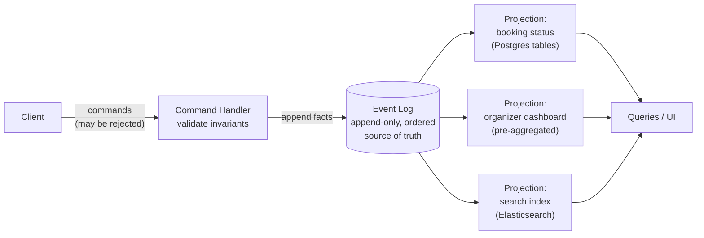

## Overview

A normal database row stores **what is true now**: `carts.total = 4200`, `bookings.active = false`. An event-sourced system stores **everything that happened**: `ItemAddedToCart`, `ItemRemovedFromCart`, `BookingCanceled` — immutable facts, appended in order, never updated in place. These are not two equivalent encodings of the same information. Current state is always derivable from the full history by replaying it; history is *not* derivable from current state, because every `UPDATE` destroys the value it overwrote and every `DELETE` destroys the row's existence along with the reason it stopped existing. Event sourcing is the decision to keep the strictly larger of the two, and **CQRS** (Command Query Responsibility Segregation) is the pattern that makes that log usable by deriving read-optimized views from it.

## The Core Idea: State as a Fold Over Events

Take a shopping cart. The mutable-state version is a `carts` row and a `cart_items` table that get written and rewritten as the user clicks around. The event-sourced version writes only facts, in past tense, because an event records that something *happened* — even if the user later reverses it, it remains true that they formerly did it:

```
append(cart_id=99, {type: "CartCreated",      at: t0, currency: "BRL"})
append(cart_id=99, {type: "ItemAddedToCart",  at: t1, sku: "A-12", qty: 2, unit_price: 1500})
append(cart_id=99, {type: "ItemAddedToCart",  at: t2, sku: "B-77", qty: 1, unit_price: 1200})
append(cart_id=99, {type: "ItemRemovedFromCart", at: t3, sku: "A-12", qty: 1})
append(cart_id=99, {type: "CouponApplied",    at: t4, code: "WELCOME10", discount_pct: 10})
```

There is no "current cart" stored anywhere. You compute it by folding the events in log order through a pure reducer:

```
def apply(state, event):
    match event.type:
        case "CartCreated":       return Cart(currency=event.currency, items={})
        case "ItemAddedToCart":   state.items[event.sku] += event.qty
                                  state.prices[event.sku] = event.unit_price
        case "ItemRemovedFromCart": state.items[event.sku] -= event.qty
        case "CouponApplied":     state.discount_pct = event.discount_pct
    return state

def current_state(cart_id):
    return reduce(apply, event_log.read(cart_id), EMPTY_CART)
```

Two properties of that fold do all the work later. It is **deterministic** — same events, same order, same code, same result — and it is **reproducible** — you can throw away the derived state entirely and recompute it. Both depend on the reducer never reaching outside the event: if a view needs a currency conversion, the exchange rate has to be *in* the event (or fetchable as a historical rate keyed on the event's timestamp), otherwise recomputing the same view next Tuesday silently produces a different answer.

Replaying from the beginning on every read is obviously not how this runs in production. Real systems periodically write a **snapshot** ("state as of event #40,000") and fold only the events after it, which is a cache of the fold, not a second source of truth — you can always delete every snapshot and rebuild from the log.

The same modeling applies to a bank account (`Deposited`, `Withdrawn`, `InterestAccrued` rather than a mutable `balance` column) or a conference registration system, which is the example Kleppmann uses: with bulk corporate orders, seats reserved for speakers, cancellations, and room capacity changes all in play, "how many seats are available?" is a genuinely hard query against normalized mutable tables, and a straightforward fold over an ordered log of what happened.

## What You Actually Gain

**A full audit trail, for free, that can't drift from reality.** In a mutable-state system the audit log is a second thing you write alongside the real write, which means it can be forgotten in a new code path, written in the wrong transaction, or disagree with the table it claims to describe. In an event-sourced system the log *is* the write path — there is no way to change state without producing the record of the change. For regulated domains (payments, healthcare, trading) this collapses a compliance requirement into the architecture.

**Intent, not diffs.** `BookingCanceled` communicates something that "`active` was set to false on row 4001, three rows were deleted from `seat_assignments`, and a refund row was inserted into `payments`" does not. Those row modifications still happen — inside a projection — but now they're the *consequence* of a named business fact rather than the only surviving evidence of one.

**Retroactive read models — the capability a mutable-state system genuinely does not have.** Suppose product asks, six months in, for "how many carts had an item added and then removed before checkout?" A mutable-state system cannot answer this for the past at any price: the intermediate adds and removes were overwritten as they happened, and the information is simply gone. The only option is to start collecting it now and answer the question in six more months. With an event log, you write a new projection, replay the entire history through it, and have the answer for all of history by lunch. The same move covers bug fixes in view logic — delete the view, fix the code, replay — and new features that hang off old events, like offering a canceled seat to the next person on a waiting list.

This "derive views by consuming a change stream" shape is the same one behind [Change Data Capture (CDC)](change-data-capture), and the distinction is worth being precise about: CDC derives an event stream *from* a database that remains the source of truth, so the events are low-level row diffs (`UPDATE bookings SET active=false`) reverse-engineered after the fact. Event sourcing makes the stream *itself* the source of truth, so the events carry business intent by construction. CDC is how you retrofit stream-shaped derivation onto a system that stores current state; event sourcing is how you design for it from the start.

**Write throughput.** Appending to a log is sequential I/O with no read-modify-write and no contention on a hot row. A burst the write side absorbs easily can be worked off by the projections at their own pace, which is a form of natural backpressure isolation.

## CQRS: The Read Side

An append-only log is close to the worst possible thing to query. `SELECT * FROM events WHERE ...` answers nothing useful; you cannot serve a product page by folding a million events per request. This is precisely why event sourcing and CQRS are almost always discussed together: the log optimizes writing, and **projections** (also called materialized views or read models) optimize reading.

The write side accepts a **command** — a request, phrased in the imperative, that may be rejected: `ReserveSeats(conference=7, qty=3)`. It loads whatever state it needs to validate the invariant (are there 3 seats left?), and if valid, appends `SeatsReserved`. The critical asymmetry: **commands can fail, events cannot**. Once a fact is in the log it has already happened, so a projection consuming the log is not allowed to reject an event — validation is a write-side responsibility that happens before the append, never after.



Each projection is free to use whatever data model suits its queries: denormalized relational tables, a search index, an in-memory structure rebuilt on service start, a set of pre-computed aggregates. They can live in the same database as the events or in different systems entirely. None of them is authoritative — every one of them is disposable and rebuildable, which is exactly what makes it safe to add, change, and delete them aggressively.

The one hard requirement is **ordering**: every projection must process events in the same order they appear in the log, or two views built from the same events will disagree about the world. "Made then canceled" and "canceled then made" are different histories. Guaranteeing a single total order across consumers is easy on one machine and genuinely difficult in a distributed system (see the **Consensus and Coordination Services** concept) — it's the constraint that most shapes how event-sourced systems get partitioned (usually per aggregate, e.g. per cart or per account, giving you ordering *within* an entity and none across entities).

### How This Differs From CQRS-Lite

The [Read/Write Splitting and CQRS-Lite](read-write-splitting-and-cqrs-lite) concept covers the far more common version of this pattern: a normalized write schema plus read replicas or denormalized views, with the *current-state tables* still acting as the source of truth. That's a scaling technique, and for most systems it's the right amount of CQRS.

The real distinction is **what is authoritative**, not how many databases you run:

| | CQRS-lite | Event sourcing + CQRS |
|---|---|---|
| Source of truth | mutable current-state tables | append-only event log |
| Read models | derived from tables (replication, views, CDC) | derived from events (projections) |
| Rebuild a view | re-copy from the tables — you get today's state only | replay history — you get every past state too |
| History | whatever you thought to log at the time | inherent; nothing is ever overwritten |
| New question about the past | unanswerable if you weren't already recording it | new projection + replay |

Notice that CQRS-lite is a strictly *read-side* change; event sourcing is a change to the **write model** first, and CQRS follows from it out of necessity. You can do CQRS without event sourcing (very common, usually the right call). You cannot practically do event sourcing without CQRS, because you'd have nothing to query.

## How the Outbox Pattern Shows Up Here

In practice most teams don't run a pure event store. They keep a relational database with current-state tables *and* want an event stream, which reintroduces the dual-write problem: writing the row and publishing the event are two operations against two systems, and a crash between them leaves the stream permanently inconsistent with the database. [The Transactional Outbox Pattern](outbox-pattern) is the standard fix — append the event to an `outbox` table inside the same transaction as the state change, then have a relay publish from that table to Kafka or a message broker.

An outbox table is, in structure, an event log that happens to live in your OLTP database, which is why the two patterns blur into each other in real implementations. Two things distinguish them. First, direction of authority: with an outbox the tables are the source of truth and the events are exhaust; with event sourcing the events are the source of truth and the tables are a projection. Second, retention: outbox rows are typically deleted after publishing, so there's no history to replay, and the retroactive-projection capability — the main reason to do event sourcing at all — is not there. Building event sourcing on top of a conventional database (MartenDB does this on Postgres, and plenty of teams roll their own `events` table plus a `NOTIFY`/polling relay) is exactly an outbox that is never truncated and is read as the primary record.

## Trade-offs

- **You are trading query simplicity for information you can't otherwise recover** — a `SELECT` against a current-state table is replaced by a fold, snapshots, and a projection pipeline you now own. Justify it with a concrete need for history, auditability, or multiple divergent read shapes; "events are more elegant" is not a requirement.
- **Every read is eventually consistent with every write** — projections lag the log, so the "I just booked a seat and the confirmation page says no booking" problem is structural here, not an edge case. Read-your-writes typically means reading the aggregate's own event stream directly, or waiting on a projection's committed log position before responding.
- **Immutability collides directly with GDPR and the right to erasure** — a log you can never modify is a log you can never delete a user from. The workarounds (keep personal data outside the events, or crypto-shredding: encrypt per user and destroy the key) both weaken the reproducibility guarantee the whole architecture rests on, since a replay after shredding no longer produces the original views.
- **Event processing must be deterministic and free of external side effects, or replay stops being safe** — fetching today's exchange rate while replaying a two-year-old event yields a different view than the original run, and rebuilding a projection that sends confirmation emails will re-send two years of them. Side effects have to be isolated from view-maintenance code before replay is a tool you can actually reach for.
- **Schema evolution never goes away, it moves** — old events stay in the log forever exactly as written, so projection code must handle every event version it has ever emitted, indefinitely. Upcasting (translating old event shapes to new on read) is the standard answer, and it's permanent complexity, not a migration you finish.
- **Ordering guarantees are the hidden distributed-systems cost** — correctness requires all projections to see the same order, which constrains partitioning (usually per aggregate) and means cross-aggregate invariants ("never oversell across all conferences") can't be enforced by the write side atomically the way a single-row constraint can.

## Interview Questions

- Why is it accurate to say current state is derivable from an event log but not the reverse? Give a concrete query about the past that a mutable-state system cannot answer retroactively at any cost.
- A command can be rejected but an event cannot. Why does that asymmetry mean validation must happen before the append, and what breaks if a projection tries to reject an event it doesn't like?
- What's the actual difference between full event sourcing plus CQRS and the CQRS-lite pattern of a write schema with read replicas? Which side of the system does each one change?
- Your projection code contains `rate = fx_api.get("USD","BRL")`. Explain why this is a bug specifically in an event-sourced system, and give two ways to fix it.
- An outbox table and an event store are structurally similar. What two properties actually separate them, and which one determines whether you get retroactive read models?

## References

- [Martin Kleppmann, "Designing Data-Intensive Applications", 2nd Edition (O'Reilly) — Chapter 3, "Data Models and Query Languages", section "Event Sourcing and CQRS"](https://www.oreilly.com/library/view/designing-data-intensive-applications/9781098119058/)
- Martin Fowler, ["Event Sourcing"](https://martinfowler.com/eaaDev/EventSourcing.html) (eaaDev patterns)
- Greg Young, ["CQRS Documents"](https://cqrs.files.wordpress.com/2010/11/cqrs_documents.pdf) — the original collected write-up of CQRS and its relationship to event sourcing
- [Kurrent (formerly EventStoreDB) — What is Event Sourcing?](https://www.kurrent.io/event-sourcing)
