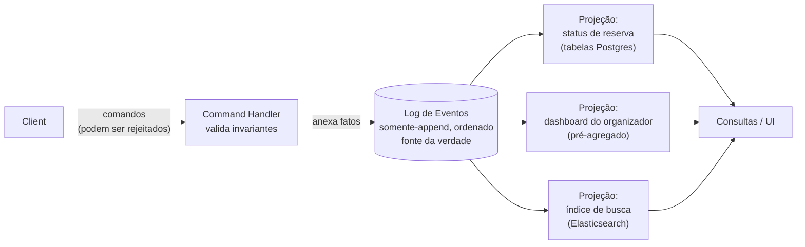

## Visão Geral

Uma linha de banco de dados normal armazena **o que é verdade agora**: `carts.total = 4200`, `bookings.active = false`. Um sistema com event sourcing armazena **tudo o que aconteceu**: `ItemAddedToCart`, `ItemRemovedFromCart`, `BookingCanceled` — fatos imutáveis, anexados em ordem, nunca atualizados no lugar. Essas não são duas codificações equivalentes da mesma informação. O estado atual é sempre derivável do histórico completo reproduzindo-o; o histórico *não* é derivável do estado atual, porque todo `UPDATE` destrói o valor que sobrescreveu e todo `DELETE` destrói a existência da linha junto com a razão pela qual parou de existir. Event sourcing é a decisão de manter o que é estritamente maior entre os dois, e **CQRS** (Command Query Responsibility Segregation) é o padrão que torna esse log utilizável derivando visões otimizadas para leitura a partir dele.

## A Ideia Central: Estado como um Fold Sobre Eventos

Pegue um carrinho de compras. A versão de estado mutável é uma linha `carts` e uma tabela `cart_items` que são escritas e reescritas conforme o usuário clica. A versão com event sourcing escreve apenas fatos, no passado, porque um evento registra que algo *aconteceu* — mesmo que o usuário depois reverta, continua sendo verdade que ele anteriormente o fez:

```
append(cart_id=99, {type: "CartCreated",      at: t0, currency: "BRL"})
append(cart_id=99, {type: "ItemAddedToCart",  at: t1, sku: "A-12", qty: 2, unit_price: 1500})
append(cart_id=99, {type: "ItemAddedToCart",  at: t2, sku: "B-77", qty: 1, unit_price: 1200})
append(cart_id=99, {type: "ItemRemovedFromCart", at: t3, sku: "A-12", qty: 1})
append(cart_id=99, {type: "CouponApplied",    at: t4, code: "WELCOME10", discount_pct: 10})
```

Não há "carrinho atual" armazenado em lugar nenhum. Você o computa reproduzindo os eventos em ordem de log através de um reducer puro:

```
def apply(state, event):
    match event.type:
        case "CartCreated":       return Cart(currency=event.currency, items={})
        case "ItemAddedToCart":   state.items[event.sku] += event.qty
                                  state.prices[event.sku] = event.unit_price
        case "ItemRemovedFromCart": state.items[event.sku] -= event.qty
        case "CouponApplied":     state.discount_pct = event.discount_pct
    return state

def current_state(cart_id):
    return reduce(apply, event_log.read(cart_id), EMPTY_CART)
```

Duas propriedades desse fold fazem todo o trabalho depois. Ele é **determinístico** — mesmos eventos, mesma ordem, mesmo código, mesmo resultado — e é **reproduzível** — você pode descartar o estado derivado completamente e recomputá-lo. Ambos dependem do reducer nunca alcançar para fora do evento: se uma visão precisa de uma conversão de moeda, a taxa de câmbio precisa estar *no* evento (ou ser buscável como uma taxa histórica chaveada no timestamp do evento), caso contrário recomputar a mesma visão na próxima terça-feira silenciosamente produz uma resposta diferente.

Reproduzir desde o início a cada leitura obviamente não é como isso roda em produção. Sistemas reais periodicamente escrevem um **snapshot** ("estado como do evento #40.000") e reproduzem apenas os eventos depois dele, que é um cache do fold, não uma segunda fonte da verdade — você sempre pode excluir todo snapshot e reconstruir a partir do log.

A mesma modelagem se aplica a uma conta bancária (`Deposited`, `Withdrawn`, `InterestAccrued` em vez de uma coluna mutável `balance`) ou um sistema de registro de conferência, que é o exemplo que Kleppmann usa: com pedidos corporativos em massa, assentos reservados para palestrantes, cancelamentos, e mudanças de capacidade de sala tudo em jogo, "quantos assentos estão disponíveis?" é uma consulta genuinamente difícil contra tabelas mutáveis normalizadas, e um fold direto sobre um log ordenado do que aconteceu.

## O Que Você Realmente Ganha

**Uma trilha de auditoria completa, de graça, que não pode divergir da realidade.** Em um sistema de estado mutável o log de auditoria é uma segunda coisa que você escreve ao lado da escrita real, o que significa que pode ser esquecido em um novo caminho de código, escrito na transação errada, ou discordar da tabela que alega descrever. Em um sistema com event sourcing o log *é* o caminho de escrita — não há como mudar estado sem produzir o registro da mudança. Para domínios regulados (pagamentos, saúde, negociação) isso colapsa um requisito de compliance na própria arquitetura.

**Intenção, não diffs.** `BookingCanceled` comunica algo que "`active` foi definido como false na linha 4001, três linhas foram excluídas de `seat_assignments`, e uma linha de reembolso foi inserida em `payments`" não comunica. Essas modificações de linha ainda acontecem — dentro de uma projeção — mas agora são a *consequência* de um fato de negócio nomeado em vez da única evidência sobrevivente de um.

**Modelos de leitura retroativos — a capacidade que um sistema de estado mutável genuinamente não tem.** Suponha que o produto pergunte, seis meses depois, "quantos carrinhos tiveram um item adicionado e depois removido antes do checkout?" Um sistema de estado mutável não consegue responder isso para o passado a preço algum: as adições e remoções intermediárias foram sobrescritas conforme aconteceram, e a informação simplesmente se foi. A única opção é começar a coletá-la agora e responder a pergunta em mais seis meses. Com um log de eventos, você escreve uma nova projeção, reproduz o histórico inteiro através dela, e tem a resposta para todo o histórico até o almoço. A mesma jogada cobre correções de bugs na lógica de visão — exclua a visão, corrija o código, reproduza — e novas funcionalidades que dependem de eventos antigos, como oferecer um assento cancelado para a próxima pessoa em uma lista de espera.

Essa forma "derivar visões consumindo um stream de mudanças" é a mesma por trás de [Change Data Capture (CDC)](change-data-capture), e a distinção vale a pena ser precisa: CDC deriva um stream de eventos *a partir de* um banco de dados que permanece a fonte da verdade, então os eventos são diffs de linha de baixo nível (`UPDATE bookings SET active=false`) reconstruídos por engenharia reversa depois do fato. Event sourcing torna o próprio stream a fonte da verdade, então os eventos carregam intenção de negócio por construção. CDC é como você retroadapta derivação em formato de stream a um sistema que armazena estado atual; event sourcing é como você projeta para isso desde o início.

**Throughput de escrita.** Anexar a um log é I/O sequencial sem leitura-modificação-escrita e sem contenção em uma linha quente. Uma rajada que o lado de escrita absorve facilmente pode ser processada pelas projeções em seu próprio ritmo, o que é uma forma natural de isolamento de backpressure.

## CQRS: O Lado da Leitura

Um log somente-append está perto da pior coisa possível para consultar. `SELECT * FROM events WHERE ...` não responde nada útil; você não pode servir uma página de produto reproduzindo um milhão de eventos por requisição. É exatamente por isso que event sourcing e CQRS são quase sempre discutidos juntos: o log otimiza escrita, e **projeções** (também chamadas de visões materializadas ou modelos de leitura) otimizam leitura.

O lado de escrita aceita um **comando** — uma requisição, fraseada no imperativo, que pode ser rejeitada: `ReserveSeats(conference=7, qty=3)`. Ele carrega qualquer estado que precise para validar o invariante (há 3 assentos restantes?), e se válido, anexa `SeatsReserved`. A assimetria crítica: **comandos podem falhar, eventos não podem**. Uma vez que um fato está no log ele já aconteceu, então uma projeção consumindo o log não tem permissão para rejeitar um evento — validação é uma responsabilidade do lado de escrita que acontece antes do append, nunca depois.



Cada projeção é livre para usar qualquer modelo de dados que sirva suas consultas: tabelas relacionais desnormalizadas, um índice de busca, uma estrutura em memória reconstruída no início do serviço, um conjunto de agregados pré-computados. Podem viver no mesmo banco de dados que os eventos ou em sistemas completamente diferentes. Nenhuma delas é autoritativa — cada uma é descartável e reconstruível, o que é exatamente o que torna seguro adicioná-las, mudá-las e excluí-las agressivamente.

O único requisito rígido é **ordenação**: toda projeção precisa processar eventos na mesma ordem em que aparecem no log, ou duas visões construídas a partir dos mesmos eventos vão discordar sobre o mundo. "Feito depois cancelado" e "cancelado depois feito" são histórias diferentes. Garantir uma única ordem total entre consumidores é fácil em uma máquina e genuinamente difícil em um sistema distribuído (veja o conceito **Consensus and Coordination Services**) — é a restrição que mais molda como sistemas com event sourcing são particionados (geralmente por agregado, ex.: por carrinho ou por conta, te dando ordenação *dentro* de uma entidade e nenhuma entre entidades).

### Como Isso Difere do CQRS-Lite

O conceito [Read/Write Splitting and CQRS-Lite](read-write-splitting-and-cqrs-lite) cobre a versão muito mais comum desse padrão: um esquema de escrita normalizado mais réplicas de leitura ou visões desnormalizadas, com as *tabelas de estado-atual* ainda agindo como a fonte da verdade. Isso é uma técnica de escala, e para a maioria dos sistemas é a quantidade certa de CQRS.

A distinção real é **o que é autoritativo**, não quantos bancos de dados você roda:

| | CQRS-lite | Event sourcing + CQRS |
|---|---|---|
| Fonte da verdade | tabelas de estado-atual mutáveis | log de eventos somente-append |
| Modelos de leitura | derivados de tabelas (replicação, visões, CDC) | derivados de eventos (projeções) |
| Reconstruir uma visão | recopiar das tabelas — você só recebe o estado de hoje | reproduzir o histórico — você recebe todo estado passado também |
| Histórico | o que quer que você tenha pensado em registrar na época | inerente; nada é jamais sobrescrito |
| Nova pergunta sobre o passado | irrespondível se você ainda não estava registrando | nova projeção + replay |

Note que CQRS-lite é uma mudança estritamente do *lado da leitura*; event sourcing é uma mudança no **modelo de escrita** primeiro, e CQRS segue disso por necessidade. Você pode fazer CQRS sem event sourcing (muito comum, geralmente a decisão certa). Você não pode praticamente fazer event sourcing sem CQRS, porque não teria nada para consultar.

## Como o Padrão Outbox Aparece Aqui

Na prática a maioria das equipes não roda um event store puro. Elas mantêm um banco de dados relacional com tabelas de estado-atual *e* querem um stream de eventos, o que reintroduz o problema da escrita dupla: escrever a linha e publicar o evento são duas operações contra dois sistemas, e um crash entre eles deixa o stream permanentemente inconsistente com o banco de dados. [O Padrão Outbox Transacional](outbox-pattern) é a correção padrão — anexar o evento a uma tabela `outbox` dentro da mesma transação que a mudança de estado, então ter um relay publicando dessa tabela para o Kafka ou um broker de mensagens.

Uma tabela outbox é, em estrutura, um log de eventos que por acaso vive no seu banco de dados OLTP, o que é por que os dois padrões se confundem em implementações reais. Duas coisas os distinguem. Primeiro, direção de autoridade: com um outbox as tabelas são a fonte da verdade e os eventos são um subproduto; com event sourcing os eventos são a fonte da verdade e as tabelas são uma projeção. Segundo, retenção: linhas outbox são tipicamente excluídas depois de publicadas, então não há histórico para reproduzir, e a capacidade de projeção retroativa — a razão principal para fazer event sourcing — não está lá. Construir event sourcing em cima de um banco de dados convencional (o MartenDB faz isso sobre Postgres, e várias equipes constroem sua própria tabela `events` mais um relay `NOTIFY`/polling) é exatamente um outbox que nunca é truncado e é lido como o registro primário.

## Trade-offs

- **Você está trocando simplicidade de consulta por informação que não pode recuperar de outra forma** — um `SELECT` contra uma tabela de estado-atual é substituído por um fold, snapshots, e um pipeline de projeção que você agora possui. Justifique com uma necessidade concreta de histórico, auditabilidade, ou múltiplas formas de leitura divergentes; "eventos são mais elegantes" não é um requisito.
- **Toda leitura é eventualmente consistente com toda escrita** — projeções ficam atrasadas do log, então o problema de "acabei de reservar um assento e a página de confirmação diz que não há reserva" é estrutural aqui, não um caso extremo. Ler-suas-próprias-escritas tipicamente significa ler o próprio stream de eventos do agregado diretamente, ou esperar pela posição de log confirmada de uma projeção antes de responder.
- **Imutabilidade colide diretamente com GDPR e o direito ao esquecimento** — um log que você nunca pode modificar é um log do qual você nunca pode excluir um usuário. As soluções alternativas (manter dados pessoais fora dos eventos, ou crypto-shredding: criptografar por usuário e destruir a chave) ambas enfraquecem a garantia de reprodutibilidade em que toda a arquitetura se apoia, já que um replay depois do shredding não produz mais as visões originais.
- **Processamento de eventos precisa ser determinístico e livre de efeitos colaterais externos, ou o replay para de ser seguro** — buscar a taxa de câmbio de hoje ao reproduzir um evento de dois anos atrás produz uma visão diferente da execução original, e reconstruir uma projeção que envia e-mails de confirmação vai reenviar dois anos deles. Efeitos colaterais precisam ser isolados do código de manutenção de visão antes que o replay seja uma ferramenta que você pode realmente usar.
- **Evolução de esquema nunca vai embora, ela se move** — eventos antigos permanecem no log para sempre exatamente como escritos, então o código de projeção precisa lidar com toda versão de evento que já emitiu, indefinidamente. Upcasting (traduzir formas antigas de evento para novas na leitura) é a resposta padrão, e é complexidade permanente, não uma migração que você termina.
- **Garantias de ordenação são o custo escondido de sistemas distribuídos** — correção requer que todas as projeções vejam a mesma ordem, o que restringe particionamento (geralmente por agregado) e significa que invariantes entre agregados ("nunca vender além do disponível em todas as conferências") não podem ser aplicados pelo lado de escrita atomicamente da forma que uma restrição de linha única pode.

## Perguntas de Entrevista

- Por que é preciso dizer que o estado atual é derivável de um log de eventos mas não o contrário? Dê uma consulta concreta sobre o passado que um sistema de estado mutável não consegue responder retroativamente a preço algum.
- Um comando pode ser rejeitado mas um evento não. Por que essa assimetria significa que validação precisa acontecer antes do append, e o que quebra se uma projeção tenta rejeitar um evento que não gosta?
- Qual é a diferença real entre event sourcing completo mais CQRS e o padrão CQRS-lite de um esquema de escrita com réplicas de leitura? Qual lado do sistema cada um muda?
- Seu código de projeção contém `rate = fx_api.get("USD","BRL")`. Explique por que isso é um bug especificamente em um sistema com event sourcing, e dê duas formas de corrigi-lo.
- Uma tabela outbox e um event store são estruturalmente similares. Quais duas propriedades realmente os separam, e qual determina se você obtém modelos de leitura retroativos?

## Referências

- [Martin Kleppmann, "Designing Data-Intensive Applications", 2ª Edição (O'Reilly) — Capítulo 3, "Data Models and Query Languages", seção "Event Sourcing and CQRS"](https://www.oreilly.com/library/view/designing-data-intensive-applications/9781098119058/)
- Martin Fowler, ["Event Sourcing"](https://martinfowler.com/eaaDev/EventSourcing.html) (padrões eaaDev)
- Greg Young, ["CQRS Documents"](https://cqrs.files.wordpress.com/2010/11/cqrs_documents.pdf) — o relato original coletado de CQRS e sua relação com event sourcing
- [Kurrent (anteriormente EventStoreDB) — What is Event Sourcing?](https://www.kurrent.io/event-sourcing)
