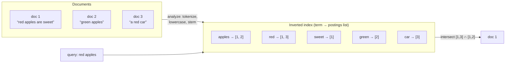
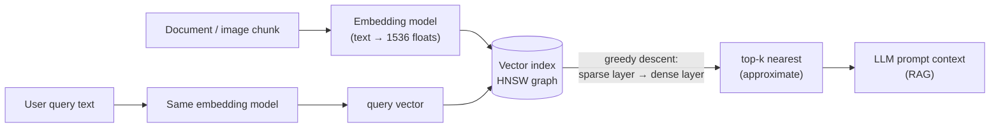

## Overview

B-trees and LSM-trees are ordered mappings from a key to a record, which makes them excellent at exact lookups and range scans over **one** attribute and useless at everything else. They cannot answer "which restaurants are inside this map rectangle," "which documents mention *red* and *apples*," or "which help page is closest in meaning to *how do I close my account*." The fallback — scan everything and filter — is not a strategy at any real scale. Each of those questions needs a genuinely different index structure: multidimensional indexes for simultaneous range queries, inverted indexes for keyword search, and vector indexes for semantic similarity.

## Multidimensional Indexes

The usual multicolumn index is a **concatenated index**: several fields glued into one sort key, in a fixed order. An index on `(lastname, firstname)` is a paper phone book — it finds everyone named Kleppmann, and everyone named Kleppmann, Martin, but it is worthless for finding everyone named Martin. The sort order only helps left-to-right.

That limitation bites hardest on geospatial data:

```sql
SELECT * FROM restaurants
 WHERE latitude  >  51.4946 AND latitude  <  51.5079
   AND longitude >  -0.1162 AND longitude <  -0.1004;
```

A concatenated index on `(latitude, longitude)` gives you either every restaurant in a band of latitudes at *any* longitude, or every restaurant in a band of longitudes from pole to pole — never both narrowed at once. You end up scanning one thin strip of the planet and filtering it in memory.

Two fixes exist. You can flatten two dimensions into one number with a **space-filling curve** (Hilbert or Z-order) and index that with an ordinary B-tree, which preserves locality well enough that nearby points land near each other in the key space. More commonly you use a real spatial index — an **R-tree** or Bkd-tree — which partitions space into nested bounding boxes so that points close together on the map are close together in the tree. PostGIS builds its geospatial indexes as R-trees on top of PostgreSQL's GiST (Generalized Search Tree) framework.

Nothing about this is specific to maps. A three-dimensional index on `(red, green, blue)` finds products in a range of colors; a two-dimensional index on `(date, temperature)` finds every weather observation in 2024 where the temperature was between 25 °C and 30 °C without scanning all of 2024 first. Any query that narrows on several attributes *simultaneously* is a multidimensional query.

## Full-Text Search and the Inverted Index

Full-text search is the same idea taken to an extreme number of dimensions. Treat every possible **term** (word) as a dimension: a document scores 1 in dimension `apples` if it contains that word and 0 if it doesn't. Searching for "red apples" is a query for a 1 in `red` and a 1 in `apples` at the same time. The dimensionality is the size of the vocabulary — hundreds of thousands of dimensions, almost all of them zero for any given document.

The structure that answers this efficiently is the **inverted index**: a sorted key-value mapping from each term to the list of document IDs containing it, called the **postings list**.



Note the direction of the arrow — it is *inverted* relative to the natural "document → its words" mapping, which is exactly what makes it fast: you look up a term once and get every matching document, instead of examining every document to see whether it mentions the term.

Conjunctive queries become set intersection. If document IDs are sequential integers, each postings list can be represented as a sparse **bitmap** — bit *n* is 1 if document *n* contains the term — and `red AND apples` is a bitwise AND of two bitmaps, which stays cheap even run-length encoded. This is the same vectorized-scan trick column stores use for analytical predicates.

Lucene — the engine inside Elasticsearch and Solr — stores its term → postings mapping in SSTable-like sorted files compacted in the background, i.e. it is an LSM-tree wearing a search-engine hat. PostgreSQL's **GIN** index type uses postings lists too, and powers both full-text search and indexing inside JSONB documents.

### Substrings, typos, and fuzzy matching

Splitting on words is a choice, not a law. An alternative is to index **n-grams** — every substring of length *n*. The trigrams of `hello` are `hel`, `ell`, `llo`; an inverted index over trigrams supports arbitrary substring search, and even regular expressions, at the cost of a substantially larger index. (Word segmentation is itself language-specific: several Asian languages are written without spaces, so deciding what a "word" is requires a model.)

Typo tolerance is handled differently. Lucene stores the term dictionary as a **finite state automaton** over the characters of the keys — structurally a trie — and converts it into a **Levenshtein automaton**, which accepts exactly the strings within a given edit distance of the query. Searching `aple~1` then becomes a walk of two automata in lockstep rather than a comparison against every term in the dictionary. This is the machinery behind "did you mean," and it is why fuzzy search is a bounded cost rather than a full dictionary scan.

### Relevance ranking

An intersection tells you *which* documents match; it says nothing about which one to put first. Ranking uses statistics stored alongside the postings: **term frequency** (how often the term appears in this document — more is better), **document frequency** (how many documents contain it at all — a term in every document, like *the*, carries almost no signal), and **document length** (a match in a 20-word title means more than a match in a 20,000-word manual). The classic formulation of the first two is TF-IDF; the modern default in Lucene and Elasticsearch is **Okapi BM25**, which is TF-IDF with saturation — the tenth occurrence of a term adds far less than the second — plus length normalization.

## Vector Embeddings and Semantic Similarity

Inverted indexes match *words*. They cannot connect a help page titled "canceling your subscription" to a user searching "how do I close my account" or "terminate contract" — zero terms overlap. Synonym lists and stemming patch the easy cases and collapse on everything else, because the real relation is meaning, not spelling.

**Semantic search** attacks this by running documents through an **embedding model** (usually a neural network, often an LLM) that maps each one to a vector of floats — a **vector embedding**. The vector is a point in a high-dimensional space, and the model is trained so that semantically similar inputs land near each other. Toy three-dimensional intuition:

```
agriculture   → [ 0.38,  0.83,  0.41]
vegetables    → [ 0.36,  0.64,  0.67]   # clearly near agriculture
star schemas  → [ 0.85,  0.10, -0.52]   # clearly far away
```

Real models emit vectors of 768, 1,024, 1,536 dimensions or more. Nobody interprets the individual numbers; they are just coordinates the model uses to place things. Closeness is measured with a distance function — **cosine similarity** (the angle between two vectors, ignoring magnitude, the usual default for text) or **Euclidean distance** (straight-line distance). For normalized vectors, cosine similarity and dot product rank identically, which is why vector databases expose all three operators.

Query time works the same way: the user's query text (plus context, such as their location) goes through the *same* embedding model, and the search becomes "find the stored vectors nearest to this query vector." Early embedding models like Word2Vec, BERT, and GPT were text-only; the field moved on to audio, video, and images, and current models are typically **multimodal** — one model embedding text and images into a shared space, so a text query can retrieve an image.

This is now load-bearing infrastructure rather than a research curiosity, because it is the retrieval half of **retrieval-augmented generation (RAG)**: embed the corpus, embed the user's question, fetch the top-k nearest chunks, and paste them into an LLM's prompt as context. The quality of an LLM answer over private data is bounded by the quality of that nearest-neighbor lookup.

## Approximate Nearest Neighbor Search

The obvious implementation is a **flat index**: keep every vector, and on each query compute the distance to all of them. It is exact and it is a linear scan — 10 million vectors at 1,536 dimensions is roughly 15 billion float multiplications per query, before you sort. Fine for 50,000 vectors, hopeless as an interactive path over 10 million.

R-trees don't rescue you either. Space-partitioning structures degrade badly as dimensionality rises — with hundreds of dimensions the bounding boxes overlap so heavily that pruning stops pruning, an instance of the curse of dimensionality. So production systems give up exactness and use **approximate nearest neighbor (ANN)** indexes, which trade a small, tunable amount of recall for orders-of-magnitude less work. In practice this is an easy trade: search results were never exactly correct in the first place, and returning 9 of the true top 10 is invisible to the user.

Two families dominate:

**IVF (inverted file) indexes** cluster the vector space into partitions around centroids. A query finds the nearest centroids and only compares vectors inside those partitions. The `probes` parameter — how many partitions to check — is the accuracy/latency dial. The characteristic failure is a query and its true nearest neighbor falling on opposite sides of a partition boundary, so the match is never even considered.

**HNSW (Hierarchical Navigable Small World) indexes** build a layered proximity graph. Each layer is a graph whose nodes are vectors and whose edges connect nearby ones; the top layer is sparse and long-range, each layer down is denser and more local. A search greedily walks the top layer to the closest node it can find, drops to the same node one layer down, walks again with finer-grained edges, and repeats to the bottom layer — coarse-to-fine navigation that reaches a good neighborhood in roughly logarithmic hops instead of scanning everything.



HNSW is the default in production today. **pgvector** supports both IVFFlat and HNSW and documents the trade-off plainly: HNSW "has better query performance than IVFFlat (in terms of speed-recall tradeoff), but has slower build times and uses more memory," and — unlike IVFFlat, which needs representative data present to train its centroids — an HNSW index can be created on an empty table and grown incrementally. That last property matters more than it sounds: an IVF index built on early data drifts out of calibration as the corpus grows and eventually needs rebuilding. **Pinecone**, **Weaviate**, **Qdrant**, and **Milvus** are all HNSW-based, and Meta's **Faiss** ships several variants of both families. Nothing in the last several years has displaced HNSW as the default choice; the active work is on quantization (compressing the vectors HNSW stores, since memory is its real cost) and on disk-resident graph variants, not on replacing the graph.

Two knobs matter when you tune it. `m` — edges per node — controls graph connectivity: higher means better recall and a bigger, slower-to-build index. `ef_search` — the size of the candidate list kept during the descent — is the per-query accuracy dial, raised until recall is acceptable and no further. Both trade latency and memory for recall, and neither has a universally correct value; you measure recall against a brute-force baseline on your own data.

In practice, keyword and vector search are complements rather than rivals. **Hybrid search** runs a BM25 query and an ANN query in parallel and fuses the two ranked lists, because inverted indexes remain unbeatable at exact tokens — error codes, SKUs, surnames, `NullPointerException` — that embeddings blur into a fog of "roughly similar technical text."

## Trade-offs

- **Concatenated indexes are cheap and only work left-to-right; multidimensional indexes cost more and narrow on all attributes at once** — a B-tree on `(lat, lng)` still scans a full latitude band, so any query genuinely constrained on two axes needs an R-tree or a space-filling-curve key, both of which are more expensive to maintain than an ordinary sort order.
- **Inverted indexes make term lookup O(1)-ish at the cost of write amplification** — one document update touches every postings list for every term it contains, which is why Lucene batches writes into immutable segments merged in the background instead of updating in place, and why Elasticsearch is near-real-time rather than real-time.
- **N-gram indexes buy substring and regex search with a much larger index** — indexing every trigram multiplies term count and index size substantially, so it's worth it for code search or languages without word boundaries, and wasteful when word-level matching is enough.
- **Vector search finds meaning and loses precision on exact tokens** — embeddings are exactly what you want for "how do I close my account" and exactly what you don't want for an error code or a part number, which is why serious systems run hybrid BM25 + ANN retrieval rather than picking one.
- **ANN trades recall for tractability, and the recall you lose is invisible until it isn't** — a flat index is exact and linear; HNSW answers in logarithmic-ish hops but can silently miss a true neighbor, so recall must be measured against a brute-force baseline on real data rather than assumed from defaults.
- **HNSW beats IVF on the speed-recall curve and pays for it in memory and build time** — the graph and its edge lists usually live in RAM, so cost scales with vector count times dimensionality times connectivity; IVF is cheaper to build and lighter, but needs training data up front and degrades as the corpus drifts away from its centroids.

## Interview Questions

- Why can't a concatenated index on `(latitude, longitude)` answer a bounding-box query efficiently, when it clearly contains both columns?
- Full-text search is described as a multidimensional query. What are the dimensions, and why does that framing explain the shape of an inverted index?
- Term frequency alone ranks a document mentioning "the" fifty times above a precise match. What does document frequency add, and why does BM25 saturate term frequency instead of counting linearly?
- Your RAG system retrieves plausible-looking but wrong chunks when users paste exact error codes. What is structurally wrong with a pure vector-search retriever here, and what would you add?
- HNSW and IVF are both approximate. Describe the different way each one misses a true nearest neighbor, and what that implies about which parameter you'd tune first in each.

## References

- [Martin Kleppmann, "Designing Data-Intensive Applications", 2nd Edition (O'Reilly) — Chapter 4, "Storage and Retrieval", section "Multidimensional and Full-Text Indexes"](https://www.oreilly.com/library/view/designing-data-intensive-applications/9781098119058/)
- [Elastic Docs — How full-text search works (inverted index, analysis, BM25 relevance scoring)](https://www.elastic.co/docs/solutions/search/full-text/how-full-text-works)
- [Yu. A. Malkov, D. A. Yashunin — "Efficient and robust approximate nearest neighbor search using Hierarchical Navigable Small World graphs" (arXiv:1603.09320)](https://arxiv.org/abs/1603.09320)
- [pgvector — PostgreSQL extension documentation (HNSW and IVFFlat index types)](https://github.com/pgvector/pgvector)
