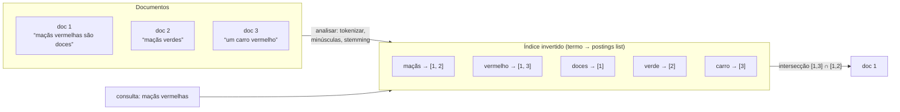

## Visão Geral

B-trees e LSM-trees são mapeamentos ordenados de uma chave para um registro, o que as torna excelentes em buscas exatas e varreduras de intervalo sobre **um** atributo e inúteis em tudo mais. Elas não conseguem responder "quais restaurantes estão dentro deste retângulo do mapa", "quais documentos mencionam *vermelho* e *maçãs*", ou "qual página de ajuda está mais próxima em significado de *como faço para fechar minha conta*". A alternativa — escanear tudo e filtrar — não é uma estratégia em nenhuma escala real. Cada uma dessas perguntas precisa de uma estrutura de índice genuinamente diferente: índices multidimensionais para consultas de intervalo simultâneas, índices invertidos para busca por palavra-chave, e índices vetoriais para similaridade semântica.

## Índices Multidimensionais

O índice multicoluna usual é um **índice concatenado**: vários campos colados em uma chave de ordenação, em uma ordem fixa. Um índice em `(sobrenome, nome)` é uma lista telefônica em papel — encontra todo mundo chamado Kleppmann, e todo mundo chamado Kleppmann, Martin, mas é inútil para encontrar todo mundo chamado Martin. A ordem de classificação só ajuda da esquerda para a direita.

Essa limitação morde mais forte em dados geoespaciais:

```sql
SELECT * FROM restaurants
 WHERE latitude  >  51.4946 AND latitude  <  51.5079
   AND longitude >  -0.1162 AND longitude <  -0.1004;
```

Um índice concatenado em `(latitude, longitude)` te dá ou todo restaurante em uma faixa de latitudes em *qualquer* longitude, ou todo restaurante em uma faixa de longitudes de polo a polo — nunca ambos estreitados ao mesmo tempo. Você acaba escaneando uma faixa fina do planeta e filtrando-a na memória.

Existem duas correções. Você pode achatar duas dimensões em um número com uma **curva de preenchimento de espaço** (Hilbert ou Z-order) e indexar isso com uma B-tree comum, o que preserva localidade o suficiente para que pontos próximos caiam próximos no espaço de chaves. Mais comumente você usa um índice espacial de verdade — uma **R-tree** ou Bkd-tree — que particiona o espaço em caixas delimitadoras aninhadas de forma que pontos próximos no mapa fiquem próximos na árvore. O PostGIS constrói seus índices geoespaciais como R-trees em cima do framework GiST (Generalized Search Tree, Árvore de Busca Generalizada) do PostgreSQL.

Nada aqui é específico de mapas. Um índice tridimensional em `(vermelho, verde, azul)` encontra produtos em um intervalo de cores; um índice bidimensional em `(data, temperatura)` encontra toda observação meteorológica de 2024 onde a temperatura estava entre 25°C e 30°C sem escanear todo 2024 primeiro. Qualquer consulta que estreita em vários atributos *simultaneamente* é uma consulta multidimensional.

## Busca de Texto Completo e o Índice Invertido

Busca de texto completo é a mesma ideia levada a um número extremo de dimensões. Trate cada possível **termo** (palavra) como uma dimensão: um documento pontua 1 na dimensão `maçãs` se contém aquela palavra e 0 se não contém. Buscar por "maçãs vermelhas" é uma consulta por um 1 em `vermelhas` e um 1 em `maçãs` ao mesmo tempo. A dimensionalidade é o tamanho do vocabulário — centenas de milhares de dimensões, quase todas zero para qualquer documento dado.

A estrutura que responde isso eficientemente é o **índice invertido**: um mapeamento chave-valor ordenado de cada termo para a lista de IDs de documento que o contêm, chamada de **postings list**.



Note a direção da seta — ela é *invertida* em relação ao mapeamento natural "documento → suas palavras", o que é exatamente o que a torna rápida: você consulta um termo uma vez e obtém todo documento correspondente, em vez de examinar cada documento para ver se ele menciona o termo.

Consultas conjuntivas viram intersecção de conjuntos. Se os IDs de documento são inteiros sequenciais, cada postings list pode ser representada como um **bitmap** esparso — o bit *n* é 1 se o documento *n* contém o termo — e `vermelho AND maçãs` é um AND bit a bit de dois bitmaps, que permanece barato mesmo com codificação run-length. Esse é o mesmo truque de varredura vetorizada que armazenamentos colunares usam para predicados analíticos.

O Lucene — o motor dentro do Elasticsearch e do Solr — armazena seu mapeamento termo → postings em arquivos ordenados estilo SSTable compactados em segundo plano, ou seja, é uma LSM-tree vestindo um chapéu de motor de busca. O tipo de índice **GIN** do PostgreSQL também usa postings lists, e alimenta tanto busca de texto completo quanto indexação dentro de documentos JSONB.

### Substrings, erros de digitação e correspondência aproximada

Dividir por palavras é uma escolha, não uma lei. Uma alternativa é indexar **n-grams** — cada substring de comprimento *n*. Os trigramas de `olá` são `olá`... na verdade `hel`, `ell`, `llo` (para `hello`); um índice invertido sobre trigramas suporta busca de substring arbitrária, e até expressões regulares, ao custo de um índice substancialmente maior. (Segmentação de palavras é em si específica de idioma: várias línguas asiáticas são escritas sem espaços, então decidir o que é uma "palavra" exige um modelo.)

Tolerância a erros de digitação é tratada de forma diferente. O Lucene armazena o dicionário de termos como um **autômato de estado finito** sobre os caracteres das chaves — estruturalmente um trie — e o converte em um **autômato de Levenshtein**, que aceita exatamente as strings dentro de uma distância de edição dada da consulta. Buscar `aple~1` então se torna uma caminhada de dois autômatos em lockstep em vez de uma comparação contra cada termo no dicionário. Essa é a maquinaria por trás de "você quis dizer", e é por isso que busca aproximada é um custo limitado em vez de uma varredura completa do dicionário.

### Classificação por relevância

Uma intersecção diz *quais* documentos correspondem; não diz nada sobre qual colocar primeiro. Classificação usa estatísticas armazenadas junto com as postings: **frequência do termo** (quantas vezes o termo aparece neste documento — mais é melhor), **frequência do documento** (quantos documentos o contêm no total — um termo em todo documento, como *o*, carrega quase nenhum sinal), e **comprimento do documento** (uma correspondência em um título de 20 palavras significa mais que uma correspondência em um manual de 20.000 palavras). A formulação clássica das duas primeiras é o TF-IDF; o padrão moderno no Lucene e no Elasticsearch é o **Okapi BM25**, que é TF-IDF com saturação — a décima ocorrência de um termo adiciona muito menos que a segunda — mais normalização de comprimento.

## Embeddings Vetoriais e Similaridade Semântica

Índices invertidos combinam *palavras*. Eles não conseguem conectar uma página de ajuda intitulada "cancelando sua assinatura" a um usuário buscando "como eu fecho minha conta" ou "encerrar contrato" — zero termos se sobrepõem. Listas de sinônimos e stemming corrigem os casos fáceis e falham em tudo mais, porque a relação real é significado, não ortografia.

**Busca semântica** ataca isso rodando documentos através de um **modelo de embedding** (geralmente uma rede neural, frequentemente um LLM) que mapeia cada um para um vetor de floats — um **embedding vetorial**. O vetor é um ponto em um espaço de alta dimensionalidade, e o modelo é treinado de forma que entradas semanticamente similares caiam próximas umas das outras. Intuição de brinquedo em três dimensões:

```
agricultura   → [ 0.38,  0.83,  0.41]
vegetais      → [ 0.36,  0.64,  0.67]   # claramente perto de agricultura
esquemas estrela → [ 0.85,  0.10, -0.52]   # claramente longe
```

Modelos reais emitem vetores de 768, 1.024, 1.536 dimensões ou mais. Ninguém interpreta os números individuais; eles são só coordenadas que o modelo usa para posicionar as coisas. Proximidade é medida com uma função de distância — **similaridade de cosseno** (o ângulo entre dois vetores, ignorando magnitude, o padrão usual para texto) ou **distância euclidiana** (distância em linha reta). Para vetores normalizados, similaridade de cosseno e produto escalar ordenam de forma idêntica, o que é por que bancos de dados vetoriais expõem os três operadores.

O tempo de consulta funciona da mesma forma: o texto da consulta do usuário (mais contexto, como sua localização) passa pelo *mesmo* modelo de embedding, e a busca se torna "encontrar os vetores armazenados mais próximos deste vetor de consulta". Modelos de embedding iniciais como Word2Vec, BERT, e GPT eram apenas texto; o campo avançou para áudio, vídeo e imagens, e modelos atuais são tipicamente **multimodais** — um modelo embutindo texto e imagens em um espaço compartilhado, então uma consulta de texto pode recuperar uma imagem.

Isso agora é infraestrutura de carga essencial em vez de uma curiosidade de pesquisa, porque é a metade de recuperação da **geração aumentada por recuperação (RAG)**: embutir o corpus, embutir a pergunta do usuário, buscar os top-k pedaços mais próximos, e colá-los no prompt de um LLM como contexto. A qualidade de uma resposta de LLM sobre dados privados é limitada pela qualidade dessa busca por vizinho mais próximo.

## Busca Aproximada de Vizinhos Mais Próximos

A implementação óbvia é um **índice flat**: manter cada vetor, e a cada consulta computar a distância a todos eles. É exata e é uma varredura linear — 10 milhões de vetores a 1.536 dimensões são aproximadamente 15 bilhões de multiplicações de ponto flutuante por consulta, antes de ordenar. Ótimo para 50.000 vetores, sem esperança como um caminho interativo com mais de 10 milhões.

R-trees também não te salvam. Estruturas de particionamento de espaço degradam mal conforme a dimensionalidade sobe — com centenas de dimensões as caixas delimitadoras se sobrepõem tão pesadamente que a poda para de podar, uma instância da maldição da dimensionalidade. Então sistemas de produção desistem da exatidão e usam índices de **vizinho mais próximo aproximado (ANN)**, que trocam uma pequena quantidade ajustável de recall por ordens de magnitude menos trabalho. Na prática essa é uma troca fácil: resultados de busca nunca foram exatamente corretos em primeiro lugar, e retornar 9 dos verdadeiros top 10 é invisível para o usuário.

Duas famílias dominam:

**Índices IVF (inverted file)** agrupam o espaço vetorial em partições ao redor de centroides. Uma consulta encontra os centroides mais próximos e só compara vetores dentro daquelas partições. O parâmetro `probes` — quantas partições verificar — é o dial de precisão/latência. A falha característica é uma consulta e seu verdadeiro vizinho mais próximo caindo em lados opostos de uma fronteira de partição, então a correspondência nunca é sequer considerada.

**Índices HNSW (Hierarchical Navigable Small World)** constroem um grafo de proximidade em camadas. Cada camada é um grafo cujos nós são vetores e cujas arestas conectam vetores próximos; a camada superior é esparsa e de longo alcance, cada camada abaixo é mais densa e mais local. Uma busca caminha gulosamente pela camada superior até o nó mais próximo que consegue encontrar, desce para o mesmo nó uma camada abaixo, caminha novamente com arestas mais refinadas, e repete até a camada inferior — navegação de grosso para fino que alcança uma boa vizinhança em saltos aproximadamente logarítmicos em vez de escanear tudo.


HNSW é o padrão em produção hoje. **pgvector** suporta tanto IVFFlat quanto HNSW e documenta a troca claramente: HNSW "tem melhor desempenho de consulta que IVFFlat (em termos de troca velocidade-recall), mas tem tempos de construção mais lentos e usa mais memória" — e, diferente do IVFFlat, que precisa de dados representativos presentes para treinar seus centroides, um índice HNSW pode ser criado em uma tabela vazia e crescer incrementalmente. Essa última propriedade importa mais do que parece: um índice IVF construído em dados iniciais desvia da calibração conforme o corpus cresce e eventualmente precisa ser reconstruído. **Pinecone**, **Weaviate**, **Qdrant**, e **Milvus** são todos baseados em HNSW, e o **Faiss** do Meta envia várias variantes de ambas as famílias. Nada nos últimos anos deslocou o HNSW como escolha padrão; o trabalho ativo é em quantização (comprimindo os vetores que o HNSW armazena, já que memória é seu custo real) e em variantes residentes em disco do grafo, não em substituir o grafo.

Dois dials importam quando você o ajusta. `m` — arestas por nó — controla a conectividade do grafo: maior significa melhor recall e um índice maior, mais lento de construir. `ef_search` — o tamanho da lista de candidatos mantida durante a descida — é o dial de precisão por consulta, aumentado até que o recall seja aceitável e não mais. Ambos trocam latência e memória por recall, e nenhum tem um valor universalmente correto; você mede recall contra uma linha de base de força bruta nos seus próprios dados.

Na prática, busca por palavra-chave e busca vetorial são complementos em vez de rivais. **Busca híbrida** roda uma consulta BM25 e uma consulta ANN em paralelo e funde as duas listas ordenadas, porque índices invertidos permanecem imbatíveis em tokens exatos — códigos de erro, SKUs, sobrenomes, `NullPointerException` — que embeddings borram em uma névoa de "texto técnico aproximadamente similar".

## Trade-offs

- **Índices concatenados são baratos e só funcionam da esquerda para a direita; índices multidimensionais custam mais e estreitam em todos os atributos ao mesmo tempo** — uma B-tree em `(lat, lng)` ainda escaneia uma faixa completa de latitude, então qualquer consulta genuinamente restrita em dois eixos precisa de uma R-tree ou uma chave de curva de preenchimento de espaço, ambas mais caras de manter do que uma ordem de classificação comum.
- **Índices invertidos tornam a busca de termo O(1)-ish ao custo de amplificação de escrita** — uma atualização de documento toca cada postings list de cada termo que ele contém, o que é por que o Lucene faz batching de escritas em segmentos imutáveis mesclados em segundo plano em vez de atualizar no lugar, e por que o Elasticsearch é quase-tempo-real em vez de tempo real.
- **Índices n-gram compram busca de substring e regex com um índice muito maior** — indexar cada trigrama multiplica substancialmente a contagem de termos e o tamanho do índice, então vale a pena para busca de código ou idiomas sem limites de palavra, e é desperdício quando correspondência em nível de palavra é suficiente.
- **Busca vetorial encontra significado e perde precisão em tokens exatos** — embeddings são exatamente o que você quer para "como eu fecho minha conta" e exatamente o que você não quer para um código de erro ou número de peça, o que é por que sistemas sérios rodam recuperação híbrida BM25 + ANN em vez de escolher um.
- **ANN troca recall por tratabilidade, e o recall que você perde é invisível até que não seja** — um índice flat é exato e linear; HNSW responde em saltos quase-logarítmicos mas pode silenciosamente perder um verdadeiro vizinho, então recall deve ser medido contra uma linha de base de força bruta em dados reais em vez de assumido a partir de padrões.
- **HNSW vence IVF na curva velocidade-recall e paga por isso em memória e tempo de construção** — o grafo e suas listas de arestas geralmente vivem em RAM, então o custo escala com contagem de vetores vezes dimensionalidade vezes conectividade; IVF é mais barato de construir e mais leve, mas precisa de dados de treino antecipadamente e degrada conforme o corpus se afasta de seus centroides.

## Perguntas de Entrevista

- Por que um índice concatenado em `(latitude, longitude)` não consegue responder uma consulta de bounding-box eficientemente, quando ele claramente contém ambas as colunas?
- Busca de texto completo é descrita como uma consulta multidimensional. Quais são as dimensões, e por que esse enquadramento explica a forma de um índice invertido?
- Frequência de termo sozinha classifica um documento mencionando "o" cinquenta vezes acima de uma correspondência precisa. O que a frequência de documento adiciona, e por que o BM25 satura a frequência de termo em vez de contar linearmente?
- Seu sistema RAG recupera pedaços plausíveis mas errados quando usuários colam códigos de erro exatos. O que está estruturalmente errado com um recuperador de busca vetorial puro aqui, e o que você adicionaria?
- HNSW e IVF são ambos aproximados. Descreva a forma diferente como cada um perde um verdadeiro vizinho mais próximo, e o que isso implica sobre qual parâmetro você ajustaria primeiro em cada um.

## Referências

- [Martin Kleppmann, "Designing Data-Intensive Applications", 2nd Edition (O'Reilly) — Capítulo 4, "Storage and Retrieval", seção "Multidimensional and Full-Text Indexes"](https://www.oreilly.com/library/view/designing-data-intensive-applications/9781098119058/)
- [Elastic Docs — How full-text search works (inverted index, analysis, BM25 relevance scoring)](https://www.elastic.co/docs/solutions/search/full-text/how-full-text-works)
- [Yu. A. Malkov, D. A. Yashunin — "Efficient and robust approximate nearest neighbor search using Hierarchical Navigable Small World graphs" (arXiv:1603.09320)](https://arxiv.org/abs/1603.09320)
- [pgvector — PostgreSQL extension documentation (HNSW and IVFFlat index types)](https://github.com/pgvector/pgvector)
