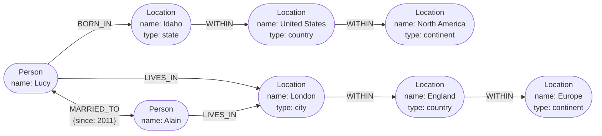

## Overview

[Relational vs. Document Data Models](relational-vs-document-data-models) ends on the observation that documents model trees and start rebuilding join tables by hand the moment relationships go many-to-many. Push that further: when *most* of your data is many-to-many — social graphs, web graphs, road networks, knowledge graphs — even relational joins get awkward, because the question "how is X connected to Y" has no fixed answer you can bake into a query. A **graph model** makes the connections themselves first-class: vertices for entities, edges for relationships, and a query language whose primitive operation is following an edge an unknown number of times.

## The Property Graph Model

A graph is two kinds of object: **vertices** (nodes, entities) and **edges** (relationships, arcs). In the **property graph** model — Neo4j, Memgraph, KùzuDB, Amazon Neptune, Apache AGE — each vertex has:

- a unique identifier
- a **label** describing what kind of thing it is (`Person`, `Location`, `Organization`)
- its sets of incoming and outgoing edges
- a bag of properties (key-value pairs)

And each edge has a unique identifier, a **tail vertex** (where it starts), a **head vertex** (where it ends), a **label** naming the kind of relationship, and its own bag of properties. Edges carrying labels, direction, *and* properties is the part that has no clean relational equivalent: `WORKED_ON {role: 'lead', from: 2019}` is a fact about the relationship, not about either endpoint.

Consider a "who worked with whom on what" graph:



Three properties of this model matter more than the syntax:

**Any vertex can connect to any other vertex.** There is no schema declaring which kinds of thing may be related. Adding "which people are allergic to which allergens, and which allergens are in which foods" means adding vertices and edges, not migrating a schema — and then "what can Lucy safely eat" becomes a traversal.

**Traversal works in both directions.** Given a vertex you can efficiently enumerate both its incoming and its outgoing edges. Many-to-many relationships almost always need both directions ("which projects did this person work on" *and* "who worked on this project"), which is precisely where the document model forced you to duplicate the relationship or lean on secondary indexes into arrays.

**Heterogeneous data lives in one graph without getting messy.** Labels keep `Person`, `Location`, `Event`, and `Comment` vertices distinguishable while letting them all participate in the same traversals. Facebook maintains a single graph containing people, places, events, check-ins and comments; search engines maintain knowledge graphs of organizations, people and places for the same reason.

You can build all of this on a relational database — a property graph is, structurally, two tables:

```sql
CREATE TABLE vertices (
    vertex_id   integer PRIMARY KEY,
    label       text,
    properties  jsonb
);

CREATE TABLE edges (
    edge_id     integer PRIMARY KEY,
    tail_vertex integer REFERENCES vertices (vertex_id),
    head_vertex integer REFERENCES vertices (vertex_id),
    label       text,
    properties  jsonb
);

CREATE INDEX edges_tails ON edges (tail_vertex);
CREATE INDEX edges_heads ON edges (head_vertex);
```

The `edges` table is the associative/join table from the relational model, generalized so that *every* kind of relationship shares one table and is distinguished by its `label`. The two indexes are what make bidirectional traversal cheap. Keep this schema in mind — it's what makes the SQL comparison below concrete.

One real limitation: an edge relates exactly two vertices, whereas a relational join table can express a three-way relationship with three foreign keys on one row. You model higher-degree relationships in a graph by *reifying* them — creating a vertex that stands for the relationship itself, with edges to each participant — or by reaching for a hypergraph.

## The Cypher Query Language

**Cypher** is the query language for property graphs, created for Neo4j and later standardized as openCypher; the 2024 ISO **GQL** standard is based on it. (It's named after a character in *The Matrix*, not after cryptographic ciphers.)

Writing data uses an ASCII-art arrow notation, where `(a) -[:LABEL]-> (b)` means "an edge labeled `LABEL` from `a` to `b`". The symbolic names are query-local, used only to wire the vertices together:

```cypher
CREATE
  (namerica :Location {name:'North America', type:'continent'}),
  (usa      :Location {name:'United States', type:'country'  }),
  (idaho    :Location {name:'Idaho',         type:'state'    }),
  (lucy     :Person   {name:'Lucy'}),
  (idaho) -[:WITHIN]-> (usa) -[:WITHIN]-> (namerica),
  (lucy)  -[:BORN_IN]-> (idaho)
```

Reading uses the *same* arrow notation in a `MATCH` clause, now as a pattern to find rather than a structure to build. "Who emigrated from the US to Europe?":

```cypher
MATCH
  (person) -[:BORN_IN]->  () -[:WITHIN*0..]-> (:Location {name:'United States'}),
  (person) -[:LIVES_IN]-> () -[:WITHIN*0..]-> (:Location {name:'Europe'})
RETURN person.name
```

Read it as: find any vertex `person` that has an outgoing `BORN_IN` edge to somewhere from which you can follow a chain of `WITHIN` edges to the vertex named "United States", *and* an outgoing `LIVES_IN` edge from which a chain of `WITHIN` edges reaches "Europe".

The load-bearing piece is `[:WITHIN*0..]` — "follow a `WITHIN` edge zero or more times", the `*` of regular expressions applied to graph traversal. It exists because **you don't know in advance how many edges you need to traverse**. A `LIVES_IN` edge might point at a street, a city, a district, a region, or a country; the location hierarchy is a different depth in France (commune → département → région) than in the US (city → county → state). Cypher lets you say "however deep it is" in four characters.

Being declarative, the query says nothing about execution strategy. The engine may scan every `Person` and check their birthplace and residence, or — if there's an index on `name` — start from the two `Location` vertices, walk *incoming* `WITHIN` edges to enumerate everything inside the US and inside Europe, and only then look for people via incoming `BORN_IN` and `LIVES_IN` edges. Same answer, wildly different cost; the optimizer picks.

## The Same Query in SQL

Graph data fits in a relational database, as the two-table schema above shows. So can you just query it with SQL? Yes — with difficulty.

Every edge you traverse is a join against `edges`. In ordinary relational work you know at query-writing time how many joins you need. In a graph query you don't: the number of joins is data-dependent. SQL's answer is the recursive common table expression, `WITH RECURSIVE`. Here is the exact same "US to Europe" query:

```sql
WITH RECURSIVE

  -- in_usa: vertex IDs of all locations within the United States
  in_usa(vertex_id) AS (
      SELECT vertex_id FROM vertices
        WHERE label = 'Location' AND properties->>'name' = 'United States'
    UNION
      SELECT edges.tail_vertex FROM edges
        JOIN in_usa ON edges.head_vertex = in_usa.vertex_id
        WHERE edges.label = 'within'
  ),

  -- in_europe: vertex IDs of all locations within Europe
  in_europe(vertex_id) AS (
      SELECT vertex_id FROM vertices
        WHERE label = 'Location' AND properties->>'name' = 'Europe'
    UNION
      SELECT edges.tail_vertex FROM edges
        JOIN in_europe ON edges.head_vertex = in_europe.vertex_id
        WHERE edges.label = 'within'
  ),

  -- born_in_usa: vertex IDs of all people born somewhere in the US
  born_in_usa(vertex_id) AS (
    SELECT edges.tail_vertex FROM edges
      JOIN in_usa ON edges.head_vertex = in_usa.vertex_id
      WHERE edges.label = 'born_in'
  ),

  -- lives_in_europe: vertex IDs of all people living somewhere in Europe
  lives_in_europe(vertex_id) AS (
    SELECT edges.tail_vertex FROM edges
      JOIN in_europe ON edges.head_vertex = in_europe.vertex_id
      WHERE edges.label = 'lives_in'
  )

SELECT vertices.properties->>'name'
FROM vertices
JOIN born_in_usa     ON vertices.vertex_id = born_in_usa.vertex_id
JOIN lives_in_europe ON vertices.vertex_id = lives_in_europe.vertex_id;
```

Four lines of Cypher became thirty-one lines of SQL, and the SQL had to spell out the traversal strategy by hand: seed each recursive CTE with the target vertex, repeatedly follow *incoming* `within` edges to grow the set, then intersect two derived people-sets with a final join. Nothing here is impossible — but you are hand-rolling a graph engine in query language, and the details keep coming: cycle handling, breadth-first versus depth-first, and whether the optimizer will do anything sensible with a recursive CTE over a `jsonb` column.

That gap is the entire argument for a dedicated graph query language. It isn't that SQL *can't*; it's that the abstraction is at the wrong level, so every graph query pays a tax in verbosity, bugs, and lost optimizer leverage. (Oracle offers its own `hierarchical` recursion extension; TigerGraph has GSQL, Oracle has PGQL, and ISO GQL is the attempt to converge the field.)

## Triple Stores and SPARQL

The **triple store** model is largely equivalent to the property graph model wearing different vocabulary. Everything is a three-part statement: **(subject, predicate, object)**. In `(Jim, likes, bananas)`, `Jim` is the subject, `likes` the predicate, `bananas` the object.

The subject is always a vertex. The object is one of two things, and which one it is determines whether the triple is a property or an edge:

- **A primitive value** — `(lucy, birthYear, 1989)` is the property `{"birthYear": 1989}` on the `lucy` vertex.
- **Another vertex** — `(lucy, marriedTo, alain)` is an edge labeled `marriedTo` with `lucy` as tail and `alain` as head.

Written in Turtle, a compact RDF serialization:

```turtle
@prefix : <urn:example:>.
_:lucy     a :Person;   :name "Lucy";          :bornIn _:idaho.
_:idaho    a :Location; :name "Idaho";         :type "state";    :within _:usa.
_:usa      a :Location; :name "United States"; :type "country";  :within _:namerica.
_:namerica a :Location; :name "North America"; :type "continent".
```

This is an encoding of **RDF** (Resource Description Framework), which came out of the early-2000s **Semantic Web** effort to publish machine-readable data across the internet. RDF's quirks follow from that ambition: subjects, predicates and objects are usually URIs, so that your `within` and someone else's `within` are globally distinct identifiers and two independently-published datasets can be merged without colliding. The URI needn't resolve to anything — it's a namespace, declared once at the top of the file.

The Semantic Web as originally envisioned did not happen. Its legacy did: JSON-LD, biomedical ontologies, Facebook's Open Graph protocol (the thing that makes link previews unfurl), Wikidata and search-engine knowledge graphs, and Schema.org's structured-data vocabularies. Triple stores are worth knowing even with zero interest in the Semantic Web — triples are a perfectly good internal data model.

**SPARQL** ("SPARQL Protocol and RDF Query Language", pronounced "sparkle") is the query language for RDF triple stores. It predates Cypher, and Cypher borrowed its pattern matching from SPARQL, so the same query looks familiar:

```sparql
PREFIX : <urn:example:>

SELECT ?personName WHERE {
  ?person :name ?personName.
  ?person :bornIn / :within* / :name "United States".
  ?person :livesIn / :within* / :name "Europe".
}
```

`?person :bornIn / :within* ?location` is exactly `(person) -[:BORN_IN]-> () -[:WITHIN*0..]-> (location)`. Because RDF makes no distinction between properties and edges — both are just predicates — the same syntax matches both, which is arguably tidier than Cypher's split. SPARQL is supported by Amazon Neptune, AllegroGraph, Blazegraph, OpenLink Virtuoso, and Apache Jena.

## Datalog, Briefly

**Datalog** is much older than either, out of 1980s academic research, and is a subset of Prolog. It's relational rather than graph-based, but recursive graph traversal is its standout strength. Rather than jumping straight to `SELECT`, you define rules that derive virtual tables from stored facts, and rules may invoke themselves:

```prolog
within_recursive(LocID, PlaceName) :- location(LocID, PlaceName, _).

within_recursive(LocID, PlaceName) :- within(LocID, ViaID),
                                      within_recursive(ViaID, PlaceName).
```

The style is closer to decomposing code into small mutually-calling functions than to writing one big query, and it's genuinely expressive for complex queries. Practically, though, it's a niche: Datomic, LogicBlox, CozoDB, and LinkedIn's LIquid use it; mainstream databases do not. Know that it exists and that recursive rule composition is its idea; you are unlikely to ship on it.

## GraphQL Is Not a Graph Query Language

This deserves its own section because the name causes more confusion than any other term in this area.

**GraphQL has nothing to do with graph databases.** It is an *API* query language: it lets client software — a mobile app, a web frontend — request a JSON document of a client-specified shape, containing exactly the fields that UI needs. It is REST-replacement territory (or REST-complement territory), and it can be implemented on top of *any* backend: relational, document, graph, a pile of REST calls, a cache, whatever the resolvers reach. GraphQL.org's own FAQ states it directly under the heading "Is GraphQL a database language like SQL?": *"No, but this is a common misconception."* The "graph" refers to the shape of the client-facing schema, not to a storage model.

A GraphQL query is a nested field selection:

```graphql
query ChatApp {
  channels {
    name
    recentMessages(latest: 50) {
      timestamp
      content
      sender {
        fullName
        imageUrl
      }
      replyTo {
        content
        sender {
          fullName
        }
      }
    }
  }
}
```

The response mirrors the query's structure exactly — those fields, no more and no less. That's the payoff: the server does not need to know what the UI renders, and adding an avatar next to reply previews means adding `imageUrl` to the client query with **no server change at all**.

Now the differences that actually matter, all of which run opposite to a graph query language:

- **No recursion.** Cypher, SPARQL, SQL and Datalog all traverse an unbounded number of hops. GraphQL deliberately does not. The client picks a fixed nesting depth, written out literally.
- **No arbitrary search conditions.** "Find people born in the US now living in Europe" is not expressible unless the service owner explicitly exposed that capability. Only joins declared in the GraphQL schema can be requested.
- **These restrictions are the point.** GraphQL queries arrive from untrusted clients, so the language forbids anything that could be expensive enough to DoS the server. A graph query language assumes a trusted operator writing queries against their own database; GraphQL assumes the opposite.
- **It duplicates data on purpose.** If one user sends ten messages, their name and avatar are repeated ten times in the response. Deduplicating would be possible; GraphQL accepts the larger payload because it makes the client's rendering code trivial. Likewise `replyTo` inlines the quoted message's content rather than returning an ID the client would have to resolve with another round trip.

The server underneath can be fully normalized and do real joins to resolve a query — that's the resolvers' job. But nothing about adopting GraphQL implies, requires, or benefits from a graph database. The overlap is the word "graph".

Adoption has costs worth naming: organizations typically need tooling to translate GraphQL queries into calls to internal REST/gRPC services, and authorization, rate limiting, and query-cost control all become harder when the client, not the server, decides the shape and depth of each request.

## Trade-offs

- **Graph models buy schemaless connectivity at the cost of a specialized system** — any vertex may link to any vertex, so new relationship types are additive rather than migrations, but you're now operating a database whose ecosystem, tooling, backup story, and hiring pool are all smaller than Postgres's.
- **A dedicated graph query language pays for itself only when traversals are variable-depth** — four lines of Cypher versus thirty-one of recursive SQL is decisive for arbitrary-depth traversal; for a fixed two-hop join a plain SQL query is shorter than either, and reaching for a graph database would be overkill.
- **Recursive CTEs make SQL sufficient, not pleasant** — `WITH RECURSIVE` genuinely handles variable-length paths, so a graph database is rarely *required*; what you give up is concision, cycle handling, traversal-order control, and an optimizer that understands it's doing a traversal.
- **Edges are binary, so higher-degree relationships need modeling work** — a relational join table can express a three-way relationship in one row with three foreign keys, while a graph forces you to reify the relationship as its own vertex or reach for a hypergraph.
- **Property graphs and triple stores are the same expressive power with different vocabulary** — pick RDF/SPARQL when you need internet-scale identifier stability and dataset merging (URIs as predicates, linked-data ecosystems); pick property graphs when the data is yours and you want richer edge properties with less ceremony.
- **"GraphQL" shares a prefix with graph databases and nothing else** — treating it as a storage decision is a category error; it's an API-layer contract that constrains queries precisely because they come from untrusted clients, which is the opposite of what a graph query language optimizes for.

## Interview Questions

- Your team stores a social network in Postgres with a `follows(follower_id, followee_id)` table. Feature requests move from "who does X follow" to "shortest connection path between X and Y". What specifically gets harder, and at what point does that justify a graph database rather than a recursive CTE?
- The Cypher pattern `[:WITHIN*0..]` compiles to a variable number of joins. Why can't you express that with a fixed number of `JOIN` clauses in ordinary SQL, and what does `WITH RECURSIVE` actually do to fill the gap?
- A property graph can be modeled as a `vertices` table and an `edges` table in any relational database. Given that, what does a native graph database actually give you that this schema plus recursive CTEs does not?
- A candidate says "we're adopting GraphQL, so we should move our data into Neo4j." Explain precisely why that reasoning is wrong, and identify what GraphQL is actually solving.
- GraphQL deliberately forbids recursive queries and arbitrary search predicates, while Cypher and SPARQL make both central. What difference in threat model explains that, and what would break if GraphQL allowed unbounded traversal?

## References

- [Martin Kleppmann, "Designing Data-Intensive Applications", 2nd Edition (O'Reilly) — Chapter 3, "Data Models and Query Languages", section "Graph-Like Data Models"](https://www.oreilly.com/library/view/designing-data-intensive-applications/9781098119058/)
- [Neo4j Cypher Manual — Introduction to the Cypher query language](https://neo4j.com/docs/cypher-manual/current/introduction/)
- [W3C — SPARQL 1.1 Query Language (W3C Recommendation)](https://www.w3.org/TR/sparql11-query/)
- [GraphQL.org FAQ — "Is GraphQL a database language like SQL?"](https://graphql.org/faq/getting-started/)
