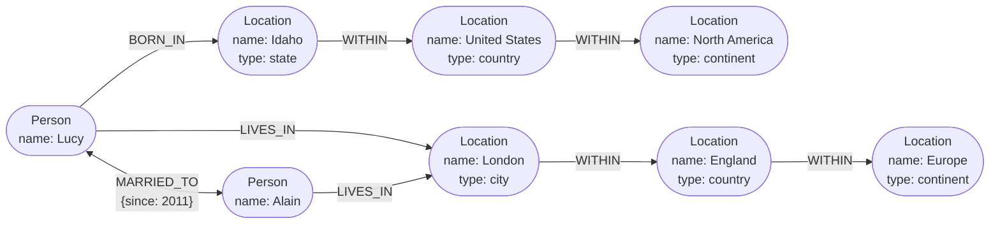

## Visão Geral

[Relational vs. Document Data Models](relational-vs-document-data-models) termina com a observação de que documentos modelam árvores e começam a reconstruir tabelas de junção manualmente no momento em que relacionamentos ficam muitos-para-muitos. Leve isso adiante: quando *a maioria* dos seus dados é muitos-para-muitos — grafos sociais, grafos web, redes rodoviárias, grafos de conhecimento — até joins relacionais ficam desajeitados, porque a pergunta "como X está conectado a Y" não tem uma resposta fixa que você possa embutir em uma consulta. Um **modelo em grafo** torna as próprias conexões cidadãs de primeira classe: vértices para entidades, arestas para relacionamentos, e uma linguagem de consulta cuja operação primitiva é seguir uma aresta um número desconhecido de vezes.

## O Modelo de Property Graph

Um grafo é dois tipos de objeto: **vértices** (nós, entidades) e **arestas** (relacionamentos, arcos). No modelo **property graph** — Neo4j, Memgraph, KùzuDB, Amazon Neptune, Apache AGE — cada vértice tem:

- um identificador único
- um **rótulo** descrevendo que tipo de coisa ele é (`Person`, `Location`, `Organization`)
- seus conjuntos de arestas de entrada e saída
- um saco de propriedades (pares chave-valor)

E cada aresta tem um identificador único, um **vértice de cauda** (onde começa), um **vértice de cabeça** (onde termina), um **rótulo** nomeando o tipo de relacionamento, e seu próprio saco de propriedades. Arestas carregando rótulos, direção, *e* propriedades é a parte que não tem equivalente relacional limpo: `WORKED_ON {role: 'lead', from: 2019}` é um fato sobre o relacionamento, não sobre nenhum dos extremos.

Considere um grafo de "quem trabalhou com quem em quê":



Três propriedades desse modelo importam mais que a sintaxe:

**Qualquer vértice pode se conectar a qualquer outro vértice.** Não há esquema declarando que tipos de coisa podem se relacionar. Adicionar "quais pessoas são alérgicas a quais alérgenos, e quais alérgenos estão em quais alimentos" significa adicionar vértices e arestas, não migrar um esquema — e então "o que a Lucy pode comer com segurança" se torna uma travessia.

**Travessia funciona em ambas as direções.** Dado um vértice, você pode enumerar eficientemente tanto suas arestas de entrada quanto de saída. Relacionamentos muitos-para-muitos quase sempre precisam de ambas as direções ("em quais projetos essa pessoa trabalhou" *e* "quem trabalhou neste projeto"), que é precisamente onde o modelo de documento te forçava a duplicar o relacionamento ou depender de índices secundários em arrays.

**Dados heterogêneos vivem em um grafo sem virar bagunça.** Rótulos mantêm vértices `Person`, `Location`, `Event`, e `Comment` distinguíveis enquanto permitem que todos participem das mesmas travessias. O Facebook mantém um único grafo contendo pessoas, lugares, eventos, check-ins e comentários; motores de busca mantêm grafos de conhecimento de organizações, pessoas e lugares pela mesma razão.

Você pode construir tudo isso em um banco de dados relacional — um property graph é, estruturalmente, duas tabelas:

```sql
CREATE TABLE vertices (
    vertex_id   integer PRIMARY KEY,
    label       text,
    properties  jsonb
);

CREATE TABLE edges (
    edge_id     integer PRIMARY KEY,
    tail_vertex integer REFERENCES vertices (vertex_id),
    head_vertex integer REFERENCES vertices (vertex_id),
    label       text,
    properties  jsonb
);

CREATE INDEX edges_tails ON edges (tail_vertex);
CREATE INDEX edges_heads ON edges (head_vertex);
```

A tabela `edges` é a tabela associativa/de junção do modelo relacional, generalizada para que *todo* tipo de relacionamento compartilhe uma tabela e seja distinguido por seu `label`. Os dois índices são o que torna a travessia bidirecional barata. Guarde esse esquema em mente — é o que torna concreta a comparação com SQL abaixo.

Uma limitação real: uma aresta relaciona exatamente dois vértices, enquanto uma tabela de junção relacional pode expressar um relacionamento de três vias com três chaves estrangeiras em uma linha. Você modela relacionamentos de grau mais alto em um grafo *reificando*-os — criando um vértice que representa o próprio relacionamento, com arestas para cada participante — ou recorrendo a um hipergrafo.

## A Linguagem de Consulta Cypher

**Cypher** é a linguagem de consulta para property graphs, criada para o Neo4j e depois padronizada como openCypher; o padrão ISO **GQL** de 2024 é baseado nela. (Tem esse nome por causa de um personagem de *Matrix*, não de cifras criptográficas.)

Escrever dados usa uma notação de seta em ASCII-art, onde `(a) -[:LABEL]-> (b)` significa "uma aresta rotulada `LABEL` de `a` para `b`". Os nomes simbólicos são locais à consulta, usados apenas para conectar os vértices entre si:

```cypher
CREATE
  (namerica :Location {name:'North America', type:'continent'}),
  (usa      :Location {name:'United States', type:'country'  }),
  (idaho    :Location {name:'Idaho',         type:'state'    }),
  (lucy     :Person   {name:'Lucy'}),
  (idaho) -[:WITHIN]-> (usa) -[:WITHIN]-> (namerica),
  (lucy)  -[:BORN_IN]-> (idaho)
```

Ler usa a *mesma* notação de seta em uma cláusula `MATCH`, agora como um padrão a encontrar em vez de uma estrutura a construir. "Quem emigrou dos EUA para a Europa?":

```cypher
MATCH
  (person) -[:BORN_IN]->  () -[:WITHIN*0..]-> (:Location {name:'United States'}),
  (person) -[:LIVES_IN]-> () -[:WITHIN*0..]-> (:Location {name:'Europe'})
RETURN person.name
```

Leia como: encontre qualquer vértice `person` que tenha uma aresta `BORN_IN` de saída para algum lugar de onde você possa seguir uma cadeia de arestas `WITHIN` até o vértice chamado "United States", *e* uma aresta `LIVES_IN` de saída de onde uma cadeia de arestas `WITHIN` alcança "Europe".

A peça essencial é `[:WITHIN*0..]` — "siga uma aresta `WITHIN` zero ou mais vezes", o `*` das expressões regulares aplicado a travessia de grafo. Ele existe porque **você não sabe de antemão quantas arestas precisa atravessar**. Uma aresta `LIVES_IN` pode apontar para uma rua, uma cidade, um distrito, uma região, ou um país; a hierarquia de localização tem profundidade diferente na França (comuna → departamento → região) do que nos EUA (cidade → condado → estado). O Cypher permite dizer "não importa quão fundo seja" em quatro caracteres.

Sendo declarativa, a consulta não diz nada sobre estratégia de execução. O motor pode escanear cada `Person` e checar seu local de nascimento e residência, ou — se houver um índice em `name` — começar pelos dois vértices `Location`, caminhar por arestas `WITHIN` de *entrada* para enumerar tudo dentro dos EUA e dentro da Europa, e só então procurar pessoas via `BORN_IN` e `LIVES_IN` de entrada. Mesma resposta, custo bem diferente; o otimizador escolhe.

## A Mesma Consulta em SQL

Dados em grafo cabem em um banco de dados relacional, como o esquema de duas tabelas acima mostra. Então você pode simplesmente consultá-los com SQL? Sim — com dificuldade.

Toda aresta que você atravessa é um join contra `edges`. Em trabalho relacional comum você sabe no momento de escrever a consulta quantos joins precisa. Em uma consulta de grafo você não sabe: o número de joins depende dos dados. A resposta do SQL é a common table expression recursiva, `WITH RECURSIVE`. Aqui está exatamente a mesma consulta "EUA para Europa":

```sql
WITH RECURSIVE

  -- in_usa: IDs de vértice de todos os locais dentro dos Estados Unidos
  in_usa(vertex_id) AS (
      SELECT vertex_id FROM vertices
        WHERE label = 'Location' AND properties->>'name' = 'United States'
    UNION
      SELECT edges.tail_vertex FROM edges
        JOIN in_usa ON edges.head_vertex = in_usa.vertex_id
        WHERE edges.label = 'within'
  ),

  -- in_europe: IDs de vértice de todos os locais dentro da Europa
  in_europe(vertex_id) AS (
      SELECT vertex_id FROM vertices
        WHERE label = 'Location' AND properties->>'name' = 'Europe'
    UNION
      SELECT edges.tail_vertex FROM edges
        JOIN in_europe ON edges.head_vertex = in_europe.vertex_id
        WHERE edges.label = 'within'
  ),

  -- born_in_usa: IDs de vértice de todas as pessoas nascidas em algum lugar nos EUA
  born_in_usa(vertex_id) AS (
    SELECT edges.tail_vertex FROM edges
      JOIN in_usa ON edges.head_vertex = in_usa.vertex_id
      WHERE edges.label = 'born_in'
  ),

  -- lives_in_europe: IDs de vértice de todas as pessoas vivendo em algum lugar na Europa
  lives_in_europe(vertex_id) AS (
    SELECT edges.tail_vertex FROM edges
      JOIN in_europe ON edges.head_vertex = in_europe.vertex_id
      WHERE edges.label = 'lives_in'
  )

SELECT vertices.properties->>'name'
FROM vertices
JOIN born_in_usa     ON vertices.vertex_id = born_in_usa.vertex_id
JOIN lives_in_europe ON vertices.vertex_id = lives_in_europe.vertex_id;
```

Quatro linhas de Cypher se tornaram trinta e uma linhas de SQL, e o SQL teve que soletrar a estratégia de travessia manualmente: semear cada CTE recursiva com o vértice alvo, seguir repetidamente arestas `within` de *entrada* para crescer o conjunto, depois interseccionar dois conjuntos de pessoas derivados com um join final. Nada aqui é impossível — mas você está construindo à mão um motor de grafo em linguagem de consulta, e os detalhes continuam chegando: tratamento de ciclos, largura-primeiro versus profundidade-primeiro, e se o otimizador vai fazer algo sensato com uma CTE recursiva sobre uma coluna `jsonb`.

Essa lacuna é o argumento inteiro para uma linguagem de consulta de grafo dedicada. Não é que SQL *não consiga*; é que a abstração está no nível errado, então toda consulta de grafo paga um imposto em verbosidade, bugs, e alavancagem de otimizador perdida. (Oracle oferece sua própria extensão de recursão `hierarchical`; TigerGraph tem GSQL, Oracle tem PGQL, e o ISO GQL é a tentativa de convergir o campo.)

## Triple Stores e SPARQL

O modelo **triple store** é largamente equivalente ao modelo property graph vestindo vocabulário diferente. Tudo é uma declaração de três partes: **(sujeito, predicado, objeto)**. Em `(Jim, likes, bananas)`, `Jim` é o sujeito, `likes` o predicado, `bananas` o objeto.

O sujeito é sempre um vértice. O objeto é uma de duas coisas, e qual delas é determina se a tripla é uma propriedade ou uma aresta:

- **Um valor primitivo** — `(lucy, birthYear, 1989)` é a propriedade `{"birthYear": 1989}` no vértice `lucy`.
- **Outro vértice** — `(lucy, marriedTo, alain)` é uma aresta rotulada `marriedTo` com `lucy` como cauda e `alain` como cabeça.

Escrito em Turtle, uma serialização RDF compacta:

```turtle
@prefix : <urn:example:>.
_:lucy     a :Person;   :name "Lucy";          :bornIn _:idaho.
_:idaho    a :Location; :name "Idaho";         :type "state";    :within _:usa.
_:usa      a :Location; :name "United States"; :type "country";  :within _:namerica.
_:namerica a :Location; :name "North America"; :type "continent".
```

Isso é uma codificação de **RDF** (Resource Description Framework, Framework de Descrição de Recursos), que veio do esforço da **Web Semântica** do início dos anos 2000 para publicar dados legíveis por máquina através da internet. As peculiaridades do RDF seguem dessa ambição: sujeitos, predicados e objetos geralmente são URIs, de forma que seu `within` e o `within` de outra pessoa são identificadores globalmente distintos e dois conjuntos de dados publicados independentemente podem ser mesclados sem colidir. A URI não precisa resolver para nada — é um namespace, declarado uma vez no topo do arquivo.

A Web Semântica como originalmente concebida não aconteceu. Seu legado sim: JSON-LD, ontologias biomédicas, o protocolo Open Graph do Facebook (a coisa que faz previews de link se expandirem), Wikidata e grafos de conhecimento de motores de busca, e os vocabulários de dados estruturados do Schema.org. Triple stores valem a pena conhecer mesmo com zero interesse na Web Semântica — triplas são um modelo de dados interno perfeitamente bom.

**SPARQL** ("SPARQL Protocol and RDF Query Language", pronunciado "sparkle") é a linguagem de consulta para triple stores RDF. Ela precede o Cypher, e o Cypher tomou emprestado sua correspondência de padrões do SPARQL, então a mesma consulta parece familiar:

```sparql
PREFIX : <urn:example:>

SELECT ?personName WHERE {
  ?person :name ?personName.
  ?person :bornIn / :within* / :name "United States".
  ?person :livesIn / :within* / :name "Europe".
}
```

`?person :bornIn / :within* ?location` é exatamente `(person) -[:BORN_IN]-> () -[:WITHIN*0..]-> (location)`. Como o RDF não faz distinção entre propriedades e arestas — ambos são só predicados — a mesma sintaxe corresponde a ambos, o que é discutivelmente mais arrumado que a divisão do Cypher. SPARQL é suportado por Amazon Neptune, AllegroGraph, Blazegraph, OpenLink Virtuoso, e Apache Jena.

## Datalog, Brevemente

**Datalog** é muito mais antigo que ambos, vindo de pesquisa acadêmica dos anos 1980, e é um subconjunto do Prolog. É relacional em vez de baseado em grafo, mas travessia recursiva de grafo é seu ponto forte de destaque. Em vez de pular direto para `SELECT`, você define regras que derivam tabelas virtuais de fatos armazenados, e regras podem invocar a si mesmas:

```prolog
within_recursive(LocID, PlaceName) :- location(LocID, PlaceName, _).

within_recursive(LocID, PlaceName) :- within(LocID, ViaID),
                                      within_recursive(ViaID, PlaceName).
```

O estilo é mais próximo de decompor código em pequenas funções mutuamente chamadas do que de escrever uma consulta grande, e é genuinamente expressivo para consultas complexas. Na prática, porém, é um nicho: Datomic, LogicBlox, CozoDB, e o LIquid do LinkedIn o usam; bancos de dados mainstream não. Saiba que ele existe e que composição de regras recursivas é sua ideia; é improvável que você venha a implantá-lo.

## GraphQL Não É uma Linguagem de Consulta de Grafo

Isso merece sua própria seção porque o nome causa mais confusão do que qualquer outro termo nesta área.

**GraphQL não tem nada a ver com bancos de dados em grafo.** É uma linguagem de consulta de *API*: permite que software cliente — um app mobile, um frontend web — solicite um documento JSON de uma forma especificada pelo cliente, contendo exatamente os campos que aquela UI precisa. É território de substituição do REST (ou território de complemento do REST), e pode ser implementado em cima de *qualquer* backend: relacional, documento, grafo, um monte de chamadas REST, um cache, o que quer que os resolvers alcancem. O próprio FAQ do GraphQL.org afirma diretamente sob o título "GraphQL é uma linguagem de banco de dados como SQL?": *"Não, mas este é um equívoco comum."* O "graph" se refere à forma do esquema voltado ao cliente, não a um modelo de armazenamento.

Uma consulta GraphQL é uma seleção de campos aninhada:

```graphql
query ChatApp {
  channels {
    name
    recentMessages(latest: 50) {
      timestamp
      content
      sender {
        fullName
        imageUrl
      }
      replyTo {
        content
        sender {
          fullName
        }
      }
    }
  }
}
```

A resposta espelha exatamente a estrutura da consulta — aqueles campos, nem mais nem menos. Esse é o retorno: o servidor não precisa saber o que a UI renderiza, e adicionar um avatar ao lado de previews de resposta significa adicionar `imageUrl` à consulta do cliente com **nenhuma mudança no servidor**.

Agora as diferenças que realmente importam, todas correndo na direção oposta a uma linguagem de consulta de grafo:

- **Sem recursão.** Cypher, SPARQL, SQL e Datalog todos atravessam um número ilimitado de saltos. GraphQL deliberadamente não faz isso. O cliente escolhe uma profundidade de aninhamento fixa, escrita literalmente.
- **Sem condições de busca arbitrárias.** "Encontre pessoas nascidas nos EUA agora vivendo na Europa" não é expressável a menos que o dono do serviço tenha explicitamente exposto essa capacidade. Só joins declarados no esquema GraphQL podem ser solicitados.
- **Essas restrições são o ponto.** Consultas GraphQL chegam de clientes não confiáveis, então a linguagem proíbe qualquer coisa que pudesse ser cara o suficiente para causar um DoS no servidor. Uma linguagem de consulta de grafo assume um operador confiável escrevendo consultas contra seu próprio banco de dados; GraphQL assume o oposto.
- **Ele duplica dados de propósito.** Se um usuário envia dez mensagens, seu nome e avatar são repetidos dez vezes na resposta. Deduplicar seria possível; GraphQL aceita o payload maior porque torna o código de renderização do cliente trivial. Da mesma forma `replyTo` inclui o conteúdo da mensagem citada em linha em vez de retornar um ID que o cliente teria que resolver com outra viagem de ida e volta.

O servidor por baixo pode ser totalmente normalizado e fazer joins de verdade para resolver uma consulta — esse é o trabalho dos resolvers. Mas nada em adotar GraphQL implica, exige, ou se beneficia de um banco de dados em grafo. A sobreposição é a palavra "graph".

A adoção tem custos que valem a pena nomear: organizações tipicamente precisam de ferramentas para traduzir consultas GraphQL em chamadas para serviços REST/gRPC internos, e autorização, rate limiting, e controle de custo de consulta todos ficam mais difíceis quando o cliente, não o servidor, decide a forma e profundidade de cada requisição.

## Trade-offs

- **Modelos em grafo compram conectividade sem esquema ao custo de um sistema especializado** — qualquer vértice pode se ligar a qualquer vértice, então novos tipos de relacionamento são aditivos em vez de migrações, mas agora você está operando um banco de dados cujo ecossistema, ferramental, história de backup, e pool de contratação são todos menores que o do Postgres.
- **Uma linguagem de consulta de grafo dedicada só se paga quando travessias são de profundidade variável** — quatro linhas de Cypher versus trinta e uma de SQL recursivo é decisivo para travessia de profundidade arbitrária; para um join fixo de dois saltos uma consulta SQL simples é mais curta que qualquer um dos dois, e recorrer a um banco de dados em grafo seria excesso de engenharia.
- **CTEs recursivas tornam o SQL suficiente, não agradável** — `WITH RECURSIVE` genuinamente trata caminhos de comprimento variável, então um banco de dados em grafo raramente é *exigido*; o que você perde é concisão, tratamento de ciclos, controle de ordem de travessia, e um otimizador que entende que está fazendo uma travessia.
- **Arestas são binárias, então relacionamentos de grau mais alto precisam de trabalho de modelagem** — uma tabela de junção relacional pode expressar um relacionamento de três vias em uma linha com três chaves estrangeiras, enquanto um grafo te força a reificar o relacionamento como seu próprio vértice ou recorrer a um hipergrafo.
- **Property graphs e triple stores são o mesmo poder expressivo com vocabulário diferente** — escolha RDF/SPARQL quando você precisa de estabilidade de identificador em escala de internet e mesclagem de conjuntos de dados (URIs como predicados, ecossistemas de dados vinculados); escolha property graphs quando os dados são seus e você quer propriedades de aresta mais ricas com menos cerimônia.
- **"GraphQL" compartilha um prefixo com bancos de dados em grafo e nada mais** — tratá-lo como uma decisão de armazenamento é um erro de categoria; é um contrato de camada de API que restringe consultas precisamente porque elas vêm de clientes não confiáveis, o que é o oposto do que uma linguagem de consulta de grafo otimiza.

## Perguntas de Entrevista

- Seu time armazena uma rede social no Postgres com uma tabela `follows(follower_id, followee_id)`. Pedidos de funcionalidade migram de "quem X segue" para "caminho de conexão mais curto entre X e Y". O que especificamente fica mais difícil, e em que ponto isso justifica um banco de dados em grafo em vez de uma CTE recursiva?
- O padrão Cypher `[:WITHIN*0..]` compila para um número variável de joins. Por que você não consegue expressar isso com um número fixo de cláusulas `JOIN` em SQL comum, e o que `WITH RECURSIVE` realmente faz para preencher a lacuna?
- Um property graph pode ser modelado como uma tabela `vertices` e uma tabela `edges` em qualquer banco de dados relacional. Dado isso, o que um banco de dados em grafo nativo realmente te dá que esse esquema mais CTEs recursivas não dá?
- Um candidato diz "estamos adotando GraphQL, então deveríamos mover nossos dados para o Neo4j." Explique precisamente por que esse raciocínio está errado, e identifique o que o GraphQL está realmente resolvendo.
- GraphQL deliberadamente proíbe consultas recursivas e predicados de busca arbitrários, enquanto Cypher e SPARQL tornam ambos centrais. Que diferença no modelo de ameaça explica isso, e o que quebraria se GraphQL permitisse travessia ilimitada?

## Referências

- [Martin Kleppmann, "Designing Data-Intensive Applications", 2nd Edition (O'Reilly) — Capítulo 3, "Data Models and Query Languages", seção "Graph-Like Data Models"](https://www.oreilly.com/library/view/designing-data-intensive-applications/9781098119058/)
- [Neo4j Cypher Manual — Introduction to the Cypher query language](https://neo4j.com/docs/cypher-manual/current/introduction/)
- [W3C — SPARQL 1.1 Query Language (W3C Recommendation)](https://www.w3.org/TR/sparql11-query/)
- [GraphQL.org FAQ — "Is GraphQL a database language like SQL?"](https://graphql.org/faq/getting-started/)
