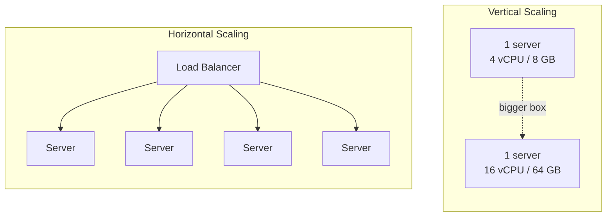

## Overview

When a system runs out of capacity, there are exactly two directions to add more: make the existing machine bigger (**vertical scaling**), or add more machines running the same workload (**horizontal scaling**). They solve the same underlying problem — not enough CPU, memory, or throughput for current demand — but they have very different ceilings, failure characteristics, and costs, and most systems that scale seriously end up using both rather than treating them as a single choice.

## Vertical Scaling

Vertical scaling ("scaling up") means increasing the resources of a single instance — more CPU cores, more RAM, faster disks — without changing how many instances exist:

```
before: 1 server, 4 vCPU,  8 GB RAM
after:  1 server, 16 vCPU, 64 GB RAM
```

It's the simplest possible change: no new failure modes, no coordination between instances, no load balancer to introduce, and it doesn't require the application to be written any differently. But it has a hard ceiling — there's a largest instance a cloud provider offers, and eventually cost stops scaling linearly with capacity (very large instances carry a premium). It also does nothing for availability: a single, bigger machine is still a single point of failure, and if it goes down, capacity doesn't degrade gracefully, it disappears entirely.

## Horizontal Scaling

Horizontal scaling ("scaling out") means adding more instances of the same size, running the same code, and spreading load across all of them:

```
before: 1 server
after:  4 servers, behind a load balancer
```

This has no real ceiling — need more capacity, add more machines — and it improves availability along the way: if one instance dies, the others keep serving traffic while it's replaced, which a single bigger machine can't offer no matter how much RAM it has. The cost is architectural: horizontal scaling only works if the workload can actually be split across instances, which means the instances can't rely on state that only exists on one of them (see Stateless Services and Decoupling Compute from Data) and something has to exist to distribute requests across the fleet (see Load Balancing Strategies). A stateful service that hasn't been redesigned to externalize its state cannot simply be horizontally scaled by starting more copies of it.



## Why They Aren't Interchangeable

Vertical scaling buys headroom without touching the architecture; horizontal scaling requires the architecture to already support it. A team migrating from one large server to a fleet of smaller ones is very often forced to also solve statelessness and load distribution at the same time — the two problems arrive together. This is why the sequence in most systems' evolution runs in a particular order: get the easy, architecture-free win of a bigger box first, and only take on the complexity of horizontal scaling once vertical scaling's ceiling is actually in sight, or once availability (not just capacity) is the thing that needs solving. Buying a bigger box is temporary relief; decoupling state is the change that makes the system scalable indefinitely.

## Autoscaling

Once a fleet can scale horizontally, the number of running instances doesn't have to be fixed — it can be a function of current demand. An **autoscaler** watches a signal (CPU utilization, request queue depth, requests per second) against target thresholds and adjusts the instance count within a configured range:

```
autoscaling_group:
  min_instances: 2
  max_instances: 10
  target_cpu_utilization: 60%

# traffic spike -> CPU exceeds 60% -> autoscaler adds instances (up to 10)
# traffic quiets down -> CPU drops -> autoscaler removes instances (down to 2)
```

The `min` floor exists for baseline availability and to absorb the time it takes to spin up a new instance (a cold instance isn't ready the instant traffic arrives); the `max` ceiling exists to cap cost and to avoid overwhelming shared downstream resources (a database that's fine at 10 app-server connections might not be fine at 200). Autoscaling turns capacity planning from "provision for worst-case traffic and pay for idle capacity the rest of the time" into "provision for a range and let the fleet size track actual demand" — at the cost of needing the workload to already be horizontally scalable, statelessly, for new instances to be safely added or removed at any moment.

## Trade-offs

- **Vertical scaling is architecturally free but capped and doesn't improve availability** — it's the right first move when there's no redesign appetite yet, but it's a ceiling, not a strategy.
- **Horizontal scaling has no real ceiling and improves availability, but demands statelessness and a load-distribution layer first** — the complexity isn't optional overhead, it's the price of the approach actually working.
- **Autoscaling turns manual capacity planning into a policy, but only on top of a fleet that's already safe to resize at any moment** — an autoscaler added to a stateful service will happily create instances that can't correctly serve traffic.
- **A low `min_instances` saves cost during quiet periods but risks a slow response to a sudden spike** — cold-start time for new instances has to be shorter than how fast demand can realistically ramp, or the autoscaler reacts too late to prevent degradation.

## Interview Questions

- What specifically stops a single, arbitrarily large vertical instance from being a complete substitute for horizontal scaling?
- Why does horizontal scaling require the application to be stateless, and what breaks if it isn't?
- Why is vertical scaling often the first move even in systems that eventually scale horizontally?
- What's the purpose of the `min_instances` floor in an autoscaling policy, given that the whole point is to shrink capacity when demand is low?
- What has to be true of a service before an autoscaler can safely terminate one of its instances mid-traffic?

## References

- [AWS — What Is Amazon EC2 Auto Scaling?](https://docs.aws.amazon.com/autoscaling/ec2/userguide/what-is-amazon-ec2-auto-scaling.html)
- [Google Cloud — Autoscaling groups of instances](https://cloud.google.com/compute/docs/autoscaler)
- [Kubernetes Documentation — Horizontal Pod Autoscaling](https://kubernetes.io/docs/tasks/run-application/horizontal-pod-autoscale/)
- Martin L. Abbott and Michael T. Fisher, *The Art of Scalability* (Addison-Wesley, 2nd Edition) — on the AKF Scale Cube and scaling axes
