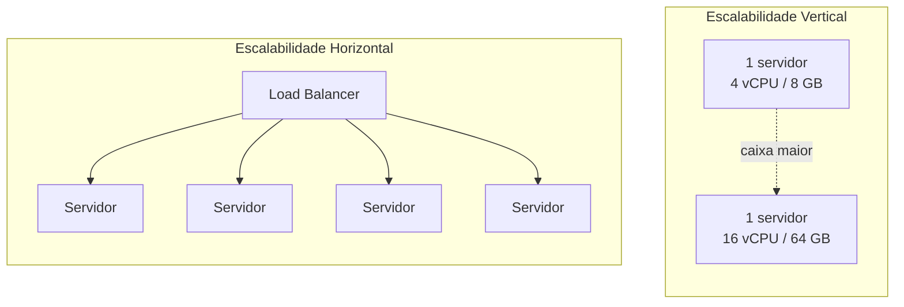

## Visão Geral

Quando um sistema fica sem capacidade, existem exatamente duas direções para adicionar mais: tornar a máquina existente maior (**escalabilidade vertical**), ou adicionar mais máquinas rodando a mesma carga de trabalho (**escalabilidade horizontal**). Elas resolvem o mesmo problema subjacente — CPU, memória ou throughput insuficientes para a demanda atual — mas têm tetos, características de falha e custos muito diferentes, e a maioria dos sistemas que escalam de forma séria acabam usando ambas em vez de tratá-las como uma única escolha.

## Escalabilidade Vertical

Escalabilidade vertical ("escalar para cima") significa aumentar os recursos de uma única instância — mais núcleos de CPU, mais RAM, discos mais rápidos — sem mudar quantas instâncias existem:

```
antes: 1 servidor, 4 vCPU,  8 GB RAM
depois: 1 servidor, 16 vCPU, 64 GB RAM
```

É a mudança mais simples possível: nenhum modo de falha novo, nenhuma coordenação entre instâncias, nenhum load balancer para introduzir, e não requer que a aplicação seja escrita de forma diferente. Mas tem um teto rígido — existe uma maior instância que um provedor de nuvem oferece, e eventualmente o custo para de escalar linearmente com a capacidade (instâncias muito grandes carregam um prêmio). Também não faz nada pela disponibilidade: uma única máquina, maior, ainda é um ponto único de falha, e se ela cai, a capacidade não degrada graciosamente, ela desaparece completamente.

## Escalabilidade Horizontal

Escalabilidade horizontal ("escalar para fora") significa adicionar mais instâncias do mesmo tamanho, rodando o mesmo código, e espalhando carga entre todas elas:

```
antes: 1 servidor
depois: 4 servidores, atrás de um load balancer
```

Isso não tem um teto real — precisa de mais capacidade, adicione mais máquinas — e melhora a disponibilidade ao longo do caminho: se uma instância morre, as outras continuam servindo tráfego enquanto ela é substituída, algo que uma única máquina maior não pode oferecer não importa quanta RAM tenha. O custo é arquitetural: escalabilidade horizontal só funciona se a carga de trabalho realmente pode ser dividida entre instâncias, o que significa que as instâncias não podem depender de estado que só existe em uma delas (veja Stateless Services and Decoupling Compute from Data) e algo precisa existir para distribuir requisições pela frota (veja Load Balancing Strategies). Um serviço com estado que não foi redesenhado para externalizar seu estado não pode simplesmente ser escalado horizontalmente iniciando mais cópias dele.



## Por Que Não São Intercambiáveis

Escalabilidade vertical compra folga sem tocar na arquitetura; escalabilidade horizontal requer que a arquitetura já a suporte. Uma equipe migrando de um servidor grande para uma frota de menores é muito frequentemente forçada a também resolver ausência de estado e distribuição de carga ao mesmo tempo — os dois problemas chegam juntos. É por isso que a sequência na evolução da maioria dos sistemas segue uma ordem particular: pegue primeiro o ganho fácil, sem mudança de arquitetura, de uma caixa maior, e só assuma a complexidade de escalabilidade horizontal uma vez que o teto da escalabilidade vertical realmente esteja à vista, ou uma vez que disponibilidade (não apenas capacidade) seja a coisa que precisa ser resolvida. Comprar uma caixa maior é alívio temporário; desacoplar estado é a mudança que torna o sistema escalável indefinidamente.

## Autoscaling

Uma vez que uma frota pode escalar horizontalmente, o número de instâncias rodando não precisa ser fixo — pode ser uma função da demanda atual. Um **autoscaler** observa um sinal (utilização de CPU, profundidade de fila de requisições, requisições por segundo) contra limites alvo e ajusta a contagem de instâncias dentro de um intervalo configurado:

```
autoscaling_group:
  min_instances: 2
  max_instances: 10
  target_cpu_utilization: 60%

# pico de tráfego -> CPU excede 60% -> autoscaler adiciona instâncias (até 10)
# tráfego se acalma -> CPU cai -> autoscaler remove instâncias (até 2)
```

O piso `min` existe para disponibilidade de linha de base e para absorver o tempo que leva para iniciar uma nova instância (uma instância fria não está pronta no instante em que o tráfego chega); o teto `max` existe para limitar custo e evitar sobrecarregar recursos downstream compartilhados (um banco de dados que está bem com 10 conexões de app-server pode não estar bem com 200). Autoscaling transforma planejamento de capacidade de "provisionar para o pior caso de tráfego e pagar por capacidade ociosa o resto do tempo" em "provisionar para um intervalo e deixar o tamanho da frota rastrear a demanda real" — ao custo de precisar que a carga de trabalho já seja horizontalmente escalável, sem estado, para que novas instâncias possam ser adicionadas ou removidas com segurança a qualquer momento.

## Trade-offs

- **Escalabilidade vertical é arquiteturalmente gratuita mas limitada e não melhora disponibilidade** — é o primeiro movimento certo quando ainda não há apetite para redesenho, mas é um teto, não uma estratégia.
- **Escalabilidade horizontal não tem teto real e melhora disponibilidade, mas exige ausência de estado e uma camada de distribuição de carga primeiro** — a complexidade não é overhead opcional, é o preço da abordagem realmente funcionar.
- **Autoscaling transforma planejamento manual de capacidade em uma política, mas apenas em cima de uma frota que já é segura para redimensionar a qualquer momento** — um autoscaler adicionado a um serviço com estado alegremente criará instâncias que não conseguem servir tráfego corretamente.
- **Um `min_instances` baixo economiza custo durante períodos calmos mas arrisca uma resposta lenta a um pico súbito** — o tempo de cold-start de novas instâncias precisa ser mais curto que quão rápido a demanda pode realisticamente aumentar, ou o autoscaler reage tarde demais para prevenir degradação.

## Perguntas de Entrevista

- O que especificamente impede uma única instância vertical arbitrariamente grande de ser um substituto completo para escalabilidade horizontal?
- Por que escalabilidade horizontal requer que a aplicação seja sem estado, e o que quebra se não for?
- Por que escalabilidade vertical é frequentemente o primeiro movimento mesmo em sistemas que eventualmente escalam horizontalmente?
- Qual é o propósito do piso `min_instances` em uma política de autoscaling, dado que todo o ponto é encolher capacidade quando a demanda está baixa?
- O que precisa ser verdade sobre um serviço antes que um autoscaler possa encerrar com segurança uma de suas instâncias no meio do tráfego?

## Referências

- [AWS — What Is Amazon EC2 Auto Scaling?](https://docs.aws.amazon.com/autoscaling/ec2/userguide/what-is-amazon-ec2-auto-scaling.html)
- [Google Cloud — Autoscaling groups of instances](https://cloud.google.com/compute/docs/autoscaler)
- [Kubernetes Documentation — Horizontal Pod Autoscaling](https://kubernetes.io/docs/tasks/run-application/horizontal-pod-autoscale/)
- Martin L. Abbott e Michael T. Fisher, *The Art of Scalability* (Addison-Wesley, 2nd Edition) — sobre o AKF Scale Cube e eixos de escala
