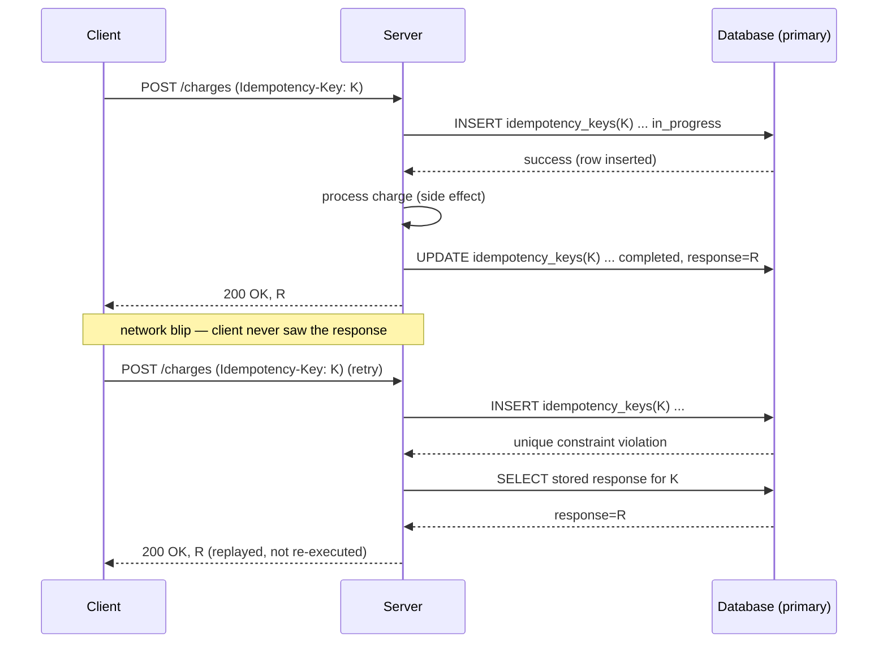

## Overview

A network is unreliable in a specific way: when a client sends a request and gets nothing back, it cannot tell whether the request was lost before it arrived, the server crashed mid-processing, or the response was lost on the way home. All three look identical from the caller's side — a timeout. Because the caller cannot distinguish "never happened" from "happened, but I don't know it," its only safe move is to retry, and that retry might land on a server that already executed the operation once. This is structural, not a bug to be fixed away: every operation exposed across a network boundary must tolerate being executed more than once for the identical input, or the system will eventually double-charge a card, double-ship an order, or double-count an event. Idempotency is the property that makes repetition safe.

## At-Least-Once Is the Default, Not a Choice

"Exactly-once delivery" is not achievable as a single network-level primitive, and it's worth being precise about why. A sender that wants a guarantee the receiver got a message has exactly one tool: retry until it sees an acknowledgment. That mechanism can only produce **at-least-once** delivery — it will never under-deliver (as long as it keeps retrying), but it can trivially over-deliver, because the ack itself can be lost after the work was already done. The opposite mechanism — send once, never retry — gives **at-most-once**: it will never over-deliver, but a lost request or a crashed server silently drops the operation with zero record of failure. There is no third mechanism that gives both properties for free; you cannot observe, from outside a black box across an unreliable network, whether "no response" means "didn't happen" or "happened, response lost."

What you *can* do is combine the two half-guarantees: retry aggressively for at-least-once (so nothing is silently dropped), and add a deduplication or idempotency check at the receiver for at-most-once (so a duplicate delivery has no additional effect). At-least-once + at-most-once = **effectively-once** — not exactly-once as a primitive, but a system that behaves like it processed everything exactly one time, as observed by the caller.

Martin Kleppmann makes this same decomposition precisely in *Designing Data-Intensive Applications* (2nd ed.), Chapter 11, "Stream Processing," in the section on exactly-once semantics. His argument is that a stream processor claiming "exactly-once" is not inventing a new network guarantee — it is doing one of two concrete things:

1. **Making the side effect idempotent**, so reprocessing a message after a crash-and-restart has no additional effect. The processor's job reduces to "guarantee at-least-once, and make the write itself indifferent to repetition."
2. **Wrapping the input offset commit and the output write in the same atomic transaction**, so "I consumed this message" and "I produced this effect" either both happen or neither does — this is how Kafka's transactional producer/consumer API and Kafka Streams implement exactly-once *within* a Kafka-to-Kafka pipeline, by committing the offset advance and the output write as one unit against the broker's transaction coordinator.

Both routes eliminate the possibility that "retry" and "double effect" happen together. Idempotency is the general-purpose version of that move — it works even without a transactional wrapper spanning both ends, which is the common case for anything crossing an HTTP boundary to a third party (a payment provider, a partner API) rather than staying inside one broker's transactional scope.

## Natural vs. Enforced Idempotency

Some operations are idempotent by construction — repeating them with the same input leaves the system in the same end state, with no special-casing required:

- `PUT /users/5 {"name": "Alex"}` — sets the resource to a fixed value; sending it three times leaves the same value as sending it once.
- `DELETE /orders/5` — the order is gone after the first call; subsequent calls find it already gone (assuming the API treats "already deleted" as success, not a 404 error, which is the detail that actually makes it idempotent in practice rather than just idempotent on paper).
- A SQL `UPSERT` (`INSERT ... ON CONFLICT (id) DO UPDATE`) — the row ends up with the same values regardless of how many times the statement runs.
- `SET x = 5` — as opposed to `x = x + 5`, which is not.

Other operations are not naturally idempotent because their effect is defined relative to the current state rather than as an absolute target state:

- `POST /charge {"amount": 10}` — every execution charges another $10; there is no natural notion of "the same charge" the server can recognize on repetition.
- `INCREMENT counter` — running it twice doubles the effect of running it once.
- Sending an email, publishing a domain event, appending to a ledger — anything whose entire point is "one more thing happened" rather than "the state is now X."

HTTP's method semantics track this distinction: `GET`, `PUT`, and `DELETE` are specified as idempotent, `POST` and `PATCH` are not. But that's a claim about intended semantics, not an enforced guarantee — a `PUT` handler that appends to an audit log as a side effect, or a `DELETE` that decrements a counter of "items remaining" rather than checking whether the item was already gone, is not actually idempotent no matter what the method name suggests. Naturally idempotent operations need nothing extra; operations that are naturally non-idempotent, or that only look idempotent until you check the side effects, need idempotency **enforced** on top — which is what the rest of this concept is about.

## Idempotency Keys: The Server-Side Mechanism

The standard mechanism for enforcing idempotency on an operation that isn't naturally idempotent is the **idempotency key**: the client generates a unique value (typically a UUID) *before* making the first attempt — not after seeing a failure — and sends it with every retry of that same logical operation, usually as a header:

```
POST /v1/charges
Idempotency-Key: 3f7d1b2e-9c04-4a55-b8e1-77a2d0c4e991
Content-Type: application/json

{"amount": 1000, "currency": "usd", "customer": "cus_8812"}
```

The server implementation needs no distributed coordination — it leans entirely on a database unique constraint:

```sql
CREATE TABLE idempotency_keys (
    key             UUID PRIMARY KEY,
    request_hash    TEXT NOT NULL,      -- hash of the request body, to detect key reuse with different params
    status          TEXT NOT NULL,      -- 'in_progress' | 'completed'
    response_body   JSONB,
    response_status INT,
    created_at      TIMESTAMPTZ NOT NULL DEFAULT now()
);
```

```java
@Transactional
public ChargeResponse charge(String idempotencyKey, ChargeRequest req) {
    Optional<IdempotencyRecord> existing = idempotencyRepo.findById(idempotencyKey);
    if (existing.isPresent()) {
        IdempotencyRecord rec = existing.get();
        if (!rec.getRequestHash().equals(hash(req))) {
            throw new IdempotencyKeyReusedException(idempotencyKey); // same key, different payload — reject
        }
        return rec.toResponse(); // replay the original result, do not re-execute
    }
    idempotencyRepo.insert(idempotencyKey, hash(req), "in_progress"); // fails on concurrent duplicate
    ChargeResponse result = processCharge(req);                       // the actual side effect
    idempotencyRepo.markCompleted(idempotencyKey, result);
    return result;
}
```

The first `INSERT` is the whole mechanism: it succeeds exactly once per key, and every subsequent attempt with that key fails the unique constraint and takes the "replay the stored result" branch instead of re-running `processCharge`. This is precisely how Stripe's API works — the [Idempotent requests](https://docs.stripe.com/api/idempotent_requests) documentation specifies exactly this contract, including that reusing a key with a *different* request body is a client error rather than silently executed. Brandur Leach's [write-up of the design](https://stripe.com/blog/idempotency) flags a point that's easy to get wrong operationally: the idempotency record must be read and written against the **primary**, never a read replica. A replica can lag by a few milliseconds — enough for a fast retry to miss a record just committed on the primary and re-execute the side effect, the exact failure the mechanism exists to prevent. Idempotency-key lookups are one of the few reads in a system that must never be routed to a replica for "performance."



A subtlety worth naming explicitly: a retry that arrives *while the first attempt is still `in_progress`* (a fast double-click, or a client that retries before the original request's own processing finished) needs a defined behavior too — typically a `409 Conflict` telling the caller to back off and retry later, since there's no completed result yet to replay and starting a second execution concurrently would defeat the whole point.

## Idempotent Consumers in Messaging

The same problem reappears in mirror image on the consuming side of an at-least-once message broker (Kafka, SQS, RabbitMQ with redelivery). A consumer that crashes before checkpointing its offset (or before acking, in a traditional broker) will receive that same message again on restart — this is exactly the cost of at-least-once delivery described in [message brokers: queues vs. log-based streaming](message-brokers-queues-vs-logs), not a broker bug. If the consumer's handler has a side effect — incrementing a balance, sending an email, inserting a row — redelivery runs that side effect twice unless the consumer is written to tolerate it.

The fix mirrors the idempotency-key mechanism, applied to a message instead of an HTTP request: dedupe by a stable message identifier. Two common shapes:

- **Track processed ids.** Keep a table (or a broker-provided exactly-once feature, where available) of message ids already handled; on receipt, check membership before running the handler, and insert the id atomically with the handler's own write.
- **Make the write itself an idempotent upsert keyed by the message's id**, so redelivery just re-applies the same write with the same result — no separate dedup table needed. `INSERT INTO order_events (event_id, order_id, status) VALUES (...) ON CONFLICT (event_id) DO NOTHING` is the SQL shape of this; it composes naturally with [the transactional outbox pattern](outbox-pattern), which already generates a stable id per event at write time specifically so the consumer has something to dedupe on.

The key design constraint is that the dedup check and the side-effect write must be atomic with each other — checking "have I seen this id?" and then separately performing the write leaves a window where a crash between the two re-introduces the exact race the mechanism was meant to close. A single `INSERT ... ON CONFLICT` (or a single transaction covering both the processed-ids table and the business write) closes that window; two separate statements do not.

## What Breaks Idempotency in Practice

- **Side effects hidden behind an apparently idempotent operation.** A `PUT` that also increments an audit counter, or a `DELETE` that decrements an "items remaining" gauge without checking whether the row was already gone, is not idempotent regardless of the HTTP verb — every observable effect has to be checked, not just the primary write.
- **Keys generated after a failure instead of before the first attempt.** If the client only creates a key when it decides to retry, the first attempt and the retry carry different keys and the server has no way to link them.
- **Reading the idempotency record from a lagging replica.** The single most common way a "correctly implemented" mechanism still lets a duplicate through in production — the lag is intermittent and small, rare enough to pass review, common enough to matter at scale.
- **Non-atomic dedup-check-then-write in a message consumer.** Checking for a duplicate and performing the effect as two separate operations reopens the exact race the check was meant to close.

## Idempotency Key Lifetime: A Real Trade-off

Idempotency records can't live forever for free, and they can't expire too soon either. Storing every key indefinitely means an ever-growing table with no natural bound — fine at low volume, a real capacity-planning problem at Stripe-scale transaction rates. Expiring keys quickly (say, minutes) reclaims space but reintroduces exactly the failure mode idempotency exists to prevent: a client that retries after a longer-than-expected delay — a mobile client that lost connectivity and resumed hours later, a batch job's delayed retry — finds its key gone and its "retry" gets processed as a brand-new operation. Stripe's own documented behavior retains idempotency keys for 24 hours, which is long enough to cover realistic retry windows without unbounded growth; the underlying decision is a genuine trade-off between storage cost and the retry window a system is willing to guarantee, not a value with one obviously correct answer.

## Trade-offs

- **Idempotency shifts complexity from "hope it doesn't happen" to explicit, testable state.** An idempotency-key table or a consumer-side dedup check is more code and more storage than doing nothing, but it converts an intermittent, hard-to-reproduce double-charge bug into a deterministic, unit-testable code path.
- **Natural idempotency is nearly free; enforced idempotency is not.** Designing an API around `PUT`-style "set to this state" semantics wherever the domain allows it avoids the entire idempotency-key machinery. Where the domain genuinely requires an incrementing or event-like operation (a charge, a shipment), the machinery is unavoidable — there's no way to make "charge $10" naturally idempotent without changing what the operation means.
- **The primary-only read requirement caps how far idempotency checks can be scaled with read replicas.** This is a direct cost: the exact technique (read replicas) normally used to scale read-heavy paths is unsafe for the one read that most needs correctness over throughput.
- **Key retention window is a genuine trade-off, not a bug to be optimized away.** Longer retention protects more legitimately-delayed retries at higher storage cost; shorter retention saves storage but silently reclassifies a slow retry as a new request. There's no expiry value that's correct for every client population.
- **Idempotency does not by itself provide ordering or exactly-once side effects across a chain of systems.** A single idempotent operation is safe to repeat; a multi-step workflow of several idempotent calls can still leave the system in an inconsistent intermediate state if it's interrupted partway through — that's the problem [the saga pattern](saga-pattern) addresses, and idempotency is a prerequisite for it, not a substitute.

## Interview Questions

- Why is "exactly-once delivery" not achievable as a single network primitive, and what two properties does it actually decompose into?
- Design the schema and request flow for an idempotency-key mechanism on a `POST /charges` endpoint. What happens if the same key arrives with a different request body? What happens if a second request with the same key arrives while the first is still processing?
- Why must an idempotency-key lookup be served from the primary database rather than a read replica? What specifically goes wrong if it isn't?
- A Kafka consumer increments a user's balance for every `PaymentReceived` event it processes. The consumer crashes after updating the balance but before committing its offset. What happens on restart, and how would you make the balance update safe against that?
- Is `DELETE /resource/5` idempotent if it returns `404 Not Found` on the second call? Why or why not, and how would you fix it?
- What's the operational trade-off in choosing how long to retain idempotency-key records, and what failure mode does each side of that trade-off produce?

## References

- [Martin Kleppmann, "Designing Data-Intensive Applications" (O'Reilly, 2017)](https://www.oreilly.com/library/view/designing-data-intensive-applications/9781098119058/) — Chapter 11, "Stream Processing," section on exactly-once semantics.
- [Stripe, "Idempotent requests" (Stripe API Reference)](https://docs.stripe.com/api/idempotent_requests) — the documented contract for idempotency keys, including request-hash mismatch handling and the 24-hour retention window.
- [Brandur Leach (Stripe), "Designing robust and predictable APIs with idempotency"](https://stripe.com/blog/idempotency) — the primary-vs-replica read requirement and the reasoning behind the unique-constraint-based design.
- [Malcolm Featonby, "Making retries safe with idempotent APIs" (Amazon Builders' Library, 2021)](https://aws.amazon.com/builders-library/making-retries-safe-with-idempotent-apis/) — client-request-token design and the recommendation to reject a reused token with mismatched parameters rather than silently execute it.
