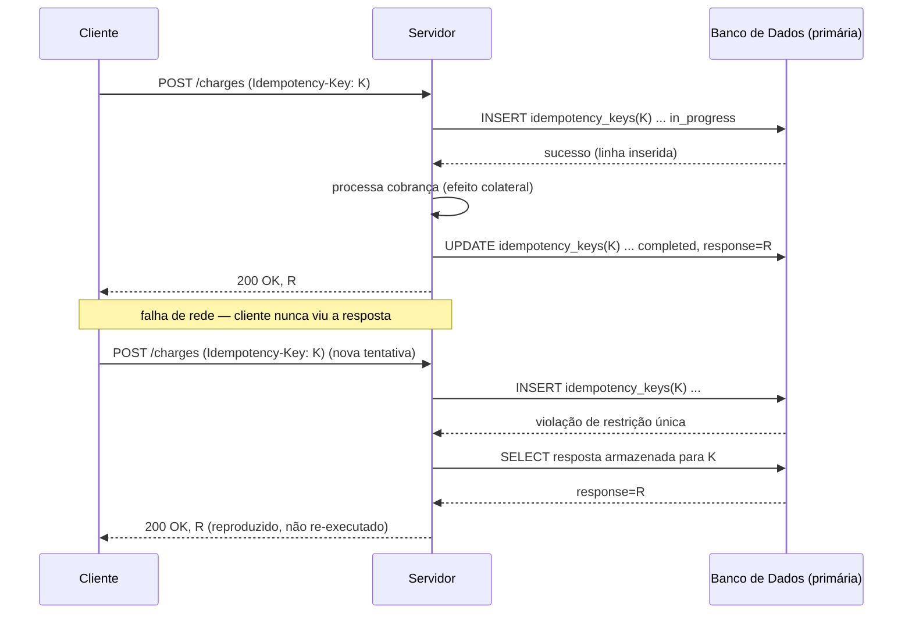

## Visão Geral

Uma rede é não confiável de uma forma específica: quando um cliente envia uma requisição e não recebe nada de volta, ele não consegue dizer se a requisição se perdeu antes de chegar, o servidor travou no meio do processamento, ou a resposta se perdeu no caminho de volta. As três parecem idênticas do lado de quem chama — um timeout. Como quem chama não consegue distinguir "nunca aconteceu" de "aconteceu, mas eu não sei", sua única jogada segura é tentar de novo, e essa nova tentativa pode cair em um servidor que já executou a operação uma vez. Isso é estrutural, não um bug a ser corrigido: toda operação exposta através de uma fronteira de rede precisa tolerar ser executada mais de uma vez para a mesma entrada, ou o sistema eventualmente vai cobrar duas vezes um cartão, enviar um pedido duas vezes, ou contar um evento duas vezes. Idempotência é a propriedade que torna a repetição segura.

## Pelo Menos Uma Vez É o Padrão, Não uma Escolha

"Entrega exatamente uma vez" não é alcançável como uma única primitiva em nível de rede, e vale a pena ser preciso sobre o porquê. Um remetente que quer uma garantia de que o receptor recebeu uma mensagem tem exatamente uma ferramenta: tentar de novo até ver uma confirmação. Esse mecanismo só pode produzir entrega **pelo menos uma vez** — nunca vai sub-entregar (desde que continue tentando), mas pode trivialmente sobre-entregar, porque a própria confirmação pode se perder depois que o trabalho já foi feito. O mecanismo oposto — enviar uma vez, nunca tentar de novo — dá **no máximo uma vez**: nunca vai sobre-entregar, mas uma requisição perdida ou um servidor que travou silenciosamente descarta a operação sem nenhum registro de falha. Não existe um terceiro mecanismo que dê ambas as propriedades de graça; você não consegue observar, de fora de uma caixa preta através de uma rede não confiável, se "sem resposta" significa "não aconteceu" ou "aconteceu, resposta perdida".

O que você *pode* fazer é combinar as duas meias-garantias: tentar de novo agressivamente para pelo menos-uma-vez (para que nada seja descartado silenciosamente), e adicionar uma verificação de deduplicação ou idempotência no receptor para no máximo-uma-vez (para que uma entrega duplicada não tenha efeito adicional). Pelo menos uma vez + no máximo uma vez = **efetivamente uma vez** — não exatamente-uma-vez como primitiva, mas um sistema que se comporta como se tivesse processado tudo exatamente uma vez, do ponto de vista de quem chama.

Martin Kleppmann faz exatamente essa mesma decomposição em *Designing Data-Intensive Applications* (2ª ed.), Capítulo 11, "Stream Processing," na seção sobre semântica de exatamente-uma-vez. Seu argumento é que um processador de streams que alega "exatamente uma vez" não está inventando uma nova garantia de rede — está fazendo uma de duas coisas concretas:

1. **Tornando o efeito colateral idempotente**, para que reprocessar uma mensagem após um crash e reinício não tenha efeito adicional. O trabalho do processador se reduz a "garantir pelo menos-uma-vez, e tornar a própria escrita indiferente à repetição."
2. **Envolvendo o commit do offset de entrada e a escrita de saída na mesma transação atômica**, para que "eu consumi esta mensagem" e "eu produzi este efeito" ou ambos aconteçam ou nenhum acontece — é assim que a API transacional produtor/consumidor do Kafka e o Kafka Streams implementam exatamente-uma-vez *dentro* de um pipeline Kafka-para-Kafka, fazendo commit do avanço do offset e da escrita de saída como uma unidade contra o coordenador de transação do broker.

Ambos os caminhos eliminam a possibilidade de "tentar de novo" e "efeito duplo" acontecerem juntos. Idempotência é a versão de propósito geral dessa jogada — funciona mesmo sem um invólucro transacional abrangendo ambas as pontas, o que é o caso comum para qualquer coisa que cruza uma fronteira HTTP para um terceiro (um provedor de pagamento, uma API parceira) em vez de permanecer dentro do escopo transacional de um único broker.

## Idempotência Natural vs. Forçada

Algumas operações são idempotentes por construção — repeti-las com a mesma entrada deixa o sistema no mesmo estado final, sem necessidade de tratamento especial:

- `PUT /users/5 {"name": "Alex"}` — define o recurso para um valor fixo; enviá-lo três vezes deixa o mesmo valor que enviá-lo uma vez.
- `DELETE /orders/5` — o pedido some após a primeira chamada; chamadas subsequentes o encontram já sumido (assumindo que a API trata "já excluído" como sucesso, não um erro 404, que é o detalhe que realmente a torna idempotente na prática, e não apenas idempotente no papel).
- Um `UPSERT` SQL (`INSERT ... ON CONFLICT (id) DO UPDATE`) — a linha termina com os mesmos valores independentemente de quantas vezes a instrução roda.
- `SET x = 5` — em oposição a `x = x + 5`, que não é.

Outras operações não são naturalmente idempotentes porque seu efeito é definido em relação ao estado atual em vez de como um estado alvo absoluto:

- `POST /charge {"amount": 10}` — toda execução cobra outros $10; não há noção natural de "a mesma cobrança" que o servidor possa reconhecer na repetição.
- `INCREMENT counter` — rodá-lo duas vezes dobra o efeito de rodá-lo uma vez.
- Enviar um e-mail, publicar um evento de domínio, adicionar a um ledger — qualquer coisa cujo ponto inteiro é "mais uma coisa aconteceu" em vez de "o estado agora é X".

A semântica de métodos do HTTP acompanha essa distinção: `GET`, `PUT` e `DELETE` são especificados como idempotentes, `POST` e `PATCH` não são. Mas isso é uma afirmação sobre semântica pretendida, não uma garantia forçada — um handler `PUT` que também adiciona a um log de auditoria como efeito colateral, ou um `DELETE` que decrementa um contador de "itens restantes" em vez de verificar se o item já tinha sumido, não é realmente idempotente não importa o que o nome do método sugira. Operações naturalmente idempotentes não precisam de nada extra; operações que são naturalmente não idempotentes, ou que só parecem idempotentes até você checar os efeitos colaterais, precisam de idempotência **forçada** por cima — o que é sobre o que trata o resto deste conceito.

## Chaves de Idempotência: O Mecanismo do Lado do Servidor

O mecanismo padrão para forçar idempotência em uma operação que não é naturalmente idempotente é a **chave de idempotência**: o cliente gera um valor único (tipicamente um UUID) *antes* de fazer a primeira tentativa — não depois de ver uma falha — e a envia com toda nova tentativa dessa mesma operação lógica, geralmente como um cabeçalho:

```
POST /v1/charges
Idempotency-Key: 3f7d1b2e-9c04-4a55-b8e1-77a2d0c4e991
Content-Type: application/json

{"amount": 1000, "currency": "usd", "customer": "cus_8812"}
```

A implementação do servidor não precisa de nenhuma coordenação distribuída — se apoia inteiramente em uma restrição única do banco de dados:

```sql
CREATE TABLE idempotency_keys (
    key             UUID PRIMARY KEY,
    request_hash    TEXT NOT NULL,      -- hash do corpo da requisição, para detectar reuso de chave com params diferentes
    status          TEXT NOT NULL,      -- 'in_progress' | 'completed'
    response_body   JSONB,
    response_status INT,
    created_at      TIMESTAMPTZ NOT NULL DEFAULT now()
);
```

```java
@Transactional
public ChargeResponse charge(String idempotencyKey, ChargeRequest req) {
    Optional<IdempotencyRecord> existing = idempotencyRepo.findById(idempotencyKey);
    if (existing.isPresent()) {
        IdempotencyRecord rec = existing.get();
        if (!rec.getRequestHash().equals(hash(req))) {
            throw new IdempotencyKeyReusedException(idempotencyKey); // mesma chave, payload diferente — rejeita
        }
        return rec.toResponse(); // reproduz o resultado original, não re-executa
    }
    idempotencyRepo.insert(idempotencyKey, hash(req), "in_progress"); // falha em duplicata concorrente
    ChargeResponse result = processCharge(req);                       // o efeito colateral real
    idempotencyRepo.markCompleted(idempotencyKey, result);
    return result;
}
```

O primeiro `INSERT` é o mecanismo inteiro: ele tem sucesso exatamente uma vez por chave, e toda tentativa subsequente com essa chave falha a restrição única e segue o ramo "reproduz o resultado armazenado" em vez de re-executar `processCharge`. É exatamente assim que a API da Stripe funciona — a documentação de [Idempotent requests](https://docs.stripe.com/api/idempotent_requests) especifica exatamente esse contrato, incluindo que reusar uma chave com um corpo de requisição *diferente* é um erro do cliente em vez de silenciosamente executado. O relato de Brandur Leach [sobre o design](https://stripe.com/blog/idempotency) sinaliza um ponto fácil de errar operacionalmente: o registro de idempotência precisa ser lido e escrito contra a **primária**, nunca uma réplica de leitura. Uma réplica pode atrasar por alguns milissegundos — suficiente para uma nova tentativa rápida não encontrar um registro recém-confirmado na primária e re-executar o efeito colateral, exatamente a falha que o mecanismo existe para prevenir. Buscas por chave de idempotência são uma das poucas leituras em um sistema que nunca devem ser roteadas para uma réplica por "performance".



Uma sutileza que vale a pena nomear explicitamente: uma nova tentativa que chega *enquanto a primeira tentativa ainda está `in_progress`* (um duplo clique rápido, ou um cliente que tenta de novo antes do próprio processamento da requisição original ter terminado) também precisa de um comportamento definido — tipicamente um `409 Conflict` dizendo ao chamador para recuar e tentar depois, já que não há resultado completado ainda para reproduzir e iniciar uma segunda execução concorrentemente derrotaria o propósito inteiro.

## Consumidores Idempotentes em Mensageria

O mesmo problema reaparece em imagem espelhada no lado consumidor de um broker de mensagens pelo menos-uma-vez (Kafka, SQS, RabbitMQ com reentrega). Um consumidor que trava antes de fazer checkpoint do seu offset (ou antes de confirmar recebimento, em um broker tradicional) vai receber essa mesma mensagem de novo no reinício — este é exatamente o custo da entrega pelo menos-uma-vez descrito em [message brokers: queues vs. log-based streaming](message-brokers-queues-vs-logs), não um bug do broker. Se o handler do consumidor tem um efeito colateral — incrementar um saldo, enviar um e-mail, inserir uma linha — a reentrega roda esse efeito colateral duas vezes a menos que o consumidor seja escrito para tolerá-lo.

A correção espelha o mecanismo de chave de idempotência, aplicado a uma mensagem em vez de uma requisição HTTP: deduplicar por um identificador estável de mensagem. Duas formas comuns:

- **Rastrear ids processados.** Manter uma tabela (ou um recurso de exatamente-uma-vez fornecido pelo broker, onde disponível) de ids de mensagem já tratados; ao receber, verificar a associação antes de rodar o handler, e inserir o id atomicamente com a própria escrita do handler.
- **Tornar a própria escrita um upsert idempotente chaveado pelo id da mensagem**, para que a reentrega apenas reaplique a mesma escrita com o mesmo resultado — sem necessidade de tabela de dedup separada. `INSERT INTO order_events (event_id, order_id, status) VALUES (...) ON CONFLICT (event_id) DO NOTHING` é a forma SQL disso; compõe-se naturalmente com [o padrão outbox transacional](outbox-pattern), que já gera um id estável por evento no momento da escrita especificamente para que o consumidor tenha algo para deduplicar.

A restrição chave de design é que a verificação de dedup e a escrita do efeito colateral precisam ser atômicas entre si — verificar "eu já vi este id?" e depois separadamente realizar a escrita deixa uma janela onde um crash entre os dois reintroduz exatamente a corrida que o mecanismo deveria fechar. Um único `INSERT ... ON CONFLICT` (ou uma única transação cobrindo tanto a tabela de ids processados quanto a escrita de negócio) fecha essa janela; duas instruções separadas não fecham.

## O Que Quebra Idempotência na Prática

- **Efeitos colaterais escondidos atrás de uma operação aparentemente idempotente.** Um `PUT` que também incrementa um contador de auditoria, ou um `DELETE` que decrementa um medidor de "itens restantes" sem verificar se a linha já tinha sumido, não é idempotente independentemente do verbo HTTP — todo efeito observável precisa ser verificado, não apenas a escrita primária.
- **Chaves geradas depois de uma falha em vez de antes da primeira tentativa.** Se o cliente só cria uma chave quando decide tentar de novo, a primeira tentativa e a nova tentativa carregam chaves diferentes e o servidor não tem como ligá-las.
- **Ler o registro de idempotência de uma réplica atrasada.** A forma mais comum de um mecanismo "corretamente implementado" ainda deixar um duplicado passar em produção — o atraso é intermitente e pequeno, raro o suficiente para passar em revisão, comum o suficiente para importar em escala.
- **Verificação-de-dedup-então-escrita não atômica em um consumidor de mensagens.** Verificar por uma duplicata e realizar o efeito como duas operações separadas reabre exatamente a corrida que a verificação deveria fechar.

## Tempo de Vida da Chave de Idempotência: Um Trade-off Real

Registros de idempotência não podem viver para sempre de graça, e também não podem expirar cedo demais. Armazenar toda chave indefinidamente significa uma tabela sempre crescente sem limite natural — bem em baixo volume, um problema real de planejamento de capacidade em taxas de transação na escala da Stripe. Expirar chaves rapidamente (digamos, minutos) recupera espaço mas reintroduz exatamente o modo de falha que a idempotência existe para prevenir: um cliente que tenta de novo após um atraso maior que o esperado — um cliente móvel que perdeu conectividade e retomou horas depois, a nova tentativa atrasada de um job em lote — encontra sua chave sumida e sua "nova tentativa" é processada como uma operação completamente nova. O comportamento documentado da própria Stripe retém chaves de idempotência por 24 horas, o que é longo o suficiente para cobrir janelas realistas de nova tentativa sem crescimento ilimitado; a decisão subjacente é um trade-off genuíno entre custo de armazenamento e a janela de nova tentativa que um sistema está disposto a garantir, não um valor com uma resposta obviamente correta.

## Trade-offs

- **Idempotência desloca complexidade de "espero que não aconteça" para estado explícito e testável.** Uma tabela de chave de idempotência ou uma verificação de dedup do lado do consumidor é mais código e mais armazenamento do que não fazer nada, mas converte um bug intermitente e difícil de reproduzir de cobrança dupla em um caminho de código determinístico e testável por unidade.
- **Idempotência natural é quase de graça; idempotência forçada não é.** Projetar uma API em torno de semântica estilo `PUT` de "definir para este estado" onde o domínio permite evita toda a maquinaria de chave de idempotência. Onde o domínio genuinamente requer uma operação incremental ou do tipo evento (uma cobrança, um envio), a maquinaria é inevitável — não há como tornar "cobre $10" naturalmente idempotente sem mudar o que a operação significa.
- **O requisito de leitura apenas-da-primária limita quão longe verificações de idempotência podem ser escaladas com réplicas de leitura.** Isso é um custo direto: exatamente a técnica (réplicas de leitura) normalmente usada para escalar caminhos intensivos em leitura é insegura para a única leitura que mais precisa de correção sobre throughput.
- **A janela de retenção de chave é um trade-off genuíno, não um bug a ser otimizado.** Retenção mais longa protege mais novas tentativas legitimamente atrasadas a um custo de armazenamento maior; retenção mais curta economiza armazenamento mas silenciosamente reclassifica uma nova tentativa lenta como uma requisição nova. Não há valor de expiração correto para toda população de clientes.
- **Idempotência por si só não fornece ordenação ou efeitos colaterais exatamente-uma-vez através de uma cadeia de sistemas.** Uma única operação idempotente é segura para repetir; um workflow de múltiplos passos de várias chamadas idempotentes ainda pode deixar o sistema em um estado intermediário inconsistente se for interrompido no meio do caminho — esse é o problema que [o padrão saga](saga-pattern) aborda, e idempotência é um pré-requisito para ele, não um substituto.

## Perguntas de Entrevista

- Por que "entrega exatamente uma vez" não é alcançável como uma única primitiva de rede, e em quais duas propriedades ela realmente se decompõe?
- Projete o esquema e o fluxo de requisição para um mecanismo de chave de idempotência em um endpoint `POST /charges`. O que acontece se a mesma chave chegar com um corpo de requisição diferente? O que acontece se uma segunda requisição com a mesma chave chegar enquanto a primeira ainda está sendo processada?
- Por que uma busca por chave de idempotência deve ser servida do banco de dados primário em vez de uma réplica de leitura? O que especificamente dá errado se não for?
- Um consumidor Kafka incrementa o saldo de um usuário para cada evento `PaymentReceived` que processa. O consumidor trava depois de atualizar o saldo mas antes de fazer commit do seu offset. O que acontece no reinício, e como você tornaria a atualização de saldo segura contra isso?
- `DELETE /resource/5` é idempotente se retorna `404 Not Found` na segunda chamada? Por que ou por que não, e como você o corrigiria?
- Qual é o trade-off operacional em escolher por quanto tempo reter registros de chave de idempotência, e qual modo de falha cada lado desse trade-off produz?

## Referências

- [Martin Kleppmann, "Designing Data-Intensive Applications" (O'Reilly, 2017)](https://www.oreilly.com/library/view/designing-data-intensive-applications/9781098119058/) — Capítulo 11, "Stream Processing," seção sobre semântica de exatamente-uma-vez.
- [Stripe, "Idempotent requests" (Stripe API Reference)](https://docs.stripe.com/api/idempotent_requests) — o contrato documentado para chaves de idempotência, incluindo tratamento de incompatibilidade de hash de requisição e a janela de retenção de 24 horas.
- [Brandur Leach (Stripe), "Designing robust and predictable APIs with idempotency"](https://stripe.com/blog/idempotency) — o requisito de leitura primária-vs-réplica e o raciocínio por trás do design baseado em restrição única.
- [Malcolm Featonby, "Making retries safe with idempotent APIs" (Amazon Builders' Library, 2021)](https://aws.amazon.com/builders-library/making-retries-safe-with-idempotent-apis/) — design de token de requisição do cliente e a recomendação de rejeitar um token reusado com parâmetros incompatíveis em vez de silenciosamente executá-lo.
</content>
