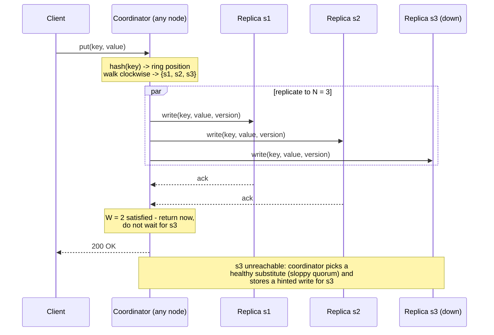

## Overview

"Design a key-value store" is a classic interview prompt because the API is trivially small — `put(key, value)` and `get(key)` — while everything interesting lives underneath it. There is no schema to argue about and no business logic to hide behind, so the entire session is spent on distributed systems fundamentals: how the keyspace is split, how many copies of each key exist, what "successful write" means when only some replicas answered, and what happens when a node dies mid-write. In practice you are being asked to build a mini Dynamo/Cassandra, and the interviewer is checking whether you can name and justify each mechanism rather than gesture at "we'd use a NoSQL database."

## Functional Requirements

The surface area is deliberately tiny:

- `put(key, value)` — insert or overwrite the value associated with a key.
- `get(key)` — return the value for a key.
- Values are **opaque blobs** to the store: strings, serialized objects, small binaries. No secondary indexes, no range scans, no joins, no server-side query language. If a caller needs "all users in Brazil," that is a different system.
- **Tunable consistency** is itself a functional requirement here: the same cluster must be able to serve a fast-read workload and a strongly-consistent workload by changing per-request parameters, not by being redeployed.

Explicitly out of scope: transactions across multiple keys, ACID guarantees, and anything requiring a global order of operations. Saying so early prevents twenty minutes of accidental scope creep into a distributed database design.

## Non-Functional Requirements and Sizing

Every quality attribute should be pinned to a number you state out loud:

- **Small values** — a key-value pair is under 10 KB. This assumption is load-bearing: it means a value fits in a single network packet's worth of payload, values can be replicated whole rather than chunked, and nothing needs to be streamed. Blobs larger than that belong in [object storage](object-storage-and-direct-upload) with only the pointer stored here.
- **Big data** — assume 10 billion keys at ~1 KB average value, so ~10 TB of logical data. At a replication factor of 3, that's ~30 TB of physical storage plus compaction headroom; on 4 TB nodes that's roughly a 12-node cluster before you count growth or hot-spot slack.
- **Throughput** — 1,000,000 read QPS and 100,000 write QPS is a reasonable target for a store fronting a large consumer product (a 10:1 read/write ratio). Spread over 12 nodes with RF=3, each node handles on the order of 250k reads/sec of replica traffic — which is why the node-local storage engine matters as much as the cluster topology.
- **Latency** — single-key `get` at p99 under 10 ms and `put` at p99 under 20 ms, measured at the coordinator. These numbers are what kill any design that requires cross-node consensus on the write path.
- **High availability** — the store keeps answering during node failure, rack failure, and full data-center loss. Target 99.99% availability for reads.
- **Automatic scaling and heterogeneity** — adding or removing a node should be an operational non-event, and a node with twice the disk should carry twice the data.

The tension between the last two bullets and the latency target is the whole design. Sub-10 ms p99 with survivability across data centers rules out a coordinator that waits for every replica, which is precisely why quorums exist.

## Single Server, and Why It Ends

A single-node key-value store is a hash table: O(1) lookup, everything in memory. Compression buys some room and demoting cold keys to disk buys more, but 10 TB does not fit on one machine, and one machine is one power supply away from total unavailability. Both the capacity requirement and the availability requirement independently force a distributed design — worth saying out loud, because it frames every later decision as "we already accepted the network."

## Data Partitioning

Splitting 10 TB across nodes has two requirements: distribute keys evenly, and move as little data as possible when the cluster changes size. Naive `hash(key) % N` fails the second requirement catastrophically — changing `N` remaps nearly every key. The answer is [Consistent Hashing](consistent-hashing): nodes are placed on a hash ring, a key hashes to a position on the same ring, and it belongs to the first node found walking clockwise. Adding or removing a node only relocates the keys in the arc that changed hands.

Two properties of consistent hashing map directly onto our non-functional requirements: **automatic scaling**, because a joining node claims its arcs without a global reshuffle, and **heterogeneity**, because a node's share of the ring is set by how many virtual nodes it owns — give a 8 TB machine twice the virtual nodes of a 4 TB one and it takes twice the data.

## Replication

For a key mapped to a ring position, walk clockwise and copy it to the first **N** distinct nodes, where N is a configurable replication factor (N = 3 is the standard starting point). "Distinct" is the subtlety: with virtual nodes, the next three positions on the ring can belong to the same physical machine, which would give you three copies on one box and zero redundancy. The walk must skip virtual nodes whose physical owner is already in the replica set.

Failure domains extend the same logic outward. Nodes in one rack share a top-of-rack switch and a power feed; nodes in one data center share a region. A rack-aware or DC-aware placement strategy — walk the ring but skip candidates whose rack or data center is already represented — turns a correlated failure into a survivable one. Replicating across data centers is what makes the "survive a full DC outage" requirement real, at the cost of cross-region write latency that pushes you toward asynchronous replication for the remote copies.

## Tunable Consistency: N, W, and R

Once a key lives on N nodes, "the write succeeded" needs a definition. **Quorum consensus** provides it with three numbers:

- **N** — the number of replicas for a key.
- **W** — the write quorum: how many replicas must acknowledge before the coordinator reports success to the client.
- **R** — the read quorum: how many replicas must respond before the coordinator returns a value.

`W = 1` does not mean the data lives on one node — the coordinator still sends the write to all N replicas. It means the coordinator returns as soon as one acknowledgement arrives and lets the rest complete in the background. W and R are latency knobs: a higher quorum means waiting on a slower replica, since the coordinator is always bounded by the W-th fastest responder.

The rule that matters is **W + R > N**. When the read set and the write set must overlap by at least one node, every read is guaranteed to touch a replica that saw the latest acknowledged write, so the coordinator can pick the newest version and return it. Common configurations:

| Config (N = 3) | W + R | Property |
|---|---|---|
| W = 3, R = 1 | 4 | Fast reads, expensive and fragile writes (any replica down blocks writes) |
| W = 1, R = 3 | 4 | Fast writes, expensive reads |
| W = 2, R = 2 | 4 | Balanced; the standard "strong-ish" default |
| W = 1, R = 1 | 2 | Lowest latency, eventual consistency only |

This is the [CAP Theorem](cap-theorem) trade-off made adjustable per request rather than decided once for the whole system. With `W + R > N` and a strict quorum, a partition that leaves fewer than W reachable replicas makes writes fail — you have chosen CP for that operation. With `W = R = 1`, the same partition still accepts writes and still serves reads, possibly stale — AP. Dynamo and Cassandra default to the AP end and let the caller pay for consistency where it matters, which suits a store whose availability target is 99.99%.

Note also what quorums are *not*: `W + R > N` gives you overlap, not linearizability. Concurrent writes, a coordinator crash between replica acknowledgements, or sloppy quorum (below) can all leave the guarantee weaker than it looks. If you need genuine consensus — leader election, locks, cluster membership decisions — that belongs in a [coordination service](consensus-and-coordination-services), not in the data path of a key-value store.

## Consistency Models and Conflict Resolution

The spectrum runs from **strong consistency** (every read returns the latest write) through **weak** to **eventual consistency** (given no new writes, replicas converge). Strong consistency is usually implemented by refusing reads and writes until all replicas agree, which directly contradicts the availability requirement — so eventual consistency is the working model, with quorums layered on top for callers that need more.

Eventual consistency admits conflicting versions, so the store needs a way to tell "newer" from "concurrent." Two approaches:

**Last-write-wins (LWW)** attaches a timestamp to each write and keeps the highest. It is trivial and it is what Cassandra does by default — and it silently discards one of two concurrent writes, and it trusts clocks. Clock skew between nodes means the "latest" write can be the one that happened first (see [The Trouble with Distributed Systems](distributed-systems-partial-failures) for why wall-clock timestamps are a poor ordering primitive).

**Vector clocks** track causality instead of time. Each version carries a set of `[server, counter]` pairs; a write handled by server `Sx` increments `Sx`'s counter or adds `[Sx, 1]`. Version X is an ancestor of version Y (no conflict — Y wins) if every counter in X is less than or equal to its counterpart in Y. If X has a counter greater than Y's for one server while Y has a greater counter for another, the two are **siblings**: a genuine concurrent conflict that the system cannot resolve on its own.

```
D1([Sx, 1])                  client writes, handled by Sx
D2([Sx, 2])                  read D1, update, write back via Sx -> descends from D1
D3([Sx, 2], [Sy, 1])         read D2, update, write via Sy
D4([Sx, 2], [Sz, 1])         read D2, update, write via Sz  -> sibling of D3
D5([Sx, 3], [Sy, 1], [Sz,1]) client reconciles D3 and D4, writes result
```

The cost is real: the client (or an application-level merge function) has to implement reconciliation, and the vector grows with the number of servers that ever coordinated a write for that key. Truncating the oldest pairs past a threshold bounds the size but can make the descendant relationship undecidable — a trade Amazon reported never actually hitting in production.

## The Write Path

A **coordinator** — any node in the ring, typically the one the client's request landed on — acts as proxy for the operation. It hashes the key, computes the N replicas, dispatches the write, and returns once W acknowledgements arrive.



On each replica, the local write is append-first: the record is persisted to a **commit log** on disk, then applied to an in-memory table (memtable). When the memtable exceeds a threshold, it is flushed to an immutable, sorted **SSTable** on disk. Nothing is ever updated in place, which is what makes writes cheap — a sequential log append plus a memory write — and why this family of engines is called log-structured. Background compaction merges SSTables and drops superseded versions.

The read path mirrors it: check the memtable; on a miss, consult a **Bloom filter** per SSTable to skip the files that definitely do not contain the key, read the candidates, and merge the results by version. The Bloom filter's false positives cost a wasted disk read; its guaranteed absence of false negatives is what makes it safe to skip files entirely.

## Failure Detection: Gossip

One node's opinion that another is down is not evidence — a timeout means "no response," which is indistinguishable from a slow network or a GC pause. All-to-all heartbeating gives you independent confirmation but costs O(n²) messages.

**Gossip protocol** decentralizes it. Each node keeps a membership list of `[member id, heartbeat counter]`, periodically increments its own counter, and periodically sends its list to a few randomly chosen peers, who merge it into theirs and pass it on. Information about any node reaches the whole cluster in O(log n) rounds with constant per-node message cost. If a node's counter has not advanced for longer than a threshold, and other nodes independently corroborate it, the node is marked down and that fact spreads the same way.

## Handling Temporary Failures: Sloppy Quorum and Hinted Handoff

A strict quorum blocks writes as soon as fewer than W of a key's N replicas are reachable — correct, but it trades away the availability the design is built around. **Sloppy quorum** relaxes it: instead of requiring the *designated* replicas, the coordinator takes the first W healthy nodes it finds walking the ring, skipping the ones that are down. The write succeeds against a substitute node.

The substitute stores the data with a **hint** recording which node it actually belongs to. When the intended replica comes back, the substitute replays the hinted writes to it and deletes its local copy — **hinted handoff**. This makes a brief node outage or rolling restart invisible to clients, at the cost of a window in which a read against the designated replicas can miss data that a write already acknowledged. Sloppy quorum is exactly the mechanism that breaks the clean `W + R > N` guarantee, and knowing that is the point of the question.

## Handling Permanent Failures: Merkle Trees

Hinted handoff assumes the node returns. A node whose disk is gone, or which was down longer than hints are retained, needs a full reconciliation against its peers — an **anti-entropy** repair. Comparing every key is prohibitive, so replicas compare **Merkle trees** instead.

Each replica partitions its keyspace into buckets, hashes the keys in each bucket, and builds a tree upward where every non-leaf node is the hash of its children. Two replicas compare root hashes first: if they match, the data is identical and nothing is transferred. If they differ, they descend only into the subtrees whose hashes disagree, until they identify the specific buckets that diverge — and sync only those. The volume of data exchanged is proportional to the *difference* between replicas, not to the amount of data they hold. Bucket sizing controls the granularity; a common configuration is one million buckets per billion keys, so a mismatch localizes to about 1,000 keys.

## Handling Data Center Outages

Cross-data-center replication is what makes a regional failure survivable, and it changes the quorum arithmetic. A quorum that spans regions pays inter-region round trips on every write — often 50-150 ms, well past the latency budget. The usual compromise is a **local quorum**: W and R are satisfied by replicas within the client's own data center, while remote replicas are updated asynchronously. Reads served from the local region stay fast; a region loss can lose the small window of writes that had not yet propagated. That window, not the mechanism, is the number to negotiate with the interviewer.

## Summary: Requirement to Technique

| Goal | Technique |
|---|---|
| Store big data, scale incrementally, handle heterogeneous nodes | Consistent hashing with virtual nodes |
| High availability for reads and writes | Replication across N nodes, rack- and DC-aware placement |
| Tunable consistency | Quorum consensus (N/W/R), `W + R > N` for overlap |
| Concurrent write conflicts | Versioning with vector clocks (or LWW, accepting lost updates) |
| Temporary node failure | Sloppy quorum and hinted handoff |
| Permanent node failure | Anti-entropy repair with Merkle trees |
| Failure detection at scale | Gossip protocol with heartbeat counters |
| Data center outage | Cross-DC replication with local quorums |

## Trade-offs

- **Tunable quorums make consistency a per-request decision, but only if callers actually understand the knob** — shipping `W = R = 1` as the default because it benchmarks well means every consumer silently inherits eventual consistency, and the one team that needed read-your-writes finds out in production.
- **Sloppy quorum buys availability by breaking the guarantee `W + R > N` appears to give** — a write acknowledged by W substitute nodes is not visible to a read of the designated R replicas, so a system that advertises "strong consistency at W=R=2" is telling a half-truth during exactly the failures it was configured for.
- **Vector clocks preserve causality that last-write-wins destroys, at the cost of pushing merge logic into the client** — LWW is one timestamp comparison and silently drops a concurrent write; vector clocks surface the conflict honestly but require every caller to answer "what does merging two shopping carts mean?"
- **Log-structured storage makes writes sequential and cheap, and makes reads pay for it** — a `get` may have to check the memtable plus several SSTables, which is why Bloom filters and compaction are not optional extras but load-bearing parts of hitting a 10 ms p99.
- **Cross-data-center replication is the only real answer to regional failure, and it is incompatible with a global strict quorum at single-digit-millisecond latency** — local quorums restore the latency budget by accepting a bounded window of writes that a region loss would take with it.
- **Anti-entropy repair keeps replicas converging but competes with live traffic for disk and network** — running repairs too rarely lets divergence accumulate past hint retention; running them aggressively degrades the p99 the whole design was built to protect.

## Interview Questions

- With N = 3, W = 2, R = 2, a client writes successfully and then immediately reads and gets a stale value. Give two distinct mechanisms in this design that could produce that outcome.
- Why does `W + R > N` guarantee an overlapping replica but not linearizability?
- Two concurrent writes to the same key are handled by different coordinators. Walk through what each of last-write-wins and vector clocks does, and name the specific data loss LWW risks.
- Why must the clockwise replica walk skip virtual nodes owned by a physical machine already in the replica set, and what failure would you see if it didn't?
- Merkle tree repair transfers data proportional to the difference between replicas. What determines that proportionality constant, and what goes wrong if you make the buckets very large or very small?

## References

- [Alex Xu, "System Design Interview – An Insider's Guide, Volume 1" (ByteByteGo, 2020) — Chapter 6, "Design A Key-value Store"](https://bytebytego.com)
- [DeCandia et al., "Dynamo: Amazon's Highly Available Key-value Store" (SOSP 2007)](https://www.allthingsdistributed.com/files/amazon-dynamo-sosp2007.pdf)
- [Apache Cassandra Documentation](https://cassandra.apache.org/doc/latest/)
- [Wikipedia — Merkle tree](https://en.wikipedia.org/wiki/Merkle_tree)
